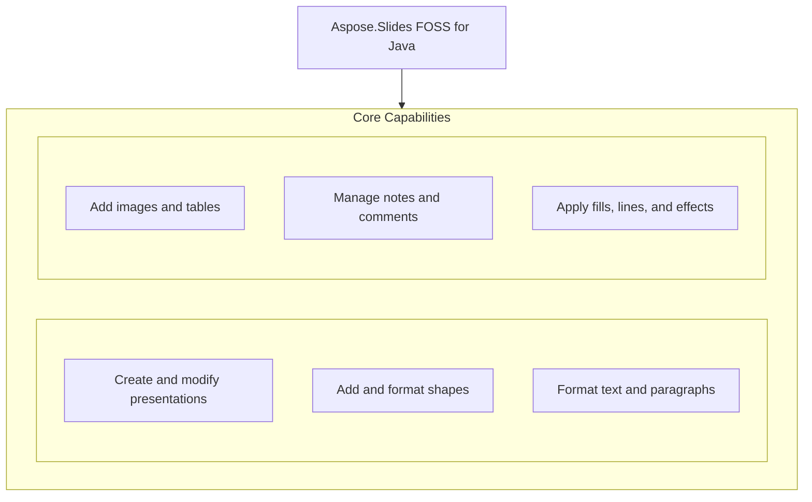

# Aspose.Slides FOSS for Java

[](LICENSE) [](https://github.com/aspose-slides-foss/Aspose.Slides-FOSS-for-Java/graphs/contributors)

[](https://products.aspose.org/slides/java/)

Aspose.Slides FOSS for Java is a free, open-source library that enables Java developers to create, read, modify, and convert PowerPoint presentations programmatically without requiring Microsoft PowerPoint. It supports common tasks such as adding shapes, tables, images, connectors, formatted text, speaker notes, and threaded comments to slides, and saving presentations in PPTX format. Built for Java 21 and higher, the library is distributed under the MIT license with no external dependencies. Developers working with presentation automation, reporting, or document generation workflows use this library to integrate robust slide manipulation directly into their Java applications.

## Navigation

- [At a Glance](#at-a-glance)
- [Key Capabilities](#key-capabilities)
- [Installation](#installation)
- [Dependencies](#dependencies)
- [Quick Start](#quick-start)
- [Additional Examples](#additional-examples)
- [API Reference](#api-reference)
- [Documentation & Resources](#documentation--resources)
- [Scope and Limitations](#scope-and-limitations)
- [Development and Testing](#development-and-testing)
- [License](#license)

## At a Glance



## Key Capabilities

- **Create and modify presentations.** Create new presentations from scratch or load existing ones from streams and files, then modify slides by adding, removing, or reordering them before saving to PPTX format.
- **Add and format shapes.** Add rectangles, connectors, and other shapes to slides, connect shapes with lines, and position them precisely using coordinates and dimensions.
- **Format text and paragraphs.** Format text by setting font height, bold style, and solid fill color, and access font names through the getFontName method.
- **Add images and tables.** Insert images from byte arrays or input streams as picture frames and create tables with custom row heights and column widths.
- **Manage notes and comments.** Add speaker notes to slides, create comment authors, and add threaded comments with parent-child relationships using the `Relationship` class.
- **Apply fills, lines, and effects.** Apply solid fill colors to text and shapes, and configure line properties through fill format and line format objects.

## Installation

Install the published package from Maven Central (`org.aspose:aspose-slides-foss`, version 26.8.0):

```bash
mvn dependency:get -Dartifact=org.aspose:aspose-slides-foss:26.8.0
```

## Dependencies

### Required Package Dependencies

No required third-party package dependencies; in `pom.xml`, every `<dependency>` the POM declares is `test`, `provided` or optional.

### Native and System Requirements

- Requires Java `21` (`maven.compiler.release` in `pom.xml`).

### Development Dependencies

- `org.apache.poi:poi-ooxml 5.4.1`
- `org.assertj:assertj-core 3.27.3`
- `org.junit.jupiter:junit-jupiter-api 5.11.4`
- `org.junit.jupiter:junit-jupiter-engine 5.11.4`
- `org.junit.jupiter:junit-jupiter-params 5.11.4`

## Quick Start

This example creates a new presentation, adds a rectangle shape with text to the first slide, saves it as a PPTX file, then reads the file back and prints the slide count, shape count, and text content.

```java
import java.io.IOException;

import org.aspose.slides.foss.IAutoShape;
import org.aspose.slides.foss.ISlide;
import org.aspose.slides.foss.Presentation;
import org.aspose.slides.foss.ShapeType;
import org.aspose.slides.foss.export.SaveFormat;

public class QuickStart {
    public static void main(String[] args) throws IOException {
        // Create a deck, put one shape with some text on the first slide, save it.
        try (Presentation prs = new Presentation()) {
            ISlide slide = prs.getSlides().get(0);
            IAutoShape shape = slide.getShapes()
                    .addAutoShape(ShapeType.RECTANGLE, 50, 50, 400, 100);
            shape.addTextFrame("Hello from Aspose.Slides FOSS");
            prs.save("hello.pptx", SaveFormat.PPTX);
        }

        // Read it back.
        try (Presentation prs = new Presentation("hello.pptx")) {
            ISlide slide = prs.getSlides().get(0);
            IAutoShape shape = (IAutoShape) slide.getShapes().get(0);
            System.out.println("slides: " + prs.getSlides().size());
            System.out.println("shapes: " + slide.getShapes().size());
            System.out.println("text:   " + shape.getTextFrame().getText());
        }
    }
}
```

## Additional Examples

Create slides with shapes and text, tables, connectors, images, notes, comments, and stream-based I/O, or extract specific slides.

### Add formatted text to a rectangle shape

```java
try (Presentation prs = new Presentation()) {
    IAutoShape shape = prs.getSlides().get(0).getShapes()
            .addAutoShape(ShapeType.RECTANGLE, 50, 50, 400, 150);
    shape.addTextFrame("Formatted text");
    IPortionFormat fmt = shape.getTextFrame().getParagraphs().get(0)
            .getPortions().get(0).getPortionFormat();
    fmt.setFontHeight(24);
    fmt.setFontBold(NullableBool.TRUE);
    fmt.getFillFormat().setFillType(FillType.SOLID);
    fmt.getFillFormat().getSolidFillColor().setColor(Color.fromArgb(255, 0, 70, 127));
    prs.save("text.pptx", SaveFormat.PPTX);
}
```

<details>
<summary>View Additional Examples</summary>

### Insert a table with two rows and three columns

```java
try (Presentation prs = new Presentation()) {
    ITable table = prs.getSlides().get(0).getShapes()
            .addTable(50, 50, new double[]{120, 120, 120}, new double[]{40, 40});
    table.getRows().get(0).get(0).getTextFrame().setText("Name");
    table.getRows().get(0).get(1).getTextFrame().setText("Value");
    prs.save("table.pptx", SaveFormat.PPTX);
}
```

### Connect two rectangles with a bent connector

```java
try (Presentation prs = new Presentation()) {
    ISlide slide = prs.getSlides().get(0);
    IAutoShape box1 = slide.getShapes().addAutoShape(ShapeType.RECTANGLE, 50, 100, 150, 60);
    IAutoShape box2 = slide.getShapes().addAutoShape(ShapeType.RECTANGLE, 350, 100, 150, 60);
    IConnector conn = slide.getShapes().addConnector(ShapeType.BENT_CONNECTOR3, 0, 0, 10, 10);
    conn.setStartShapeConnectedTo(box1);
    conn.setStartShapeConnectionSiteIndex(3);  // right
    conn.setEndShapeConnectedTo(box2);
    conn.setEndShapeConnectionSiteIndex(1);    // left
    prs.save("connector.pptx", SaveFormat.PPTX);
}
```

### Embed a PNG image into a picture frame

```java
try (Presentation prs = new Presentation()) {
    byte[] png = Files.readAllBytes(Path.of("photo.png"));
    IPPImage image = prs.getImages().addImage(png);          // or addImage(InputStream)
    prs.getSlides().get(0).getShapes()
            .addPictureFrame(ShapeType.RECTANGLE, 50, 50, 200, 150, image);
    prs.save("picture.pptx", SaveFormat.PPTX);
}
```

### Add speaker notes and threaded comments to a slide

```java
try (Presentation prs = new Presentation()) {
    ISlide slide = prs.getSlides().get(0);

    INotesSlide notes = slide.getNotesSlideManager().addNotesSlide();
    notes.getNotesTextFrame().setText("Speaker notes go here.");

    ICommentAuthor author = prs.getCommentAuthors().addAuthor("Jane Smith", "JS");
    IComment root = author.getComments()
            .addComment("Review this slide", slide, new PointF(2.0f, 2.0f), LocalDateTime.now());
    IComment reply = author.getComments()
            .addComment("Done", slide, new PointF(2.0f, 2.0f), LocalDateTime.now());
    reply.setParentComment(root);   // writes ppt/threadedComments/ as well as the classic list

    prs.save("notes-and-comments.pptx", SaveFormat.PPTX);
}
```

### Load and save a presentation via streams

```java
try (Presentation prs = new Presentation(Files.newInputStream(Path.of("in.pptx")));
     OutputStream out = Files.newOutputStream(Path.of("out.pptx"))) {
    prs.save(out, SaveFormat.PPTX);
}
```

### Export only the first and third slides

```java
try (Presentation prs = new Presentation("deck.pptx")) {
    // Zero-based. Repeats are ignored; the slides kept stay in document order.
    prs.save("first-and-third.pptx", new int[]{0, 2}, SaveFormat.PPTX);
}
```

</details>

## API Reference

Aspose.Slides FOSS for Java provides the `org.aspose.slides` namespace as the primary entry point for working with presentations.

The verified public surface has 238 types.

<details>
<summary>View the Complete Public API Surface</summary>

### Core API

| Class | Description |
| --- | --- |
| `AdjustValue` | Represents a single geometry adjustment value backed by an OOXML element. |
| `AdjustValueCollection` | Represents a collection of shape's adjustments backed by an OOXML element. |
| `AutoShape` | Represents an AutoShape. |
| `BaseHandoutNotesSlideHeaderFooterManager` | Represents abstract base class for handout and notes slide header/footer managers. |
| `BasePortionFormat` | Common text portion formatting properties. |
| `BaseShapeLock` | Base class for shape locks. |
| `BaseSlide` | Represents common data for all slide types. |
| `BulletFormat` | Represents paragraph bullet formatting properties. |
| `Camera` | Represents 3D camera settings. |
| `Cell` | Represents a cell of a table. |
| `CellCollection` | Represents a collection of cells. |
| `CellFormat` | Represents format of a table cell. |
| `ColorFormat` | Represents a color used in a presentation. |
| `Column` | Represents a column in a table. |
| `ColumnCollection` | Represents collection of columns in a table. |
| `ColumnFormat` | Represents formatting properties of a table column. |
| `Comment` | Represents a comment on a presentation slide. |
| `CommentAuthor` | Represents an author of comments. |
| `CommentAuthorCollection` | Represents a collection of comment authors in a presentation. |
| `CommentCollection` | Represents a collection of comments of one author. |
| `Connector` | Represents a connector shape. |
| `ConnectorLock` | Represents the lock settings for a connector shape. |
| `DocumentProperties` | Represents properties of a presentation. |
| `EffectFormat` | Represents effect formatting properties of a shape. |
| `FillFormat` | Represents fill formatting properties. |
| `GeometryShape` | Base class for shapes with geometry, backed by an OOXML shape element. |
| `GlobalLayoutSlideCollection` | Represents a collection of all layout slides in presentation. |
| `GradientFormat` | Represents a gradient format. |
| `GradientStop` | Represents a single gradient stop. |
| `GradientStopCollection` | Represents a collection of gradient stops. |
| `GraphicalObject` | Abstract base class for graphical objects on a slide. |
| `GraphicalObjectLock` | Represents the lock settings for a graphical object shape. |
| `GroupShape` | Represents a group of shapes on a slide. |
| `HeadingPair` | Represents a heading pair indicating a grouping of document parts. |
| `IAdjustValue` | Represents a geometry shape adjustment value. |
| `IAdjustValueCollection` | Represents a collection of shape adjustment values. |
| `IAutoShape` | Represents an AutoShape. |
| `IBaseHandoutNotesSlideHeaderFooterManager` | Represents base interface for handout and notes slide header/footer managers. |
| `IBaseHeaderFooterManager` | Represents base interface for header/footer managers. |
| `IBasePortionFormat` | Represents common text portion formatting properties. |
| `IBaseSlide` | Represents common data for all slide types. |
| `IBaseSlideHeaderFooterManager` | Represents base interface for slide header/footer managers that manage footer, slide number, and date-time placeholders. |
| `IBulkTextFormattable` | Represents an object with the possibility of bulk setting child text elements' formats. |
| `IBulletFormat` | Represents paragraph bullet formatting properties. |
| `ICamera` | Represents Camera. |
| `ICell` | Represents a cell in a table. |
| `ICellCollection` | Represents a collection of cells. |
| `ICellFormat` | Represents format of a table cell. |
| `IColorFormat` | Represents a color used in a presentation. |
| `IColumn` | Represents a column in a table. |
| `IColumnCollection` | Represents collection of columns in a table. |
| `IColumnFormat` | Represents format of a table column. |
| `IComment` | Represents a comment on a presentation slide. |
| `ICommentAuthor` | Represents a comment author in a presentation. |
| `ICommentAuthorCollection` | Represents a collection of comment authors in a presentation. |
| `ICommentCollection` | Represents a collection of comments belonging to a single author. |
| `IConnector` | Represents a connector. |
| `IConnectorLock` | Determines which operations are disabled on the parent Connector. |
| `ICustomData` | Represents custom data associated with a shape. |
| `IDocumentProperties` | Represents properties of a presentation document. |
| `IEffectFormat` | Represents effect formatting properties. |
| `IEffectParamSource` | Marker interface for objects that serve as a source of effect parameters. |
| `IFillFormat` | Represents fill formatting options. |
| `IFillParamSource` | Marker interface for objects that serve as a source of fill parameters. |
| `IFontData` | Represents a font definition. |
| `IGeometryShape` | Represents a shape with geometry (preset or custom). |
| `IGlobalLayoutSlideCollection` | Represents a collection of all layout slides in a presentation. |
| `IGradientFormat` | Represents a gradient format. |
| `IGradientStop` | Represents a gradient stop. |
| `IGradientStopCollection` | Represents a collection of gradient stops. |
| `IGraphicalObject` | Represents abstract graphical object. |
| `IGraphicalObjectLock` | Determines which operations are disabled on the parent IGraphicalObject. |
| `IGroupShape` | Represents a group of shapes on a slide. |
| `IHeadingPair` | Represents a heading pair that indicates a grouping of document parts and the number of parts in each group. |
| `IHyperlinkContainer` | Marker interface for objects that contain hyperlinks. |
| `IImage` | Represents a raster or vector image. |
| `IImageCollection` | Represents a collection of images in a presentation. |
| `ILayoutSlide` | Represents a layout slide. |
| `ILayoutSlideCollection` | Represents a base class for collection of a layout slides. |
| `ILightRig` | Represents a light rig. |
| `ILineFillFormat` | Represents properties for lines filling. |
| `ILineFormat` | Represents format of a line. |
| `ILineParamSource` | Marker interface for objects that serve as a source of line parameters. |
| `ILoadOptions` | Represents options that can be used to configure how a presentation is loaded. |
| `IMasterLayoutSlideCollection` | Represents a collection of layout slides belonging to a master slide. |
| `IMasterSlide` | Represents a master slide in a presentation. |
| `IMasterSlideCollection` | Represents a collection of master slides. |
| `INotesSize` | Represents a size of notes slide. |
| `INotesSlide` | Represents a notes slide in a presentation. |
| `INotesSlideHeaderFooterManager` | Represents manager which holds behavior of the notes slide placeholders, including header placeholder. |
| `INotesSlideManager` | Manages the notes slide for a given slide. |
| `IPPImage` | Represents an image in a presentation. |
| `IParagraph` | Represents a text paragraph. |
| `IParagraphCollection` | Represents a collection of paragraphs. |
| `IParagraphFormat` | Represents paragraph formatting properties. |
| `IPatternFormat` | Represents a pattern fill format. |
| `IPictureFillFormat` | Represents a picture fill style. |
| `IPictureFrame` | Represents a frame with a picture inside. |
| `IPictureFrameLock` | Determines which operations are disabled on the parent IPictureFrame. |
| `IPlaceholder` | Represents a placeholder on a slide. |
| `IPortion` | Represents a portion of text inside a text paragraph. |
| `IPortionCollection` | Represents a collection of text portions. |
| `IPortionFormat` | Represents formatting properties of a text portion with no inheritance applied. |
| `IPresentation` | Represents a presentation document. |
| `IPresentationComponent` | Represents a component of a presentation. |
| `IRow` | Represents a row in a table. |
| `IRowCollection` | Represents a collection of rows in a table. |
| `IRowFormat` | Represents format of a table row. |
| `ISection` | Represents a section in a presentation. |
| `IShape` | Represents a shape on a slide. |
| `IShapeBevel` | Represents properties of shape's main face relief. |
| `IShapeCollection` | Represents a collection of shapes. |
| `IShapeFrame` | Represents shape frame's properties. |
| `IShapeStyle` | Represents a shape's style reference. |
| `ISlide` | Represents a slide in a presentation. |
| `ISlideCollection` | Represents a collection of slides in a presentation. |
| `ISlideComponent` | Represents a component of a slide. |
| `ISlidesPicture` | Represents a picture in a presentation. |
| `ITable` | Represents a table on a slide. |
| `ITableFormat` | Represents format of a table. |
| `ITextFrame` | Represents a TextFrame. |
| `ITextFrameFormat` | Represents format of a text frame. |
| `IThreeDFormat` | Represents 3-D properties. |
| `IThreeDParamSource` | Marker interface for objects that serve as a source of 3D parameters. |
| `Image` | Represents a raster or vector image. |
| `ImageCollection` | Represents a collection of images in a presentation. |
| `Images` | Methods to instantiate and work with IImage. |
| `LayoutSlide` | Represents a layout slide. |
| `LayoutSlideCollection` | Represents a collection of layout slides. |
| `LightRig` | Represents a light rig for 3D scene. |
| `LineFillFormat` | Represents the fill format of a line. |
| `LineFormat` | Represents format of a line. |
| `MasterLayoutSlideCollection` | Represents a collection of all layout slides of the defined master slide. |
| `MasterSlide` | Represents a master slide in a presentation. |
| `MasterSlideCollection` | Represents a collection of master slides in a presentation. |
| `NotesSize` | Represents the size of a notes slide. |
| `NotesSlide` | Represents a notes slide in a presentation. |
| `NotesSlideHeaderFooterManager` | Represents manager which holds behavior of the notes slide placeholders, including header placeholder. |
| `NotesSlideManager` | Manages the notes slide for a given slide. |
| `PPImage` | Represents an image in a presentation. |
| `PVIObject` | Base class for property-value-inheritance (PVI) objects that are bound to a slide and presentation. |
| `Paragraph` | Represents a text paragraph. |
| `ParagraphCollection` | Represents a collection of paragraphs. |
| `ParagraphFormat` | Represents paragraph formatting properties. |
| `PatternFormat` | Represents a pattern fill format. |
| `Picture` | Represents a picture in a presentation. |
| `PictureFillFormat` | Represents a picture fill style. |
| `PictureFrame` | Represents a frame with a picture inside. |
| `PictureFrameLock` | Represents the locks for a PictureFrame. |
| `Portion` | Represents a text portion (run) within a paragraph. |
| `PortionCollection` | Represents a collection of text portions within a paragraph. |
| `PortionFormat` | Represents text portion formatting properties. |
| `PptCorruptFileException` | Exception thrown when a PPT file is corrupt and cannot be processed. |
| `PptException` | Base exception for PPT-related errors. |
| `PptReadException` | Exception thrown when a PPT file cannot be read. |
| `Presentation` | Represents a PowerPoint presentation. |
| `Row` | Represents a row in a table. |
| `RowCollection` | Represents a collection of rows in a table. |
| `RowFormat` | Represents formatting properties of a table row. |
| `Shape` | Abstract base class for shapes on a slide. |
| `ShapeBevel` | Contains the properties of shape's main face relief (bevel). |
| `ShapeCollection` | Represents a collection of shapes on a slide. |
| `ShapeFrame` | Represents an immutable shape frame with position, size, rotation, and flip properties. |
| `ShapeStyle` | Represents a shape's style reference. |
| `Slide` | Represents a slide in a presentation. |
| `SlideCollection` | Represents a collection of slides in a presentation. |
| `Table` | Represents a table shape on a slide. |
| `TableFormat` | Represents format of a table. |
| `TextFrame` | Represents a text frame containing paragraphs. |
| `TextFrameFormat` | Contains the TextFrame's formatting properties. |
| `ThreeDFormat` | Represents 3-D formatting properties for a shape. |
| `Color` | Immutable value type representing an ARGB color. |
| `PointF` | Represents a 2D point with float coordinates. |
| `RectangleF` | Represents a rectangle defined by position and size using floating-point coordinates. |
| `Size` | Represents a 2D size with integer dimensions. |
| `SizeF` | Represents a 2D size with float dimensions. |
| `Blur` | Represents a Blur effect that is applied to the entire shape, including its fill. |
| `FillOverlay` | Represents a Fill Overlay effect. |
| `Glow` | Represents a glow effect backed by an OOXML element. |
| `IBlur` | Represents a Blur effect that is applied to the entire shape, including its fill. |
| `IFillOverlay` | Represents a Fill Overlay effect. |
| `IGlow` | Represents a glow effect applied to a shape. |
| `IImageTransformOperation` | Represents an image-transform operation effect. |
| `IInnerShadow` | Represents an inner shadow effect applied to a shape. |
| `IOuterShadow` | Represents an Outer Shadow effect. |
| `IPresetShadow` | Represents a Preset Shadow effect. |
| `IReflection` | Represents a reflection effect applied to a shape. |
| `ISoftEdge` | Represents a Soft Edge effect. |
| `ImageTransformOperation` | Represents an image-transform operation applied to an image effect. |
| `InnerShadow` | Represents an inner shadow effect backed by an OOXML element. |
| `OuterShadow` | Represents an outer shadow effect backed by an OOXML element. |
| `PresetShadow` | Represents a preset shadow effect backed by an OOXML element. |
| `Reflection` | Represents a reflection effect backed by an OOXML element. |
| `SoftEdge` | Represents a soft edge effect backed by an OOXML element. |
| `ISaveOptions` | Options that control how a presentation is saved. |
| `IThemeable` | Represents objects that can be themed. |

#### Enumerations

| Enumeration | Description |
| --- | --- |
| `BevelPresetType` | Constants which define 3D bevel of shape. |
| `BulletType` | Represents the type of the extended bullets. |
| `CameraPresetType` | Constants which define camera preset type. |
| `ColorType` | Represents different color modes. |
| `FillBlendMode` | Determines blend mode. |
| `FillType` | Specifies the interior fill type of various visual objects. |
| `FontAlignment` | Represents vertical font alignment. |
| `GradientDirection` | Represents the gradient style. |
| `GradientShape` | Represents the shape of gradient fill. |
| `LightRigPresetType` | Constants which define light preset types. |
| `LightingDirection` | Constants which define light directions. |
| `LineAlignment` | Represents the lines alignment type. |
| `LineArrowheadLength` | Represents the length of an arrowhead. |
| `LineArrowheadStyle` | Represents the style of an arrowhead. |
| `LineArrowheadWidth` | Represents the width of an arrowhead. |
| `LineCapStyle` | Represents the line cap style. |
| `LineDashStyle` | Represents the line dash style. |
| `LineJoinStyle` | Represents the lines join style. |
| `LineStyle` | Represents the style of a line. |
| `MaterialPresetType` | Constants which define material of shape. |
| `NullableBool` | Represents triple boolean values. |
| `NumberedBulletStyle` | Represents the style of the numbered bullets. |
| `PatternStyle` | Represents the pattern style. |
| `PictureFillMode` | Determines how picture will fill area. |
| `PresetColor` | Represents predefined color presets. |
| `PresetShadowType` | Represents a preset for a shadow effect. |
| `RectangleAlignment` | Defines 2-dimension alignment. |
| `SchemeColor` | Represents colors in a color scheme. |
| `ShapeType` | Represents preset geometry of geometry shapes. |
| `SlideLayoutType` | Represents the slide layout type. |
| `SourceFormat` | Represents source file format. |
| `TableStylePreset` | Represents builtin table styles. |
| `TextAlignment` | Represents different text alignment styles. |
| `TextAnchorType` | text box alignment within a text area. |
| `TextAutofitType` | Represents text autofit mode. |
| `TextCapType` | Represents the type of text capitalisation. |
| `TextShapeType` | Represents text wrapping shape. |
| `TextStrikethroughType` | Represents the type of text strikethrough. |
| `TextUnderlineType` | Represents the type of text underline. |
| `TextVerticalType` | Determines vertical writing mode for a text. |
| `TileFlip` | Defines tile flipping mode. |
| `SaveFormat` | Constants which define the format of a saved presentation. |

#### Detailed Member Reference

### org

The org package serves as the root namespace for all Aspose.Slides FOSS for Java classes and interfaces.

### aspose

The `org.aspose` namespace contains core utilities and base types shared across Aspose products for Java.

### slides

The `org.aspose.slides` namespace provides the complete API surface for creating, editing, and converting presentation documents in Java.

### getFontName

The getFontName method returns the name of the font used in a text portion.

### Relationship

The `Relationship` class represents a relationship between parts in a presentation package.

</details>

## Documentation & Resources

- **[Aspose.Slides for Java — product page](https://products.aspose.com/slides/java/)** — The product page introduces Aspose.Slides for Java, the commercial offering that complements this FOSS library.
- **[Documentation](https://docs.aspose.com/slides/java/)** — The documentation provides step-by-step guides and examples for working with presentations using Aspose.Slides for Java.
- **[API reference](https://reference.aspose.com/slides/java/)** — The API reference documents every class and method available in the `org.aspose:aspose-slides-foss` package version 26.8.0. It covers all 238 verified public types; the [API Reference](#api-reference) section above covers the essentials.
- **[Free support forum](https://forum.aspose.com/c/slides/11)** — The free support forum hosts community discussions and official responses to questions about Aspose.Slides for Java.
- **[CONTRIBUTING.md](CONTRIBUTING.md)** — `CONTRIBUTING.md` outlines the process for submitting code changes and participating in development of the library.
- **[Code of Conduct](CODE_OF_CONDUCT.md)** — The Code of Conduct establishes expectations for respectful and inclusive behavior in community interactions.
- Found a bug or have a feature request? [Open an issue](https://github.com/aspose-slides-foss/Aspose.Slides-FOSS-for-Java/issues).

## Scope and Limitations

Aspose.Slides FOSS for Java provides a free, open-source library for creating and manipulating `PowerPoint`-compatible presentations in Java applications, targeting Java 21 or later with no runtime dependencies.

- The library supports writing only three presentation formats—PPTX, PPSX, and POTX—and raises `UnsupportedOperationException` for all other `SaveFormat` values, including PDF, XPS, TIFF, and image formats.
- Cloning a master slide using `getMasters()`.addClone(...) incorrectly reports a size increase while failing to persist the clone to the saved package, leaving the output file unchanged.
- Text language metadata is not written to the presentation package, so `PowerPoint` applies the authoring machine's default language instead of any language specified in the source.
- Many presentation features are not exposed in the public API, including charts, `SmartArt`, OLE objects, video, audio, group shapes, animations, hyperlinks, sections, slide backgrounds, themes, slide size control, rendering, and VBA macros.
- Round-tripping preserves every part in the package but only guarantees byte-identical content for parts the library does not model; parts like docProps/`app.xml` and slide XML are rebuilt, and the measured fidelity on a 41-part Apache POI deck shows only 36 parts unchanged.
- Version 26.7.0, the only version available on Maven Central, lacks XML hardening and security fixes present in the current source tree, and users should build from source if they require the latest behaviour.

| | |
|---|---|
| Java | **21 or later.** The sources use `List.getFirst()`, `List.removeLast()` and an unconditional `instanceof` pattern, so they do not compile below 21, and the build refuses to start on an older JDK. |
| Runtime dependencies | none |
| Tested on | Linux, Windows and macOS, on Java 21 and Java 25 — every push and every pull request |

These limitations don't apply to [Aspose.Slides for Java — Enterprise Edition](https://products.aspose.com/slides/java/). Aspose.Slides FOSS for Java provides core presentation processing capabilities; the commercial Aspose.Slides for Java adds advanced features such as PowerPoint file encryption, digital signing, and enhanced rendering options.

## Development and Testing

Build and test the Aspose.Slides FOSS for Java repository using the provided test assets in tests/ and CI workflows in .github/workflows/; the project targets Java 21 and publishes the `org.aspose:aspose-slides-foss` package at version 26.8.0.

The suite covers 41 test files under `tests/`. Releases run through the [maven-central-release workflow](.github/workflows/maven-central-release.yml).

## License

This project is licensed under the [MIT License](LICENSE). The MIT License permits use, copying, modification, distribution, sublicensing, and commercial use, provided its copyright and permission notice are retained. The software is provided without warranty.
