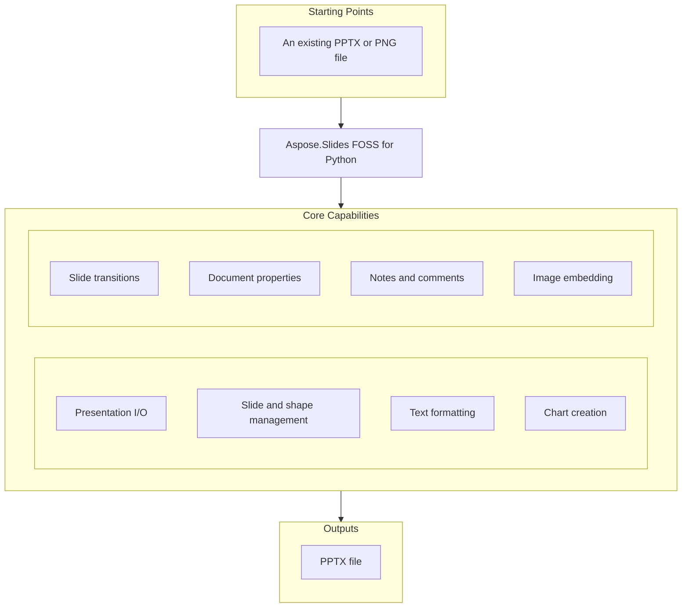

# Aspose.Slides FOSS for Python

[](https://pypi.org/project/aspose-slides-foss/)  [](LICENSE) [](https://github.com/aspose-slides-foss/Aspose.Slides-FOSS-for-Python/graphs/contributors)

[](https://products.aspose.org/slides/python/)

Aspose.Slides FOSS for Python is a free, open-source library that enables Python developers to create, read, modify, and convert PowerPoint presentations without requiring Microsoft PowerPoint. It supports common operations such as adding shapes, tables, charts, images, text formatting, hyperlinks, comments, speaker notes, and slide transitions, all while preserving unknown XML content on round-trip saves. Developers use it to automate report generation, build dynamic slide decks, and integrate presentation workflows into Python applications running on Python 3.10 or later under the MIT license.

## Navigation

- [At a Glance](#at-a-glance)
- [Key Capabilities](#key-capabilities)
- [Installation](#installation)
- [Dependencies](#dependencies)
- [Quick Start](#quick-start)
- [Additional Examples](#additional-examples)
- [API Reference](#api-reference)
- [Documentation & Resources](#documentation--resources)
- [Scope and Limitations](#scope-and-limitations)
- [Development and Testing](#development-and-testing)
- [License](#license)

## At a Glance



## Key Capabilities

- **Presentation I/O.** Create new presentations from scratch or open existing `.pptx` files and save them back to `.pptx` format using the `Presentation` class and `SaveFormat.PPTX`.
- **Slide and shape management.** Add and manage shapes including rectangles, bent connectors, tables, and group shapes on slides using methods like `add_auto_shape`, `add_connector`, `add_table`, and `add_group_shape`.
- **Text formatting.** `Format` text by setting font height, bold style, and solid fill color on portions, and apply hyperlinks to individual text portions or entire shapes.
- **Chart creation.** Create clustered column charts with embedded workbook data by calling `add_chart` with `ChartType.CLUSTERED_COLUMN` and populating series and categories via `chart_data_workbook`.
- **Slide transitions.** Configure slide transitions by setting the transition type to CIRCLE and enabling advance on click or after a specified time in milliseconds.
- **Document properties.** Set built-in document properties such as title and author, and store custom properties like version numbers using `document_properties` methods.
- **Notes and comments.** Add speaker notes to slides using `notes_slide_manager.add_notes_slide` and attach comments with timestamps and positions via `comment_authors` and comments.
- **Image embedding.** Embed images from `.png` files by reading them into memory and adding them to the presentation's image collection, then placing them as picture frames on slides.

## Installation

Install the published package from PyPI (`aspose-slides-foss`, version 26.8.0):

```bash
pip install aspose-slides-foss
```

To work from a source checkout instead, install the clone with pip:

```bash
git clone https://github.com/aspose-slides-foss/Aspose.Slides-FOSS-for-Python.git
cd Aspose.Slides-FOSS-for-Python
pip install .
```

Verify the install:

```bash
python -c "import aspose.slides_foss"
```

The package declares `python_requires` as `>=3.10`.

## Dependencies

### Required Package Dependencies

- `lxml>=4.9`

### Native and System Requirements

- Requires Python 3.10 or later (`python_requires=">=3.10"` in `pyproject.toml`).

### Development Dependencies

- `pytest>=7` (extra `test`)
- `python-pptx>=1.0` (extra `test`)

## Quick Start

The example imports the library, creates a new presentation from scratch, and then opens an existing file to read its slide count before saving again.

```python
import aspose.slides_foss as slides
from aspose.slides_foss.export import SaveFormat

# Create a new presentation — needs no input file, so this runs as it stands
with slides.Presentation() as prs:
    slide = prs.slides[0]
    prs.save("new.pptx", SaveFormat.PPTX)

# Open an existing presentation
with slides.Presentation("new.pptx") as prs:
    print(f"Slides: {len(prs.slides)}")
    prs.save("output.pptx", SaveFormat.PPTX)
```

## Additional Examples

Create shapes, format text, add tables and connectors, insert images, manage notes and comments, set slide transitions, and build charts using Aspose.Slides FOSS for Python.

### Build a clustered column chart and populate its embedded workbook

```python
from aspose.slides_foss.charts import ChartType
import aspose.slides_foss as slides
from aspose.slides_foss.export import SaveFormat

with slides.Presentation() as prs:
    slide = prs.slides[0]

    # Pass has_default_data=False to start with an empty workbook
    chart = slide.shapes.add_chart(ChartType.CLUSTERED_COLUMN, 50, 50, 600, 400, False)
    chart.chart_title.add_text_frame_for_overriding("Quarterly Sales")

    cd = chart.chart_data
    wb = cd.chart_data_workbook  # embedded XLSX workbook backing the chart

    cd.series.clear()
    cd.categories.clear()

    # Workbook layout (worksheet 0):
    #          col 0   col 1      col 2
    #  row 0            "Revenue"  "Expenses"   <- series name row
    #  row 1   "Q1"     1200       800
    #  row 2   "Q2"     1500       900
    #  row 3   "Q3"     1800       1000
    #  row 4   "Q4"     2100       1100

    # Categories — column 0, rows 1..4
    for row, name in enumerate(["Q1", "Q2", "Q3", "Q4"], start=1):
        cd.categories.add(wb.get_cell(0, row, 0, name))

    # Series 1 (Revenue) — name at (row 0, col 1), values at (rows 1..4, col 1)
    s1 = cd.series.add(wb.get_cell(0, 0, 1, "Revenue"), chart.type)
    for row, value in enumerate([1200, 1500, 1800, 2100], start=1):
        s1.data_points.add_data_point_for_bar_series(wb.get_cell(0, row, 1, value))

    # Series 2 (Expenses) — name at (row 0, col 2), values at (rows 1..4, col 2)
    s2 = cd.series.add(wb.get_cell(0, 0, 2, "Expenses"), chart.type)
    for row, value in enumerate([800, 900, 1000, 1100], start=1):
        s2.data_points.add_data_point_for_bar_series(wb.get_cell(0, row, 2, value))

    prs.save("chart.pptx", SaveFormat.PPTX)
```

<details>
<summary>View Additional Examples</summary>

### Add a rectangle shape with text to a slide and save as PPTX

```python
from aspose.slides_foss import ShapeType
import aspose.slides_foss as slides
from aspose.slides_foss.export import SaveFormat

with slides.Presentation() as prs:
    slide = prs.slides[0]
    shape = slide.shapes.add_auto_shape(ShapeType.RECTANGLE, 50, 50, 300, 100)
    shape.add_text_frame("Hello, world!")
    prs.save("shapes.pptx", SaveFormat.PPTX)
```

### `Format` text font height, bold, and solid fill color for a shape

```python
from aspose.slides_foss import ShapeType, NullableBool, FillType
from aspose.slides_foss.drawing import Color
import aspose.slides_foss as slides
from aspose.slides_foss.export import SaveFormat

with slides.Presentation() as prs:
    shape = prs.slides[0].shapes.add_auto_shape(ShapeType.RECTANGLE, 50, 50, 400, 150)
    tf = shape.add_text_frame("Formatted text")
    fmt = tf.paragraphs[0].portions[0].portion_format
    fmt.font_height = 24
    fmt.font_bold = NullableBool.TRUE
    fmt.fill_format.fill_type = FillType.SOLID
    fmt.fill_format.solid_fill_color.color = Color.from_argb(255, 0, 70, 127)
    prs.save("text.pptx", SaveFormat.PPTX)
```

### Add click and mouse-over hyperlinks to text and shapes

```python
import aspose.slides_foss as slides
from aspose.slides_foss import Hyperlink, ShapeType
from aspose.slides_foss.export import SaveFormat

with slides.Presentation() as prs:
    shape = prs.slides[0].shapes.add_auto_shape(ShapeType.RECTANGLE, 50, 50, 400, 100)
    tf = shape.add_text_frame("Read the report")
    # On a single text portion ...
    tf.paragraphs[0].portions[0].portion_format.hyperlink_click = "https://example.com/report"
    # ... or on the whole shape, with a tooltip.
    shape.hyperlink_mouse_over = Hyperlink("https://example.com", tooltip="Home")
    prs.save("links.pptx", SaveFormat.PPTX)
```

### Create a table with rows and columns and populate cell text

```python
import aspose.slides_foss as slides
from aspose.slides_foss.export import SaveFormat

with slides.Presentation() as prs:
    table = prs.slides[0].shapes.add_table(50, 50, [120.0, 120.0, 120.0], [40.0, 40.0])
    table.rows[0][0].text_frame.text = "Name"
    table.rows[0][1].text_frame.text = "Value"
    prs.save("table.pptx", SaveFormat.PPTX)
```

### Connect two rectangles with a bent connector shape

```python
from aspose.slides_foss import ShapeType
import aspose.slides_foss as slides
from aspose.slides_foss.export import SaveFormat

with slides.Presentation() as prs:
    slide = prs.slides[0]
    box1 = slide.shapes.add_auto_shape(ShapeType.RECTANGLE, 50, 100, 150, 60)
    box2 = slide.shapes.add_auto_shape(ShapeType.RECTANGLE, 350, 100, 150, 60)
    conn = slide.shapes.add_connector(ShapeType.BENT_CONNECTOR3, 0, 0, 10, 10)
    conn.start_shape_connected_to = box1
    conn.start_shape_connection_site_index = 3  # right
    conn.end_shape_connected_to = box2
    conn.end_shape_connection_site_index = 1    # left
    prs.save("connector.pptx", SaveFormat.PPTX)
```

### Fill a rectangle shape with a solid color

```python
from aspose.slides_foss import ShapeType, FillType
from aspose.slides_foss.drawing import Color
import aspose.slides_foss as slides
from aspose.slides_foss.export import SaveFormat

with slides.Presentation() as prs:
    shape = prs.slides[0].shapes.add_auto_shape(ShapeType.RECTANGLE, 50, 50, 300, 150)
    shape.fill_format.fill_type = FillType.SOLID
    shape.fill_format.solid_fill_color.color = Color.from_argb(255, 30, 120, 200)
    prs.save("fill.pptx", SaveFormat.PPTX)
```

### Insert an image from bytes and add it as a picture frame

```python
import aspose.slides_foss as slides
from aspose.slides_foss import ShapeType
from aspose.slides_foss.export import SaveFormat

with slides.Presentation() as prs:
    with open("picture.png", "rb") as fh:
        image = prs.images.add_image(fh)      # or add_image(fh.read())
    prs.slides[0].shapes.add_picture_frame(ShapeType.RECTANGLE, 50, 50, 300, 200, image)
    prs.save("picture.pptx", SaveFormat.PPTX)
```

### Add speaker notes to a slide using the notes slide manager

```python
import aspose.slides_foss as slides
from aspose.slides_foss.export import SaveFormat

with slides.Presentation() as prs:
    notes = prs.slides[0].notes_slide_manager.add_notes_slide()
    notes.notes_text_frame.text = "Speaker notes go here."
    prs.save("notes.pptx", SaveFormat.PPTX)
```

### Add a comment author and place a comment on a slide

```python
from aspose.slides_foss.drawing import PointF
from datetime import datetime
import aspose.slides_foss as slides
from aspose.slides_foss.export import SaveFormat

with slides.Presentation() as prs:
    author = prs.comment_authors.add_author("Jane Smith", "JS")
    slide = prs.slides[0]
    author.comments.add_comment("Review this slide", slide, PointF(2.0, 2.0), datetime.now())
    prs.save("comments.pptx", SaveFormat.PPTX)
```

### Set document properties and custom properties for the presentation

```python
import aspose.slides_foss as slides
from aspose.slides_foss.export import SaveFormat

with slides.Presentation() as prs:
    prs.document_properties.title = "Q1 Results"
    prs.document_properties.author = "Finance Team"
    prs.document_properties.set_custom_property_value("Version", 3)
    prs.save("deck.pptx", SaveFormat.PPTX)
```

### Configure circle transition with click and time-based advance

```python
from aspose.slides_foss.slideshow import TransitionType
import aspose.slides_foss as slides
from aspose.slides_foss.export import SaveFormat

with slides.Presentation() as prs:
    slide = prs.slides[0]
    slide.slide_show_transition.type = TransitionType.CIRCLE
    slide.slide_show_transition.advance_on_click = True
    slide.slide_show_transition.advance_after_time = 3000  # ms
    prs.save("transition.pptx", SaveFormat.PPTX)
```

### Group multiple shapes under a named group shape container

```python
from aspose.slides_foss import ShapeType
import aspose.slides_foss as slides
from aspose.slides_foss.export import SaveFormat

with slides.Presentation() as prs:
    slide = prs.slides[0]
    group = slide.shapes.add_group_shape()
    group.shapes.add_auto_shape(ShapeType.RECTANGLE, 300, 100, 100, 100)
    group.shapes.add_auto_shape(ShapeType.RECTANGLE, 500, 100, 100, 100)
    group.name = "TwoRectangles"
    prs.save("group.pptx", SaveFormat.PPTX)
```

</details>

## API Reference

The aspose-slides-foss package exposes `slides_foss.Presentation` as the primary entry point for working with presentations, and provides supporting classes such as `AutoShape`, `Chart`, and `Hyperlink` for authoring content.

The verified public surface has 516 types.

<details>
<summary>View the Complete Public API Surface</summary>

### Core API

| Class | Description |
| --- | --- |
| `AdjustValue` | Represents a geometry shape's adjustment value. These values affect shape's form. |
| `AdjustValueCollection` | Reprasents a collection of shape's adjustments. |
| `AutoShape` | Represents an AutoShape. |
| `Background` | Represents background of a slide. |
| `BaseHandoutNotesSlideHeaderFooterManager` | BaseHandoutNotesSlideHeaderFooterManager manages header and footer elements for handout and notes slides in a presentation. |
| `BasePortionFormat` | Common text portion formatting properties. |
| `BaseShapeLock` | BaseShapeLock provides base functionality for locking shape properties to prevent user modifications. |
| `BaseSlide` | Represents common data for all slide types. |
| `BulletFormat` | Represents paragraph bullet formatting properties. |
| `Camera` | Represents Camera. |
| `Cell` | Represents a cell of a table. |
| `CellCollection` | Represents a collection of cells. |
| `CellFormat` | Represents format of a table cell. |
| `ColorFormat` | Represents a color used in a presentation. |
| `Column` | Represents a column in a table. |
| `ColumnCollection` | Represents collection of columns in a table. |
| `Comment` | Represents a comment on a slide. |
| `CommentAuthor` | Represents an author of comments. |
| `CommentAuthorCollection` | Represents a collection of comment authors. |
| `CommentCollection` | Represents a collection of comments of one author. |
| `Connector` | Represents a connector. |
| `DocumentProperties` | Represents properties of a presentation. |
| `EffectFormat` | Represents effect properties of shape. |
| `FillFormat` | Represents a fill formatting options. |
| `FontData` | Represents a font definition. Immutable. |
| `Fonts` | Fonts collection. |
| `GeometryShape` | GeometryShape represents a shape with geometric properties such as connector lines and built-in shapes like rectangles and circles. |
| `GlobalLayoutSlideCollection` | Represents a collection of all layout slides in presentation. Extends LayoutSlideCollection class with methods for adding/cloning layout slides in context of uniting of the individual collections of master's layout slides. |
| `GradientFormat` | Represent a gradient format. |
| `GradientStop` | Represents a gradient format. |
| `GradientStopCollection` | Represnts a collection of gradient stops. |
| `GraphicalObject` | GraphicalObject is an abstract base class for shapes that support graphical formatting and rendering. |
| `GraphicalObjectLock` | GraphicalObjectLock extends BaseShapeLock to provide locking capabilities specific to graphical objects. |
| `GroupShape` | Represents a group of shapes on a slide. |
| `GroupShapeLock` | Determines which operations are disabled on the parent GroupShape. |
| `HeadingPair` | Represents a 'Heading pair' property of the document. It indicates the group name of document parts and the number of parts in group. |
| `Hyperlink` | Represents a hyperlink to an external target. |
| `IAdjustValue` | Represents a geometry shape's adjustment value. These values affect shape's form. |
| `IAdjustValueCollection` | Reprasents a collection of shape's adjustments. |
| `IAnimationTimeLine` | Represents timeline of animation. |
| `IAutoShape` | Represents an AutoShape. |
| `IBackground` | Represents background of a slide. |
| `IBackgroundEffectiveData` | Immutable object which contains effective background properties. |
| `IBasePortionFormat` | This class contains the text portion formatting properties. Unlike , all properties of this class are writeable. |
| `IBaseShapeLock` | Represents Shape lock (disabled operation). |
| `IBaseSlide` | Represents common data for all slide types. |
| `IBulkTextFormattable` | Represents an object with possibility of bulk setting child text elements' formats. |
| `IBulletFormat` | Represents paragraph bullet formatting properties. |
| `ICamera` | Represents Camera. |
| `ICell` | Represents a cell in a table. |
| `ICellCollection` | Represents a collection of cells. |
| `ICellFormat` | Represents format of a table cell. |
| `IColorFormat` | Represents a color used in a presentation. |
| `IColumn` | Represents a column in a table. |
| `IColumnCollection` | Represents collection of columns in a table. |
| `IComment` | Represents a comment on a slide. |
| `ICommentAuthor` | Represents an author of comments. |
| `ICommentAuthorCollection` | Represents a collection of comment authors. |
| `ICommentCollection` | Represents a collection of comments of one author. |
| `IConnector` | Represents a connector. |
| `IDocumentProperties` | Represents properties of a presentation. |
| `IEffectFormat` | Represents effect properties of shape. |
| `IEffectParamSource` | IEffectParamSource defines the interface for objects that supply parameters for visual effects. |
| `IFillFormat` | Represents a fill formatting options. |
| `IFillParamSource` | IFillParamSource defines the interface for objects that supply parameters for shape fill formatting. |
| `IFontData` | Represents a font definition. |
| `IFonts` | Represents fonts collection. |
| `IGeometryShape` | Represents the parent class for all geometric shapes. |
| `IGlobalLayoutSlideCollection` | Represents a collection of all layout slides in presentation. Extends ILayoutSlideCollection interface with methods for adding/cloning layout slides in context of uniting of the individual collections of master's layout slides. |
| `IGradientFormat` | Represent a gradient format. |
| `IGradientStop` | Represents a gradient format. |
| `IGradientStopCollection` | Represnts a collection of gradient stops. |
| `IGraphicalObject` | Represents abstract graphical object. |
| `IGroupShape` | Represents a group of shapes on a slide. |
| `IGroupShapeLock` | Determines which operations are disabled on the parent GroupShape. |
| `IHeadingPair` | Represents a 'Heading pair' property of the document. It indicates the group name of document parts and the number of parts in group. |
| `IHyperlink` | Represents a hyperlink. |
| `IHyperlinkContainer` | Represents an object that can carry hyperlinks. |
| `IImage` | Represents a raster or vector image. |
| `IImageCollection` | Represents collection of PPImage. |
| `ILayoutSlide` | Represents a layout slide. |
| `ILayoutSlideCollection` | Represents a base class for collection of a layout slides. |
| `ILightRig` | Represents LightRig. |
| `ILineFillFormat` | Represents properties for lines filling. |
| `ILineFormat` | Represents format of a line. |
| `ILineParamSource` | ILineParamSource defines the interface for objects that supply parameters for shape line formatting. |
| `ILoadOptions` | ILoadOptions provides configuration settings for loading presentations from files or streams. |
| `IMasterLayoutSlideCollection` | IMasterLayoutSlideCollection represents a collection of master and layout slides in a presentation. |
| `IMasterSlide` | Represents a master slide in a presentation. |
| `IMasterSlideCollection` | Represents a collection of master slides. |
| `INotesSize` | Represents a size of notes slide. |
| `INotesSlide` | Represents a notes slide in a presentation. |
| `INotesSlideHeaderFooterManager` | Represents manager which holds behavior of the notes slide placeholders, including header placeholder. |
| `INotesSlideManager` | Notes slide manager. |
| `IPPImage` | Represents an image in a presentation. |
| `IParagraph` | Represents a paragraph of a text. |
| `IParagraphCollection` | Represents a collection of a paragraphs. |
| `IParagraphFormat` | This class contains the paragraph formatting properties. Unlike , all properties of this class are writeable. |
| `IPatternFormat` | Represents a pattern to fill a shape. |
| `IPictureFillFormat` | Represents a picture fill style. |
| `IPictureFrame` | Represents a frame with a picture inside. |
| `IPictureFrameLock` | Determines which operations are disabled on the parent PictureFrameEx. |
| `IPortion` | Represents a portion of text inside a text paragraph. |
| `IPortionCollection` | Represents a collection of a portions. |
| `IPortionFormat` | IPortionFormat defines formatting properties for text portions including font, color, and hyperlink behavior. |
| `IPresentation` | Presentation document |
| `IPresentationComponent` | Represents a component of a presentation. |
| `IRow` | Represents a row in a table. |
| `IRowCollection` | Represents table row collection. |
| `ISection` | ISection defines the interface for a logical section within a presentation structure. |
| `IShape` | Represents a shape on a slide. |
| `IShapeBevel` | Represents properties of shape's main face relief. |
| `IShapeCollection` | Represents a collection of shapes. |
| `IShapeFrame` | Represents shape frame's properties. |
| `ISlide` | Represents a slide in a presentation. |
| `ISlideCollection` | Represents a collection of a slides. |
| `ISlideComponent` | Represents a component of a slide. |
| `ISlideShowTransition` | Represents slide show transition. |
| `ISlidesPicture` | Represents a picture in a presentation. |
| `ITable` | Represents a table on a slide. |
| `ITableFormat` | Represents format of a table. |
| `ITextFrame` | Represents a TextFrame. |
| `ITextFrameFormat` | Contains the TextFrame's formatting properties. |
| `IThreeDFormat` | Represents 3-D properties. |
| `IThreeDParamSource` | IThreeDParamSource defines the interface for objects that supply parameters for three-dimensional effects. |
| `Image` | Represents a raster or vector image. |
| `ImageCollection` | Represents collection of PPImage. |
| `Images` | Methods to instantiate and work with . |
| `LayoutSlide` | Represents a layout slide. |
| `LayoutSlideCollection` | Represents a base class for collection of a layout slides. |
| `LightRig` | Represents LightRig. |
| `LineFillFormat` | Represents properties for lines filling. |
| `LineFormat` | Represents format of a line. |
| `MasterLayoutSlideCollection` | Represents a collections of all layout slides of defined master slide. Extends LayoutSlideCollection class with methods for adding/inserting/removing/cloning/reordering layout slides in context of the individual collections of master's layout slides. |
| `MasterSlide` | Represents a master slide in a presentation. |
| `MasterSlideCollection` | Represents a collection of master slides. |
| `NotesSize` | Represents a size of notes slide. |
| `NotesSlide` | Represents a notes slide in a presentation. |
| `NotesSlideHeaderFooterManager` | Represents manager which holds behavior of the notes slide placeholders, including header placeholder. |
| `NotesSlideManager` | Notes slide manager. |
| `PPImage` | Represents an image in a presentation. |
| `PVIObject` | Encapsulates basic service infrastructure for objects can be a subject of property value inheritance. |
| `Paragraph` | Represents a paragraph of text. |
| `ParagraphCollection` | Represents a collection of a paragraphs. |
| `ParagraphFormat` | This class contains the paragraph formatting properties. Unlike , all properties of this class are writeable. |
| `PatternFormat` | Represents a pattern to fill a shape. |
| `Picture` | Represents a picture in a presentation. |
| `PictureFillFormat` | Represents a picture fill style. |
| `PictureFrame` | Represents a frame with a picture inside. |
| `PictureFrameLock` | Determines which operations are disabled on the parent PictureFrame. |
| `Portion` | Represents a portion of text inside a text paragraph. |
| `PortionCollection` | Represents a collection of portions. |
| `PortionFormat` | This class contains the text portion formatting properties. Unlike , all properties of this class are writeable. |
| `Presentation` | Represents a Microsoft PowerPoint presentation. |
| `Row` | Represents a row in a table. |
| `RowCollection` | Represents table row collection. |
| `Shape` | Represents a shape on a slide. This is an abstract base class. |
| `ShapeBevel` | Contains the properties of shape's main face relief. |
| `ShapeCollection` | Represents a collection of shapes. |
| `ShapeFrame` | Represents shape frame's properties. |
| `Slide` | Represents a slide in a presentation. |
| `SlideCollection` | Represents a collection of a slides. |
| `Table` | Represents a table on a slide. |
| `TableFormat` | Represents format of a table. |
| `TextFrame` | Represents a TextFrame. |
| `TextFrameFormat` | Contains the TextFrame's formatTextFrameFormatting properties. |
| `ThreeDFormat` | Represents 3-D properties. |
| `AnimationTimeLine` | Represents timeline of animation. |
| `Behavior` | Represent base class behavior of effect. |
| `BehaviorCollection` | Represents collection of behavior effects. |
| `BehaviorFactory` | Factory for creating behavior effect instances. |
| `BehaviorProperty` | Represent property types for animation behavior. Follows the list of properties from https://msdn.microsoft.com/en-us/library/dd949052(v=office.15).aspx and https://msdn.microsoft.com/en-us/library/documentformat.openxml.presentation.attributename(v=office.15).aspx |
| `BehaviorPropertyCollection` | Represents collection of behavior properties. |
| `ColorEffect` | Represent color effect behavior of effect. |
| `ColorOffset` | Represent color offset. |
| `CommandEffect` | Represent command effect behavior of effect. |
| `Effect` | Represents animation effect. |
| `FilterEffect` | Represent filter effect behavior of effect. |
| `IBehavior` | Represent base class behavior of effect. |
| `IBehaviorCollection` | Represents collection of behavior effects. |
| `IBehaviorFactory` | Allows to create animation effects |
| `IBehaviorProperty` | Represent property types for animation behavior. Follows the list of properties from https://msdn.microsoft.com/en-us/library/dd949052(v=office.15).aspx and https://msdn.microsoft.com/en-us/library/documentformat.openxml.presentation.attributename(v=office.15).aspx |
| `IBehaviorPropertyCollection` | Represents timing properties for the effect behavior. |
| `IColorEffect` | Represents a color effect for an animation behavior. |
| `IColorOffset` | Represent color offset. |
| `ICommandEffect` | Represents a command effect for an animation behavior. |
| `IEffect` | Represents animation effect. |
| `IFilterEffect` | Represent filter effect of behavior. |
| `IMotionCmdPath` | Represent one command of a path. |
| `IMotionEffect` | Represent motion effect behavior of effect. |
| `IMotionPath` | Represent motion path. |
| `IPoint` | Represent animation point. |
| `IPointCollection` | Represents a collection of portions. |
| `IPropertyEffect` | Represent property effect behavior. |
| `IRotationEffect` | Represent rotation behavior of effect. |
| `IScaleEffect` | Represents animation scale effect. |
| `ISequence` | Represents sequence (collection of effects). |
| `ISequenceCollection` | Represents collection of interactive sequences. |
| `ISetEffect` | Represents a set effect for an animation behavior. |
| `ITextAnimation` | Represent text animation. |
| `ITextAnimationCollection` | Represents collection of text animations. |
| `ITiming` | Represents animation timing. |
| `MotionCmdPath` | Represent one command of a path. |
| `MotionEffect` | Represent motion effect behavior of effect. |
| `MotionPath` | Represent motion path. |
| `Point` | Represents animation point. |
| `PointCollection` | Represents a collection of animation points. |
| `PropertyEffect` | Represent property effect behavior of effect. |
| `RotationEffect` | Represent rotation effect behavior of effect. |
| `ScaleEffect` | Represent scale effect behavior of effect. |
| `Sequence` | Represents sequence (collection of effects). |
| `SequenceCollection` | Represents collection of interactive sequences. |
| `SetEffect` | Represent set effect behavior of effect. |
| `TextAnimation` | Represent text animation. |
| `TextAnimationCollection` | Represents collection of text animations. |
| `Timing` | Represents animation timing. |
| `AxesManager` | Provides access to chart axes. |
| `Axis` | Encapsulates the object that represents a chart's axis. |
| `BaseChartValue` | Base class for chart value types. |
| `Chart` | Represents a chart on a slide. |
| `ChartCategory` | Represents a chart category. |
| `ChartCategoryCollection` | Represents collection of chart categories. |
| `ChartData` | Represents data used for chart plotting. |
| `ChartDataCell` | Represents a cell in the chart data workbook. |
| `ChartDataPoint` | Represents a series data point. |
| `ChartDataPointCollection` | Represents collection of data points for a series. |
| `ChartDataWorkbook` | Provides access to the embedded Excel workbook for chart data. |
| `ChartDataWorksheet` | Represents a worksheet in the chart data workbook. |
| `ChartLinesFormat` | Represents gridlines format properties. |
| `ChartPlotArea` | Represents rectangle where chart should be plotted. |
| `ChartPortionFormat` | Chart portion formatting — wraps <a:defRPr> inside <c:txPr>. |
| `ChartSeries` | Represents a chart series. |
| `ChartSeriesCollection` | Represents collection of chart series. |
| `ChartSeriesGroup` | Represents group of series. |
| `ChartSeriesGroupCollection` | Collection of ChartSeriesGroup objects. |
| `ChartSeriesReadonlyCollection` | Readonly view of chart series belonging to a single series group. |
| `ChartTextFormat` | Specifies default text formatting for chart text elements. |
| `ChartTitle` | Represents chart title properties. |
| `ChartWall` | Represents walls on 3D charts. |
| `DataLabel` | Represents a series data point label. |
| `DataLabelCollection` | Represents the labels of a chart series. |
| `DataLabelFormat` | Represents formatting options for DataLabel. |
| `DataSourceTypeForErrorBarsCustomValues` | Specifies types of values in ChartDataPoint.ErrorBarsCustomValues properties list. |
| `DataTable` | Represents data table properties. |
| `DoubleChartValue` | Represents a double value backed by a workbook cell or literal. |
| `ErrorBarsCustomValues` | Specifies the error bar values for a single data point. |
| `ErrorBarsFormat` | Represents error bars of chart series. |
| `Format` | Represents chart format properties (fill, line, effect, 3D). |
| `IActualLayout` | Specifies actual position of a chart element. |
| `IAxesManager` | Provides access to chart axes. |
| `IAxis` | Encapsulates the object that represents a chart's axis. |
| `IAxisFormat` | Represents chart format properties. |
| `IBaseChartValue` | Represents a value of a chart. |
| `IChart` | Represents an graphic chart on a slide. |
| `IChartCategory` | Represents chart categories. |
| `IChartCategoryCollection` | Represents collection of |
| `IChartCategoryLevelsManager` | Managed container of the values of the chart category levels. |
| `IChartCellCollection` | Represents collection of a cells with data. |
| `IChartComponent` | Represents a component of a chart. |
| `IChartData` | Represents data used for a chart plotting. |
| `IChartDataCell` | Represents cell for chart data. |
| `IChartDataPoint` | Represents series data point. |
| `IChartDataPointCollection` | Represents collection of a series data point. |
| `IChartDataWorkbook` | Provides access to embedded Excel workbook |
| `IChartDataWorksheet` | Represents worksheet associated with |
| `IChartDataWorksheetCollection` | Represents the collection of worksheets of chart data workbook. |
| `IChartLinesFormat` | Represents gridlines format properties. |
| `IChartParagraphFormat` | Represents a paragraph formatting properties of a chart. |
| `IChartPlotArea` | Represents chart title properties. |
| `IChartPortionFormat` | Represents the chart portion formatting properties used in charts. |
| `IChartSeries` | Represents a chart series. |
| `IChartSeriesCollection` | Represents collection of |
| `IChartSeriesGroup` | Represents group of series. |
| `IChartSeriesGroupCollection` | Represents the collection of groups of combinable series. |
| `IChartSeriesReadonlyCollection` | Represents a readonly collection of |
| `IChartTextBlockFormat` | Represents formatting properties for chart text elements. |
| `IChartTextFormat` | Chart operate with restricted set of text format properties. IChartTextFormat, IChartTextBlockFormat, IChartParagraphFormat, IChartPortionFormat interfaces describe this restricted set. |
| `IChartTitle` | Represents chart title properties. |
| `IChartWall` | Represents walls on 3d charts. |
| `IDataLabel` | Represents a series labels. |
| `IDataLabelCollection` | Represents a series labels. |
| `IDataLabelFormat` | Represents formatting options for DataLabel. |
| `IDataSourceTypeForErrorBarsCustomValues` | Specifies types of values in ChartDataPoint.ErrorBarsCustomValues properties list |
| `IDataTable` | Represents data table properties. |
| `IDoubleChartValue` | Represent double value which can be stored in PPTX presentation document in two ways: 1) in cell/cells of workbook related to chart; 2) as literal value. |
| `IErrorBarsCustomValues` | Specifies the errors bar values. It shall be used only when the Error bars value type is Custom. |
| `IErrorBarsFormat` | Represents error bars of chart series. ErrorBars custom values are in IChartDataPointCollection (in property). |
| `IFormat` | Represents chart format properties. |
| `IFormattedTextContainer` | Represents chart text format. |
| `ILayoutable` | Specifies the exact position of a chart element. |
| `ILegend` | Represents chart's legend properties. |
| `ILegendEntryCollection` | Represents legends collection. |
| `ILegendEntryProperties` | Represents legend properties of a chart. |
| `IMarker` | Represents marker of a chert. |
| `IMultipleCellChartValue` | Represents a collection of a chart cells. |
| `IOverridableText` | Represents overridable text for a chart. |
| `IPieSplitCustomPointCollection` | Represents a collection of points that shall be drawn in the second pie or bar on a bar-of-pie or pie-of-pie chart with a custom split. |
| `IRotation3D` | Represents 3D rotation of a chart. |
| `ISingleCellChartValue` | Represents a chart data cell. |
| `IStringChartValue` | Represent string value which can be stored in PPTX presentation document in two ways: 1) in cell/cells of workbook related to chart; 2) as literal value. |
| `IStringOrDoubleChartValue` | Represent string or double value which can be stored in PPTX presentation document in two ways: 1) in cell/cells of workbook related to chart; 2) as literal value. |
| `ITrendline` | Class represents trend line of chart series |
| `ITrendlineCollection` | Represents a collection of TrendlineEx |
| `IUpDownBarsManager` | Provide access to up/down bars of Line- or Stock-chart. |
| `Legend` | Represents chart's legend properties. |
| `LegendEntryCollection` | Collection of legend entries. |
| `LegendEntryProperties` | Represents legend properties of a chart entry. |
| `Marker` | Represents a chart marker (symbol at data points). |
| `Rotation3D` | Represents 3D rotation of a chart. |
| `StringChartValue` | Represents a string value backed by workbook cells or literal. |
| `StringOrDoubleChartValue` | Represents a value that can be string or double, backed by a cell or literal. |
| `Trendline` | Represents a trend line of a chart series. |
| `TrendlineCollection` | Represents a collection of Trendline objects for a chart series. |
| `Color` | Represents an ARGB color, equivalent to System.Drawing.Color. |
| `PointF` | Represents a 2D point with float coordinates, equivalent to System.Drawing.PointF. |
| `Size` | Represents a 2D size with integer dimensions, equivalent to System.Drawing.Size. |
| `SizeF` | Represents a 2D size with float dimensions, equivalent to System.Drawing.SizeF. |
| `Blur` | Represents a Blur effect that is applied to the entire shape, including its fill. All color channels, including alpha, are affected. |
| `FillOverlay` | Represents a Fill Overlay effect. A fill overlay may be used to specify an additional fill for an object and blend the two fills together. |
| `Glow` | Represents a Glow effect, in which a color blurred outline is added outside the edges of the object. |
| `IBlur` | Represents a Blur effect that is applied to the entire shape, including its fill. All color channels, including alpha, are affected. |
| `IFillOverlay` | Represents a Fill Overlay effect. A fill overlay may be used to specify an additional fill for an object and blend the two fills together. |
| `IGlow` | Represents a Glow effect, in which a color blurred outline is added outside the edges of the object. |
| `IImageTransformOperation` | IImageTransformOperation defines the interface for image transformation operations applied to picture frames. |
| `IInnerShadow` | Represents a inner shadow effect. |
| `IOuterShadow` | Represents an Outer Shadow effect. |
| `IPresetShadow` | Represents a Preset Shadow effect. |
| `IReflection` | Represents a reflection effect. |
| `ISoftEdge` | Represents a Soft Edge effect. The edges of the shape are blurred, while the fill is not affected. |
| `ImageTransformOperation` | ImageTransformOperation implements image transformation operations such as cropping, color adjustments, and artistic effects. |
| `InnerShadow` | Represents a Inner Shadow effect. |
| `OuterShadow` | Represents an Outer Shadow effect. |
| `PresetShadow` | Represents a Preset Shadow effect. |
| `Reflection` | Represents a Reflection effect. |
| `SoftEdge` | Represents a soft edge effect. The edges of the shape are blurred, while the fill is not affected. |
| `ISaveOptions` | Options that control how a presentation is saved. |
| `MarkdownSaveOptions` | Represents options that control how presentation should be saved to markdown. |
| `SaveOptions` | Abstract class with options that control how a presentation is saved. |
| `CornerDirectionTransition` | Corner direction slide transition effect. |
| `EightDirectionTransition` | Eight direction slide transition effect. |
| `EmptyTransition` | Empty slide transition effect. |
| `FlyThroughTransition` | Fly-through slide transition effect. |
| `GlitterTransition` | Glitter slide transition effect. |
| `ICornerDirectionTransition` | Corner direction slide transition effect. |
| `IEightDirectionTransition` | Eight direction slide transition effect. |
| `IEmptyTransition` | Empty slide transition effect. |
| `IFlyThroughTransition` | Fly-through slide transition effect. |
| `IGlitterTransition` | Glitter slide transition effect. |
| `IInOutTransition` | In-Out slide transition effect. |
| `ILeftRightDirectionTransition` | Left-right direction slide transition effect. |
| `IMorphTransition` | Ripple slide transition effect. |
| `IOptionalBlackTransition` | Optional black slide transition effect. |
| `IOrientationTransition` | Orientation slide transition effect. |
| `IRevealTransition` | Reveal slide transition effect. |
| `IRippleTransition` | Ripple slide transition effect. |
| `IShredTransition` | Shred slide transition effect. |
| `ISideDirectionTransition` | Side direction slide transition effect. |
| `ISplitTransition` | Split slide transition effect. |
| `ITransitionValueBase` | Represents base class for slide transition effects. |
| `IWheelTransition` | Wheel slide transition effect. |
| `InOutTransition` | In-Out slide transition effect. |
| `LeftRightDirectionTransition` | Left-right direction slide transition effect. |
| `MorphTransition` | Morph slide transition effect. |
| `OptionalBlackTransition` | Optional black slide transition effect. |
| `OrientationTransition` | Orientation slide transition effect. |
| `RevealTransition` | Reveal slide transition effect. |
| `RippleTransition` | Ripple slide transition effect. |
| `ShredTransition` | Shred slide transition effect. |
| `SideDirectionTransition` | Side direction slide transition effect. |
| `SlideShowTransition` | Represents slide show transition. |
| `SplitTransition` | Split slide transition effect. |
| `TransitionValueBase` | Base class for slide transition effects. |
| `WheelTransition` | Wheel slide transition effect. |
| `BaseOverrideThemeManager` | Base class for classes that provide access to different types of overriden themes. |
| `BaseThemeManager` | Base class for classes that provide access to different types of themes. |
| `ColorScheme` | Stores theme-defined colors. |
| `EffectStyle` | Represents an effect style. |
| `EffectStyleCollection` | Represents a collection of effect styles. |
| `ExtraColorScheme` | Represents an additional color scheme which can be assigned to a slide. |
| `ExtraColorSchemeCollection` | Represents a collection of additional color schemes. |
| `FillFormatCollection` | Represents the collection of fill styles. |
| `FontScheme` | Stores theme-defined fonts. |
| `FormatScheme` | Stores theme-defined formats for the shapes. |
| `IColorScheme` | Stores theme-defined colors. |
| `IEffectStyle` | Represents an effect style. |
| `IEffectStyleCollection` | Represents a collection of effect styles. |
| `IExtraColorScheme` | Represents an additional color scheme which can be assigned to a slide. |
| `IExtraColorSchemeCollection` | Represents a collection of additional color schemes. |
| `IFillFormatCollection` | Represents the collection of fill styles. |
| `IFontScheme` | Stores theme-defined fonts. |
| `IFormatScheme` | Stores theme-defined formats for the shapes. |
| `ILineFormatCollection` | Represents the collection of line styles. |
| `IMasterTheme` | Represents a master theme. |
| `IMasterThemeManager` | Provides access to presentation master theme. |
| `IMasterThemeable` | Represent master theme manager. |
| `IOverrideTheme` | Represents a overriding theme. |
| `IOverrideThemeManager` | Provides access to different types of overriden themes. |
| `IOverrideThemeable` | Represents override theme manager. |
| `ITheme` | Represents a theme. |
| `IThemeManager` | Represent theme properties. |
| `IThemeable` | Represents objects that can be themed with . |
| `LayoutSlideThemeManager` | Provides access to layout slide theme overriden. |
| `LineFormatCollection` | Represents the collection of line styles. |
| `MasterTheme` | Represents a master theme. |
| `MasterThemeManager` | Provides access to presentation master theme. |
| `NotesSlideThemeManager` | Provides access to notes slide theme overriden. |
| `OverrideTheme` | Represents a overriding theme. |
| `SlideThemeManager` | Provides access to slide theme overriden. |
| `Theme` | Represents a theme. |

#### Enumerations

| Enumeration | Description |
| --- | --- |
| `BackgroundType` | Defines the slide background fill source. |
| `BevelPresetType` | Constants which define 3D bevel of shape. |
| `BulletType` | Represents the type of the extended bullets. |
| `CameraPresetType` | Constants which define camera preset type. |
| `ColorType` | Represents different color modes. |
| `FillBlendMode` | Determines blend mode. |
| `FillType` | Specifies the interior fill type of various visual objects. |
| `FontAlignment` | Represents vertical font alignment. |
| `GradientDirection` | Represents the gradient style. |
| `GradientShape` | Represents the shape of gradient fill. |
| `LightRigPresetType` | Constants which define light preset types. |
| `LightingDirection` | Constants which define light directions. |
| `LineAlignment` | Represents the lines alignment type. |
| `LineArrowheadLength` | Represents the length of an arrowhead. |
| `LineArrowheadStyle` | Represents the style of an arrowhead. |
| `LineArrowheadWidth` | Represents the width of an arrowhead. |
| `LineCapStyle` | Represents the line cap style. |
| `LineDashStyle` | Represents the line dash style. |
| `LineJoinStyle` | Represents the lines join style. |
| `LineStyle` | Represents the style of a line. |
| `MaterialPresetType` | Constants which define material of shape. |
| `NullableBool` | Represents triple boolean values. |
| `NumberedBulletStyle` | Represents the style of the numbered bullets. |
| `Orientation` | Represents the orientation of a shape. |
| `PatternStyle` | Represents the pattern style. |
| `PictureFillMode` | Determines how picture will fill area. |
| `PresetColor` | Represents predefined color presets. |
| `PresetShadowType` | Represents a preset for a shadow effect. |
| `RectangleAlignment` | Defines 2-dimension allignment. |
| `SchemeColor` | Represents colors in a color scheme. |
| `ShapeType` | Represents preset geometry of geometry shapes. |
| `SlideLayoutType` | Represents the slide layout type. |
| `SourceFormat` | Represents source file format. |
| `TableStylePreset` | Represents builtin table styles. |
| `TextAlignment` | Represents different text alignment styles. |
| `TextAnchorType` | text box alignment within a text area. |
| `TextAutofitType` | Represents text autofit mode. |
| `TextCapType` | Represents the type of text capitalisation. |
| `TextShapeType` | Represents text wrapping shape. |
| `TextStrikethroughType` | Represents the type of text strikethrough. |
| `TextUnderlineType` | Represents the type of text underline. |
| `TextVerticalType` | Determines vertical writing mode for a text. |
| `TileFlip` | Defines tile flipping mode. |
| `AfterAnimationType` | Represents the after animation type of an animation effect. |
| `AnimateTextType` | Represents the animate text type of an animation effect. |
| `BehaviorAccumulateType` | Represents types of accumulation of effect behaviors. |
| `BehaviorAdditiveType` | Represents additive type for effect behavior. |
| `BuildType` | Determines how text will appear on a shape during animation. |
| `ColorDirection` | Represents color direction for color effect behavior. |
| `ColorSpace` | Represents color space for color effect behavior. |
| `CommandEffectType` | Represents command effect type for command effect behavior. |
| `EffectChartMajorGroupingType` | Represents the type of an animation effect for chart's element. |
| `EffectChartMinorGroupingType` | Represents the type of an animation effect for chart's element in series or category. |
| `EffectFillType` | Represent fill types. |
| `EffectPresetClassType` | Represent effect class types. |
| `EffectRestartType` | Represent restart types for timing. |
| `EffectSubtype` | Represents subtypes of animation effect. |
| `EffectTriggerType` | Represent trigger type of effect. |
| `EffectType` | Represents the type of an animation effect. |
| `FilterEffectRevealType` | Represents filter reveal type. |
| `FilterEffectSubtype` | Represents filter effect subtypes. |
| `FilterEffectType` | Represents filter effect types. |
| `MotionCommandPathType` | Represent types of command for animation motion effect behavior. |
| `MotionOriginType` | Specifies what the origin of the motion path is relative to. Such as the layout of the slide, or the parent. |
| `MotionPathEditMode` | Specifies how the motion path moves when the target shape is moved |
| `MotionPathPointsType` | Represent types of points in animation motion path. |
| `PropertyCalcModeType` | Represent calc mode for animation property. |
| `PropertyValueType` | Represent property value types. |
| `AxisPositionType` | Determines a position of axis. |
| `BubbleSizeRepresentationType` | Specifies the possible ways to represent data as bubble chart sizes. |
| `CategoryAxisType` | Represents a type of a category axis. |
| `ChartDataSourceType` | Represents a type of data source of the chart. |
| `ChartType` | Represents a type of chart. |
| `CombinableSeriesTypesGroup` | Enumeration of groups of combinable series types. Each element relates to group of types of chart series that can persist simultaneously in one ChartSeriesGroup. For example: ChartType.PercentsStackedArea series cannot be simultaneously with ChartType.StackedArea series in one ChartSeriesGroup. But two or more ChartType.PercentsStackedArea can be in one ChartSeriesGroup simultaneously (CombinableSeriesTypesGroup.AreaChart_PercentsStackedArea). And ChartType.Line series can be with ChartType.LineWithMarkers series simultaneously in one CombinableSeriesTypesGroup.LineChart_Line ChartSeriesGroup. |
| `CrossesType` | Determines where axis will cross. |
| `DataSourceType` | Data source types. |
| `DisplayBlanksAsType` | Determines how missing data will be displayed. |
| `DisplayUnitType` | Determines multiplicity of the displayed data. |
| `ErrorBarType` | Represents type of error bar |
| `ErrorBarValueType` | Represents type of error bar value |
| `LayoutTargetType` | If layout of the plot area defined manually this property specifies whether |
| `LegendDataLabelPosition` | Determines position of data labels. |
| `LegendPositionType` | Determines a position of legend on a chart. |
| `MarkerStyleType` | Determines form of marker on chart's data point. |
| `PieSplitType` | Represents a type of splitting points in the second pie or bar on a pie-of-pie or bar-of-pie chart. |
| `StyleType` | Represents chart style. |
| `TickLabelPositionType` | Represents the position type of tick-mark labels on the specified axis. |
| `TickMarkType` | Represents the tick mark type for the specified axis. |
| `TimeUnitType` | Represents the base unit for the category axis |
| `TrendlineType` | Represents type of trend line |
| `Flavor` | All markdown specifications used in program. |
| `HandleRepeatedSpaces` | Specifies how repeated regular space characters should be handled during Markdown export. |
| `MarkdownExportType` | Type of rendering document. |
| `NewLineType` | Type of new line that will be used in generated document. |
| `SaveFormat` | Constants which define the format of a saved presentation. |
| `TransitionCornerAndCenterDirectionType` | Specifies a direction restricted to the corners and center. |
| `TransitionCornerDirectionType` | Represent corner direction transition types. |
| `TransitionEightDirectionType` | Represent eight direction transition types. |
| `TransitionInOutDirectionType` | Represent in or out direction transition types. |
| `TransitionLeftRightDirectionType` | Specifies a direction restricted to the values of left and right. |
| `TransitionMorphType` | Represent a type of morph transition. |
| `TransitionPattern` | Specifies a geometric pattern that tiles together to fill a larger area. |
| `TransitionShredPattern` | Specifies a geometric shape that tiles together to fill a larger area. |
| `TransitionSideDirectionType` | Represent side direction transition types. |
| `TransitionSoundMode` | Represent sound mode of transition. |
| `TransitionSpeed` | Represent transition speed types. |
| `TransitionType` | Represent slide show transition type. |

#### Detailed Member Reference

### slides_foss

The `slides_foss` module serves as the top-level namespace for the Aspose.Slides FOSS for Python API, exposing core classes like `Presentation`, `AutoShape`, and `Chart`.

### Presentation

The `Presentation` class enables creating new presentations from scratch or opening existing ones, and provides access to slides, masters, notes, images, comments, document properties, and transition settings through its members.

- `as_i_presentation_component`: Defined as `def as_i_presentation_component(self) -> IPresentationComponent`.
- `comment_authors`: Returns the collection of comment authors. Read-only.
- `current_date_time`: Returns or sets date and time which will substitute content of datetime fields. Time of this Presentation object creation by default. Read/write .
- `dispose`: Release all resources used by this Presentation object.
- `document_properties`: Returns DocumentProperties object which contains standard and custom document properties. Read-only .
- `first_slide_number`: Represents the first slide number in the presentation
- `images`: Returns the collection of all images in the presentation. Read-only .
- `layout_slides`: Returns a list of all layout slides that are defined in the presentation. Read-only .
- `master_theme`: Returns master theme of the presentation. Read-only .
- `masters`: Returns a list of all master slides that are defined in the presentation. Read-only .
- `notes_size`: Returns notes slide size object. Read-only.
- `presentation`: Defined as `def presentation(self) -> IPresentation`.
- `save`: Save the presentation to a file or stream.
- `slides`: Returns a list of all slides that are defined in the presentation. Read-only .
- `source_format`: Returns information about from which format presentation was loaded. Read-only .

### AutoShape

`AutoShape` represents geometric shapes and text boxes on a slide, supporting operations like adding text frames and querying shape type or text content.

- `add_text_frame`: Defined as `def add_text_frame(self, text) -> ITextFrame`.
- `as_i_geometry_shape`: Defined as `def as_i_geometry_shape(self) -> IGeometryShape`.
- `is_text_box`: Specifies if the shape is a text box.
- `shape_type`: Defined as `def shape_type(self) -> ShapeType`.
- `text_frame`: Returns TextFrame object for the AutoShape. Read-only .

### BasePortionFormat

`BasePortionFormat` exposes text formatting properties such as font height, bold, italic, underline, fill, and line settings for individual text portions.

- `alternative_language_id`: Returns or sets the Id of an alternative language. Read/write .
- `complex_script_font`: Returns or sets the complex script font info. Null means font is undefined and should be inherited from the Master. Read/write .
- `east_asian_font`: Returns or sets the East Asian font info. Null means font is undefined and should be inherited from the Master. Read/write .
- `effect_format`: Returns the text EffectFormat properties. No inheritance applied. Read-only .
- `escapement`: Returns or sets the superscript or subscript text. Value from -100% (subscript) to 100% (superscript). float.NaN means value is undefined and should be inherited from the Master. Read/write .
- `fill_format`: Returns the text FillFormat properties. No inheritance applied. Read-only .
- `font_bold`: Determines whether the font is bold. No inheritance applied. Read/write .
- `font_height`: Returns or sets the font height of a portion. float.NaN means height is undefined and should be inherited from the Master. Read/write .
- `font_italic`: Determines whether the font is itallic. No inheritance applied. Read/write .
- `font_underline`: Returns or sets the text underline type. No inheritance applied. Read/write .
- `highlight_color`: Returns the color used to highlight a text. No inheritance applied. Read-only .
- `is_hard_underline_fill`: Determines whether the underline style has own FillFormat properties or inherits it from the FillFormat properties of the text. Read/write .
- `is_hard_underline_line`: Determines whether the underline style has own LineFormat properties or inherits it from the LineFormat properties of the text. Read/write .
- `kerning_minimal_size`: Returns or sets the minimal font size, for which kerning should be switched on. float.NaN means value is undefined and should be inherited from the Master. Read/write .
- `kumimoji`: Determines whether the numbers should ignore text eastern language-specific vertical text layout. No inheritance applied. Read/write .
- `language_id`: Returns or sets the Id of a proofing language. Used for checking spelling and grammar. Read/write .
- `latin_font`: Returns or sets the Latin font info. Null means font is undefined and should be inherited from the Master. Read/write .
- `line_format`: Returns the LineFormat properties for text outlining. No inheritance applied. Read-only .
- `normalise_height`: Determines whether the height of a text should be normalized. No inheritance applied. Read/write .
- `proof_disabled`: Determines whether the text shouldn't be proofed. No inheritance applied. Read/write .
- `spacing`: Returns or sets the intercharacter spacing increment. float.NaN means value is undefined and should be inherited from the Master. Read/write .
- `spell_check`: Gets or sets a value indicating whether spell checking is enabled for the text portion. When this property is set to false, spelling checks for text elements are suppressed. When set to true, spell checking is allowed. Default value is false.
- `strikethrough_type`: Returns or sets the strikethrough type of a text. No inheritance applied. Read/write .
- `symbol_font`: Returns or sets the symbolic font info. Null means font is undefined and should be inherited from the Master. Read/write .
- `text_cap_type`: Returns or sets the type of text capitalization. No inheritance applied. Read/write .
- `underline_fill_format`: Returns the underline line FillFormat properties. No inheritance applied. Read-only .
- `underline_line_format`: Returns the LineFormat properties used to outline underline line. No inheritance applied. Read-only .

### Chart

`Chart` provides access to chart data, axes, title, and series, enabling programmatic creation and modification of embedded charts backed by an XLSX workbook.

- `axes`: Defined as `def axes(self) -> 'IAxesManager'`.
- `back_wall`: Defined as `def back_wall(self) -> 'IChartWall'`.
- `chart`: Defined as `def chart(self)`.
- `chart_data`: Defined as `def chart_data(self) -> IChartData`.
- `chart_data_table`: Defined as `def chart_data_table(self) -> IDataTable`.
- `chart_title`: Defined as `def chart_title(self) -> 'IChartTitle'`.
- `display_blanks_as`: Defined as `def display_blanks_as(self) -> 'DisplayBlanksAsType'`.
- `effect_format`: Defined as `def effect_format(self)`.
- `fill_format`: Defined as `def fill_format(self)`.
- `floor`: Defined as `def floor(self) -> 'IChartWall'`.
- `has_data_table`: Defined as `def has_data_table(self) -> bool`.
- `has_legend`: Defined as `def has_legend(self) -> bool`.
- `has_rounded_corners`: Defined as `def has_rounded_corners(self) -> bool`.
- `has_title`: Defined as `def has_title(self) -> bool`.
- `legend`: Defined as `def legend(self) -> 'ILegend'`.
- `line_format`: Defined as `def line_format(self)`.
- `plot_area`: Defined as `def plot_area(self) -> 'IChartPlotArea'`.
- `plot_visible_cells_only`: Defined as `def plot_visible_cells_only(self) -> bool`.
- `rotation_3d`: Defined as `def rotation_3d(self) -> 'IRotation3D'`.
- `show_data_labels_over_maximum`: Defined as `def show_data_labels_over_maximum(self) -> bool`.
- `side_wall`: Defined as `def side_wall(self) -> 'IChartWall'`.
- `style`: Defined as `def style(self) -> 'StyleType'`.
- `text_format`: Defined as `def text_format(self) -> 'IChartTextFormat'`.
- `three_d_format`: Defined as `def three_d_format(self)`.
- `type`: Defined as `def type(self) -> ChartType`.
- `validate_chart_layout`: Defined as `def validate_chart_layout(self) -> None`.

### slide_show_transition

`slide_show_transition` on `BaseSlide` controls slide transition behavior, including type, advance on click, and advance after a specified time in milliseconds.

### DocumentProperties

`DocumentProperties` holds built-in properties like title and author, and supports custom properties for metadata storage on a presentation.

- `app_version`: Returns the app version. Read-only .
- `application_template`: Returns or sets the template of a application. Read/write .
- `author`: Returns or sets the author of a presentation. Read/write .
- `category`: Returns or sets the category of a presentation. Read/write .
- `clear_built_in_properties`: Defined as `def clear_built_in_properties(self) -> None`.
- `clear_custom_properties`: Defined as `def clear_custom_properties(self) -> None`.
- `comments`: Returns or sets the comments of a presentation. Read/write .
- `company`: Returns or sets the company property. Read/write .
- `contains_custom_property`: Defined as `def contains_custom_property(self, name) -> bool`.
- `content_status`: Returns or sets the content status of a presentation. Read/write .
- `content_type`: Returns or sets the content type of a presentation. Read/write .
- `count_of_custom_properties`: Returns the number of custom properties actually contained in a collection. Read-only .
- `created_time`: Returns the date a presentation was created. Values are in UTC. Read/write .
- `get_custom_property_name`: Defined as `def get_custom_property_name(self, index) -> str`.
- `get_custom_property_value`: Get a custom property value by name. The value is returned via the second argument (list).
- `heading_pairs`: Indicates the grouping of document parts and the number of parts in each group. Read-only .
- `hidden_slides`: Returns the number of hidden slides in a presentation document. Read-only .
- `hyperlink_base`: Returns or sets the HyperlinkBase document property. Read/write .
- `hyperlinks_changed`: Specifies that one or more hyperlinks in this part were updated exclusively in this part by a producer. The next producer to open this document shall update the hyperlink relationships with the new hyperlinks specified in this part. Read/write .
- `keywords`: Returns or sets the keywords of a presentation. Read/write .
- `last_printed`: Returns the date when a presentation was printed last time. Read/write .
- `last_saved_by`: Returns or sets the name of a last person who modified a presentation. Read/write .
- `last_saved_time`: Returns the date a presentation was last modified. Values are in UTC. Read-only in case of Presentation.DocumentProperties (because it will be updated internally while IPresentation object saving process). Can be changed via DocumentProperties instance returning by method Please see the example in method summary.
- `links_up_to_date`: Indicates whether hyperlinks in a document are up-to-date. Set this element to true to indicate that hyperlinks are updated. Set this element to false to indicate that hyperlinks are outdated. Read/write .
- `manager`: Returns or sets the manager property. Read/write .
- `multimedia_clips`: Returns the total number of sound or video clips that are present in the document. Read-only .
- `name_of_application`: Returns or sets the name of the application. Read/write .
- `notes`: Returns the number of slides in a presentation containing notes. Read-only .
- `paragraphs`: Returns the total number of paragraphs found in a document if applicable. Read-only .
- `presentation_format`: Returns or sets the intended format of a presentation. Read/write .
- `remove_custom_property`: Defined as `def remove_custom_property(self, name) -> bool`.
- `revision_number`: Returns or sets the presentation revision number. Read/write .
- `scale_crop`: Indicates the display mode of the document thumbnail. Set this element to true to enable scaling of the document thumbnail to the display. Set this element to false to enable cropping of the document thumbnail to show only sections that fits the display. Read/write .
- `set_custom_property_value`: Set a custom property value by name.
- `shared_doc`: Determines whether the presentation is shared between multiple people. Read/write .
- `slides`: Returns the total number of slides in a presentation document. Read-only .
- `subject`: Returns or sets the subject of a presentation. Read/write .
- `title`: Returns or sets the title of a presentation. Read/write .
- `titles_of_parts`: Specifies the title of each document part. These parts are not document parts but conceptual representations of document sections. Read-only .
- `total_editing_time`: Total editing time of a presentation. Read/write .
- `words`: Returns the total number of words contained in a document. Read-only .

### NotesSlide

`NotesSlide` stores speaker notes associated with a slide and provides access to its text frame for authoring notes content.

- `as_i_base_slide`: Defined as `def as_i_base_slide(self) -> IBaseSlide`.
- `header_footer_manager`: Returns HeaderFooter manager of the notes slide. Read-only.
- `notes_text_frame`: Returns a TextFrame with notes' text if there is one. Read-only.
- `parent_slide`: Returns the parent slide. Read-only.

### Comment

`Comment` represents a user comment attached to a slide, including author, text, position, and timestamp.

- `author`: Returns the author of a comment. Read-only.
- `created_time`: Returns or sets the time of a comment creation. Read/write datetime.
- `parent_comment`: Gets or sets parent comment. Read/write IComment.
- `position`: Returns or sets the position of a comment on a slide. Read/write PointF.
- `remove`: Removes comment and all its replies from the parent collection.
- `slide`: Returns the parent slide of a comment. Read-only.
- `text`: Returns or sets the plain text of a slide comment. Read/write str.

### Images

`Images` allows adding image objects to a presentation, which can then be inserted into picture frames on slides.

- `from_file`: Defined as `def from_file(*args, **kwargs) -> IImage`.
- `from_stream`: Defined as `def from_stream(*args, **kwargs) -> IImage`.

### SaveFormat

`SaveFormat` enumerates supported output formats, including `.pptx` for saving presentations.

### Hyperlink

`Hyperlink` enables associating clickable links with text portions or entire shapes, supporting both click and mouse-over actions.

- `external_url`: Returns the target URL of the hyperlink. Read-only .
- `target_frame`: Returns the frame the link opens in. Read-only .
- `tooltip`: Returns the text shown when the pointer rests on the link. Read-only .

</details>

## Documentation & Resources

- **[CHANGELOG.md](https://github.com/aspose-slides-foss/Aspose.Slides-FOSS-for-Python/blob/main/CHANGELOG.md)** — The changelog documents version-specific changes, new features, bug fixes, and breaking changes introduced in each release of Aspose.Slides FOSS for Python.
- **[GitHub Repository](https://github.com/aspose-slides-foss/Aspose.Slides-FOSS-for-Python)** — The GitHub repository hosts the source code, release artifacts, and supporting files for Aspose.Slides FOSS for Python, enabling inspection and contribution.
- **[Contributing](https://github.com/aspose-slides-foss/Aspose.Slides-FOSS-for-Python/blob/main/CONTRIBUTING.md)** — The contributing guidelines outline how developers can submit code, documentation, or test improvements to Aspose.Slides FOSS for Python.
- **[Security policy](https://github.com/aspose-slides-foss/Aspose.Slides-FOSS-for-Python/blob/main/SECURITY.md)** — The security policy describes how to report vulnerabilities and the process Aspose.Slides FOSS for Python follows to address security concerns.
- **[Code of conduct](https://github.com/aspose-slides-foss/Aspose.Slides-FOSS-for-Python/blob/main/CODE_OF_CONDUCT.md)** — The code of conduct defines expected behavior and community standards for participants interacting in the Aspose.Slides FOSS for Python project.
- Found a bug or have a feature request? [Open an issue](https://github.com/aspose-slides-foss/Aspose.Slides-FOSS-for-Python/issues).

## Scope and Limitations

Aspose.Slides FOSS for Python version 26.8.0 creates and edits PowerPoint presentations in the OOXML family, supporting Python 3.10 and later under the MIT license.

- Only seven `SaveFormat` values write valid files — PPTX, PPTM, PPSX, PPSM, POTX, POTM, and MD — while the remaining fourteen raise ValueError instead of producing mislabelled output.
- Rendering and conversion to PDF, HTML, XPS, or images is not supported, slide size cannot be read or changed, and SmartArt, OLE objects, mathematical text, VBA macros, digital signatures, encryption, and most action settings are absent.
- The `add_image` method requires image bytes or a file-like object, not a file path, so callers must open the file and pass the handle or its bytes.
- Assigning a shape or formatting object to a property that does not accept it raises AttributeError, ensuring misspelt property names fail at the point of assignment.
- `Comment` threads are written from the classic comment list on save, so resolved status, @-mentions, and reply chains that the classic list cannot express are lost if the presentation's comment authors are modified before saving.
- Unknown XML parts encountered during load are preserved verbatim on save, so opening and re-saving a file never strips content this library does not yet understand.

Unknown XML parts encountered during load are preserved verbatim on save —
opening and re-saving a file will never strip content this library does not yet understand.

## Development and Testing

Build and test the aspose-slides-foss package using the tests directory and CI workflows defined in .github/workflows/, ensuring compatibility with Python >=3.10 under the MIT license.

The suite covers 52 test files under `tests/`. Releases run through the [publish workflow](.github/workflows/publish.yml).

## License

This project is licensed under the [MIT License](LICENSE). The MIT License permits use, copying, modification, distribution, sublicensing, and commercial use, provided its copyright and permission notice are retained. The software is provided without warranty.
