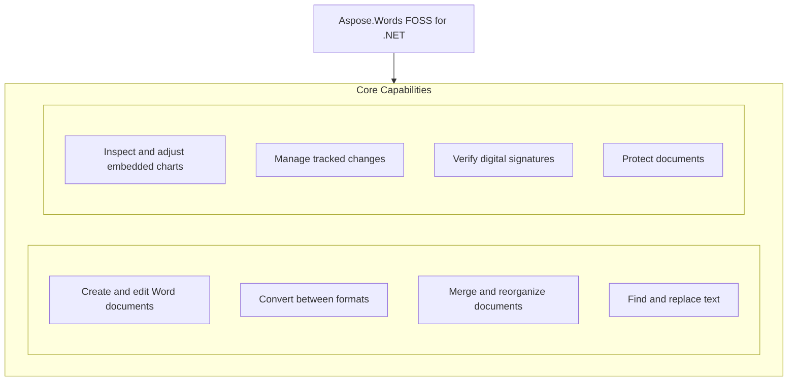

# Aspose.Words FOSS for .NET

[](https://www.nuget.org/packages/Aspose.Words.FOSS/) [](LICENSE) [](https://github.com/aspose-words-foss/Aspose.Words-FOSS-for-.NET/graphs/contributors)

[](https://products.aspose.org/words/net/)

Aspose.Words FOSS for .NET is a .NET library that enables developers to create, read, convert, and manipulate Word documents programmatically without requiring Microsoft Word. It supports a wide range of document formats for input and output, including DOCX, RTF, HTML, and Markdown, allowing applications to process documents across platforms. Developers use this library to automate document generation, merge multiple documents, apply styles, manage revisions, and handle digital signatures, bookmarks, comments, and tables. Built on netstandard2.0, it provides a consistent API surface including `Aspose.Words.Document`, `Aspose.Words.DocumentBuilder`, `Aspose.Words.Bookmark`, `Aspose.Words.Comment`, `Aspose.Words.TableStyle`, `Aspose.Words.SaveFormat`, `Aspose.Words.LoadFormat`, `Aspose.Words.NodeImporter`, `Aspose.Words.Replacing`, `Aspose.Words.Drawing`, `Aspose.Words.Revision`, `Aspose.Words.RevisionCollection`, `Aspose.Words.DigitalSignatures`, `Aspose.Words.ProtectionType`, and `Aspose.Words.Vba`.

## Navigation

- [At a Glance](#at-a-glance)
- [Key Capabilities](#key-capabilities)
- [Installation](#installation)
- [Dependencies](#dependencies)
- [API Reference](#api-reference)
- [Documentation & Resources](#documentation--resources)
- [Scope and Limitations](#scope-and-limitations)
- [License](#license)

## At a Glance



## Key Capabilities

- **Create and edit Word documents.** Create and edit Word documents using `Aspose.Words.Document` and `Aspose.Words.DocumentBuilder` to build content programmatically, add bookmarks with `Aspose.Words.Bookmark`, insert comments via `Aspose.Words.Comment`, and apply table styles through `Aspose.Words.TableStyle`.
- **Convert between formats.** Convert between formats by loading documents with `Aspose.Words.LoadFormat` and saving them using `Aspose.Words.SaveFormat`, supporting formats such as DOCX, RTF, HTML, and Markdown.
- **Merge and reorganize documents.** Merge and reorganize documents by appending content with `Aspose.Words.Document.AppendDocument` and importing nodes between documents using `Aspose.Words.NodeImporter`.
- **Find and replace text.** Find and replace text using `Aspose.Words.Replacing` to perform search-and-replace operations across document content with support for regular expressions and case sensitivity.
- **Inspect and adjust embedded charts.** Inspect and adjust embedded charts through `Aspose.Words.Drawing` to access chart objects, modify series, data labels, and formatting directly within the document.
- **Manage tracked changes.** Manage tracked changes by reviewing revisions with `Aspose.Words.Revision` and `Aspose.Words.RevisionCollection` to accept or reject changes individually or collectively.
- **Verify digital signatures.** Verify digital signatures using `Aspose.Words.DigitalSignatures` to validate the authenticity and integrity of signed documents.
- **Protect documents.** Protect documents by applying password or encryption-based protection using `Aspose.Words.ProtectionType` and managing VBA macros through `Aspose.Words.Vba`.

## Installation

Install the published package from NuGet (`Aspose.Words.FOSS`):

```bash
dotnet add package Aspose.Words.FOSS
```

## Dependencies

### Required Package Dependencies

No required third-party package dependencies; in `Aspose.Words/Aspose.Words.csproj`, no `PackageReference` a consumer would install is declared.

### Native and System Requirements

- Requires .NET `netstandard2.0` (`TargetFramework` in `Aspose.Words/Aspose.Words.csproj`).

### Development Dependencies

- `ILRepack 2.0.46`

## API Reference

The `Aspose.Words.Document` class serves as the primary entry point for creating, loading, and manipulating documents, while `Aspose.Words.DocumentBuilder` offers a convenient way to insert content programmatically.

The verified public surface has 618 types.

<details>
<summary>View the Complete Public API Surface</summary>

### Core API

| Class | Description |
| --- | --- |
| `AbsolutePositionTab` | An absolute position tab is a character which is used to advance the position on the current line of text when displaying this WordprocessingML content. |
| `Bibliography` | Represents the list of bibliography sources available in the document. |
| `Contributor` | Represents a bibliography source contributor. |
| `ContributorCollection` | Represents bibliography source contributors. |
| `Corporate` | Represents a corporate (an organization) bibliography source contributor. |
| `Person` | Represents individual (a person) bibliography source contributor. |
| `PersonCollection` | Represents a list of persons who are bibliography source contributors. |
| `Source` | Represents an individual source, such as a book, journal article, or interview. |
| `Body` | Represents a container for the main text of a section. |
| `Bookmark` | Represents a single bookmark. |
| `BookmarkCollection` | A collection of Bookmark objects that represent the bookmarks in the specified range. |
| `BookmarkEnd` | Represents an end of a bookmark in a Word document. |
| `BookmarkStart` | Represents a start of a bookmark in a Word document. |
| `Border` | Represents a border of an object. |
| `BorderCollection` | A collection of Border objects. |
| `BuildVersionInfo` | Provides information about the current product name and version. |
| `BuildingBlock` | Aspose.Words.BuildingBlocks.BuildingBlock represents a reusable content block that can be inserted into documents, containing structured content such as text, tables, and images with associated metadata like name, category, and gallery. |
| `BuildingBlockCollection` | A collection of BuildingBlock objects in the document. |
| `GlossaryDocument` | Represents the root element for a glossary document within a Word document. |
| `CleanupOptions` | Allows to specify options for document cleaning. |
| `Comment` | Represents a container for text of a comment. |
| `CommentCollection` | Provides typed access to a collection of Comment nodes. |
| `CommentRangeEnd` | Denotes the end of a region of text that has a comment associated with it. |
| `CommentRangeStart` | Denotes the start of a region of text that has a comment associated with it. |
| `CompositeNode` | Base class for nodes that can contain other nodes. |
| `ConditionalStyle` | Represents special formatting applied to some area of a table with assigned table style. |
| `ConditionalStyleCollection` | Represents a collection of ConditionalStyle objects. |
| `ControlChar` | Control characters often encountered in documents. |
| `ConvertUtil` | Provides helper functions to convert between various measurement units. |
| `CertificateHolder` | Represents a holder of X509Certificate2 instance. |
| `DigitalSignature` | Represents a digital signature on a document and the result of its verification. |
| `DigitalSignatureCollection` | Provides a read-only collection of digital signatures attached to a document. |
| `DigitalSignatureUtil` | Provides methods for signing document. |
| `SignOptions` | Allows to specify options for document signing. |
| `Document` | Aspose.Words.Document represents a complete document object model that provides access to all content, structure, and properties of a Word document, including sections, paragraphs, and document metadata. |
| `DocumentBase` | Provides the abstract base class for a main document and a glossary document of a Word document. |
| `DocumentBuilder` | Provides methods to insert text, images and other content, specify font, paragraph and section formatting. |
| `DocumentBuilderOptions` | Allows to specify additional options for the document building process. |
| `DocumentReaderPluginLoadException` | Thrown during document load, when the plugin required for reading the document format cannot be loaded. |
| `DocumentVisitor` | Base class for custom document visitors. |
| `Adjustment` | Represents adjustment values that are applied to the specified shape. |
| `AdjustmentCollection` | Represents a read-only collection of Adjustment adjust values that are applied to the specified shape. |
| `AxisBound` | Represents minimum or maximum bound of axis values. |
| `AxisDisplayUnit` | Provides access to the scaling options of the display units for the value axis. |
| `AxisScaling` | Represents the scaling options of the axis. |
| `AxisTickLabels` | Represents properties of axis tick mark labels. |
| `BubbleSizeCollection` | Represents a collection of bubble sizes for a chart series. |
| `Chart` | Provides access to the chart shape properties. |
| `ChartAxis` | Represents the axis options of the chart. |
| `ChartAxisCollection` | Represents a collection of chart axes. |
| `ChartAxisTitle` | Provides access to the axis title properties. |
| `ChartDataLabel` | Represents data label on a chart point or trendline. |
| `ChartDataLabelCollection` | Represents a collection of ChartDataLabel. |
| `ChartDataPoint` | Allows to specify formatting of a single data point on the chart. |
| `ChartDataPointCollection` | Represents collection of a ChartDataPoint. |
| `ChartDataTable` | Allows to specify properties of a chart data table. |
| `ChartFormat` | Represents the formatting of a chart element. |
| `ChartLegend` | Represents chart legend properties. |
| `ChartLegendEntry` | Represents a chart legend entry. |
| `ChartLegendEntryCollection` | Represents a collection of chart legend entries. |
| `ChartMarker` | Represents a chart data marker. |
| `ChartMultilevelValue` | Represents a value for charts that display multilevel data. |
| `ChartNumberFormat` | Represents number formatting of the parent element. |
| `ChartSeries` | Represents chart series properties. |
| `ChartSeriesCollection` | Represents collection of a ChartSeries. |
| `ChartSeriesGroup` | Represents properties of a chart series group, that is, the properties of chart series of the same type associated with the same axes. |
| `ChartSeriesGroupCollection` | Represents a collection of ChartSeriesGroup objects. |
| `ChartTitle` | Provides access to the chart title properties. |
| `ChartXValue` | Represents an X value for a chart series. |
| `ChartXValueCollection` | Represents a collection of X values for a chart series. |
| `ChartYValue` | Represents an Y value for a chart series. |
| `ChartYValueCollection` | Represents a collection of Y values for a chart series. |
| `IChartDataPoint` | Contains properties of a single data point on the chart. |
| `Fill` | Represents fill formatting for an object. |
| `GlowFormat` | Represents the glow formatting for an object. |
| `GradientStop` | Represents one gradient stop. |
| `GradientStopCollection` | Contains a collection of GradientStop objects. |
| `GroupShape` | Represents a group of shapes in a document. |
| `HorizontalRuleFormat` | Represents horizontal rule formatting. |
| `ImageData` | Aspose.Words.Drawing.ImageData encapsulates image properties and content used in document shapes, enabling programmatic access and modification of embedded or linked images. |
| `ImageSize` | Contains information about image size and resolution. |
| `CheckBoxControl` | The CheckBox control toggles a value. |
| `CommandButtonControl` | The CommandButton control runs a macro that performs an action when a user clicks it. |
| `Forms2OleControl` | Represents Microsoft Forms 2.0 OLE control. |
| `Forms2OleControlCollection` | Represents collection of Forms2OleControl objects. |
| `MorphDataControl` | The MorphDataControl structure is an aggregate of six controls: CheckBox, ComboBox, ListBox, OptionButton, TextBox, and ToggleButton. |
| `OleControl` | Represents OLE ActiveX control. |
| `OptionButtonControl` | The OptionButton control enables a single choice in a limited set of mutually exclusive choices. |
| `TextBoxControl` | The TextBox control displays text from an organized set of data or user input. |
| `OleFormat` | Provides access to the data of an OLE object or ActiveX control. |
| `OlePackage` | Allows to access OLE Package properties. |
| `ReflectionFormat` | Represents the reflection formatting for an object. |
| `ShadowFormat` | Represents shadow formatting for an object. |
| `Shape` | Represents an object in the drawing layer, such as an AutoShape, textbox, freeform, OLE object, ActiveX control, or picture. |
| `ShapeBase` | Base class for objects in the drawing layer, such as an AutoShape, freeform, OLE object, ActiveX control, or picture. |
| `SignatureLine` | Provides access to signature line properties. |
| `SoftEdgeFormat` | Represents the soft edge formatting for an object. |
| `Stroke` | Defines a stroke for a shape. |
| `TextBox` | Defines attributes that specify how a text is displayed inside a shape. |
| `TextPath` | Defines the text and formatting of the text path (of a WordArt object). |
| `EditableRange` | Represents a single editable range. |
| `EditableRangeEnd` | Represents an end of an editable range in a Word document. |
| `EditableRangeStart` | Represents a start of an editable range in a Word document. |
| `BarcodeParameters` | Container class for barcode parameters to pass-through to BarcodeGenerator. |
| `ComparisonEvaluationResult` | The comparison evaluation result. |
| `ComparisonExpression` | The comparison expression. |
| `DropDownItemCollection` | A collection of strings that represent all the items in a drop-down form field. |
| `Field` | Represents a Microsoft Word document field. |
| `FieldAddIn` | Implements the ADDIN field. |
| `FieldAddressBlock` | Implements the ADDRESSBLOCK field. |
| `FieldAdvance` | Implements the ADVANCE field. |
| `FieldArgumentBuilder` | Builds a complex field argument consisting of fields, nodes, and plain text. |
| `FieldAsk` | Implements the ASK field. |
| `FieldAuthor` | Implements the AUTHOR field. |
| `FieldAutoNum` | Implements the AUTONUM field. |
| `FieldAutoNumLgl` | Implements the AUTONUMLGL field. |
| `FieldAutoNumOut` | Implements the AUTONUMOUT field. |
| `FieldAutoText` | Implements the AUTOTEXT field. |
| `FieldAutoTextList` | Implements the AUTOTEXTLIST field. |
| `FieldBarcode` | Implements the BARCODE field. |
| `FieldBibliography` | Implements the BIBLIOGRAPHY field. |
| `FieldBidiOutline` | Implements the BIDIOUTLINE field. |
| `FieldBuilder` | Builds a field from field code tokens (arguments and switches). |
| `FieldChar` | Base class for nodes that represent field characters in a document. |
| `FieldCitation` | Implements the CITATION field. |
| `FieldCollection` | A collection of Field objects that represents the fields in the specified range. |
| `FieldComments` | Implements the COMMENTS field. |
| `FieldCompare` | Implements the COMPARE field. |
| `FieldCreateDate` | Implements the CREATEDATE field. |
| `FieldData` | Implements the DATA field. |
| `FieldDatabase` | Implements the DATABASE field. |
| `FieldDatabaseDataRow` | Provides data for the FieldDatabase field result. |
| `FieldDatabaseDataTable` | Provides data for the FieldDatabase field result. |
| `FieldDate` | Implements the DATE field. |
| `FieldDde` | Implements the DDE field. |
| `FieldDdeAuto` | Implements the DDEAUTO field. |
| `FieldDisplayBarcode` | Implements the DISPLAYBARCODE field. |
| `FieldDocProperty` | Implements the DOCPROPERTY field. |
| `FieldDocVariable` | Implements DOCVARIABLE field. |
| `FieldEQ` | Implements the EQ field. |
| `FieldEditTime` | Implements the EDITTIME field. |
| `FieldEmbed` | Implements the EMBED field. |
| `FieldEnd` | Represents an end of a Word field in a document. |
| `FieldFileName` | Implements the FILENAME field. |
| `FieldFileSize` | Implements the FILESIZE field. |
| `FieldFillIn` | Implements the FILLIN field. |
| `FieldFootnoteRef` | Implements the FOOTNOTEREF field. |
| `FieldFormCheckBox` | Implements the FORMCHECKBOX field. |
| `FieldFormDropDown` | Implements the FORMDROPDOWN field. |
| `FieldFormText` | Implements the FORMTEXT field. |
| `FieldFormat` | Provides typed access to field's numeric, date and time, and general formatting. |
| `FieldFormula` | Implements the = (formula) field. |
| `FieldGlossary` | Implements the GLOSSARY field. |
| `FieldGoToButton` | Implements the GOTOBUTTON field. |
| `FieldGreetingLine` | Implements the GREETINGLINE field. |
| `FieldHyperlink` | Implements the HYPERLINK field To learn more, visit the Working with Fields documentation article. |
| `FieldIf` | Implements the IF field. |
| `FieldImport` | Implements the IMPORT field. |
| `FieldInclude` | Implements the INCLUDE field. |
| `FieldIncludePicture` | Implements the INCLUDEPICTURE field. |
| `FieldIncludeText` | Implements the INCLUDETEXT field. |
| `FieldIndex` | Implements the INDEX field. |
| `FieldInfo` | Implements the INFO field. |
| `FieldKeywords` | Implements the KEYWORDS field. |
| `FieldLastSavedBy` | Implements the LASTSAVEDBY field. |
| `FieldLink` | Implements the LINK field. |
| `FieldListNum` | Implements the LISTNUM field. |
| `FieldMacroButton` | Implements the MACROBUTTON field. |
| `FieldMergeBarcode` | Implements the MERGEBARCODE field. |
| `FieldMergeField` | Implements the MERGEFIELD field. |
| `FieldMergeRec` | Implements the MERGEREC field. |
| `FieldMergeSeq` | Implements the MERGESEQ field. |
| `FieldNext` | Implements the NEXT field. |
| `FieldNextIf` | Implements the NEXTIF field. |
| `FieldNoteRef` | Implements the NOTEREF field. |
| `FieldNumChars` | Implements the NUMCHARS field. |
| `FieldNumPages` | Implements the NUMPAGES field. |
| `FieldNumWords` | Implements the NUMWORDS field. |
| `FieldOcx` | Implements the OCX field. |
| `FieldOptions` | Represents options to control field handling in a document. |
| `FieldPage` | Implements the PAGE field. |
| `FieldPageRef` | Implements the PAGEREF field. |
| `FieldPrint` | Implements the PRINT field. |
| `FieldPrintDate` | Implements the PRINTDATE field. |
| `FieldPrivate` | Implements the PRIVATE field. |
| `FieldQuote` | Implements the QUOTE field. |
| `FieldRD` | Implements the RD field. |
| `FieldRef` | Implements the REF field. |
| `FieldRevNum` | Implements the REVNUM field. |
| `FieldSaveDate` | Implements the SAVEDATE field. |
| `FieldSection` | Implements the SECTION field. |
| `FieldSectionPages` | Implements the SECTIONPAGES field. |
| `FieldSeparator` | Represents a Word field separator that separates the field code from the field result. |
| `FieldSeq` | Implements the SEQ field. |
| `FieldSet` | Implements the SET field. |
| `FieldShape` | Implements the SHAPE field. |
| `FieldSkipIf` | Implements the SKIPIF field. |
| `FieldStart` | Represents a start of a Word field in a document. |
| `FieldStyleRef` | Implements the STYLEREF field. |
| `FieldSubject` | Implements the SUBJECT field. |
| `FieldSymbol` | Implements a SYMBOL field. |
| `FieldTA` | Implements the TA field. |
| `FieldTC` | Implements the TC field. |
| `FieldTemplate` | Implements the TEMPLATE field. |
| `FieldTime` | Implements the TIME field. |
| `FieldTitle` | Implements the TITLE field. |
| `FieldToa` | Implements the TOA field. |
| `FieldToc` | Implements the TOC field. |
| `FieldUnknown` | Implements an unknown or unrecognized field. |
| `FieldUpdatingProgressArgs` | Provides data for the field updating progress event. |
| `FieldUserAddress` | Implements the USERADDRESS field. |
| `FieldUserInitials` | Implements the USERINITIALS field. |
| `FieldUserName` | Implements the USERNAME field. |
| `FieldXE` | Implements the XE field. |
| `FormField` | Represents a single form field. |
| `FormFieldCollection` | A collection of FormField objects that represent all the form fields in a range. |
| `GeneralFormatCollection` | Represents a typed collection of general formats. |
| `IBarcodeGenerator` | Public interface for barcode custom generator. |
| `IBibliographyStylesProvider` | Implement this interface to provide bibliography style for the  FieldBibliography and FieldCitation fields when they're updated. |
| `IComparisonExpressionEvaluator` | When implemented, allows to override default comparison expressions evaluation for the FieldIf and FieldCompare fields. |
| `IFieldDatabaseProvider` | Implement this interface to provide data for the FieldDatabase field when it's updated. |
| `IFieldResultFormatter` | Implement this interface if you want to control how the field result is formatted. |
| `IFieldUpdateCultureProvider` | When implemented, provides a CultureInfo object that should be used during the update of a particular field. |
| `IFieldUpdatingCallback` | Implement this interface if you want to have your own custom methods called during a field update. |
| `IFieldUpdatingProgressCallback` | Implement this interface if you want to track field updating progress. |
| `IFieldUserPromptRespondent` | Represents the respondent to user prompts during field update. |
| `MergeFieldImageDimension` | Represents an image dimension (i.e. |
| `ToaCategories` | Represents a table of authorities categories. |
| `UserInformation` | Specifies information about the user. |
| `FileCorruptedException` | Thrown during document load, when the document appears to be corrupted and impossible to load. |
| `FileFormatInfo` | Contains data returned by FileFormatUtil document format detection methods. |
| `FileFormatUtil` | Provides utility methods for working with file formats, such as detecting file format or converting file extensions to/from file format enums. |
| `Font` | Contains font attributes (font name, font size, color, and so on) for an object. |
| `FontEmbeddingLicensingRights` | Represents embedding licensing rights for the font. |
| `FontInfo` | Specifies information about a font used in the document. |
| `FontInfoCollection` | Represents a collection of fonts used in a document. |
| `FontSettings` | Specifies font settings for a document. |
| `FrameFormat` | Represents frame related formatting for a paragraph. |
| `Frameset` | Represents a frames page or a single frame on a frames page. |
| `FramesetCollection` | Represents a collection of instances of the Frameset class. |
| `HeaderFooter` | Represents a container for the header or footer text of a section. |
| `HeaderFooterCollection` | Provides typed access to HeaderFooter nodes of a Section. |
| `IDocumentConverterPlugin` | Defines an interface for external converter plugin. |
| `IDocumentMergerPlugin` | Defines an interface for external merger plugin that can merge Pdf documents. |
| `IDocumentReaderPlugin` | Defines an interface for external reader plugins that can read a file into a document. |
| `INodeChangingCallback` | Implement this interface if you want to receive notifications when nodes are inserted or removed in the document. |
| `INodeCollection` | Aspose.Words.INodeCollection provides a read-only interface for iterating over and accessing child nodes within a composite document node. |
| `IRevisionCriteria` | Implement this interface if you want to control when certain Revision should be accepted/rejected or not by the Accept/Reject methods. |
| `IWarningCallback` | Implement this interface if you want to have your own custom method called to capture loss of fidelity warnings that can occur during document loading or saving. |
| `ImageWatermarkOptions` | Contains options that can be specified when adding a watermark with image. |
| `ImportFormatOptions` | Allows to specify various import options to format output. |
| `IncorrectPasswordException` | Thrown if a document is encrypted with a password and the password specified when opening the document is incorrect or missing. |
| `Inline` | Base class for inline-level nodes that can have character formatting associated with them, but cannot have child nodes of their own. |
| `InlineStory` | Base class for inline-level nodes that can contain paragraphs and tables. |
| `InternableComplexAttr` | Base class for internable complex attribute. |
| `JoinRunsOptions` | Provides configuration flags for the join runs operation. |
| `List` | Aspose.Words.Lists.List defines a reusable list template that specifies numbering, bullet, and formatting rules applied to paragraphs in a document. |
| `ListCollection` | Stores and manages formatting of bulleted and numbered lists used in a document. |
| `ListFormat` | Allows to control what list formatting is applied to a paragraph. |
| `ListLabel` | Defines properties specific to a list label. |
| `ListLevel` | Defines formatting for a list level. |
| `ListLevelCollection` | A collection of list formatting for each level in a list. |
| `ChmLoadOptions` | Allows to specify additional options when loading CHM document into a Document object. |
| `DocumentLoadingArgs` | An argument passed into Notify(DocumentLoadingArgs). |
| `HtmlLoadOptions` | Allows to specify additional options when loading HTML document into a Document object. |
| `IDocumentLoadingCallback` | Implement this interface if you want to have your own custom method called during loading a document. |
| `IResourceLoadingCallback` | Implement this interface if you want to control how Aspose.Words loads external resource when importing a document and inserting images using DocumentBuilder. |
| `LanguagePreferences` | Allows to set up language preferences. |
| `LoadOptions` | Allows to specify additional options (such as password or base URI) when loading a document into a Document object. |
| `MarkdownLoadOptions` | Allows to specify additional options when loading Markdown document into a Document object. |
| `PdfLoadOptions` | Allows to specify additional options when loading Pdf document into a Document object. |
| `ResourceLoadingArgs` | Provides data for the ResourceLoading method. |
| `RtfLoadOptions` | Allows to specify additional options when loading Rtf document into a Document object. |
| `TxtLoadOptions` | Allows to specify additional options when loading Text document into a Document object. |
| `CustomPart` | Represents a custom (arbitrary content) part, that is not defined by the ISO/IEC 29500 standard. |
| `CustomPartCollection` | Represents a collection of CustomPart objects. |
| `CustomXmlPart` | Represents a Custom XML Data Storage Part (custom XML data within a package). |
| `CustomXmlPartCollection` | Represents a collection of Custom XML Parts. |
| `CustomXmlProperty` | Represents a single custom XML attribute or a smart tag property. |
| `CustomXmlPropertyCollection` | Represents a collection of custom XML attributes or smart tag properties. |
| `CustomXmlSchemaCollection` | A collection of strings that represent XML schemas that are associated with a custom XML part. |
| `IStructuredDocumentTag` | Interface to define a common data for StructuredDocumentTag and StructuredDocumentTagRangeStart. |
| `SdtListItem` | This element specifies a single list item within a parent ComboBox or DropDownList structured document tag. |
| `SdtListItemCollection` | Provides access to SdtListItem elements of a structured document tag. |
| `SmartTag` | This element specifies the presence of a smart tag around one or more inline structures (runs, images, fields,etc.) within a paragraph. |
| `StructuredDocumentTag` | Represents a structured document tag (SDT or content control) in a document. |
| `StructuredDocumentTagCollection` | A collection of IStructuredDocumentTag instances that represent the structured document tags in the specified range. |
| `StructuredDocumentTagRangeEnd` | Represents an end of ranged structured document tag which accepts multi-sections content. |
| `StructuredDocumentTagRangeStart` | Represents a start of ranged structured document tag which accepts multi-sections content. |
| `XmlMapping` | Specifies the information that is used to establish a mapping between the parent structured document tag and an XML element stored within a custom XML data part in the document. |
| `OfficeMath` | Represents an Office Math object such as function, equation, matrix or alike. |
| `Node` | Base class for all nodes of a Word document. |
| `NodeChangingArgs` | Provides data for methods of the INodeChangingCallback interface. |
| `NodeCollection` | Represents a collection of nodes of a specific type. |
| `NodeEnumerator` | Aspose.Words.NodeEnumerator supports forward-only iteration over a collection of document nodes, enabling traversal of the document object model. |
| `NodeImporter` | Allows to efficiently perform repeated import of nodes from one document to another. |
| `NodeList` | Represents a collection of nodes matching an XPath query executed using the SelectNodes method. |
| `EndnoteOptions` | Represents the endnote numbering options for a document or section. |
| `Footnote` | Represents a container for text of a footnote or endnote. |
| `FootnoteOptions` | Represents the footnote numbering options for a document or section. |
| `FootnoteSeparator` | Represents a container for the footnote/endnote separator and continuation content of a document. |
| `FootnoteSeparatorCollection` | Provides typed access to FootnoteSeparator nodes of a document. |
| `PageSetup` | Represents the page setup properties of a section. |
| `Paragraph` | Represents a paragraph of text. |
| `ParagraphCollection` | Provides typed access to a collection of Paragraph nodes. |
| `ParagraphFormat` | Represents all the formatting for a paragraph. |
| `PhoneticGuide` | Represents Phonetic Guide. |
| `PlainTextDocument` | Allows to extract plain-text representation of the document's content. |
| `BuiltInDocumentProperties` | A collection of built-in document properties. |
| `CustomDocumentProperties` | A collection of custom document properties. |
| `DocumentProperty` | Represents a custom or built-in document property. |
| `DocumentPropertyCollection` | Base class for BuiltInDocumentProperties and CustomDocumentProperties collections. |
| `Range` | Represents a contiguous area in a document. |
| `FindReplaceOptions` | Specifies options for find/replace operations. |
| `IReplacingCallback` | Implement this interface if you want to have your own custom method called during a find and replace operation. |
| `ReplacingArgs` | Provides data for a custom replace operation. |
| `Revision` | Represents a revision (tracked change) in a document node or style. |
| `RevisionCollection` | A collection of Revision objects that represent revisions in the document. |
| `RevisionGroup` | Represents a group of sequential Revision objects. |
| `RevisionGroupCollection` | A collection of RevisionGroup objects that represent revision groups in the document. |
| `Run` | Represents a run of characters with the same font formatting. |
| `RunCollection` | Provides typed access to a collection of Run nodes. |
| `BookmarksOutlineLevelCollection` | A collection of individual bookmarks outline level. |
| `CssSavingArgs` | Provides data for the CssSaving event. |
| `DigitalSignatureDetails` | Contains details for signing a document with a digital signature. |
| `DocumentPartSavingArgs` | Provides data for the DocumentPartSaving callback. |
| `DocumentSavingArgs` | An argument passed into Notify(DocumentSavingArgs). |
| `GraphicsQualityOptions` | Allows to specify additional Graphics quality optionsjava.awt.RenderingHints Graphics quality options. |
| `HtmlSaveOptions` | Can be used to specify additional options when saving a document into the Html, Mhtml, Epub, Azw3 or Mobi format. |
| `ICssSavingCallback` | Implement this interface if you want to control how Aspose.Words saves CSS (Cascading Style Sheet) when saving a document to HTML. |
| `IDocumentPartSavingCallback` | Implement this interface if you want to receive notifications and control how Aspose.Words saves document parts when exporting a document to Html or Epub format. |
| `IDocumentSavingCallback` | Implement this interface if you want to have your own custom method called during saving a document. |
| `IImageSavingCallback` | Implement this interface if you want to control how Aspose.Words saves images when saving a document to HTML. |
| `IPageSavingCallback` | Implement this interface if you want to control how Aspose.Words saves separate pages when saving a document to fixed page formats. |
| `IResourceSavingCallback` | Implement this interface if you want to control how Aspose.Words saves external resources (images, fonts and css) when saving a document to fixed page HTML or SVG. |
| `ImageSavingArgs` | Provides data for the ImageSaving event. |
| `MarkdownSaveOptions` | Class to specify additional options when saving a document into the Markdown format. |
| `MultiPageLayout` | Defines a layout for rendering multiple pages into a single output. |
| `OoxmlSaveOptions` | Can be used to specify additional options when saving a document into the Docx, Docm, Dotx, Dotm or FlatOpc format. |
| `OutlineOptions` | Allows to specify outline options. |
| `PageRange` | Represents a continuous range of pages. |
| `PageSavingArgs` | Provides data for the PageSaving event. |
| `PageSet` | Describes a random set of pages. |
| `ResourceSavingArgs` | Provides data for the ResourceSaving event. |
| `SaveOptions` | This is an abstract base class for classes that allow the user to specify additional options when saving a document into a particular format. |
| `SaveOutputParameters` | This object is returned to the caller after a document is saved and contains additional information that has been generated or calculated during the save operation. |
| `TxtListIndentation` | Specifies how list levels are indented when document is exporting to Text format. |
| `TxtSaveOptions` | Can be used to specify additional options when saving a document into the Text format. |
| `TxtSaveOptionsBase` | The base class for specifying additional options when saving a document into a text based formats. |
| `WordML2003SaveOptions` | Can be used to specify additional options when saving a document into the WordML format. |
| `Section` | Represents a single section in a document. |
| `SectionCollection` | A collection of Section objects in the document. |
| `CompatibilityOptions` | Contains compatibility options (that is, the user preferences entered on the Compatibility tab of the Options dialog in Microsoft Word). |
| `HyphenationOptions` | Allows to configure document hyphenation options. |
| `MailMergeSettings` | Specifies all of the mail merge information for a document. |
| `Odso` | Specifies the Office Data Source Object (ODSO) settings for a mail merge data source. |
| `OdsoFieldMapData` | Specifies how a column in the external data source shall be mapped to the predefined merge fields within the document. |
| `OdsoFieldMapDataCollection` | A typed collection of the OdsoFieldMapData objects. |
| `OdsoRecipientData` | Represents information about a single record within an external data source that is to be excluded from the mail merge. |
| `OdsoRecipientDataCollection` | A typed collection of OdsoRecipientData To learn more, visit the Mail Merge and Reporting documentation article. |
| `ViewOptions` | Provides various options that control how a document is shown in Microsoft Word. |
| `WriteProtection` | Specifies write protection settings for a document. |
| `Shading` | Contains shading attributes for an object. |
| `SignatureLineOptions` | Allows to specify options for signature line being inserted. |
| `SpecialChar` | Base class for special characters in the document. |
| `Story` | Base class for elements that contain block-level nodes Paragraph and Table. |
| `Style` | Represents a single built-in or user-defined style. |
| `StyleCollection` | A collection of Style objects that represent both the built-in and user-defined styles in a document. |
| `SubDocument` | Represents a SubDocument - which is a reference to an externally stored document. |
| `TabStop` | Represents a single custom tab stop. |
| `TabStopCollection` | Aspose.Words.TabStopCollection holds a collection of tab stop positions and their alignment and leader settings used for formatting paragraph text. |
| `TableStyle` | Represents a table style. |
| `Cell` | Represents a table cell. |
| `CellCollection` | Provides typed access to a collection of Cell nodes. |
| `CellFormat` | Represents all formatting for a table cell. |
| `PreferredWidth` | Represents a value and its unit of measure that is used to specify the preferred width of a table or a cell. |
| `Row` | Represents a table row. |
| `RowCollection` | Provides typed access to a collection of Row nodes. |
| `RowFormat` | Represents all formatting for a table row. |
| `Table` | Represents a table in a Word document. |
| `TableCollection` | Provides typed access to a collection of Table nodes. |
| `TextColumn` | Represents a single text column. |
| `TextColumnCollection` | A collection of TextColumn objects that represent all the columns of text in a section of a document. |
| `TextWatermarkOptions` | Contains options that can be specified when adding a watermark with text. |
| `Theme` | Represents document Theme, and provides access to main theme parts including MajorFonts, MinorFonts and Colors To learn more, visit the Working with Styles and Themes documentation article. |
| `ThemeColors` | Represents the color scheme of the document theme which contains twelve colors. |
| `ThemeFonts` | Represents a collection of fonts in the font scheme, allowing to specify different fonts for different languages Latin, EastAsian and ComplexScript. |
| `UnsupportedFileFormatException` | Thrown during document load, when the document format is not recognized or not supported by Aspose.Words. |
| `VariableCollection` | A collection of document variables. |
| `VbaModule` | Provides access to VBA project module. |
| `VbaModuleCollection` | Represents a collection of VbaModule objects. |
| `VbaProject` | Provides access to VBA project information. |
| `VbaReference` | Implements a reference to an Automation type library or VBA project. |
| `VbaReferenceCollection` | Represents a collection of VbaReference objects. |
| `WarningInfo` | Contains information about a warning that Aspose.Words issued during document loading or saving. |
| `WarningInfoCollection` | Represents a typed collection of WarningInfo objects. |
| `Watermark` | Represents class to work with document watermark. |
| `BaseWebExtensionCollection` | Base class for TaskPaneCollection, WebExtensionBindingCollection, WebExtensionPropertyCollection and WebExtensionReferenceCollection collections. |
| `TaskPane` | Represents an add-in task pane object. |
| `TaskPaneCollection` | Specifies a list of persisted task pane objects. |
| `WebExtension` | Represents a web extension object. |
| `WebExtensionBinding` | Specifies a binding relationship between a web extension and the data in the document. |
| `WebExtensionBindingCollection` | Specifies a list of web extension bindings. |
| `WebExtensionProperty` | Specifies a web extension custom property. |
| `WebExtensionPropertyCollection` | Specifies a set of web extension custom properties. |
| `WebExtensionReference` | Represents the reference to a web extension. |
| `WebExtensionReferenceCollection` | Specifies a list of web extension references. |

#### Enumerations

| Enumeration | Description |
| --- | --- |
| `BaselineAlignment` | Specifies fonts vertical position on a line. |
| `SourceType` | Represents bibliography source types. |
| `BorderType` | Specifies sides of a border. |
| `BreakType` | Specifies type of a break inside a document. |
| `BuildingBlockBehavior` | Specifies the behavior that shall be applied to the contents of the building block when it is inserted into the main document. |
| `BuildingBlockGallery` | Specifies the predefined gallery into which a building block is classified. |
| `BuildingBlockType` | Specifies a building block type. |
| `CalendarType` | Specifies the type of a calendar. |
| `ChapterPageSeparator` | Defines the separator character that appears between the chapter and page number. |
| `ConditionalStyleType` | Represents possible table areas to which conditional formatting may be defined in a table style. |
| `ContentDisposition` | Enumerates different ways of presenting the document at the client browser. |
| `DigitalSignatureType` | Specifies the type of a digital signature. |
| `XmlDsigLevel` | Specifies the level of a digital signature based on XML-DSig standard. |
| `DocumentPositionMovement` | Aspose.Words.DocumentPositionMovement specifies the direction and behavior for moving the document cursor or selection within a document during editing operations. |
| `ArrowLength` | Length of the arrow at the end of a line. |
| `ArrowType` | Specifies the type of an arrow at a line end. |
| `ArrowWidth` | Width of the arrow at the end of a line. |
| `AxisBuiltInUnit` | Specifies the display units for an axis. |
| `AxisCategoryType` | Specifies type of a category axis. |
| `AxisCrosses` | Specifies the possible crossing points for an axis. |
| `AxisGroup` | Represents a type of a chart axis group. |
| `AxisScaleType` | Specifies the possible scale types for an axis. |
| `AxisTickLabelPosition` | Specifies the possible positions for tick labels. |
| `AxisTickMark` | Specifies the possible positions for tick marks. |
| `AxisTimeUnit` | Specifies the unit of time for axes. |
| `ChartAxisType` | Specifies type of chart axis. |
| `ChartDataLabelLocationMode` | Specifies how the values ​​that specify the location of a data label - the Left and Top properties - are interpreted. |
| `ChartDataLabelPosition` | Specifies the position for a chart data label. |
| `ChartSeriesType` | Specifies a type of a chart series. |
| `ChartShapeType` | Specifies the shape type of chart elements. |
| `ChartStyle` | Specifies predefined styles of a chart. |
| `ChartType` | Specifies type of a chart. |
| `ChartXValueType` | Allows to specify type of an X value of a chart series. |
| `ChartYValueType` | Allows to specify type of an Y value of a chart series. |
| `LegendPosition` | Specifies the possible positions for a chart legend. |
| `MarkerSymbol` | Specifies marker symbol style. |
| `DashStyle` | Dashed line style. |
| `EndCap` | Specifies line cap style. |
| `FillType` | Specifies fill type for a fillable object. |
| `FlipOrientation` | Possible values for the orientation of a shape. |
| `GradientStyle` | Specifies the style for a gradient fill. |
| `GradientVariant` | Specifies the variant for a gradient fill. |
| `HorizontalAlignment` | Specifies horizontal alignment of a floating shape, text frame or floating table. |
| `HorizontalRuleAlignment` | Represents the alignment for the specified horizontal rule. |
| `ImageType` | Specifies the type (format) of an image in a Microsoft Word document. |
| `JoinStyle` | Line join style. |
| `LayoutFlow` | Determines the flow of the text layout in a textbox. |
| `Forms2OleControlType` | Enumerates types of Forms 2.0 controls. |
| `PatternType` | Specifies the fill pattern to be used to fill a shape. |
| `PresetTexture` | Specifies texture to be used to fill a shape. |
| `RelativeHorizontalPosition` | Specifies to what the horizontal position of a shape or text frame is relative. |
| `RelativeHorizontalSize` | Specifies relatively to what the width of a shape or a text frame is calculated horizontally. |
| `RelativeVerticalPosition` | Specifies to what the vertical position of a shape or text frame is relative. |
| `RelativeVerticalSize` | Specifies relatively to what the height of a shape or a text frame is calculated vertically. |
| `ShadowType` | Aspose.Words.Drawing.ShadowType defines the style and appearance of shadows applied to shapes in a document, such as offset, blur, and color characteristics. |
| `ShapeLineStyle` | Specifies the compound line style of a Shape. |
| `ShapeMarkupLanguage` | Aspose.Words.Drawing.ShapeMarkupLanguage indicates the markup format used to represent vector shapes within a document, supporting interoperability and rendering consistency. |
| `ShapeTextOrientation` | Specifies orientation of text in shapes. |
| `ShapeType` | Specifies the type of shape in a Microsoft Word document. |
| `TextBoxAnchor` | Specifies values used for shape text vertical alignment. |
| `TextBoxWrapMode` | Specifies how text wraps inside a shape. |
| `TextPathAlignment` | WordArt alignment. |
| `TextureAlignment` | Specifies the alignment for the tiling of the texture fill. |
| `VerticalAlignment` | Specifies vertical alignment of a floating shape, text frame or a floating table. |
| `WrapSide` | Specifies what side(s) of the shape or picture the text wraps around. |
| `WrapType` | Specifies how text is wrapped around a shape or picture. |
| `DropCapPosition` | Specifies the position for a drop cap text. |
| `EditorType` | Specifies the set of possible aliases (or editing groups) which can be used as aliases to determine if the current user shall be allowed to edit a single range defined by an editable range within a document. |
| `EmphasisMark` | Specifies possible types of emphasis mark. |
| `FieldIfComparisonResult` | Specifies the result of the IF field condition evaluation. |
| `FieldIndexFormat` | Specifies the formatting for the FieldIndex fields in a document. |
| `FieldType` | Specifies Microsoft Word field types. |
| `FieldUpdateCultureSource` | Indicates what culture to use during field update. |
| `GeneralFormat` | Specifies a general format that is applied to a numeric, text, or any field result. |
| `MergeFieldImageDimensionUnit` | Specifies an unit of an image dimension (i.e. |
| `TextFormFieldType` | Specifies the type of a text form field. |
| `EmbeddedFontFormat` | Specifies format of particular embedded font inside FontInfo object. |
| `EmbeddedFontStyle` | Specifies the style of an embedded font inside a FontInfo object. |
| `FontEmbeddingUsagePermissions` | Represents the font embedding usage permissions. |
| `FontFamily` | Represents the font family. |
| `FontPitch` | Represents the font pitch. |
| `HeaderFooterType` | Identifies the type of header or footer found in a Word file. |
| `HeightRule` | Specifies the rule for determining the height of an object. |
| `HtmlInsertOptions` | Specifies options for the InsertHtml(string, HtmlInsertOptions) method. |
| `ImportFormatMode` | Specifies how formatting is merged when importing content from another document. |
| `LineNumberRestartMode` | Determines when automatic line numbering restarts. |
| `LineSpacingRule` | Specifies line spacing values for a paragraph. |
| `LineStyle` | Specifies line style of a Border. |
| `ListLevelAlignment` | Specifies alignment for the list number or bullet. |
| `ListTemplate` | Specifies one of the predefined list formats available in Microsoft Word. |
| `ListTrailingCharacter` | Specifies the character that separates the list label from the text of the paragraph. |
| `LoadFormat` | Indicates the format of the document that is to be loaded. |
| `BlockImportMode` | Specifies how properties of block-level elements are imported from HTML-based documents. |
| `DocumentDirection` | Allows to specify the direction to flow the text in a document. |
| `DocumentRecoveryMode` | Specifies the available recovery options when a document encounters errors during loading. |
| `EditingLanguage` | Specifies the editing language. |
| `HtmlControlType` | Type of document nodes that represent &lt;input&gt; and &lt;select&gt; elements imported from HTML. |
| `ResourceLoadingAction` | Specifies the mode of resource loading. |
| `ResourceType` | Type of loaded resource. |
| `TxtLeadingSpacesOptions` | Specifies available options for leading space handling during import from Text file. |
| `TxtTrailingSpacesOptions` | Specifies available options for trailing spaces handling during import from Text file. |
| `Margins` | Specifies preset margins. |
| `MarkupLevel` | Specifies the level in the document tree where a particular StructuredDocumentTag can occur. |
| `SdtAppearance` | Specifies the appearance of a structured document tag. |
| `SdtCalendarType` | Specifies the possible types of calendars which can be used to specify CalendarType in an Office Open XML document. |
| `SdtDateStorageFormat` | Specifies how the date for a date SDT is stored/retrieved when the SDT is bound to an XML node in the document's data store. |
| `SdtType` | Specifies the type of a structured document tag (SDT) node. |
| `MathObjectType` | Specifies type of an Office Math object. |
| `OfficeMathDisplayType` | Specifies the display format type of the equation. |
| `OfficeMathJustification` | Specifies the justification of the equation. |
| `MeasurementUnits` | Specifies the unit of measurement. |
| `NodeChangingAction` | Specifies the type of node change. |
| `NodeType` | Specifies the type of a Word document node. |
| `EndnotePosition` | Defines the endnote position. |
| `FootnoteNumberingRule` | Determines when automatic footnote or endnote numbering restarts. |
| `FootnotePosition` | Defines the footnote position. |
| `FootnoteSeparatorType` | Specifies the type of the footnote/endnote separator. |
| `FootnoteType` | Specifies whether this is a footnote or an endnote. |
| `NumSpacing` | Specifies possible values in which numeral spacing can be displayed. |
| `NumberStyle` | Specifies the number style for a list, footnotes and endnotes, page numbers. |
| `Orientation` | Specifies page orientation. |
| `OutlineLevel` | Specifies the outline level of a paragraph in the document. |
| `PageBorderAppliesTo` | Specifies which pages the page border is printed on. |
| `PageBorderDistanceFrom` | Specifies the positioning of the page border relative to the page margin. |
| `PageVerticalAlignment` | Specifies vertical justification of text on each page. |
| `PaperSize` | Specifies paper size. |
| `ParagraphAlignment` | Specifies text alignment in a paragraph. |
| `DocumentSecurity` | Used as a value for the Security property. |
| `PropertyType` | Specifies data type of a document property. |
| `ProtectionType` | Protection type for a document. |
| `FindReplaceDirection` | Specifies direction for replace operations. |
| `ReplaceAction` | Allows the user to specify what happens to the current match during a replace operation. |
| `ReplacementFormat` | Specifies the replacement format. |
| `RevisionType` | Aspose.Words.RevisionType categorizes tracked changes in a document, such as insertions, deletions, and formatting modifications, allowing selective review and acceptance. |
| `RevisionsView` | Allows to specify whether to work with the original or revised version of a document. |
| `SaveFormat` | Indicates the format in which the document is saved. |
| `ColorMode` | Specifies how colors are rendered. |
| `CompressionLevel` | Compression level for OOXML files. |
| `CssStyleSheetType` | Specifies how CSS (Cascading Style Sheet) styles are exported to HTML. |
| `Dml3DEffectsRenderingMode` | Specifies how 3D shape effects are rendered. |
| `DmlEffectsRenderingMode` | Specifies how DrawingML effects are rendered to fixed page formats. |
| `DmlRenderingMode` | Specifies how DrawingML shapes are rendered to fixed page formats. |
| `DocumentSplitCriteria` | Specifies how the document is split into parts when saving to Html, Epub or Azw3 format. |
| `EmfPlusDualRenderingMode` | Specifies how Aspose.Words should render EMF+ Dual metafiles. |
| `ExportHeadersFootersMode` | Specifies how headers and footers are exported to HTML, MHTML or EPUB. |
| `ExportListLabels` | Specifies how list labels are exported to HTML, MHTML and EPUB. |
| `HeaderFooterBookmarksExportMode` | Specifies how bookmarks in headers/footers are exported. |
| `HtmlElementSizeOutputMode` | Specifies how Aspose.Words exports element widths and heights to HTML, MHTML and EPUB. |
| `HtmlMetafileFormat` | Indicates the format in which metafiles are saved to HTML documents. |
| `HtmlOfficeMathOutputMode` | Specifies how Aspose.Words exports OfficeMath to HTML, MHTML and EPUB. |
| `HtmlVersion` | Indicates the version of HTML is used when saving the document to Html and Mhtml formats. |
| `ImageBinarizationMethod` | Specifies the method used to binarize image. |
| `ImageColorMode` | Specifies the color mode for the generated images of document pages. |
| `ImagePixelFormat` | Specifies the pixel format for the generated images of document pages. |
| `ImlRenderingMode` | Specifies how ink (InkML) objects are rendered to fixed page formats. |
| `MarkdownEmptyParagraphExportMode` | Specifies how Aspose.Words exports empty paragraphs to Markdown. |
| `MarkdownExportAsHtml` | Allows to specify the elements to be exported to Markdown as raw HTML. |
| `MarkdownLinkExportMode` | Specifies how links are exported into Markdown. |
| `MarkdownListExportMode` | Specifies how lists are exported into Markdown. |
| `MarkdownOfficeMathExportMode` | Specifies how Aspose.Words exports OfficeMath to Markdown. |
| `NumeralFormat` | Indicates the symbol set that is used to represent numbers while rendering to fixed page formats. |
| `OoxmlCompliance` | Allows to specify which OOXML specification will be used when saving in the DOCX format. |
| `SvgTextOutputMode` | Allows to specify how text inside a document should be rendered when saving in SVG format. |
| `TableContentAlignment` | Allows to specify the alignment of the content of the table to be used when exporting into Markdown format. |
| `TiffCompression` | Specifies what type of compression to apply when saving page images into a TIFF file. |
| `TxtExportHeadersFootersMode` | Specifies the way headers and footers are exported to plain text format. |
| `TxtOfficeMathExportMode` | Specifies how Aspose.Words exports OfficeMath to Text. |
| `Zip64Mode` | Specifies when to use ZIP64 format extensions for OOXML files. |
| `SectionLayoutMode` | Specifies the layout mode for a section allowing to define the document grid behavior. |
| `SectionStart` | The type of break at the beginning of the section. |
| `Compatibility` | Specifies names of compatibility options. |
| `JustificationMode` | Specifies the character spacing adjustment for a document. |
| `MailMergeCheckErrors` | Specifies how Microsoft Word will report errors detected during mail merge. |
| `MailMergeDataType` | Specifies the type of an external mail merge data source. |
| `MailMergeDestination` | Specifies the possible results which may be generated when a mail merge is carried out on a document. |
| `MailMergeMainDocumentType` | Specifies the possible types for a mail merge source document. |
| `MsWordVersion` | Allows Aspose.Wods to mimic MS Word version-specific application behavior. |
| `MultiplePagesType` | Specifies how document is printed out. |
| `OdsoDataSourceType` | Specifies the type of the external data source to be connected to as part of the ODSO connection information. |
| `OdsoFieldMappingType` | Specifies the possible types used to indicate if a given mail merge field has been mapped to a column in the given external data source. |
| `ViewType` | Possible values for the view mode in Microsoft Word. |
| `ZoomType` | Possible values for how large or small the document appears on the screen in Microsoft Word. |
| `StoryType` | Text of a Word document is stored in stories. |
| `StyleIdentifier` | Locale independent style identifier. |
| `StyleType` | Represents type of the style. |
| `TabAlignment` | Specifies the alignment/type of a tab stop. |
| `TabLeader` | Specifies the type of the leader line displayed under the tab character. |
| `AutoFitBehavior` | Determines how Aspose.Words resizes the table when you invoke the AutoFit method. |
| `CellMerge` | Specifies how a cell in a table is merged with other cells. |
| `CellVerticalAlignment` | Specifies vertical justification of text inside a table cell. |
| `PreferredWidthType` | Specifies the unit of measurement for the preferred width of a table or cell. |
| `TableAlignment` | Specifies alignment for an inline table. |
| `TableStyleOptions` | Specifies how table style is applied to a table. |
| `TextWrapping` | Specifies how text is wrapped around the table. |
| `TextDmlEffect` | Dml text effect for text runs. |
| `TextEffect` | Animation effect for text runs. |
| `TextOrientation` | Specifies orientation of text on a page, in a table cell or a text frame. |
| `TextureIndex` | Specifies shading texture. |
| `ThemeColor` | Specifies the theme colors for document themes. |
| `ThemeFont` | Specifies the types of theme font names for document themes. |
| `Underline` | Indicates type of the underline applied to a font. |
| `VbaModuleType` | Specifies the type of a model in a VBA project. |
| `VbaReferenceType` | Allows to specify the type of a VbaReference object. |
| `VisitorAction` | Allows the visitor to control the enumeration of nodes. |
| `WarningSource` | Specifies the module that produces a warning during document loading or saving. |
| `WarningType` | Specifies the type of a warning that is issued by Aspose.Words during document loading or saving. |
| `WatermarkLayout` | Defines layout of the watermark relative to the watermark center. |
| `WatermarkType` | Specifies the watermark type. |
| `TaskPaneDockState` | Enumerates available locations of task pane object. |
| `WebExtensionBindingType` | Enumerates available types of binding between a web extension and the data in the document. |
| `WebExtensionStoreType` | Enumerates available types of a web extension store. |

#### Detailed Member Reference

### Document

The `Aspose.Words.Document` class supports loading documents from files or streams using `Aspose.Words.LoadFormat`, saving them in various formats via `Aspose.Words.SaveFormat`, and performing operations such as appending documents, tracking revisions, and managing document protection.

- `Accept`: Calls VisitDocumentStart, then calls Accept for all child nodes of the document and calls VisitDocumentEnd at the end.
- `AcceptAllRevisions`: Accepts all tracked changes in the document.
- `AcceptEnd`: Accepts a visitor for visiting the end of the document.
- `AcceptStart`: Accepts a visitor for visiting the start of the document.
- `AppendChild`: Adds the specified node to the end of the list of child nodes for this node.
- `AppendDocument`: Appends the specified document to the end of this document.
- `AttachedTemplate`: Gets or sets the full path of the template attached to the document.
- `AutomaticallyUpdateStyles`: Gets or sets a flag indicating whether the styles in the document are updated to match the styles in the attached template each time the document is opened in MS Word.
- `BackgroundShape`: Gets or sets the background shape of the document.
- `Bibliography`: Gets the Bibliography object that represents the list of sources available in the document.
- `BuiltInDocumentProperties`: Returns a collection that represents all the built-in document properties of the document.
- `Cleanup`: Cleans unused styles and lists from the document.
- `Clone`: Performs a deep copy of the Document.
- `CompatibilityOptions`: Provides access to document compatibility options (that is, the user preferences entered on the Compatibility tab of the Options dialog in Word).
- `Compliance`: Gets the OOXML compliance version determined from the loaded document content.
- `CopyStylesFromTemplate`: Copies styles from the specified template to a document.
- `Count`: Gets the number of immediate children of this node.
- `CreateNavigator`: Creates navigator which can be used to traverse and read nodes.
- `CustomDocumentProperties`: Returns a collection that represents all the custom document properties of the document.
- `CustomNodeId`: Specifies custom node identifier.
- `CustomXmlParts`: Gets or sets the collection of Custom XML Data Storage Parts.
- `DefaultTabStop`: Gets or sets the interval (in points) between the default tab stops.
- `DigitalSignatures`: Gets the collection of digital signatures for this document and their validation results.
- `Document`: Creates or loads a document.
- `EndnoteOptions`: Provides options that control numbering and positioning of endnotes in this document.
- `EnsureMinimum`: If the document contains no sections, creates one section with one paragraph.
- `ExpandTableStylesToDirectFormatting`: Converts formatting specified in table styles into direct formatting on tables in the document.
- `FieldOptions`: Gets a FieldOptions object that represents options to control field handling in the document.
- `FirstChild`: Gets the first child of the node.
- `FirstSection`: Gets the first section in the document.
- `FontInfos`: Provides access to properties of fonts used in this document.
- `FontSettings`: Gets or sets document font settings.
- `FootnoteOptions`: Provides options that control numbering and positioning of footnotes in this document.
- `FootnoteSeparators`: Provides access to the footnote/endnote separators defined in the document.
- `Frameset`: Returns a Frameset instance if this document represents a frames page.
- `GetAncestor`: Gets the first ancestor of the specified object type.
- `GetAncestorOf`: Defined as `GetAncestorOf()`.
- `GetChild`: Returns an Nth child node that matches the specified type.
- `GetChildNodes`: Returns a collection of child nodes that match the specified type.
- `GetEnumerator`: Provides support for the for each style iteration over the child nodes of this node.
- `GetText`: Gets the text of this node and of all its children.
- `GlossaryDocument`: Gets or sets the glossary document within this document or template.
- `GrammarChecked`: Returns true if the document has been checked for grammar.
- `HasChildNodes`: Returns true if this node has any child nodes.
- `HasMacros`: Returns true if the document has a VBA project (macros).
- `HasRevisions`: Returns true if the document has any tracked changes.
- `HyphenationOptions`: Provides access to document hyphenation options.
- `ImportNode`: Imports a node from another document to the current document.
- `IncludeTextboxesFootnotesEndnotesInStat`: Specifies whether to include textboxes, footnotes and endnotes in word count statistics.
- `IndexOf`: Returns the index of the specified child node in the child node array.
- `InsertAfter`: Inserts the specified node immediately after the specified reference node.
- `InsertBefore`: Inserts the specified node immediately before the specified reference node.
- `IsComposite`: Returns true as this node can have child nodes.
- `JoinRunsWithSameFormatting`: Joins runs with same formatting in all paragraphs of the document.
- `JustificationMode`: Gets or sets the character spacing adjustment of a document.
- `LastChild`: Gets the last child of the node.
- `LastSection`: Gets the last section in the document.
- `Lists`: Provides access to the list formatting used in the document.
- `MailMergeSettings`: Gets or sets the object that contains all of the mail merge information for a document.
- `NextPreOrder`: Gets next node according to the pre-order tree traversal algorithm.
- `NextSibling`: Gets the node immediately following this node.
- `NodeChangingCallback`: Called when a node is inserted or removed in the document.
- `NodeType`: Returns Document.
- `NodeTypeToString`: A utility method that converts a node type enum value into a user friendly string.
- `NormalizeFieldTypes`: Changes field type values FieldType of FieldStart, FieldSeparator, FieldEnd in the whole document so that they correspond to the field types contained in the field codes.
- `OriginalFileName`: Gets the original file name of the document.
- `OriginalLoadFormat`: Gets the format of the original document that was loaded into this object.
- `PackageCustomParts`: Gets or sets the collection of custom parts (arbitrary content) that are linked to the OOXML package using "unknown relationships".
- `PageColor`: Gets or sets the page color of the document.
- `ParentNode`: Gets the immediate parent of this node.
- `PrependChild`: Adds the specified node to the beginning of the list of child nodes for this node.
- `PreviousPreOrder`: Gets the previous node according to the pre-order tree traversal algorithm.
- `PreviousSibling`: Gets the node immediately preceding this node.
- `Protect`: Protects the document from changes.
- `ProtectionType`: Gets the currently active document protection type.
- `PunctuationKerning`: Specifies whether kerning applies to both Latin text and punctuation.
- `Range`: Returns a Range object that represents the portion of a document that is contained in this node.
- `Remove`: Removes itself from the parent.
- `RemoveAllChildren`: Removes all the child nodes of the current node.
- `RemoveChild`: Removes the specified child node.
- `RemoveExternalSchemaReferences`: Removes external XML schema references from this document.
- `RemoveMacros`: Removes all macros (the VBA project) as well as toolbars and command customizations from the document.
- `RemovePersonalInformation`: Gets or sets a flag indicating that Microsoft Word will remove all user information from comments, revisions and document properties upon saving the document.
- `RemoveSmartTags`: Removes all SmartTag descendant nodes of the current node.
- `ResourceLoadingCallback`: Allows to control how external resources are loaded.
- `Revisions`: Gets a collection of revisions (tracked changes) that exist in this document.
- `RevisionsView`: Gets or sets a value indicating whether to work with the original or revised version of a document.
- `Save`: Saves the document.
- `Sections`: Returns a collection that represents all sections in the document.
- `SelectNodes`: Selects a list of nodes matching the XPath expression.
- `SelectSingleNode`: Selects the first Node that matches the XPath expression.
- `ShadeFormData`: Specifies whether to turn on the gray shading on form fields.
- `ShowGrammaticalErrors`: Specifies whether to display grammar errors in this document.
- `ShowSpellingErrors`: Specifies whether to display spelling errors in this document.
- `SpellingChecked`: Returns true if the document has been checked for spelling.
- `StartTrackRevisions`: Starts automatically marking all further changes you make to the document programmatically as revision changes.
- `StopTrackRevisions`: Stops automatic marking of document changes as revisions.
- `Styles`: Returns a collection of styles defined in the document.
- `Theme`: Gets the Theme object for this document.
- `ToString`: Exports the content of the node into a string in the specified format.
- `TrackRevisions`: True if changes are tracked when this document is edited in Microsoft Word.
- `UnlinkFields`: Unlinks fields in the whole document.
- `Unprotect`: Removes protection from the document.
- `UpdateActualReferenceMarks`: Updates the ActualReferenceMark property of all footnotes and endnotes in the document.
- `UpdateFields`: Updates the values of fields in the whole document.
- `UpdateListLabels`: Updates list labels for all list items in the document.
- `UpdateTableLayout`: Implements an earlier approach to table column widths re-calculation that has known issues.
- `Variables`: Returns the collection of variables added to a document or template.
- `VbaProject`: Gets or sets a VbaProject.
- `VersionsCount`: Gets the number of document versions that was stored in the DOC document.
- `ViewOptions`: Provides options to control how the document is displayed in Microsoft Word.
- `WarningCallback`: Called during various document processing procedures when an issue is detected that might result in data or formatting fidelity loss.
- `Watermark`: Provides access to the document watermark.
- `WebExtensionTaskPanes`: Returns a collection that represents a list of task pane add-ins.
- `WriteProtection`: Provides access to the document write protection options.

### SaveFormat

`Aspose.Words.SaveFormat` is an enumeration that defines supported output formats including Docx, Docm, Dotx, Dotm, FlatOpc, FlatOpcMacroEnabled, FlatOpcTemplate, FlatOpcTemplateMacroEnabled, Text, and Markdown.

### NodeImporter

`Aspose.Words.NodeImporter` enables importing nodes from one document to another, supporting operations like `ImportNode` to transfer content while preserving formatting or adapting it to the target document's styles.

- `ImportNode`: Imports a node from one document into another.
- `NodeImporter`: Initializes a new instance of the NodeImporter class.

### Replacing

`Aspose.Words.Replacing` provides functionality for finding and replacing text within a document, supporting both simple string replacements and more complex pattern-based replacements using regular expressions.

### Drawing

`Aspose.Words.Drawing` supports working with shapes, pictures, and other drawing objects in a document, allowing developers to insert, modify, and format visual elements programmatically.

### Revision

`Aspose.Words.Revision` and `Aspose.Words.RevisionCollection` enable tracking and managing tracked changes in a document, including accepting or rejecting individual revisions or all revisions at once.

- `Accept`: Accepts this revision.
- `Author`: Gets or sets the author of this revision.
- `DateTime`: Gets or sets the date/time of this revision.
- `Group`: Gets the revision group.
- `ParentNode`: Gets the immediate parent node (owner) of this revision.
- `ParentStyle`: Gets the immediate parent style (owner) of this revision.
- `Reject`: Reject this revision.
- `RevisionType`: Gets the type of this revision.

### DigitalSignatures

`Aspose.Words.DigitalSignatures` provides access to digital signatures applied to a document, allowing verification of signature validity and inspection of signature metadata such as sign time and certificate information.

### ProtectionType

`Aspose.Words.ProtectionType` defines the types of protection that can be applied to a document, while `Aspose.Words.Vba` supports working with Visual Basic for Applications macros embedded in the document.

</details>

## Documentation & Resources

- **[official documentation and examples](https://docs.aspose.com/words/net/)** — supplies official documentation and examples that largely apply to `Aspose.Words.FOSS` because its API matches the commercial edition
- **[Getting started guide](https://docs.aspose.org/words/net/)** — provides installation instructions, step-by-step walkthroughs, and feature guides for `Aspose.Words.FOSS` on netstandard2.0
- **[How-to guides & FAQ](https://kb.aspose.org/words/net/)** — offers task-focused answers for common Word-document-processing questions encountered when using `Aspose.Words.FOSS`
- **[Full API reference](https://reference.aspose.org/words/net/)** — contains the complete, browsable reference for all public types in `Aspose.Words.FOSS` targeting netstandard2.0 It covers all 618 verified public types; the [API Reference](#api-reference) section above covers the essentials.
- **[AGENTS.md](AGENTS.md)** — details usage recipes for AI coding assistants and conventions for building, testing, and styling code in this repository
- Found a bug or have a feature request? [Open an issue](https://github.com/aspose-words-foss/Aspose.Words-FOSS-for-.NET/issues).

## Scope and Limitations

Aspose.Words FOSS for .NET provides a minimal, free edition of the `Aspose.Words.Document` API for .NET developers, targeting netstandard2.0 and installable via dotnet add package `Aspose.Words.FOSS`.

- This edition does not support saving to PDF, XPS, or images, nor printing, and layout-dependent field values such as page numbers in a table of contents or NUMPAGES evaluate to zero instead of being computed.
- Reading and writing additional formats such as DOC, RTF, ODT, HTML, and EPUB is not supported in this edition.
- Mail merge, LINQ Reporting, document comparison, document signing, and embedded-font subsetting are not included.
- The Aspose.Words FOSS for .NET project is intentionally minimal, representing the commercial codebase reduced as far as possible, and the boundary of included functionality may evolve based on community demand.

To keep this edition free, the subsystems that power Aspose's commercial offering were removed. To be upfront about it:

These limitations don't apply to [Aspose.Words for .NET — Enterprise Edition](https://products.aspose.com/words/net/). `Aspose.Words.FOSS` is the free and open source version of Aspose.Words for .NET, and the commercial Aspose.Words for .NET adds advanced features such as document protection, digital signatures, and enhanced rendering capabilities.

## License

This project is licensed under the [MIT License](LICENSE). The MIT License permits use, copying, modification, distribution, sublicensing, and commercial use, provided its copyright and permission notice are retained. The software is provided without warranty.
