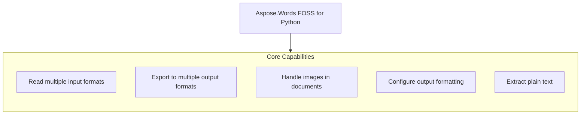

# Aspose.Words FOSS for Python

[](https://pypi.org/project/aspose-words-foss/)  [](LICENSE) [](https://github.com/aspose-words-foss/Aspose.Words-FOSS-for-Python/graphs/contributors)

[](https://products.aspose.org/words/python/)

Aspose.Words FOSS for Python is a free and open-source library that enables Python developers to read, convert, and manipulate word processing documents without requiring Microsoft Office. It supports loading DOC, DOCX, RTF, TXT, and Markdown files, and can save to DOCX, PDF, Markdown, and plain text formats. Developers use it to automate tasks such as extracting text, converting legacy formats, and embedding images in Markdown output. The library runs on Python versions 3.10 through 3.12 and is distributed under the MIT license.

## Navigation

- [At a Glance](#at-a-glance)
- [Key Capabilities](#key-capabilities)
- [Installation](#installation)
- [Dependencies](#dependencies)
- [API Reference](#api-reference)
- [Documentation & Resources](#documentation--resources)
- [Scope and Limitations](#scope-and-limitations)
- [Development and Testing](#development-and-testing)
- [License](#license)

## At a Glance



## Key Capabilities

- **Read multiple input formats.** Read DOCX, DOC, RTF, Markdown, and plain text files by passing a file path to the `Document` constructor, where the reader is selected automatically based on the file extension, with DOCX parsing implemented as a pure-Python parser built on the standard library zipfile module, DOC and RTF files delegated to the OLE2 path via olefile, and Markdown parsing supporting headings, lists, emphasis, tables, block quotes, code blocks, links, and embedded images as document-model nodes.
- **Export to multiple output formats.** Export loaded documents to DOCX, Markdown, and PDF formats using the `docx_writer`, `md_writer`, and `pdf_writer` modules respectively, with `SaveFormat` providing named constants for each target format.
- **Handle images in documents.** Process inline images, captioned images, images in tables, and images in headers or footers using the drawing module, where images embed as base64 data URIs in Markdown output, render via the built-in `ShapeRenderer` in PDF, and round-trip losslessly in DOCX, with the `WorkingWithImages` example class demonstrating conversion of image-containing documents to all formats.
- **Configure output formatting.** Tune output formatting through `MarkdownLoadOptions`, `WorkingWithMarkdownSaveOptions`, `WorkingWithOoxmlSaveOptions`, and `WorkingWithPdfSaveOptions`, enabling control over underline formatting, encoding, paragraph breaks, compression level, pretty-printed XML, and PDF rendering behavior.
- **Extract plain text.** Extract plain text from any loaded document using the `Document.get_text` method or save it directly to a text file by specifying `SaveFormat`.TEXT, supporting all input formats including DOCX, DOC, RTF, Markdown, and plain text.

## Installation

Install the published package from PyPI (`aspose-words-foss`, version 26.7.0):

```bash
pip install aspose-words-foss
```

The package declares `python_requires` as `>=3.10,<3.13`.

## Dependencies

### Required Package Dependencies

- `fpdf2>=2.7.5`
- `olefile>=0.46`
- `pydantic>=2.0.0`

### Native and System Requirements

- Requires Python `>=3.10,<3.13` (`python_requires` in `pyproject.toml`).

### Development Dependencies

- `Pillow>=10.0.0` (extra `dev`)
- `pytest>=9.0.2` (extra `dev`)

## API Reference

The aspose-words-foss package provides the `Document` class as the primary entry point for loading, manipulating, and saving documents in various formats, supporting both full and light document models.

The verified public surface has 198 types.

<details>
<summary>View the Complete Public API Surface</summary>

### Core API

| Class | Description |
| --- | --- |
| `ConvertDocument` | Demonstrates every supported input -> output format pair. |
| `DocsExamplesBase` | Base class for API example tests, mirroring Aspose.Words DocsExamples. |
| `LoadingDocument` | Demonstrates loading documents from files and streams. |
| `LoadingMarkdown` | Demonstrates loading Markdown straight from a string/bytes, no file needed. |
| `WorkingWithImages` | Convert image-containing documents to all output formats. |
| `WorkingWithMarkdownSaveOptions` | ApiExamples.working_with_markdown_save_options.WorkingWithMarkdownSaveOptions demonstrates how to export documents to Markdown format with configurable options such as underline formatting, encoding, and paragraph break handling. |
| `WorkingWithOoxmlSaveOptions` | ApiExamples.working_with_ooxml_save_options.WorkingWithOoxmlSaveOptions shows how to control the compression level and pretty formatting of DOCX output files. |
| `WorkingWithPdfSaveOptions` | ApiExamples.working_with_pdf_save_options.WorkingWithPdfSaveOptions illustrates saving documents to PDF format from various input formats using dedicated save options. |
| `WorkingWithTxtSaveOptions` | ApiExamples.working_with_txt_save_options.WorkingWithTxtSaveOptions provides examples for exporting documents to plain text format and retrieving document text content. |
| `Document` | Represents a Word document. |
| `LoadOptions` | Options for loading a document. |
| `MarkdownLoadOptions` | Load options specific to Markdown (.md) input. |
| `NodeType` | Node type discriminators, valued as in aspose.words. |
| `ListHandler` | Handles parsing and conversion of lists. |
| `ParagraphConverter` | Handles conversion of paragraphs to Markdown. |
| `TableConverter` | Handles conversion of tables to Markdown. |
| `DocFileReader` | Full DOC reader with LDM (Light Document Model) building capability. |
| `DocFileReaderCore` | Core reader for Word 97-2003 (.doc) files. |
| `FibData` | Parsed FIB (File Information Block) data. |
| `BlipInfo` | Parsed BSE (Blip Store Entry) with location of image data. |
| `ChildAnchorInfo` | Position of a child shape within its parent group's coordinate system. |
| `GroupShapeInfo` | Coordinate system of a shape group (from Spgr record). |
| `ShapeAnchor` | Parsed SPA (Shape Address) from PlcSpaMom / PlcSpaHdr. |
| `ShapeCropInfo` | Escher crop properties for a shape (from FOpt records). |
| `ShapeLineProps` | Escher line/fill properties for a shape (from FOpt records). |
| `ListDef` | Parsed list definition with full level information. |
| `ListLevelData` | One parsed LVL record (measurements in points). |
| `CharProps` | Properties extracted from CHPX for a text run. |
| `ParaProps` | Properties extracted from PAPX for a single paragraph. |
| `TableRowProps` | Properties extracted from PAPX SPRMs on table row-end paragraphs. |
| `StyleData` | Properties parsed from a style definition (STSH UPX). |
| `DocTableBuilderMixin` | Mixin that adds table-building helpers to the DOC reader. |
| `CellData` | Table cell. |
| `DocumentReader` | Reads DOCX documents and produces abstracted data structures. |
| `NumberingInfo` | Numbering definition. |
| `NumberingLevel` | List level definition. |
| `ParagraphData` | Paragraph with style and content. |
| `RowData` | Table row. |
| `RunData` | Text run with formatting. |
| `TableData` | Table structure. |
| `LdmBuilderMixin` | Mixin that adds :meth:to_light_document to :class:DocumentReader. |
| `FontBuilder` | Build a non-cascaded :class:ldm.Font from one <w:rPr>. |
| `FontResolver` | Compose a fully cascaded :class:ldm.Font. |
| `ParagraphFormatBuilder` | Build a non-cascaded :class:ldm.ParagraphFormat from one <w:pPr>. |
| `ParagraphFormatResolver` | Compose a fully cascaded :class:ldm.ParagraphFormat. |
| `StyleChainResolver` | Walk the <w:basedOn> graph for a styleId. |
| `ListBuilder` | Translate <w:numbering> into a list of :class:ldm.DocList. |
| `StyleBuilder` | Translate <w:styles> into a list of :class:ldm.Style. |
| `ParagraphBuilder` | Build :class:ldm.Paragraph from a <w:p> element. |
| `RunBuilder` | Build a single :class:ldm.Run with a resolved font cascade. |
| `PageSetupBuilder` | Build :class:ldm.PageSetup from a <w:sectPr> element. |
| `SectionBuilder` | Split the body into :class:ldm.Section\ s at sectPr boundaries. |
| `CellBuilder` | Build :class:ldm.Cell from a <w:tc> element. |
| `RowBuilder` | Build :class:ldm.Row from a <w:tr> element. |
| `TableBuilder` | Build :class:ldm.Table from a <w:tbl> element. |
| `ShapeParserMixin` | Mixin providing drawing/shape parsing methods for DocumentReader. |
| `DocxWriterLossyWarning` | Warns the caller that the writer is dropping known LDM constructs. |
| `LdmDocxWriter` | Convert an :class:ldm.Document into a DOCX file. |
| `BookmarkState` | Hands out monotonically increasing bookmark ids and pairs |
| `ImageEntry` | One image to add to word/media/ plus its relationship row. |
| `ImageRenderState` | Accumulator threaded through paragraph rendering for inline shapes. |
| `ImageData` | aspose.words_foss.drawing.ImageData represents image data with a content type and supports creation from MIME type strings. |
| `ImageType` | Specifies the type (format) of an image in a document. |
| `Shape` | aspose.words_foss.drawing.Shape models a visual drawing object in a document that can contain image data and other graphical content. |
| `WrapType` | Specifies how text is wrapped around a shape or picture. |
| `Body` | aspose.words_foss.light_document_model.Body holds the main content of a document section, including paragraphs and tables. |
| `BookmarkEnd` | aspose.words_foss.light_document_model.BookmarkEnd marks the end position of a bookmark in a document. |
| `BookmarkStart` | Marks the beginning of a Word bookmark (<w:bookmarkStart>). |
| `Border` | aspose.words_foss.light_document_model.Border defines the visual properties of a border line, such as style and color. |
| `Cell` | aspose.words_foss.light_document_model.Cell represents a single cell within a table row. |
| `CellFormat` | aspose.words_foss.light_document_model.CellFormat provides access to formatting settings for a table cell. |
| `ConditionalStyleMask` | Parsed <w:cnfStyle> 12-bit bitmask for banded-table regions. |
| `DocList` | aspose.words_foss.light_document_model.DocList represents a list structure in a document. |
| `FieldEnd` | aspose.words_foss.light_document_model.FieldEnd marks the end of a field in a document. |
| `FieldSeparator` | aspose.words_foss.light_document_model.FieldSeparator separates the field code from the field result in a document. |
| `FieldStart` | aspose.words_foss.light_document_model.FieldStart marks the beginning of a field in a document. |
| `Font` | aspose.words_foss.light_document_model.Font encapsulates character formatting attributes such as typeface, size, and style. |
| `FrameFormat` | Floating text-frame definition.  Numeric dimensions are in points. |
| `HeaderFooter` | aspose.words_foss.light_document_model.HeaderFooter contains content that appears in the header or footer area of a section. |
| `ListFormat` | aspose.words_foss.light_document_model.ListFormat stores list-related formatting information for a paragraph. |
| `ListLabel` | Snapshot of a list-item's rendered bullet/number label. |
| `ListLevel` | aspose.words_foss.light_document_model.ListLevel defines the appearance and behavior of a specific level in a list. |
| `ListLevelOverride` | One <w:lvlOverride> inside a concrete <w:num>. |
| `NodeCastMixin` | as_*() casts mirroring aspose.words.Node; identity here. |
| `PageSetup` | aspose.words_foss.light_document_model.PageSetup holds page layout settings such as margins, orientation, and paper size. |
| `Paragraph` | A paragraph whose children — Run, BookmarkStart / End, |
| `ParagraphFormat` | aspose.words_foss.light_document_model.ParagraphFormat stores formatting properties that apply to an entire paragraph. |
| `PreferredWidth` | Preferred width of a table / cell. |
| `Row` | aspose.words_foss.light_document_model.Row represents a horizontal row of cells in a table. |
| `RowFormat` | aspose.words_foss.light_document_model.RowFormat provides access to formatting settings for a table row. |
| `Run` | aspose.words_foss.light_document_model.Run represents a sequence of characters with the same formatting within a paragraph. |
| `Section` | aspose.words_foss.light_document_model.Section defines a section in a document, containing headers, footers, and body content. |
| `Shading` | aspose.words_foss.light_document_model.Shading describes the background fill pattern and color for a document element. |
| `Style` | aspose.words_foss.light_document_model.Style defines a reusable set of formatting properties for paragraphs and runs. |
| `TabStop` | aspose.words_foss.light_document_model.TabStop represents a single tab stop position and its alignment. |
| `TabStopCollection` | aspose.words_foss.light_document_model.TabStopCollection manages a collection of tab stops for a paragraph. |
| `light_document_model.Table` | aspose.words_foss.light_document_model.Table represents a table structure composed of rows and cells. |
| `TableStyleFormat` | Table-level properties stored on table styles (w:tblPr inside w:style). |
| `TableStyleProperty` | Conditional formatting for a table region (w:tblStylePr). |
| `TextColumn` | aspose.words_foss.light_document_model.TextColumn defines the properties of a single text column in a section. |
| `TextColumns` | aspose.words_foss.light_document_model.TextColumns holds the collection of text columns for a section. |
| `UnknownNode` | aspose.words_foss.light_document_model.UnknownNode represents an unrecognized node type in the document tree. |
| `MarkdownReader` | Reads Markdown (.md) files, producing the same data structures as |
| `AtxHeadingBlock` | aspose.words_foss.md_import.AtxHeadingBlock models an ATX-style Markdown heading consisting of one or more hash characters followed by text. |
| `AutolinkBlock` | aspose.words_foss.md_import.AutolinkBlock represents an automatic link in Markdown that converts a URL into a clickable link. |
| `Block` | Base class for every node in the Markdown block tree. |
| `BoldInlineBlock` | aspose.words_foss.md_import.BoldInlineBlock represents inline bold text in Markdown, typically enclosed by double asterisks or underscores. |
| `BulletListItemBlock` | aspose.words_foss.md_import.BulletListItemBlock models a single item in a Markdown bullet list. |
| `CellBlock` | aspose.words_foss.md_import.CellBlock represents a cell within a Markdown table row. |
| `DocumentBlock` | aspose.words_foss.md_import.DocumentBlock serves as the root container for all blocks in a parsed Markdown document. |
| `FencedCodeBlock` | The FencedCodeBlock class represents a fenced code block in a Markdown document. |
| `FootnoteDefinitionBlock` | The FootnoteDefinitionBlock class represents a footnote definition in a Markdown document. |
| `FootnoteReferenceBlock` | The FootnoteReferenceBlock class represents a footnote reference in a Markdown document. |
| `HeadingBlock` | The HeadingBlock class represents a heading in a Markdown document. |
| `HorizontalRuleBlock` | The HorizontalRuleBlock class represents a horizontal rule in a Markdown document. |
| `HtmlInsertOptions` | Flags for :meth:MarkdownDocumentBuilder.insert_html (mirrors |
| `HtmlTagBlock` | A raw HTML tag, block-level or inline (Markdig's HtmlBlock / |
| `IndentedCodeBlock` | The IndentedCodeBlock class represents an indented code block in a Markdown document. |
| `InlineCodeBlock` | The InlineCodeBlock class represents inline code in a Markdown document. |
| `ItalicInlineBlock` | The ItalicInlineBlock class represents italic text in a Markdown document. |
| `LineBreakBlock` | The LineBreakBlock class represents a line break in a Markdown document. |
| `LinkTextBlock` | The LinkTextBlock class represents the text portion of a link in a Markdown document. |
| `ListBlock` | Container grouping sibling ListItemBlocks (Markdig's ListBlock). |
| `ListItemBlock` | The ListItemBlock class represents a list item in a Markdown document. |
| `MarkdownDocumentBuilder` | LDM cursor/writer used by :class:MarkdownReaderContext. |
| `MarkdownReaderContext` | Drives Markdown block-tree events into a fresh LDM Document. |
| `OrderedListItemBlock` | The OrderedListItemBlock class represents an ordered list item in a Markdown document. |
| `ParagraphBlock` | The ParagraphBlock class represents a paragraph in a Markdown document. |
| `QuoteBlock` | The QuoteBlock class represents a blockquote in a Markdown document. |
| `RowBlock` | The RowBlock class represents a table row in a Markdown document. |
| `SetextHeadingBlock` | The SetextHeadingBlock class represents a setext-style heading in a Markdown document. |
| `StrikethroughBlock` | The StrikethroughBlock class represents strikethrough text in a Markdown document. |
| `TableBlock` | The TableBlock class represents a table in a Markdown document. |
| `TextBlock` | A literal run of text (Markdig's LiteralInline). |
| `UnderlineBlock` | The UnderlineBlock class represents underlined text in a Markdown document. |
| `LdmMarkdownWriter` | Converts a light_document_model.Document to a Markdown string. |
| `CellMerge` | Specifies how a cell in a table is merged with other cells. |
| `CellVerticalAlignment` | Specifies vertical justification of text inside a table cell. |
| `HeightRule` | Specifies the rule for determining the height of an object. |
| `LineSpacingRule` | Specifies values for line spacing. |
| `LineStyle` | Specifies line style of a border. |
| `NumberStyle` | Specifies the number style for a list, footnotes, endnotes, |
| `Orientation` | Specifies page orientation. |
| `ParagraphAlignment` | Specifies text alignment in a paragraph. |
| `PreferredWidthType` | Specifies the unit of measurement for the preferred width of a table or cell. |
| `SectionStart` | Specifies the type of break at the beginning of the section. |
| `StyleIdentifier` | Locale-independent built-in style identifier. |
| `StyleType` | Specifies type of the style. |
| `TabAlignment` | Tab stop alignment. |
| `TabLeader` | Tab stop leader character. |
| `Underline` | Specifies type of the underline applied to a font. |
| `ConversionOptions` | Options for controlling DOCX to Markdown conversion. |
| `ParagraphInfo` | Information about a paragraph's style and context. |
| `RunFormatting` | Text run formatting properties. |
| `models.Table` | Represents a table structure. |
| `TableCell` | Represents a table cell. |
| `TableRow` | Represents a table row. |
| `NumberingParser` | Parser for DOCX numbering definitions. |
| `StyleParser` | Parser for DOCX style names and properties. |
| `ListInfo` | Information about a list. |
| `ListLevelInfo` | Information about a list level. |
| `ParsedStyle` | Parsed style information. |
| `LdmPdfWriter` | Converts a light_document_model.Document to a PDF file. |
| `ParagraphRenderer` | Renders LDM paragraphs into PDF. |
| `RunRenderer` | Renders formatted runs (text segments with fonts, colors, links). |
| `ShapeRenderer` | Renders shapes, images, and positioned elements. |
| `TableRenderer` | Renders LDM tables into PDF. |
| `DocumentFormatReader` | Protocol defining the interface all document readers must implement. |
| `RtfFileReader` | Reads RTF files (OLE2-format) and produces the same data structures |
| `MarkdownSaveOptions` | Options for saving documents as Markdown. |
| `OoxmlSaveOptions` | Options for saving a document as DOCX (Office Open XML). |
| `OutlineOptions` | Controls how outlines (bookmarks panel) are generated in the PDF. |
| `PdfSaveOptions` | Options for saving documents as PDF. |
| `MarkdownFileReader` | Reads Markdown (.md) files and yields one Paragraph per line. |
| `TextFileReader` | Reads plain-text (.txt) files and yields one Paragraph per line. |

#### Enumerations

| Enumeration | Description |
| --- | --- |
| `LoadFormat` | Document load format constants, valued as in aspose.words. |
| `SaveFormat` | Document save format constants, valued as in aspose.words. |
| `BlockType` | aspose.words_foss.md_import.BlockType enumerates the different types of blocks that can appear in a Markdown document. |
| `md_import.ListMarker` | Bullet/ordered list marker, mirroring Aspose.Words' ListMarker. |
| `MarkdownBlockLevel` | Where a block sits in the tree. |
| `CodeBlockStyle` | Code block style preference. |
| `HeadingStyle` | Heading export style preference. |
| `models.ListMarker` | Bullet list marker style. |
| `ColorMode` | Color rendering mode. |
| `CompressionLevel` | Compression level for OOXML files. |
| `MarkdownEmptyParagraphExportMode` | Controls how empty paragraphs are exported. Note NONE is 2, not 0. |
| `MarkdownExportAsHtml` | Controls which elements are exported as raw HTML. |
| `MarkdownLinkExportMode` | Link export mode options. |
| `MarkdownListExportMode` | List export mode options. |
| `OoxmlCompliance` | OOXML standards compliance level. |
| `PdfCompliance` | PDF standards compliance level. |
| `PdfFontEmbeddingMode` | Font embedding mode in PDF. Note EMBED_NONE is 2, not 1. |
| `PdfImageCompression` | Image compression in PDF. |
| `PdfPageMode` | PDF page display mode. |
| `PdfTextCompression` | Text compression in PDF. |
| `PdfZoomBehavior` | Mirrors public API. |
| `TableContentAlignment` | Table content alignment options. |
| `Zip64Mode` | Controls when to use ZIP64 format extensions for OOXML files. |

#### Detailed Member Reference

### Document

The `Document` class supports loading from multiple input formats via `LoadFormat` and saving to various output formats using `SaveFormat`, enabling programmatic document processing across common office and text formats.

- `first_section`: The first section of the document.
- `get_child_nodes`: Child nodes, optionally filtered by :class:NodeType.
- `get_text`: Extract plain text from the loaded document.
- `last_section`: The last section of the document.
- `light_document_model`: Access the internal Light Document Model.
- `lists`: All document list definitions.
- `page_count`: Estimated page count.
- `save`: Save the document to the specified format.
- `sections`: All document sections.
- `styles`: All document styles.

### SaveFormat

`SaveFormat` enumerates the supported output formats including DOCX, PDF, Markdown, and plain text, allowing users to specify the target format when saving a `Document`.

### doc_reader

The package provides dedicated reader modules for DOC, RTF, Markdown, and plain text formats, enabling explicit parsing of these document types into a `Document` object.

### docx_writer

Writer modules for DOCX, Markdown, and PDF formats allow exporting a `Document` to these common output formats with format-specific options.

### MarkdownLoadOptions

`MarkdownLoadOptions` and `WorkingWithMarkdownSaveOptions` provide control over Markdown export behavior including underline formatting, encoding, paragraph breaks, and support for importing from multiple input formats.

### WorkingWithOoxmlSaveOptions

`WorkingWithOoxmlSaveOptions` demonstrates how to configure OOXML save options such as pretty formatting and compression level when exporting to DOCX.

- `test_pretty_format_off`: Defined as `def test_pretty_format_off(self)`.
- `test_pretty_format_round_trip`: Pretty-formatted DOCX should produce the same text after reload.
- `test_set_compression_level`: Defined as `def test_set_compression_level(self)`.
- `test_set_pretty_format`: Defined as `def test_set_pretty_format(self)`.

### WorkingWithPdfSaveOptions

`WorkingWithPdfSaveOptions` shows how to convert documents from various input formats to PDF and customize PDF export behavior using `PdfSaveOptions`.

- `test_pdf_from_all_input_formats`: Save DOCX, DOC, RTF, TXT as PDF.
- `test_save_with_pdf_save_options`: PdfSaveOptions is accepted for API compatibility.

### light_document_model

The `light_document_model`, model, and models modules provide a memory-efficient alternative for read-only document inspection and text extraction.

### drawing

The drawing module and `WorkingWithImages` examples illustrate how to process image-containing documents and export them to multiple formats while preserving embedded graphics.

### ApiExamples

The `ApiExamples` module contains working code samples that demonstrate common document processing tasks including format conversion, save options configuration, and image handling.

</details>

## Documentation & Resources

- **[Getting started guide](https://docs.aspose.org/words/python/)** — The getting started guide introduces core concepts and basic workflows for loading, manipulating, and saving documents using Aspose.Words FOSS for Python.
- **[How-to guides & FAQ](https://kb.aspose.org/words/python/)** — The how-to guides and FAQ provide practical examples and answers to common questions about document conversion, formatting options, and troubleshooting.
- **[Full API reference](https://reference.aspose.org/words/python/)** — The full API reference documents every class, method, and constant available in the aspose-words-foss package for programmatic document processing. It covers all 198 verified public types; the [API Reference](#api-reference) section above covers the essentials.
- Found a bug or have a feature request? [Open an issue](https://github.com/aspose-words-foss/Aspose.Words-FOSS-for-Python/issues).

## Scope and Limitations

Aspose.Words FOSS for Python provides a free, open-source subset of the commercial Aspose.Words API for Python, supporting reading and writing DOCX, Markdown, PDF, and plain text documents with a focus on document conversion and basic formatting operations.

- The library does not implement a writer for the legacy DOC format despite defining `SaveFormat.DOC` for API compatibility, and attempting to save to .doc raises `ValueError`, with only Markdown, Text, PDF, and DOCX supported as output formats.
- Saving DOCX with `OoxmlSaveOptions.compliance` set to `OoxmlCompliance.ISO29500_2008_STRICT` raises `NotImplementedError`, and only ECMA376_2006 or ISO29500_2008_TRANSITIONAL compliance levels are supported.
- Eight `PdfSaveOptions` fields — `text_compression`, `embed_full_fonts`, `use_core_fonts`, `font_embedding_mode`, `page_mode`, `color_mode`, `preserve_form_fields`, and `memory_optimization` — exist for API forward-compatibility but are not consumed by the PDF writer.

## Development and Testing

Install the development dependencies and run the example test suite, or execute an individual example script directly. Test fixtures live under tests/data/input/ and generated output is written to `ApiExamples`/output/ (git-ignored).

The suite covers 16 test files under `tests/`.

Install the development dependencies and run the example test suite:

```bash
pip install -e ".[dev]"
python -m pytest ApiExamples/ -v --rootdir=ApiExamples -c ApiExamples/pytest.ini
```

Run an individual example script directly:

```bash
python ApiExamples/convert_document.py
```

## License

This project is licensed under the [MIT License](LICENSE). The MIT License permits use, copying, modification, distribution, sublicensing, and commercial use, provided its copyright and permission notice are retained. The software is provided without warranty.
