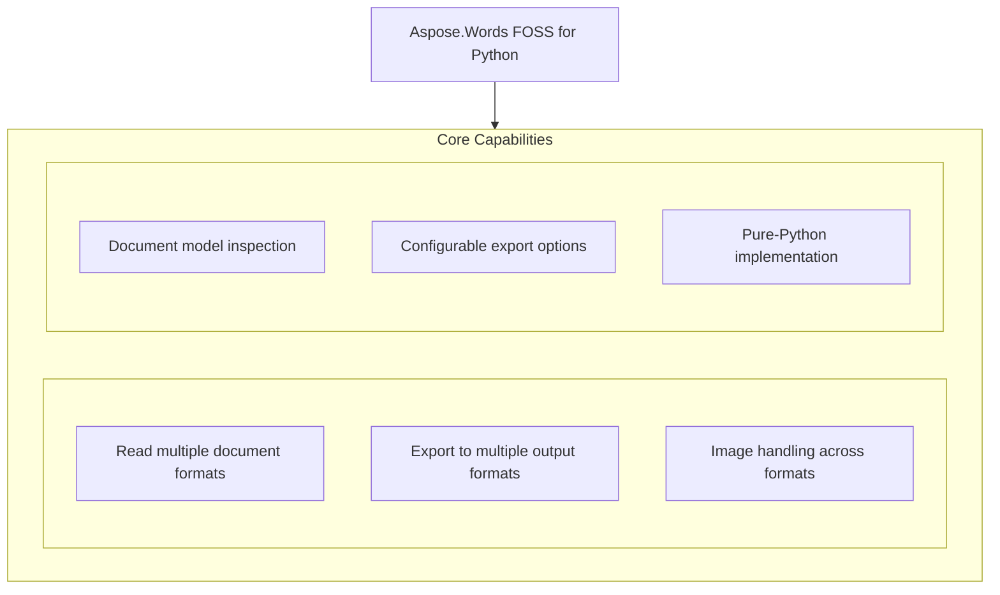

# Aspose.Words FOSS for Python

[](https://pypi.org/project/aspose-words-foss/)  [](LICENSE) [](https://github.com/aspose-words-foss/Aspose.Words-FOSS-for-Python/graphs/contributors)

[](https://products.aspose.org/words/python/)

Aspose.Words FOSS for Python provides a free, open-source interface for reading, converting, and saving documents in Python applications. It supports common word processing formats—including DOCX, DOC, RTF, TXT, and Markdown—without requiring a commercial license, enabling developers to build document automation workflows. The package supports Python versions 3.10 through 3.12, depends on fpdf2 and olefile, and is distributed under the MIT license. Users include developers building reporting tools, document converters, and content extraction pipelines who need a lightweight, permissively licensed library for document manipulation.

## Navigation

- [At a Glance](#at-a-glance)
- [Key Capabilities](#key-capabilities)
- [Installation](#installation)
- [Dependencies](#dependencies)
- [API Reference](#api-reference)
- [Documentation & Resources](#documentation--resources)
- [Scope and Limitations](#scope-and-limitations)
- [Development and Testing](#development-and-testing)
- [License](#license)

## At a Glance



## Key Capabilities

- **Read multiple document formats.** Read documents in DOC, DOCX, RTF, Markdown, and plain text formats using dedicated reader classes under the `aspose.words_foss` namespace.
- **Export to multiple output formats.** Export documents to DOCX, Markdown, and PDF formats by specifying a `SaveFormat` value when calling the save method.
- **Image handling across formats.** Handle images embedded in documents during export to Markdown and PDF, where shapes are rendered using the drawing module and embedded as base64 in Markdown output.
- **Document model inspection.** Inspect document structure and content through the `light_document_model`, model, and models modules, which expose the underlying object hierarchy.
- **Configurable export options.** Customize export behavior using `LoadOptions` for input parsing and `MarkdownLoadOptions` or `PdfSaveOptions` for output formatting.
- **Pure-Python implementation.** `Run` entirely in pure Python without external native dependencies, relying only on the fpdf2 and olefile libraries for PDF generation and file format detection.

## Installation

Install the published package from PyPI (`aspose-words-foss`, version 26.7.0):

```bash
pip install aspose-words-foss
```

The package declares `python_requires` as `>=3.10,<3.13`.

## Dependencies

### Required Package Dependencies

- `fpdf2>=2.7.5`
- `olefile>=0.46`
- `pydantic>=2.0.0`

### Native and System Requirements

- Requires Python `>=3.10,<3.13` (`python_requires` in `pyproject.toml`).

### Development Dependencies

- `Pillow>=10.0.0` (extra `dev`)
- `pytest>=9.0.2` (extra `dev`)

## API Reference

Aspose.Words FOSS for Python provides the `aspose.words_foss.Document` class as the primary entry point for loading, inspecting, and saving documents in multiple formats including DOC, DOCX, RTF, Markdown, and plain text. The `Document` class populates a Light `Document` Model internally and exposes methods to convert the content to `SaveFormat` constants such as MARKDOWN, DOCX, and PDF.

The verified public surface has 198 types.

<details>
<summary>View the Complete Public API Surface</summary>

### Core API

| Class | Description |
| --- | --- |
| `ConvertDocument` | Demonstrates every supported input -> output format pair. |
| `DocsExamplesBase` | Base class for API example tests, mirroring Aspose.Words DocsExamples. |
| `LoadingDocument` | Demonstrates loading documents from files and streams. |
| `LoadingMarkdown` | Demonstrates loading Markdown straight from a string/bytes, no file needed. |
| `WorkingWithImages` | Convert image-containing documents to all output formats. |
| `WorkingWithMarkdownSaveOptions` | ApiExamples.working_with_markdown_save_options.WorkingWithMarkdownSaveOptions demonstrates how to export documents to Markdown format with configurable options such as underline formatting, encoding, and paragraph break handling. |
| `WorkingWithOoxmlSaveOptions` | ApiExamples.working_with_ooxml_save_options.WorkingWithOoxmlSaveOptions shows how to control the compression level and pretty formatting of output DOCX files. |
| `WorkingWithPdfSaveOptions` | ApiExamples.working_with_pdf_save_options.WorkingWithPdfSaveOptions illustrates saving documents to PDF format from various input formats using dedicated save options. |
| `WorkingWithTxtSaveOptions` | ApiExamples.working_with_txt_save_options.WorkingWithTxtSaveOptions provides examples for exporting documents to plain text and retrieving document content as a string. |
| `Document` | Represents a Word document. |
| `LoadOptions` | Options for loading a document. |
| `MarkdownLoadOptions` | Load options specific to Markdown (.md) input. |
| `NodeType` | Node type discriminators, valued as in aspose.words. |
| `ListHandler` | Handles parsing and conversion of lists. |
| `ParagraphConverter` | Handles conversion of paragraphs to Markdown. |
| `TableConverter` | Handles conversion of tables to Markdown. |
| `DocFileReader` | Full DOC reader with LDM (Light Document Model) building capability. |
| `DocFileReaderCore` | Core reader for Word 97-2003 (.doc) files. |
| `FibData` | Parsed FIB (File Information Block) data. |
| `BlipInfo` | Parsed BSE (Blip Store Entry) with location of image data. |
| `ChildAnchorInfo` | Position of a child shape within its parent group's coordinate system. |
| `GroupShapeInfo` | Coordinate system of a shape group (from Spgr record). |
| `ShapeAnchor` | Parsed SPA (Shape Address) from PlcSpaMom / PlcSpaHdr. |
| `ShapeCropInfo` | Escher crop properties for a shape (from FOpt records). |
| `ShapeLineProps` | Escher line/fill properties for a shape (from FOpt records). |
| `ListDef` | Parsed list definition with full level information. |
| `ListLevelData` | One parsed LVL record (measurements in points). |
| `CharProps` | Properties extracted from CHPX for a text run. |
| `ParaProps` | Properties extracted from PAPX for a single paragraph. |
| `TableRowProps` | Properties extracted from PAPX SPRMs on table row-end paragraphs. |
| `StyleData` | Properties parsed from a style definition (STSH UPX). |
| `DocTableBuilderMixin` | Mixin that adds table-building helpers to the DOC reader. |
| `CellData` | Table cell. |
| `DocumentReader` | Reads DOCX documents and produces abstracted data structures. |
| `NumberingInfo` | Numbering definition. |
| `NumberingLevel` | List level definition. |
| `ParagraphData` | Paragraph with style and content. |
| `RowData` | Table row. |
| `RunData` | Text run with formatting. |
| `TableData` | Table structure. |
| `LdmBuilderMixin` | Mixin that adds :meth:to_light_document to :class:DocumentReader. |
| `FontBuilder` | Build a non-cascaded :class:ldm.Font from one <w:rPr>. |
| `FontResolver` | Compose a fully cascaded :class:ldm.Font. |
| `ParagraphFormatBuilder` | Build a non-cascaded :class:ldm.ParagraphFormat from one <w:pPr>. |
| `ParagraphFormatResolver` | Compose a fully cascaded :class:ldm.ParagraphFormat. |
| `StyleChainResolver` | Walk the <w:basedOn> graph for a styleId. |
| `ListBuilder` | Translate <w:numbering> into a list of :class:ldm.DocList. |
| `StyleBuilder` | Translate <w:styles> into a list of :class:ldm.Style. |
| `ParagraphBuilder` | Build :class:ldm.Paragraph from a <w:p> element. |
| `RunBuilder` | Build a single :class:ldm.Run with a resolved font cascade. |
| `PageSetupBuilder` | Build :class:ldm.PageSetup from a <w:sectPr> element. |
| `SectionBuilder` | Split the body into :class:ldm.Section\ s at sectPr boundaries. |
| `CellBuilder` | Build :class:ldm.Cell from a <w:tc> element. |
| `RowBuilder` | Build :class:ldm.Row from a <w:tr> element. |
| `TableBuilder` | Build :class:ldm.Table from a <w:tbl> element. |
| `ShapeParserMixin` | Mixin providing drawing/shape parsing methods for DocumentReader. |
| `DocxWriterLossyWarning` | Warns the caller that the writer is dropping known LDM constructs. |
| `LdmDocxWriter` | Convert an :class:ldm.Document into a DOCX file. |
| `BookmarkState` | Hands out monotonically increasing bookmark ids and pairs |
| `ImageEntry` | One image to add to word/media/ plus its relationship row. |
| `ImageRenderState` | Accumulator threaded through paragraph rendering for inline shapes. |
| `ImageData` | aspose.words_foss.drawing.ImageData represents image data in a document, supporting content type detection and creation from MIME type strings. |
| `ImageType` | Specifies the type (format) of an image in a document. |
| `Shape` | aspose.words_foss.drawing.Shape models a visual drawing object such as an image or geometric figure within a document. |
| `WrapType` | Specifies how text is wrapped around a shape or picture. |
| `Body` | aspose.words_foss.light_document_model.Body holds the main content of a document section, including paragraphs and tables. |
| `BookmarkEnd` | aspose.words_foss.light_document_model.BookmarkEnd marks the end position of a bookmark in a document. |
| `BookmarkStart` | Marks the beginning of a Word bookmark (<w:bookmarkStart>). |
| `Border` | aspose.words_foss.light_document_model.Border defines the visual properties of a border line, such as style and color. |
| `Cell` | aspose.words_foss.light_document_model.Cell represents a single cell within a table row. |
| `CellFormat` | aspose.words_foss.light_document_model.CellFormat stores formatting settings that apply to a table cell. |
| `ConditionalStyleMask` | Parsed <w:cnfStyle> 12-bit bitmask for banded-table regions. |
| `DocList` | aspose.words_foss.light_document_model.DocList represents a list structure in a document, containing list levels and items. |
| `FieldEnd` | aspose.words_foss.light_document_model.FieldEnd marks the end of a field in a document. |
| `FieldSeparator` | aspose.words_foss.light_document_model.FieldSeparator separates the field code from the field result in a document. |
| `FieldStart` | aspose.words_foss.light_document_model.FieldStart marks the beginning of a field in a document. |
| `Font` | aspose.words_foss.light_document_model.Font encapsulates character-level formatting attributes such as typeface and size. |
| `FrameFormat` | Floating text-frame definition.  Numeric dimensions are in points. |
| `HeaderFooter` | aspose.words_foss.light_document_model.HeaderFooter contains content that appears in the header or footer area of a section. |
| `ListFormat` | aspose.words_foss.light_document_model.ListFormat holds list-related formatting for a paragraph. |
| `ListLabel` | Snapshot of a list-item's rendered bullet/number label. |
| `ListLevel` | aspose.words_foss.light_document_model.ListLevel defines the appearance and numbering style for a specific level in a list. |
| `ListLevelOverride` | One <w:lvlOverride> inside a concrete <w:num>. |
| `NodeCastMixin` | as_*() casts mirroring aspose.words.Node; identity here. |
| `PageSetup` | aspose.words_foss.light_document_model.PageSetup stores page layout settings such as margins, orientation, and paper size. |
| `Paragraph` | A paragraph whose children — Run, BookmarkStart / End, |
| `ParagraphFormat` | aspose.words_foss.light_document_model.ParagraphFormat holds formatting attributes that apply to a paragraph. |
| `PreferredWidth` | Preferred width of a table / cell. |
| `Row` | aspose.words_foss.light_document_model.Row represents a horizontal row of cells in a table. |
| `RowFormat` | aspose.words_foss.light_document_model.RowFormat stores formatting settings that apply to a table row. |
| `Run` | aspose.words_foss.light_document_model.Run represents a sequence of characters with the same formatting in a paragraph. |
| `Section` | aspose.words_foss.light_document_model.Section groups content that shares the same page setup and section-level formatting. |
| `Shading` | aspose.words_foss.light_document_model.Shading defines the background fill pattern and color for a document element. |
| `Style` | aspose.words_foss.light_document_model.Style represents a named collection of formatting attributes that can be applied to paragraphs or runs. |
| `TabStop` | aspose.words_foss.light_document_model.TabStop defines a single tab stop position and its alignment. |
| `TabStopCollection` | aspose.words_foss.light_document_model.TabStopCollection manages a list of tab stops for a paragraph. |
| `light_document_model.Table` | aspose.words_foss.light_document_model.Table represents a tabular structure composed of rows and cells. |
| `TableStyleFormat` | Table-level properties stored on table styles (w:tblPr inside w:style). |
| `TableStyleProperty` | Conditional formatting for a table region (w:tblStylePr). |
| `TextColumn` | aspose.words_foss.light_document_model.TextColumn describes the width and spacing of a single column in a multi-column section. |
| `TextColumns` | aspose.words_foss.light_document_model.TextColumns holds the collection of columns that define multi-column layout for a section. |
| `UnknownNode` | aspose.words_foss.light_document_model.UnknownNode represents an unrecognized node type in the document tree. |
| `MarkdownReader` | Reads Markdown (.md) files, producing the same data structures as |
| `AtxHeadingBlock` | aspose.words_foss.md_import.AtxHeadingBlock models an Atx-style Markdown heading, such as those beginning with one or more hash characters. |
| `AutolinkBlock` | aspose.words_foss.md_import.AutolinkBlock represents an automatic link in Markdown, typically a URL or email address. |
| `Block` | Base class for every node in the Markdown block tree. |
| `BoldInlineBlock` | aspose.words_foss.md_import.BoldInlineBlock models inline text formatted as bold in Markdown. |
| `BulletListItemBlock` | aspose.words_foss.md_import.BulletListItemBlock represents a single item in a Markdown bullet list. |
| `CellBlock` | aspose.words_foss.md_import.CellBlock models a cell within a Markdown table row. |
| `DocumentBlock` | aspose.words_foss.md_import.DocumentBlock serves as the root container for all parsed Markdown content. |
| `FencedCodeBlock` | Represents a fenced code block in a Markdown document, containing code with language specification and optional title. |
| `FootnoteDefinitionBlock` | Represents a footnote definition block in a Markdown document, associating a footnote reference with its content. |
| `FootnoteReferenceBlock` | Represents a footnote reference block in a Markdown document, indicating an inline reference to a footnote definition. |
| `HeadingBlock` | Represents a heading block in a Markdown document, containing text with a specified heading level. |
| `HorizontalRuleBlock` | Represents a horizontal rule block in a Markdown document, rendering as a thematic break or separator line. |
| `HtmlInsertOptions` | Flags for :meth:MarkdownDocumentBuilder.insert_html (mirrors |
| `HtmlTagBlock` | A raw HTML tag, block-level or inline (Markdig's HtmlBlock / |
| `IndentedCodeBlock` | Represents an indented code block in a Markdown document, containing code blocks defined by four-space indentation. |
| `InlineCodeBlock` | Represents an inline code block in a Markdown document, containing short code snippets within a paragraph. |
| `ItalicInlineBlock` | Represents an italic inline block in a Markdown document, rendering text in italics using asterisks or underscores. |
| `LineBreakBlock` | Represents a line break block in a Markdown document, forcing a line break within a paragraph. |
| `LinkTextBlock` | Represents a link text block in a Markdown document, containing the visible text of a hyperlink. |
| `ListBlock` | Container grouping sibling ListItemBlocks (Markdig's ListBlock). |
| `ListItemBlock` | Represents a list item block in a Markdown document, forming part of an unordered or ordered list. |
| `MarkdownDocumentBuilder` | LDM cursor/writer used by :class:MarkdownReaderContext. |
| `MarkdownReaderContext` | Drives Markdown block-tree events into a fresh LDM Document. |
| `OrderedListItemBlock` | Represents an ordered list item block in a Markdown document, forming part of a numbered list structure. |
| `ParagraphBlock` | Represents a paragraph block in a Markdown document, containing a block of text separated by blank lines. |
| `QuoteBlock` | Represents a quote block in a Markdown document, containing blockquote content introduced by the greater-than symbol. |
| `RowBlock` | Represents a row block in a Markdown table, containing cells aligned with column separators. |
| `SetextHeadingBlock` | Represents a Setext heading block in a Markdown document, using underlines to define heading levels. |
| `StrikethroughBlock` | Represents a strikethrough block in a Markdown document, rendering text with a deletion line using tildes. |
| `TableBlock` | Represents a table block in a Markdown document, containing rows of cells separated by pipe characters. |
| `TextBlock` | A literal run of text (Markdig's LiteralInline). |
| `UnderlineBlock` | Represents an underline block in a Markdown document, rendering text with an underline using plus signs. |
| `LdmMarkdownWriter` | Converts a light_document_model.Document to a Markdown string. |
| `CellMerge` | Specifies how a cell in a table is merged with other cells. |
| `CellVerticalAlignment` | Specifies vertical justification of text inside a table cell. |
| `HeightRule` | Specifies the rule for determining the height of an object. |
| `LineSpacingRule` | Specifies values for line spacing. |
| `LineStyle` | Specifies line style of a border. |
| `NumberStyle` | Specifies the number style for a list, footnotes, endnotes, |
| `Orientation` | Specifies page orientation. |
| `ParagraphAlignment` | Specifies text alignment in a paragraph. |
| `PreferredWidthType` | Specifies the unit of measurement for the preferred width of a table or cell. |
| `SectionStart` | Specifies the type of break at the beginning of the section. |
| `StyleIdentifier` | Locale-independent built-in style identifier. |
| `StyleType` | Specifies type of the style. |
| `TabAlignment` | Tab stop alignment. |
| `TabLeader` | Tab stop leader character. |
| `Underline` | Specifies type of the underline applied to a font. |
| `ConversionOptions` | Options for controlling DOCX to Markdown conversion. |
| `ParagraphInfo` | Information about a paragraph's style and context. |
| `RunFormatting` | Text run formatting properties. |
| `models.Table` | Represents a table structure. |
| `TableCell` | Represents a table cell. |
| `TableRow` | Represents a table row. |
| `NumberingParser` | Parser for DOCX numbering definitions. |
| `StyleParser` | Parser for DOCX style names and properties. |
| `ListInfo` | Information about a list. |
| `ListLevelInfo` | Information about a list level. |
| `ParsedStyle` | Parsed style information. |
| `LdmPdfWriter` | Converts a light_document_model.Document to a PDF file. |
| `ParagraphRenderer` | Renders LDM paragraphs into PDF. |
| `RunRenderer` | Renders formatted runs (text segments with fonts, colors, links). |
| `ShapeRenderer` | Renders shapes, images, and positioned elements. |
| `TableRenderer` | Renders LDM tables into PDF. |
| `DocumentFormatReader` | Protocol defining the interface all document readers must implement. |
| `RtfFileReader` | Reads RTF files (OLE2-format) and produces the same data structures |
| `MarkdownSaveOptions` | Options for saving documents as Markdown. |
| `OoxmlSaveOptions` | Options for saving a document as DOCX (Office Open XML). |
| `OutlineOptions` | Controls how outlines (bookmarks panel) are generated in the PDF. |
| `PdfSaveOptions` | Options for saving documents as PDF. |
| `MarkdownFileReader` | Reads Markdown (.md) files and yields one Paragraph per line. |
| `TextFileReader` | Reads plain-text (.txt) files and yields one Paragraph per line. |

#### Enumerations

| Enumeration | Description |
| --- | --- |
| `LoadFormat` | Document load format constants, valued as in aspose.words. |
| `SaveFormat` | Document save format constants, valued as in aspose.words. |
| `BlockType` | aspose.words_foss.md_import.BlockType enumerates the different kinds of Markdown blocks that can be parsed. |
| `md_import.ListMarker` | Bullet/ordered list marker, mirroring Aspose.Words' ListMarker. |
| `MarkdownBlockLevel` | Where a block sits in the tree. |
| `CodeBlockStyle` | Code block style preference. |
| `HeadingStyle` | Heading export style preference. |
| `models.ListMarker` | Bullet list marker style. |
| `ColorMode` | Color rendering mode. |
| `CompressionLevel` | Compression level for OOXML files. |
| `MarkdownEmptyParagraphExportMode` | Controls how empty paragraphs are exported. Note NONE is 2, not 0. |
| `MarkdownExportAsHtml` | Controls which elements are exported as raw HTML. |
| `MarkdownLinkExportMode` | Link export mode options. |
| `MarkdownListExportMode` | List export mode options. |
| `OoxmlCompliance` | OOXML standards compliance level. |
| `PdfCompliance` | PDF standards compliance level. |
| `PdfFontEmbeddingMode` | Font embedding mode in PDF. Note EMBED_NONE is 2, not 1. |
| `PdfImageCompression` | Image compression in PDF. |
| `PdfPageMode` | PDF page display mode. |
| `PdfTextCompression` | Text compression in PDF. |
| `PdfZoomBehavior` | Mirrors public API. |
| `TableContentAlignment` | Table content alignment options. |
| `Zip64Mode` | Controls when to use ZIP64 format extensions for OOXML files. |

#### Detailed Member Reference

### Document

The `aspose.words_foss.Document` class loads files in DOC, DOCX, RTF, TEXT, or MARKDOWN formats via its constructor, supports loading from file paths, byte streams, or in-memory data, and provides access to sections, paragraphs, tables, styles, and lists through properties like sections, `first_section`, `last_section`, and `get_child_nodes`; it also exposes `get_text` for plain-text extraction and save to write output in formats specified by `SaveFormat` or save options.

- `first_section`: The first section of the document.
- `get_child_nodes`: Child nodes, optionally filtered by :class:NodeType.
- `get_text`: Extract plain text from the loaded document.
- `last_section`: The last section of the document.
- `light_document_model`: Access the internal Light Document Model.
- `lists`: All document list definitions.
- `page_count`: Estimated page count.
- `save`: Save the document to the specified format.
- `sections`: All document sections.
- `styles`: All document styles.

### docx_reader

The `aspose.words_foss.docx_reader` module exposes the `DocumentReader` class, which implements the `DocumentFormatReader` protocol and provides `load_file`, `load_stream`, and `load_bytes` methods to read DOCX content before converting it to a Light `Document` Model via `to_light_document`.

### doc_reader

The `aspose.words_foss.doc_reader` module provides the `DocFileReader` class for reading legacy DOC files (Word 97-2003 binary format) and converting them to a Light `Document` Model using the `to_light_document` method.

### rtf_reader

The `aspose.words_foss.rtf_reader` module exposes the `RtfFileReader` class, which reads RTF content via OLE2 delegation and offers `load_file`, `load_stream`, and `load_bytes` methods followed by `to_light_document` to produce a Light `Document` Model.

### MarkdownLoadOptions

The `aspose.words_foss.MarkdownLoadOptions` class configures how Markdown content is parsed during document loading and is passed to the `Document` constructor when loading Markdown from bytes or streams.

### md_writer

The `aspose.words_foss.md_writer` module provides the `LdmMarkdownWriter` class, which writes a Light `Document` Model to Markdown using the write method and respects formatting options defined in `MarkdownSaveOptions`.

### pdf_writer

The `aspose.words_foss.pdf_writer` module exposes the `LdmPdfWriter` class, which renders a Light `Document` Model to PDF using internal renderers including `ParagraphRenderer`, `RunRenderer`, `TableRenderer`, and `ShapeRenderer`, and applies options defined in `PdfSaveOptions`.

### docx_writer

The `aspose.words_foss.docx_writer` module provides the `LdmDocxWriter` class, which writes a Light `Document` Model to DOCX using write or `write_to_bytes` methods, and supports configuration via `OoxmlSaveOptions`; it also emits `DocxWriterLossyWarning` for round-trip fidelity loss.

### light_document_model

The `aspose.words_foss.light_document_model` module defines core DOM classes such as `Section`, `Paragraph`, `Table`, `Row`, `Cell`, `Style`, `Font`, `ParagraphFormat`, and `PageSetup`, which represent the parsed document structure and formatting attributes resolved during loading.

### saving

The `aspose.words_foss.saving` module exposes save options classes `MarkdownSaveOptions`, `PdfSaveOptions`, and `OoxmlSaveOptions`, along with `CompressionLevel`, which control output formatting and compression when calling `Document.save` with a format or options instance.

### model

The `aspose.words_foss.model` module provides the `Document` class and the enums submodule, which includes enumerations such as `LineStyle`, `LineSpacingRule`, `HeightRule`, `CellMerge`, `CellVerticalAlignment`, `Orientation`, `ParagraphAlignment`, `SectionStart`, `StyleType`, `StyleIdentifier`, `TabAlignment`, `TabLeader`, `Underline`, and `WrapType` used throughout the API.

</details>

## Documentation & Resources

- **[Getting started guide](https://docs.aspose.org/words/python/)** — The getting started guide covers installation, walkthroughs, and feature guides for this library.
- **[How-to guides & FAQ](https://kb.aspose.org/words/python/)** — The how-to guides and FAQ provide task-focused answers for common Word-processing questions.
- **[Full API reference](https://reference.aspose.org/words/python/)** — The full API reference offers a complete, browsable reference for all 146 public types. It covers all 198 verified public types; the [API Reference](#api-reference) section above covers the essentials.
- Found a bug or have a feature request? [Open an issue](https://github.com/aspose-words-foss/Aspose.Words-FOSS-for-Python/issues).

## Scope and Limitations

Aspose.Words FOSS for Python provides a free, open-source subset of the commercial Aspose.Words API for Python, supporting reading and writing DOCX, Markdown, PDF, and plain text documents, with version 26.7.0 requiring Python 3.10 through 3.12 and distributed under the MIT license.

- The `SaveFormat.DOC` constant exists for API compatibility but the library does not implement a DOC writer, so saving to the .doc format raises a `ValueError`, while only four save formats are actually implemented.
- Saving DOCX files with `OoxmlCompliance.ISO29500_2008_STRICT` raises `NotImplementedError` because the writer does not implement strict compliance, and users must choose an alternative compliance level instead.
- The `aspose.words_foss.saving` module exposes several options classes such as `PdfSaveOptions`, but some of their fields exist for API forward-compatibility with the commercial Aspose.Words API and are not yet consumed by the PDF writer.

## Development and Testing

Install the development dependencies and run the example test suite, or execute an individual example script directly. Test fixtures live under tests/data/input/ and generated output is written to `ApiExamples`/output/ (git-ignored).

The suite covers 16 test files under `tests/`.

Install the development dependencies and run the example test suite:

```bash
pip install -e ".[dev]"
python -m pytest ApiExamples/ -v --rootdir=ApiExamples -c ApiExamples/pytest.ini
```

Run an individual example script directly:

```bash
python ApiExamples/convert_document.py
```

## License

This project is licensed under the [MIT License](LICENSE). The MIT License permits use, copying, modification, distribution, sublicensing, and commercial use, provided its copyright and permission notice are retained. The software is provided without warranty.
