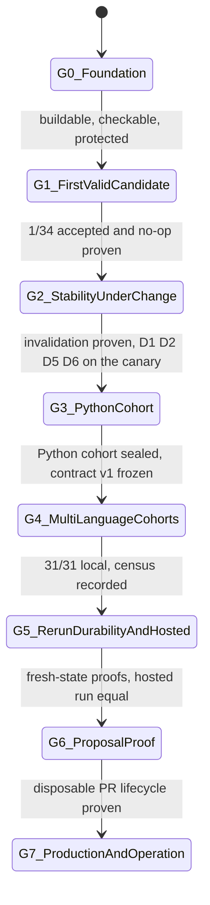
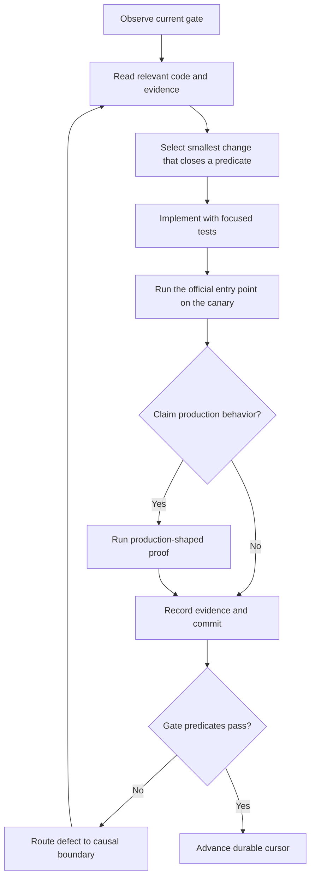

# Repository Presenter Implementation State Machine

Status: authoritative build and delivery plan, revision 2 (2026-09-02)  
Audience: the coding agent responsible for implementing Repository Presenter  
Companion authority: [`STATE_MACHINE.md`](STATE_MACHINE.md) defines the runtime target;
[`../plans/idea.md`](../plans/idea.md) owns the product outcome; `migration/reuse-manifest.yaml`
owns legacy disposition; `project/state.yaml` is the only cursor  
Legacy source baseline: `babar-raza/foss-readme-optimizer` at
`a8a163f7e9a7beeac1d2ef8b7c02e8e4bd5a7815`

Revision 1 sequenced four infrastructure gates before the first README, the legacy failure mode;
`RESEARCH_AND_GUIDELINES.md` §17 records why revision 2 replaced it. Cap: 500 lines, eight gates.

## 1. Mission

Build and deploy Repository Presenter as an autonomous GitHub-native system whose foundational
component keeps the README files of authorized repositories accurate, credible, repository-specific,
and current, using a configurable custom LLM inside deterministic controls.

Progress has exactly one unit: **current, reviewable, no-op-proven README candidates, N/34**. The
`status` command prints it. Code volume, tests, evidence, schemas, transitions, and closed work items
are not progress. The observable repository transaction is:

1. inspect an immutable real repository revision;
2. interpret the product agentically from repository-grounded evidence;
3. reconcile the existing README without silently losing valuable content;
4. plan and compose a concise repository-specific README;
5. validate it deterministically with a small set of blocking checks;
6. obtain one independent agentic approval;
7. prove an unchanged rerun is byte-identical and makes zero provider calls;
8. keep that candidate valid while the system changes around it;
9. later, monitor drift on hosted runners and open or update a safe proposal; and
10. recover correctly after interruption or an uncertain remote effect.

## 2. Binding principles

1. The system runs autonomously on GitHub-hosted runners on schedules and explicit triggers.
2. The production LLM is a configurable OpenAI-compatible gateway supplied through GitHub secrets.
3. Agentic reasoning is mandatory for interpretation, reconciliation, planning, composition,
   independent review, and targeted repair.
4. Deterministic code owns evidence, validation, state, transitions, safety, authorization,
   idempotency, recovery, and GitHub effects.
5. The portfolio presentation contract is a brand/assurance shell, not a universal prose template.
6. Normal execution detects product, ecosystem, shape, sections, evidence, examples, and validation
   paths without human template selection. Each platform extractor is independent of every other
   and of every downstream stage, sharing only `facts.json` (`REPOSITORY_LAYOUT.md` §2.1).
7. The exact immutable repository snapshot is factual authority.
8. Existing README content is high-value evidence: validate, preserve, improve, correct, or
   explicitly omit every material unit.
9. Aspose.org and previously published candidates are development oracles, never runtime
   dependencies. Legacy per-product profiles and catalogs hold the same status: pulled and
   reviewed per repository or family as needed, never in bulk (`RESEARCH_AND_GUIDELINES.md` §7.2.1).
10. A README-only placeholder receives a typed non-processable disposition, never invented content.
11. An accepted unchanged transaction makes zero new provider calls.
12. Analysis and write credentials are separately minted, repository-scoped, and short-lived.
13. Initial publication is PR-only: opening or updating one, never a direct default-branch commit.
14. A content candidate and permission to publish it are separate decisions.
15. One repository failure never stops safe work on unrelated repositories.
16. Research a battle-tested library or standard facility before writing a custom mechanism;
    document a departure with the alternative considered. `RESEARCH_AND_GUIDELINES.md` §18 is the
    registry. A pulled legacy module is judged by this rule too, not exempted by having run in
    production.
17. Do not import the legacy mission graph, trusted lane, or proof bureaucracy.
18. **Infrastructure is just-in-time.** A mechanism enters only when the current or next gate's
    end-to-end run consumes it. Leases, fencing, durable CAS state, hosted workflows, and
    authorization machinery arrive at G5 and G6, not before.
19. **Every work item ends with a run of the official entry point on the canary.** A module with no
    production importer is a defect, not a deliverable.
20. **A candidate is invalidated only by a change to an input it consumed.** Every bundle carries a
    per-candidate dependency manifest; no global control-plane hash exists in the codebase.
21. **Validators and reviewers re-check; they do not invalidate.** A validator or rubric change
    re-runs against accepted candidates and produces "still valid", `VALID_UPDATE_AVAILABLE`, or a
    typed factual, safety, or protected-content failure. Only the last invalidates.
22. **Reviewer findings must be repairable.** A finding names a candidate section and a causal
    stage from a fixed vocabulary; anything else is advisory and never blocks twice.
23. **The acceptance contract freezes at G2 exit** as version 1 and changes only at declared
    version boundaries with regression evaluation across every current candidate.
24. **Governance stays compact.** `AGENTS.md` at most 200 lines, this document at most 500, at most
    eight gates. When a new rule is needed, an old one is replaced.

## 3. Authority and conflict resolution

The coding agent reads authority in this order:

1. This document owns implementation sequence, gates, deliverables, and the build cursor.
2. `docs/STATE_MACHINE.md` owns the production runtime states and transitions;
   `docs/README_CONTRACT.md` owns the candidate's shape, assembly, agentic decisions, and checks;
   `docs/REPOSITORY_LAYOUT.md` owns where a file lives.
3. Typed schemas and tests own implemented interface behavior after their gate is accepted.
4. The reuse manifest owns the disposition of each legacy module and asset.
5. Git history and committed evidence record what actually happened.

`plans/idea.md` is the human product authority for outcomes and standing constraints. It does not
own sequence or state. Section 12 maps every obligation it states to the gate that delivers it; an
obligation without a gate is a defect in this document, not permission to skip the obligation.

If implementation proves a design assumption wrong, the agent records evidence, updates the
affected authoritative document and its tests in one coherent change, and resumes from the earliest
invalidated gate. It never creates a competing plan.

## 4. Build-state overview

The agent may research ahead of the cursor but may not build or claim a later gate's machinery
before its dependency gate passes.

## 5. Durable implementation cursor

`project/state.yaml` is updated in the same commit as every accepted transition. It is a concise
cursor with a `progress` block (`current_candidates`, `denominator`, `canary`), the current gate,
one active work item, queued items, `owner_items`, legacy-source verification, execution limits,
the control-repository push policy, and the last transition. Allowed statuses for the current gate
and the active work item are `READY`, `IN_PROGRESS`, `VERIFYING`, `ACCEPTED`, `BLOCKED_EXTERNAL`,
and `FAILED_INTERNAL`. Queued entries use `PENDING` or `BLOCKED_BY_GATE`. At most one shared-code
item is `IN_PROGRESS`. A JSON Schema under `schemas/` validates the file in CI from G0 onward.

Gate identifiers: `G0_FOUNDATION`, `G1_FIRST_VALID_CANDIDATE`, `G2_STABILITY_UNDER_CHANGE`,
`G3_PYTHON_COHORT`, `G4_MULTI_LANGUAGE_COHORTS`, `G5_RERUN_DURABILITY_AND_HOSTED_OPERATION`,
`G6_PROPOSAL_EFFECT_PROOF`, `G7_PRODUCTION_AND_CONTINUOUS_OPERATION`.

**Owner-only predicates never live in a gate.** Branch protection, secrets, App installation, and
product decisions are `owner_items` with an exact resume predicate and the gate or work item that
consumes them. They hard-block only there, are re-checked every iteration, and a work item is
`BLOCKED_EXTERNAL` only when it itself consumes an unmet owner item. Everything else proceeds.

## 6. Global execution loop

Rules: inspect before replacing; change the smallest causal boundary; two equivalent failed attempts
or 15 minutes without narrowing force a first-principles review and a changed mechanism; unit tests
support a claim but do not prove hosted workflows, live gateways, Git safety, recovery, or GitHub
effects; every commit leaves the repository consistent and names its gate and work item; never
mutate a target repository while proving read-only behavior.

Control-repository pushes: after the full local CI-equivalent passes, the agent pushes this
repository to its own `origin` so hosted CI runs, directly to `main` while `main` is unprotected
and by branch, PR, and auto-merge once protected (`publication.control_repository`). Never force,
never a product repository. A red hosted run is `FAILED_INTERNAL` at the next iteration.

## 7. Legacy reuse protocol: pull-based

The legacy repository holds 171,345 lines of first-party production Python at the frozen revision
and its scheduled entry point imports 79% of it, so reuse by entry point is impossible and a
census-first audit would become its own project. Reuse is **pull-based**: a legacy file enters this
repository only when a gate's work needs it, with a manifest record, its tests, and a cut closure.

Every pulled file receives exactly one disposition: `PORT_NEARLY_INTACT`, `EXTRACT_AND_REFACTOR`,
`ADAPT_AS_PLUGIN`, `FIXTURE_OR_ORACLE_ONLY`, or `MIGRATION_READER_ONLY`. Everything never pulled is
`RETIRE` by default. Each record carries source path, SHA-256 at the frozen revision, disposition,
destination, retained behavior, removed behavior and coupling, tests ported, and acceptance.

Pull rules:

- Compute the import closure at the source before pulling. A pull that drags a retired module or a
  `supervisor`, `capabilities`, or `specialists` module fails; cut the chain first. The known chains
  are recorded in the manifest as `CPL-01` to `CPL-08`.
- Seam-cut order for the first pulls: shared identity types out of `capabilities/schema.py`;
  `sha256_text` out of `readme/facts.py`; the validation ruleset version; then the `llm/*` modules.
- Non-Python assets follow the same rule: prompt manifests, template and section registries, policy
  files, registry and link data, the benchmark profile, the presentation standard, and the golden
  sample are pulled per asset with a record. The manifest lists their expected dispositions.
- The legacy suite is not green at the frozen revision (`RESEARCH_AND_GUIDELINES.md` §16.9); record
  the Linux-runner baseline before the first pull so a failing ported test is attributable.
- The G4 exit census records file and line totals by disposition. No reuse percentage is claimed
  before it.

## 8. Gates

## G0 — Foundation

Goal: make the repository buildable, checkable, and protected in at most two working days, without
importing legacy runtime behavior or building speculative infrastructure.

### Work

1. Python 3.11+ `src/` package, `pyproject.toml`, lock file, CLI with `--version` and `status`.
2. Formatting, linting, typing, and unit-test CI on Python 3.11, 3.12, and 3.13.
3. JSON Schemas under `schemas/` for `project/state.yaml`, the reuse manifest, and the candidate
   bundle; CI validates the first two now.
4. Secret canary test proving configured secrets cannot enter a candidate bundle; `.env.example`
   with `GH_TOKEN`, `LLM_BASE_URL`, `LLM_API_KEY`, `LLM_MODEL`.
5. Path-budget test: no tracked path exceeds 200 characters.
6. Record the owner items (branch protection, gateway credentials, dirty legacy tree, GitHub
   App) with exact resume predicates; apply the recorded default for the dirty tree.

Explicit non-goals: decision-record folders, evidence frameworks, typed error taxonomies beyond what
the CLI needs, configuration precedence machinery, any legacy port.

### Exit predicates

- Clean environment installs from the lock; lint, format, types, tests pass on Python 3.11-3.13.
- CLI reports version, current gate, and `0/34` candidates.
- Schemas validate the cursor and manifest; canary and path-budget tests pass.
- The accepted commits are pushed to the control repository's `origin`; hosted CI is checked at the
  next iteration.
- Owner items are recorded with exact resume predicates; none is consumed by G0.
- No legacy production file has been copied.

## G1 — First Valid Candidate

Goal: `repository-presenter present --repo aspose-3d-foss/Aspose.3D-FOSS-for-Python` produces a
concise, product-first candidate at
`candidates/aspose-3d-foss__Aspose.3D-FOSS-for-Python/<revision>/README.md` with a sealed bundle,
and an immediate rerun is a zero-call no-op. This is the first milestone of the recovery direction:
one README that a human can open and judge.

### Work

The transaction is a linear pipeline with stage artifacts on disk. No durable multi-machine state,
leases, or hosted execution yet; those are G5.

1. **Snapshot.** Allow-list check against the registry, push-neutered clone at the pinned default-
   branch revision, exact README bytes, tree inventory. Pull `gitsafety/`, `repository_snapshot.py`,
   `inspection/`, `registry/loader.py`, `evidence/redaction.py`, `errors.py`, `retry.py`.
2. **Facts.** Distribution name, import path, exported symbols, Python range, verified executable
   examples, formats, license, and the material-unit inventory of the existing README, all as typed
   `facts.json` records with evidence IDs and polarity. Pull the Python consumer and example
   verifier as the first platform plugin behind a registry. A PSD-style README-only fixture returns
   `insufficient_evidence` with a resume predicate and zero LLM calls.
3. **LLM jobs** (the first item that consumes the gateway credentials owner item; items 1 and 2
   proceed without them). Governed prompt manifests for `repository_investigation`,
   `source_reconciliation`, `presentation_planning`, `section_authoring`, `independent_review`, and
   `targeted_repair`, one file each under `prompts/`, plus a `preflight` command that reaches the
   gateway without leaking the key and lists its model catalog; each prompt manifest's `model_route`
   is chosen from that catalog for job fit, never assumed (`RESEARCH_AND_GUIDELINES.md` §18.4). Build
   the transport on the `openai` SDK per §18.2 rather than porting `call_transport.py`'s `requests`-
   based protocol handling, unless evaluating the SDK against the actual gateway finds a documented
   reason not to. Pull the call
   ledger, call schema, prompt registry, and prompt hygiene after the `CPL-01` cut; the ledger and
   schema are project-specific accounting the SDK does not replace. LLM prose may only express fact
   IDs supplied in its packet; deterministic code renders commands, links, badges, Mermaid, example
   code, and license identity.
4. **Composition** to `docs/README_CONTRACT.md`: the semantic shell in its §2, the assembly
   pipeline in its §3, and the agentic decisions in its §4. The LLM returns typed content units
   bound to fact IDs; the deterministic renderer emits the Markdown; one coherence pass may revise
   LLM-owned units only.
5. **Blocking checks:** exactly the eleven in `docs/README_CONTRACT.md` §5. Everything else is
   advisory until G2 freezes contract v1.
6. **Independent review** per `docs/README_CONTRACT.md` §4 and §6: separate prompt and identity;
   findings name a section and a causal stage; one targeted repair per equivalent fingerprint;
   unrepairable findings are advisory.
7. **Bundle.** `README.md`, `README.patch`, `facts.json`, `dispositions.json`, `plan.json`,
   `validation.json`, `review.json`, `calls.jsonl`, `dependencies.json` (exact hashes of every
   consumed input: source revision and relevant tree, fact records, prompt manifests, model route,
   template component versions, validator IDs and versions, acceptance profile, protected-content
   fingerprint, policy), and `manifest.json` with checksums.
8. **No-op.** Fresh process, same inputs: same bytes, zero calls, ledger records cache reuse per job.
9. `status` prints `1/34` from the bundles on disk.

### Exit predicates

- A human can open the candidate at its stable path and it reads as a concise, product-first README
  for this repository, within budget, with every required section of the semantic shell present.
- All eleven blocking checks pass; review verdict is `ACCEPT`; no-op is proven in a fresh process.
- Every pulled legacy file has a manifest record and ported tests; every new module has a production
  importer; provider calls reconcile with the ledger.
- The PSD fixture yields `insufficient_evidence` with zero calls.

## G2 — Stability Under Change

Goal: the G1 candidate remains valid while the system evolves — the milestone the legacy never
reached — and the first-candidate causes of drift (`RESEARCH_AND_GUIDELINES.md` §27, §28) are closed.

### Work

1. Dependency evaluation from `dependencies.json`: a changed component reopens only its consumers,
   at the earliest affected stage, reusing unaffected work; corrupt or missing artifacts fail closed.
2. Change each dependency class in isolation — source revision, fact extractor, prompt, model route,
   template component, validator, reviewer rubric, link policy — and prove routing: presentation
   changes yield `VALID_UPDATE_AVAILABLE`; factual, safety, or preservation failures invalidate.
3. Inject one factual defect and one preservation defect; prove rejection and repair at the causal
   stage with accepted unaffected work retained; prove the two-attempt rule terminates honestly.
4. Grep-enforced test: no global control-plane hash anywhere in `src/`.
5. The first-candidate half of D1–D7 (§27.5, §28.5) on the canary: test fixture, constructive
   generation, title binding, content-only acceptance, coverage ledger; D3, D4, fan-out → G5, freeze → G3.

### Exit predicates

- The invalidation matrix is green; unaffected artifacts are reused; no global hash exists;
  injected defects are rejected and repaired at their causal stage.
- On the canary: first-attempt acceptance ≥95% and re-ask ≤5% per job, zero required-row
  advisories, a blocking coverage check, one local `pytest` pass under three minutes.

## G3 — Python Cohort and Contract Freeze

Goal: every processable Python repository has a candidate or an evidence-bound disposition, and the
contract freezes against thirteen sealed products rather than one (§28.5).

### Work

1. Python cohort: the twelve remaining Python registry entries through the existing pipeline, one
   transaction each; seal what passes all eleven checks; an evidence-bound disposition with a resume
   predicate for the rest (PSD-Python `NON_PROCESSABLE`); fixes by failure class, a regression test each.
2. Freeze acceptance contract v1: the 30-point profile with hard disqualifiers, the blocking checks,
   and the advisory set, each versioned in every bundle's `dependencies.json`.

### Exit predicates

- `status` prints the sealed count (up to 13/34); the gate manifest carries the cohort report by
  repository (sealed, disposition, failure class); every sealed bundle is zero-call proven; v1 frozen.

## G4 — Multi-Language Cohorts, Local

Goal: 31/31 READMEs and 34/34 dispositions on this machine through one shared surface extractor
and six thin ecosystem plugins, before any hosted machinery (§28.5, RC-B).

| Ecosystem | Mandatory truth |
|---|---|
| Python | Distribution name, import path, exported symbols, Python range, extras, executable example. |
| .NET | NuGet identity, TFMs, namespaces, project references, native dependencies, compilable C# example. |
| Java | Maven coordinates, repository availability, JDK level, packages, dependencies, compilable example. |
| C++ | Compiler and standard, CMake or build files, includes, namespaces, linkage, compilable example. |
| Go | Module and import path, Go version, exported API, dependencies, idiomatic compilable example. |
| Rust | Crate identity, edition and MSRV, visibility and re-exports, features, safety claims, compilable example. |
| TypeScript | npm identity, exports and types, runtime targets, ESM/CJS behavior, dependencies, compilable example. |

### Work

1. Second reuse source (§29.6 E1–E2): `plans/idea.md` admits aspose.org's extraction engine and
   tests under the pull discipline (pinned revision, file records, ported tests, minimal closure only,
   never a runtime import); `sources` in the manifest schema; the engine under a `_vendor/` boundary
   with confined `mypy`/`ruff` overrides, recorded patches, a typed `SurfaceExtractor` façade; census.
2. Layered plugins (§29.6 E3–E5): `EcosystemSpec` + one thin verifier + one negative control each;
   shared `RegistryProbe`; ecosystem-generic renderer, badges, Installation, fences, aliases, slugs.
   Six items, one per ecosystem with its cohort — .NET (6), Java (4), C++ (4), TypeScript (2), Go
   (2), Rust (1); fixes by failure class; evidence-bound dispositions (Email .NET `CS1929`, PSD-.NET).
3. Extractor parity per repository against the live README's API rows (§24); a shortfall routes to
   EXTRACTING; compiler-emitted corroboration (E6) is admitted per ecosystem only when parity fails.
4. Freeze one registry revision as the denominator; portfolio report with separated counts.

### Exit predicates

- `status` prints 31 sealed candidates and 34 dispositions; every verifier has a negative control;
  every cohort report and the census are in the gate manifest; parity is recorded per repository.

## G5 — Rerun Durability and Hosted Operation

Goal: the 31 candidates stay byte-stable across reruns, revisions, and machines, then the read-only
transaction runs autonomously on GitHub-hosted runners (§27.5 D3, D4, D7).

### Work

1. Anchored canonical plans (D3), portable reproducibility with the fresh-state proof (D4), bounded
   fan-out inside a candidate; every candidate re-sealed byte-identically or with its recorded delta.
2. Durable runtime from `STATE_MACHINE.md`: repository record with CAS, leases and fencing, trigger
   normalization and deduplication, recovery before scheduling, transition receipts; pull and slim
   `state/git_backend.py`, `cas.py`, `trigger_v2.py`, `recovery.py`, `health.py`, `freshness_contract.py`.
3. `monitor.yml` (schedule, manual, workflow-call, repository-dispatch) and `present.yml` (isolated
   per-repository job); proven locally under `act` with `GH_TOKEN`, then hosted with a read-only App
   token; ambient tokens ignored, fail closed. Consumes the branch-protection and App owner items.
4. Authorized discovery and intake (new repositories disabled and read-only, exclusions explicit);
   changed-or-due matrix; TTL-governed package and release surfaces, caches never authoritative;
   isolated lanes with bounded concurrency; adversarial audit; `BenchmarkQualityProfileV1` comparison.

### Exit predicates

- Every candidate passes the fresh-state proof (empty `runs/`, fresh process, zero calls); a new
  revision with unchanged facts reuses every call; a hosted run reaches the same accepted result as
  local execution; an unchanged hosted rerun makes zero provider calls; a synthetic upstream change
  schedules only the affected repository; the aggregate report reconciles with repository receipts.

## G6 — Proposal Effect Proof

Goal: prove automatic PR creation and maintenance against a disposable target with isolated
credentials, then qualify the Java cohort that `plans/idea.md` designates.

### Work

1. `propose.yml` as a separately authorized write-capable workflow; exact authorization payload
   binding candidate hash, source revision, branch, PR intent, policy version, and expiry.
2. Fresh repository-scoped App token minted only inside the effect job; source revision rechecked
   immediately before the effect; one stable presenter branch and PR per target.
3. Update rather than duplicate; reconcile lost responses before retry; upstream README overlap
   returns to reconciliation; merged and closed-unmerged outcomes observed without recreation.

### Exit predicates

- Disposable PR created and updated with exact effect evidence; the analysis token cannot write;
  stale source blocks the effect; repeated invocation creates no duplicate; lost-response simulation
  reconciles; no default-branch push exists.

## G7 — Production Readiness, Deployment, and Continuous Operation

Goal: harden for unattended operation, enable it on the approved repository and App installation,
then keep the system useful without weakening the README foundation.

### Work

1. Threat model (credentials, prompt injection from repositories, malicious Markdown, unsafe links,
   untrusted build files, evidence exfiltration; sandboxed per-ecosystem execution); failure
   exercises (leases, crash recovery, duplicate triggers, corrupt state, gateway and GitHub outages,
   rate limits, matrix partial failure); dependency locking, SBOM, vulnerability audit; budgets,
   health, alerts naming the causal repository, dead-man monitoring; App permissions, rotation, rollback.
2. Upstream-defect handoff for a confirmed product defect (seed: Email .NET `CS1929`),
   evidence-backed and deduplicated, never a fabricated severity or unverified fix; later automated
   behind its own authorization and deduplication ledger.
3. Deploy: App and gateway secrets; scheduled monitor in read-only observation; hosted output
   compared with accepted local bundles; automatic PR mode for the Java cohort with fresh effect
   authorization, expanding only after observed stability.
4. Operate: monitor quality, cost, repair rate, drift, proposal acceptance, time to update; refresh
   prompts and routes only at declared version boundaries with regression across every candidate;
   admit new repositories disabled and read-only (no plugin, stays non-processable until one lands —
   one file, one test, one registry entry); add the other surfaces (description, topics, community
   files, release links, visuals, social preview) as separate machines; Level 7 and 8 certifications.

### Exit predicates

- Security suite and failure exercises pass; no write credential in analysis jobs; state survives
  runner loss; hosted monitoring runs unattended; approved repositories receive safe proposals after
  drift; unchanged repositories incur no LLM work; `delivery_complete` closes the gate and
  `certification_complete` the background tracks. Operating objectives: drift to accepted proposal
  within one daily cycle; no unsupported claim, inherited-content loss, duplicate PR, or halt.

## 9. Gate failure routing

| Failure | Route |
|---|---|
| Pulled legacy code drags retired machinery | Cut the seam or reimplement the narrow contract; never widen the pull. |
| Custom gateway malformed output | Tighten the typed job schema or prompt, or change the routed model; never weaken validation. |
| Facts incomplete | Improve deterministic extraction or bounded evidence tools. |
| Candidate generic or too long | Reopen investigation or planning; enforce the budget; never polish prose only. |
| Candidate loses source material | Reopen reconciliation and disposition mapping. |
| Example does not compile or run | Reopen example selection; never explain it away in README prose. |
| Reviewer rejects | Route the typed defect to its causal stage; if the finding is unrepairable, make it advisory and fix reviewer scope. |
| Candidate invalidated by a component it did not consume | Fix the dependency manifest; never widen invalidation. |
| Validator change fails accepted candidates on presentation only | Emit `VALID_UPDATE_AVAILABLE`; never invalidate. |
| No-op invokes the LLM | Fix dependency identity, cache, or state; never exempt the call. |
| Module has no production importer, or governance or module growth exceeds budget | Wire or delete it in the same work item; remove, do not document around it. |
| Hosted state missing, or GitHub effect uncertain | Fix the durable backend, caches cannot substitute; reconcile the remote branch and PR before retrying. |
| Owner item unmet | Skip only the work items that consume it; record the exact action; never wait on anything else. |
| Internal bug blocks progress | `FAILED_INTERNAL`; repair and resume; never acceptable completion. |

## 10. Evidence

Each accepted gate writes `evidence/build/<gate-id>/manifest.json`: control and legacy revisions,
exact commands and exit statuses, test results, proof identity, artifact hashes, LLM call summary,
predicate verdicts, next work item. For candidates the sealed bundle is the evidence; nothing is
duplicated. Evidence is redacted, checksum-valid, and reproducible.

## 11. Definition of done

Repository Presenter is complete when: the repository is independent of the legacy and Aspose.org
trees at runtime; scheduled hosted monitoring covers the admitted portfolio; every processable
repository has a current independently accepted candidate; every unchanged accepted repository
proves zero-call idempotency; upstream and due-surface changes reopen exactly the affected work;
custom-LLM investigation, planning, composition, review, and repair are live and attributable;
automatic PR creation and update work through the isolated App effect job; placeholders and
unresolved facts fail honestly; recovery, concurrency, stale authorization, and lost-response
behavior are proven; and the system operates without routine human initiation or template selection.

## 12. Product-outcome coverage of `plans/idea.md`

| Obligation in `plans/idea.md` | Gate | Note |
|---|---|---|
| Product explained before promotion; contextual Aspose links within configured-or-derived ceilings; "Enterprise Edition" only; below-the-fold **full-featured ... Enterprise Edition** anchor | G1 | Blocking check; legacy `links/allocation.py` behavior pulled. |
| Presentation contract: one H1, badge row, canonical product name, title case, abbreviations, At a Glance topology and column rules, visible-versus-collapsible rules, Third-Party Notices, license prose, no internal narration | G1 essential subset, G2 full | Ported from the legacy template registry and presentation standard. |
| Search-intent vocabulary as corroborating evidence with output lineage, never repeated across headings | G2 | The legacy tests for this are red at the frozen revision. |
| Exactly one disposition per material source unit; LLM reasoning mandatory; every call attributable; zero-call no-op; small governed prompt registry | G1 | Blocking checks, six prompt manifests, ledger, fresh-process replay. |
| System decides product and platform; ecosystem truth includes the public consumer surface | G1 (Python), G2, G4 (all) | Plugin registry and platform verifiers with negative controls. |
| Aspose.org and sibling assets are oracles, never runtime dependencies | G1 rule, G4 pull, G5 benchmark | Fixture-only, plus file pulls with records and tests in G4; never a runtime import. |
| Benchmark quality profile met or exceeded; `BENCHMARK_REFRESH_AVAILABLE` | G5 | Development-only comparison. |
| 30-point acceptance, zero hard disqualifiers, criterion-specific evidence | G3 | Frozen as contract v1 after the Python cohort. |
| Independent non-authoring review; second reviewer only on typed trigger | G1 | Hard invariant. |
| Complete authorized discovery; hard allow-list; frozen registry revision; new repositories disabled and read-only; explicit exclusions | G4 registry freeze, G5 intake | Registry modules pulled and refactored. |
| README-only placeholders become non-processable with resume predicates | G1 fixture, G3 and G4 PSD | Zero LLM calls. |
| Versions freeze, design does not; component invalidation scopes; `VALID_UPDATE_AVAILABLE`; drift detection and protected content as a durable control | G2, G5 | Per-candidate dependency manifests; broader-than-SHA freshness. |
| Portfolio reporting with separated counts | G4 | Health report. |
| Autonomous hosted operation with schedules, triggers, and recovery; `act` local testing with `GH_TOKEN`; GitHub App only in production, fail closed | G5 | Two workflows, `act` proof, token boundary. |
| Separate analysis and write credentials; PR-only publication; recheck before effect | G6 | Disposable target. |
| Java repositories as the first verified-proposal cohort | G6, G7 | After disposable proof and fresh authorization. |
| Other surfaces (description, topics, visuals, social preview, community files, release links); upstream defect reporting; Level 7 and 8 certification | G7 | Deferred by `plans/idea.md`; seed case `CS1929`; background tracks. |
| Two-attempt rule; serial calibration with at most three disjoint workers; battle-tested libraries | `AGENTS.md`, `project/state.yaml`, principle 16 | Governance and execution limits. |
| Baseline figures are dated observations | G4 | 34 entries at `a8a163f7`; frozen at G4. |
