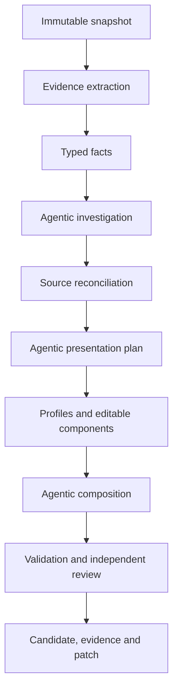

# Repository Presenter Research and Design Guidelines

Status: durable research record and implementation guidance  
Recorded through: 2026-09-02  
Legacy repository: `babar-raza/foss-readme-optimizer`  
Legacy source baseline used by the new project: `a8a163f7e9a7beeac1d2ef8b7c02e8e4bd5a7815`

## 1. Purpose and authority

This document preserves the useful investigation, reasoning, rejected approaches, measurements,
and design guidance developed before implementation began. It exists so a future agent can recover
the reasoning without relying on conversation history.

It is deliberately not another execution plan:

- [`EXECUTION_STATE_MACHINE.md`](EXECUTION_STATE_MACHINE.md) owns build order, gates, deliverables,
  and execution state.
- [`STATE_MACHINE.md`](STATE_MACHINE.md) owns production runtime states and transitions.
- This document explains why those contracts exist, records their empirical basis, and identifies
  conclusions that must be retained or revalidated.

Labels used below:

- **Observed** — directly inspected in source, state, history, workflows, or target repositories.
- **Measured** — produced from a bounded count or inventory at the recorded revision/date.
- **Inferred** — reasoned conclusion from observations; implementation must test it.
- **Decision** — selected direction for the new project.
- **Rejected** — approach considered and deliberately not selected.
- **Revalidate** — time-sensitive or incomplete observation that cannot remain permanently assumed.

## 2. Original problem

The legacy README optimizer accumulated extensive machinery but failed to provide a dependable,
current, contract-valid README transaction. The central problem was not absence of code, tests,
state, plans, or evidence. It was failure to convert those assets into the primary observable
result: one current repository-grounded README, independently accepted and immediately no-op
proven.

The new product must therefore optimize for completed repository outcomes rather than machinery
completion.

### 2.1 Intended product outcome recovered from `plans/idea.md`

**Observed:** the permanent intent is a central repository-presentation agent, not a link injector,
static template renderer, or one-time cleanup script.

The system must:

- establish a FOSS product as useful, credible, and professionally maintained before promotion;
- explain what it does, the problems it solves, supported capabilities/formats, installation,
  usage, limitations, and maintenance;
- place relevant Aspose and Enterprise Edition links only where they help the reader;
- continuously inventory and monitor authorized repositories;
- run autonomously on GitHub-hosted runners through schedules and explicit triggers;
- use repository-grounded facts and reconcile product-agent/current-README claims;
- employ agentic reasoning for interpretation, editorial planning, composition, review, and repair;
- keep deterministic control over safety, evidence, validation, state, effects, and idempotency;
- remain durable across ephemeral runners;
- update presentations after upstream changes without routine human operation; and
- eventually manage other repository presentation surfaces through the same core.

README health is foundational and cannot be displaced by social preview, metadata, research,
governance, or future-surface infrastructure.

## 3. Legacy-system investigation

### 3.1 Repository scale

**Measured during the 2026-09-01 audit:** approximately:

| Measure | Result |
|---|---:|
| Legacy repository commits since 2026-07-17 | 1,423 |
| First-party production Python | 171,345 lines |
| Vendored Aspose.org Python | 23,574 lines |
| Tests | 156,031 lines |
| `facts/` | 36,455 lines |
| `readme/` | 30,920 lines |
| `supervisor/` | 26,376 lines |
| `specialists/` | 20,682 lines |
| `presentation/` | 13,867 lines |
| `state/` | 6,627 lines |
| `capabilities/` | 6,485 lines |
| Foundation-oriented packages | approximately 18,690 lines |

These counts describe scale, not value. Large areas contain valuable implementation mixed with
historical lanes, product-specific fixes, proof scaffolding, compatibility paths, and orchestration
that should not be reproduced.

### 3.2 Live delivery state found during the audit

**Observed at legacy state reference `827881b...` on 2026-09-01:**

- registry/accountability denominator: 34;
- `facts_ready`: 1;
- `candidate_generated`: 0;
- no-op proven: 0;
- active task: null;
- durable transitions: 1,209;
- attempts: 247;
- ineffective attempts: 115;
- closed tasks: 81, including closures later shown not to establish the promised result.

The first candidate-focused task, PF02, had 159 transitions and 21 staleness regressions. PF04 had
to reopen because its proven-transaction runner had no production importer. This is strong evidence
that transition volume and task closure were decoupled from user-visible delivery.

### 3.3 Stale candidate evidence

**Observed:** an older finalized evidence area contained ten Python candidates from 2026-08-11/12,
but those artifacts were stale relative to current source and current control contracts.

Approximately 619 control-repository commits followed the last promotion without a corresponding
change to the canonical finalized candidate set. One old 3D/Python candidate was approximately 793
README lines and included weak generated API prose.

**Guideline:** candidate existence, historical approval, generated evidence, or task closure never
counts as current acceptance. Source, facts, candidate, validation, independent review, provider
calls, and no-op proof must form one current transaction.

### 3.4 Two generations of legacy product

**Observed:** the legacy repository contains:

1. A narrow deterministic `generate/run` path that detects four promotional gaps and writes a
   bounded owned span.
2. A much broader `supervise/verified_repository_presentation` path intended to perform agentic,
   repository-verified presentation work.

The narrow path remains useful only as historical behavior or a migration reader. It is not the
new product's foundation. The broader path contains significant reusable intelligence, but its
supervisor/mission/proof architecture became too elaborate to carry forward safely.

### 3.5 What was structurally sound

The following ideas were valuable and must not be lost:

- immutable source revision binding;
- exact preservation of original README bytes;
- hard repository allow-list;
- push-neutered read-only clones;
- separate read and write credentials;
- per-job custom-LLM routing and typed outputs;
- provider-call attribution and zero-call accounting;
- prompt registry and prompt hashes;
- ecosystem-aware public consumer-surface extraction;
- claim accountability and source-content dispositions;
- deterministic validation and independent review;
- component-scoped dependency hashes and invalidation;
- repository-scoped durable state and CAS;
- trigger deduplication, leases, recovery, effect reconciliation, and health reporting;
- no-op as a complete-transaction property;
- independent processability classification; and
- portfolio accounting that retains non-processable entries.

### 3.6 What caused failure or unnecessary drag

**Inferred from code/state/history:**

- the mission/task apparatus became a product of its own;
- multiple trusted/verified/POC/compatibility paths created ambiguous authority;
- proof machinery was built before one simple current transaction worked;
- state transitions could grow without narrowing the README defect;
- historical artifacts could look like progress despite stale dependencies;
- numerous specialist, capability, promotion, cohort, and lifecycle abstractions increased wiring
  risk;
- product-specific fact machinery accumulated without a clean plugin boundary;
- infrastructure and acceptance contracts expanded faster than visible output;
- runtime and project-development governance became entangled; and
- repeated retries could preserve the same causal owner instead of changing mechanism.

## 4. Target-repository research

### 4.1 Corpus scope

**Observed:** all 34 repositories listed in the legacy product registry were inspected at their
then-current default branches on 2026-09-01. They span 13 families and seven ecosystems.

| Family | Platforms | Presentation observation |
|---|---|---|
| 3D | Java, .NET, Python, TypeScript | Shared semantic portfolio structure. |
| Barcode | Python | Standard structure. |
| Cells | C++, Go, Java, .NET, Python, Rust, TypeScript | Standard structure. |
| Email | C++, .NET, Python | Standard structure. |
| Font | Python | Purposefully product-specific. |
| HTML | Python | Standard structure. |
| Note | Python | Standard structure. |
| Page | Python | Standard structure with visual-output content. |
| PDF | C++, Go, Java, .NET, Python, TypeScript | Five standard; TypeScript is a detailed product manual. |
| PSD | .NET, Python | README-only placeholders. |
| Slides | C++, Java, .NET, Python | Shared Slides-family presentation. |
| TeX | Python | Compact, output-oriented presentation. |
| Words | .NET, Python | Standard structure. |

Classification at the time of inspection:

- 25 repositories used substantially the same semantic README contract;
- seven had legitimate bespoke family/product compositions; and
- two PSD repositories lacked implementation evidence.

This classification must be frozen with exact revisions during the reuse/corpus gate and refreshed
before portfolio proof.

### 4.2 Standard does not mean identical

The 25 standard-shell repositories share a reader journey, not a universal prose body. Common
semantic identities are:

1. Identity and badges
2. Navigation
3. At a Glance
4. Key Capabilities
5. Installation
6. Dependencies
7. Quick Start
8. Additional Examples
9. API Reference
10. Documentation and Resources
11. Scope and Limitations
12. Development and Testing
13. License

Each repository must still supply its own facts, audience, emphasis, workflows, examples, API hubs,
limitations, development instructions, and coherent prose.

### 4.3 Legitimate variations

- **Font/Python:** variable-font-first workflows, generated outputs, CLI behavior, MCP server and
  review artifacts are central to the product story.
- **PDF/TypeScript:** extensive capabilities and examples justify a manual-like composition.
- **Slides family:** supported/unsupported behavior and edition choice are more useful than a
  generic API inventory.
- **Page/Python:** visual output evidence materially improves comprehension.
- **TeX/Python:** a compact output-oriented journey is more appropriate.
- **PSD/.NET and PSD/Python:** no implementation evidence means no README authoring.

Profiles must make these compositions expressible, but the planning agent must select and justify
the result from current evidence.

### 4.4 Live README refreshes and lineage gap

**Observed:** many target READMEs were refreshed during August 2026, including standard-shell
changes across 3D, Cells, Email, HTML, Note, Page, PDF, and Words. Other product repositories were
updated through independent release or product workflows.

This explains the apparent contradiction: useful live READMEs exist while the legacy optimizer's
current canonical state has no valid candidate. The live files are valuable source material and a
development corpus, but must be requalified because the legacy system cannot trace them to a
current complete transaction.

## 5. Factual authority and content guidance

### 5.1 Evidence hierarchy

The exact immutable repository snapshot is primary authority. Relevant evidence includes:

- Git identity, default branch, tags, releases, and history;
- manifests and lock files;
- public consumer surface, exports, namespaces, modules, and declarations;
- implementation source;
- tests and examples;
- build/CI configuration;
- license and community files;
- current README and repository assets; and
- verified package registry observations.

Product agents, Aspose.org pages, package pages, external documentation, SEO vocabulary, and
previous candidates are leads, oracles, and presentation evidence. They cannot override
contradictory repository/package evidence or solely support a public factual claim.

### 5.2 Field-to-evidence mapping

| README material | Expected evidence |
|---|---|
| Identity and repository links | Git metadata, registry and repository configuration. |
| Package/install command | Ecosystem manifests plus verified public consumer/package surface. |
| Dependencies/runtime | Manifests, lock files, native loading, build configuration and CI. |
| Quick Start | Tested example/test or independently verified public-consumer example. |
| Capabilities | Public symbols corroborated by examples, tests, formats and implementation. |
| API Reference | Parsed public/exported surface, grouped for reader utility. |
| Build/test instructions | Actual build files and CI. |
| Limitations | Explicit implementation boundaries, omissions and unsupported paths. |
| License | Repository license evidence; absence remains absence. |
| Images/links | Existing assets plus destination/context validation. |
| Positioning and journey | Agentic interpretation of accepted evidence. |

### 5.3 Preservation

Maintainer/product-agent README material is neither disposable nor automatically true. Every
meaningful unit must receive exactly one outcome: preserve, rewrite, move, correct, supersede,
omit with evidence, defer as unresolved, or classify as non-content.

The approved presentation contract owns tone, headings, organization, and formatting. Source prose
structure is not itself protected, but validated information and maintainer intent are.

## 6. Deterministic and agentic responsibilities

### 6.1 Agentic work

Agents must perform genuine judgment for:

- understanding the product and audience;
- identifying important workflows and evidence gaps;
- reconciling conflicting or stale claims;
- determining the visitor journey and useful section depth;
- selecting the best examples and API hubs;
- composing coherent repository-specific prose;
- independently reviewing factual and visitor quality; and
- choosing targeted causal repairs.

A candidate produced solely by phrase matching, rules, or template population fails the product
intent even if deterministic checks pass.

### 6.2 Deterministic work

Code owns:

- registry admission and processability;
- immutable snapshots and hashes;
- evidence extraction and provenance;
- state transitions, leases and recovery;
- prompt/model/component dependency identities;
- commands, code blocks, verified links, badges and diagram topology;
- claim and source-unit accountability;
- Markdown, structure, link, example and safety validation;
- caching and no-op decisions;
- credential isolation and authorization;
- GitHub effect execution and reconciliation; and
- terminal artifact production.

### 6.3 Correct composition flow

Profiles and templates constrain and enable presentation. They do not replace interpretation.

## 7. Template and modularity guidelines

### 7.1 Semantic components

Templates should be ordinary Markdown/Jinja files, with layout/order/applicability in YAML.
They may define presentation framing, stable headings, slots, and deterministic structure.

They must not hardcode:

- package names or versions;
- product capabilities or supported formats;
- install/build commands;
- public API claims;
- limitations;
- repository-specific links; or
- unsupported marketing statements.

Those values come from versioned typed facts and an accepted agentic plan. Missing or unresolved
required facts fail compilation.

### 7.2 Profiles

- Platform profiles contain ecosystem knowledge and validation requirements.
- Family profiles contain accepted recurring terminology, workflows, and composition hints.
- Repository profiles are reviewed declarative overlays used only for true residual exceptions.
- No profile may bypass evidence, force a fact, or predetermine the entire document.

### 7.2.1 Importing legacy profiles and catalogs (2026-09-02)

**Observed in the legacy source:** `config/policies/*.yml` (34 files) hardcode a per-product
`products_org_link`, `products_com_link`, label, and prohibited-term list each. `data/
aspose_org_links.json` is a generated catalog of 7,755 link records whose own provenance block
records only 44 as live-verified, at a probe dated a month before freeze; `data/aspose_com_links.json`
is the same shape. `data/families.json` (17 records) and `data/platform_priorities.json` (a seven-item
execution order) are different in kind: small, global, structural, and low-risk to pull in full.

Rule: a policy file or a catalog record is pulled only when the repository or family currently being
composed needs it, never as the full 34-file or 7,755-record set ahead of G4 — the same pull-based
discipline `EXECUTION_STATE_MACHINE.md` §7 requires of code, applied to data. The pulling work item
re-verifies what it pulls before writing the file record: the link target resolves now (the check
`README_CONTRACT.md` §5 already requires of every rendered link), and the label and terminology still
match current product reality. A stale or unverifiable entry is corrected or dropped, never carried
forward on the legacy catalog's word. Record what was checked, changed, and dropped in the file
record's `note`. A pulled profile or catalog value is a lead, in the same evidentiary tier as an
Aspose.org page (§5.1): it can corroborate `presentation_planning`'s link and ceiling choices, never
override contradictory repository evidence or stand alone as a public factual claim.

### 7.3 Component boundary

README is one component of Repository Presenter. Shared `core` services own snapshot, evidence,
artifacts, state, LLM access, validation primitives, authorization, and GitHub integration.

Future components may manage:

- repository description;
- homepage and topics;
- community/contribution/security files;
- release and package links;
- visual assets and social preview; and
- drift protection across those surfaces.

They consume public core contracts and must not depend on README-private implementation.

### 7.4 Extraction and platform independence (2026-09-02)

Knowledge extraction (`extractors/`, facts stage S2) and knowledge processing (`investigation/`,
`reconciliation/`, `composition/`, S3 onward) are independent: `facts.json` is the only artifact that
crosses the boundary; no processing module imports an extractor module directly. Within extraction,
each platform's module (`extractors/platforms/<ecosystem>.py`) depends only on `core/` and its own
file, sharing no import with any other ecosystem's module; only the registry
(`extractors/platforms/registry.py`) references more than one ecosystem, and only to register them.

**The registry is open-ended, not fixed at seven.** `ecosystem` is a pattern-constrained string in
the registry schema and model (`^[a-z][a-z0-9_]*$`), never a closed enum, and the extractor registry
holds plugins in a plain `{ecosystem: plugin}` dict that fails closed with `ConfigError` on anything
unregistered — verified in the built code, not just planned. G3 qualifies seven representatives
because that is what the frozen 34-repository portfolio needs; it proves the pattern generalizes, and
is a milestone, not a ceiling. An eighth ecosystem, or a fiftieth, enters exactly the same way at any
later gate: one plugin file implementing the same protocol, one test, one entry in the registry's
dict — nothing else changes. A repository in an ecosystem with no registered plugin stays
non-processable, correctly, until that plugin exists; that is the fail-closed default working, never
a defect to route around.

**Verified in the legacy source:** `ecosystems/registry.py` is already the sole file importing more
than one ecosystem module; `ecosystems/python.py` and `ecosystems/rust.py` import no sibling ecosystem
module. This one boundary was sound and this repository keeps it. Adding, fixing, or extending one
ecosystem's extractor must change only that file, its test, and its registration line — never another
ecosystem's file, the registry's dispatch logic, or any downstream stage. `REPOSITORY_LAYOUT.md` §2.1
states this as a placement and test requirement.

## 8. Autonomous GitHub operation

### 8.1 Trigger and monitoring model

Recommended initial cadence:

- frequent cheap remote-revision/open-proposal probe;
- daily changed/due repository processing;
- weekly complete discovery and all-surface freshness audit;
- `repository_dispatch` for product release/upstream-change notification;
- manual/workflow-call entry points for bounded diagnosis and integration; and
- recovery before new scheduling.

Scheduled polling remains the dependable recovery mechanism even if product workflows later emit
events.

### 8.2 Drift is broader than Git SHA

Track independently:

- source/default-branch revision and relevant file fingerprints;
- exact README blob and material-unit inventory;
- package/release observations with TTL;
- repository description/homepage/topics with TTL;
- presentation assets and observable GitHub state;
- prompts, models, schemas, extractors, validators, profiles and template components; and
- open presenter proposal state.

A changed repository should invalidate only dependent work. A test-only commit may require no
README update; a package identity change reopens installation; a new exported API reopens public
surface/capability/example analysis; an upstream README edit reopens reconciliation.

### 8.3 GitHub workflow boundary

Use three focused workflows:

1. `monitor.yml` — registry reconciliation, recovery, cheap probes, due-work matrix, health.
2. `present.yml` — isolated read-only repository transaction using the custom LLM.
3. `propose.yml` — separately authorized, repository-scoped PR creation/update.

GitHub Actions cache accelerates execution but is never authoritative durable state. Use
repository-scoped CAS state in a dedicated control-repository namespace plus immutable
content-addressed artifacts.

### 8.4 Publication

Initial autonomous update mode means open or update one presenter-owned PR. It does not mean direct
default-branch pushes.

Before a write:

- mint a fresh repository-scoped GitHub App token in the effect job;
- bind target repository, candidate hash, source revision, branch, PR intent, policy, and expiry;
- refetch source and cancel if stale;
- reconcile an uncertain prior effect before retrying; and
- preserve/reconcile overlapping upstream README edits.

Auto-merge can later be enabled by explicit repository policy after production proof.

## 9. Custom LLM guidance

### 9.1 Reusable legacy capability

The legacy custom-LLM implementation already supports:

- OpenAI-compatible `/chat/completions`;
- configurable base URL and API key;
- per-job model routing;
- deterministic sampling defaults;
- bounded transport retry;
- typed response validation;
- request/response hashes;
- attempt, latency and token accounting;
- prompt registry and prompt hashes;
- fixture clients; and
- cache-reuse/zero-call accounting.

This is a high-value reuse area and should be simplified, not rewritten casually.

### 9.2 Initial job set

Use a small governed set:

- `repository_investigation`;
- `source_reconciliation`;
- `presentation_planning`;
- `section_authoring`;
- `independent_review`; and
- `targeted_repair`.

The custom model may have a modest reliable context window. Supply bounded evidence dossiers and
small fact packets, but retain one final whole-document coherence step. An LLM cannot write exact
commands, APIs, links, badges, example code, or diagram topology without deterministic evidence.

### 9.3 Failure behavior

- Required route unavailable or deliberately disabled: block honestly.
- Malformed structured response: reject; do not loosen schema silently.
- One normal semantic attempt plus one targeted correction for an equivalent fingerprint.
- Third equivalent attempt prohibited until evidence, prompt, model, component, stage, or mechanism
  changes.
- Every physical provider attempt remains attributable to repository, revision, job, prompt, model,
  outcome, latency, and usage.

## 10. Legacy-code reuse findings

### 10.1 Quantified expectation

At audit time, approximately 31–37% of first-party production code appeared to contain behavior
worth carrying into the new repository:

- approximately 11% near-intact foundations;
- approximately 20–26% surgical extraction/refactoring; and
- approximately 63–69% not suitable for production migration.

This was an audit estimate, not a license to bulk copy. The execution gate must produce a file-level
reuse manifest and measured final result.

### 10.2 Reuse substantially intact

- LLM transport, attempt accounting, call schema/ledger, prompt registry/hygiene;
- Git safety and push blocking;
- allow-list loader and selected discovery/intake primitives;
- immutable repository snapshot and inspection;
- ecosystem/public consumer-surface parsers;
- evidence redaction and atomic writing;
- contextual link validation;
- selected deterministic public-quality validators;
- read-only GitHub API and preflight; and
- authorization data contracts.

### 10.3 Extract and refactor

- `ProductFactsV2` concepts and general repository facts;
- ecosystem consumer/example verification;
- format, identity, protected-content and interpretive evidence logic;
- README assessment, source disposition, preservation and document assembly;
- agentic section authoring and whole-document composition;
- presentation component compiler and claim validation;
- independent separated review;
- repository-scoped Git CAS, triggers, freshness, recovery and health; and
- product-specific fact logic converted into registered plugins.

### 10.4 Reference or fixture only

- bulk vendored Aspose.org tree;
- imported knowledge snapshots;
- previously generated candidates;
- old benchmark reports; and
- old acceptance/proof artifacts.

Useful mechanisms may be adapted natively with provenance and regression tests. Production must
not depend on a sibling checkout or an unbounded vendored system.

### 10.5 Retire

- legacy four-gap renderer and marker writer, except a migration reader if required;
- trusted transformation lane and trusted cohort machinery;
- Level-8 mission graph and mission command system;
- PF04/proven-transaction proof machinery;
- generic planner-driven capability/task graph;
- compatibility commands and duplicated lifecycle schemas;
- overlapping evidence manifest versions; and
- thirteen overlapping workflows (§16.3), replaced by three.

## 11. Tangible output and success contracts

Every README-component invocation returns exactly one public outcome:

| Outcome | Meaning |
|---|---|
| `candidate` | README, exact patch, facts/dispositions, evidence, validation, review and call summary exist. |
| `no_change` | Byte-identical accepted result with checksum-valid evidence and zero provider calls. |
| `insufficient_evidence` | No candidate; typed missing evidence and resume predicate. |
| `failed` | Bounded redacted diagnostic, causal state and retry/block classification. |

Internal runtime states may be richer, but no repository is left with an ambiguous external result.

The initial project is not done because it has code, tests, workflows, candidate files, task
closures, or evidence. It is done only when the GitHub-hosted system monitors the admitted
portfolio, produces independently accepted current candidates for all processable repositories,
proves zero-call no-op, responds to drift, and safely opens/updates authorized PRs.

## 12. Rejected approaches and cautionary lessons

### 12.1 Repair the legacy architecture wholesale

**Rejected:** it would preserve the ambiguity and complexity that prevented tangible delivery.
Reusable implementation should migrate behind new narrow contracts.

### 12.2 Build a deterministic README compiler

**Rejected:** typed facts plus platform/family templates alone cannot decide product meaning,
audience, emphasis, example quality, useful API depth, limitations, inherited-content correction,
or coherent prose.

### 12.3 Use one editable Markdown template

**Rejected:** the corpus demonstrates legitimate product/family compositions. Use a semantic shell,
editable components, profiles as evidence-aware hints, and agentic planning.

### 12.4 Give equal writing authority to multiple agents

**Rejected:** product/evidence agents provide technical truth and critique, while one central
composer owns final document coherence. An independent non-authoring reviewer owns acceptance
judgment.

### 12.5 Treat Aspose.org as permanent truth or runtime dependency

**Rejected:** it is an evolving development oracle and may contain defects. Repository/package
evidence remains authoritative.

### 12.6 Treat Git SHA as complete freshness

**Rejected:** package releases, metadata, proposals, presentation policy, prompts and external
surfaces can change independently.

### 12.7 Treat Actions cache/artifacts as durable mutable state

**Rejected:** caches can evict and artifacts expire. They are acceleration and review surfaces.

### 12.8 Build broad infrastructure before one transaction

**Rejected:** the first vertical slice must complete investigation through no-op and then a
disposable PR. Infrastructure is admitted only when the current/next proof consumes it.

## 13. Implementation heuristics

1. Lead every development increment with the observable repository outcome it unlocks.
2. Maintain one build cursor and one runtime state machine; do not create parallel authorities.
3. Port behavior with its tests and provenance, not files by reputation.
4. Keep orchestration small; stages call public seams and contain no domain implementation.
5. Add ecosystems and product families through registries/plugins, never expanding a central
   `if/elif` chain.
6. Preserve exact target revisions in corpus fixtures and refresh only at declared boundaries.
7. Validate model output before state advancement.
8. Route defects to the earliest causal stage; validation should not paper over extraction or
   planning errors.
9. Retain unaffected accepted work across repair and invalidation.
10. Run the exact production workflow in production-like conditions before claiming it works.
11. Keep write credentials physically absent from analysis jobs.
12. Continue safe unrelated repositories when one is retryable, blocked, or internally failed.
13. Expose honest portfolio health and a concrete resume predicate.
14. Measure provider cost, repair rate, false-positive drift, proposal acceptance, and update delay.
15. Do not let evidence production become a substitute for candidate delivery.

## 14. Items requiring revalidation

The implementation agent must not treat these dated findings as permanent:

- current default-branch revisions and README bytes of all 34 target repositories;
- registry denominator and processability classification;
- 25/7/2 composition grouping;
- package/release/public-consumer information;
- custom gateway models, context behavior, tool/structured-output reliability and limits;
- GitHub App installation coverage and permissions;
- live source counts and legacy module dependency closures;
- link targets, banners and repository assets;
- exact GitHub Actions behavior and supported action versions;
- whether a social-preview write API remains unavailable;
- the disposition of the legacy working-tree changes that were uncommitted at freeze (§16.2); and
- the legacy test-suite baseline at the frozen revision (§16.9), which must be re-measured if the
  frozen revision moves.

Revalidation updates evidence and, when necessary, the relevant authoritative contract. It does
not silently rewrite history.

## 15. Research reading order

A new implementation agent should read:

1. this document for context and design reasoning;
2. [`EXECUTION_STATE_MACHINE.md`](EXECUTION_STATE_MACHINE.md) for the current build gate;
3. [`project/state.yaml`](../project/state.yaml) for the live cursor;
4. [`STATE_MACHINE.md`](STATE_MACHINE.md) for the behavior being implemented;
5. [`plans/idea.md`](../plans/idea.md) for the product outcome and standing constraints, through
   the authority note at its top;
6. the reuse manifest's file records as pulls create them, and the corpus inventory once the G3
   census produces it; and
7. only the legacy modules explicitly named by the active reuse record.

This order prevents both context-free implementation and a return to reading the entire legacy
project as an undifferentiated authority.

## 16. Pre-migration verification (2026-09-02)

These measurements were taken before Gate 0 began, directly against the frozen legacy revision and
the legacy working tree, to test the claims in §3 and §10 and the seed dispositions in the reuse
manifest. Labels follow §1.

### 16.1 Frozen revision

**Observed:** `a8a163f7e9a7beeac1d2ef8b7c02e8e4bd5a7815` exists in the local legacy clone and was
its `main` HEAD: author Babar Raza, authored 2026-09-01 18:39 +05:00, subject "fix(readme): drop the
ungrounded Project Structure summary phrase (PWD-060-FOLLOWUP5)". The local clone is shallow (two
shallow roots), so the 1,423 commits in §3.1 are the visible history, not necessarily the complete
history; provenance reasoning beyond the shallow boundary needs the remote.

### 16.2 Working tree at freeze

**Observed:** the legacy working tree was dirty when the revision was frozen: 15 modified tracked
files (496 insertions, 77 deletions) and 9 untracked files. Modified production files:
`facts/portfolio_facts_readiness.py`, `presentation/verified_template_api_reference.py`,
`presentation/verified_template_example_presentation.py`, `presentation/verified_template_sections.py`,
`specialists/review_standard_mermaid_premises.py`, `supervisor/mission_execution_guard.py`, plus
seven of their tests. Modified documents: `plans/idea.md` (adds the "Upstream Defect Reporting"
section) and `plans/investigations/control/mission-resume-capsule.md`. Untracked: a golden-corpus
reconstruction investigation with its roster, taskcards, evidence directory, and five tools.

**Decision:** this repository's `plans/idea.md` deliberately carries the uncommitted worktree text
(so it includes Upstream Defect Reporting) and says so in its authority note. The code changes are
not part of the frozen revision. The default exclusion was applied on 2026-09-02 as owner item
OWNER-03 in `project/state.yaml`; the owner may override it by committing the changes upstream and
naming a new frozen revision. The manifest records each exclusion under
`source.working_tree_at_freeze.exclusions`.

### 16.3 Scale measurements

**Measured** from a `git archive` of the frozen revision:

| Measure | Result | Comparison with §3.1 |
|---|---:|---|
| First-party production Python (excluding vendored) | 171,345 lines | exact match |
| Vendored Aspose.org Python | 23,574 lines | exact match |
| Tests | 156,031 lines | exact match |
| Test files | 457 unit, 12 integration, 9 security, 5 fixtures | new |
| Unit tests collected | 5,669 (4 `live` tests deselected) | new |
| Workflow files | 13 | earlier text said eleven; corrected |
| Scheduled workflows | production daily 05:17 UTC and weekly Sunday 04:43 UTC; registry update weekly Monday 07:00 UTC; log-coverage audit daily 06:00 UTC | new |
| Registry entries | 34, all `active: true`; mode `full` 2, `dry_run` 29, `disabled` 3 | matches §4.1 |
| Registry by ecosystem | python 13, net 7, java 4, cpp 4, typescript 3, go 2, rust 1; 13 families | matches §4.1 |
| Registry at `df864ffd` (2026-08-20, the baseline commit named in `plans/idea.md`) | 33 entries | the TypeScript entry was admitted 2026-08-26 |
| Legacy `LICENSE` file | absent; README says "all rights reserved by default" | provenance recorded per ported file |

The two PSD repositories are `disabled` in the registry, consistent with their non-processable
classification.

### 16.4 Real production entry point

**Observed:** `.github/workflows/readme-agent-production.yml` runs `registry-preflight` (App token
scoped to one control repository), `recovery-sweep` (control-repository `contents: write` for
`refs/readme-agent-state`), then `readme-agent supervise --repo <repo> --resume-trigger-key <key>
--no-registry-heal --execution-profile github_observe` per matrix member, a serialized
`staging_effect` job with a separately minted target-scoped token, and `health-report`.

**Measured:** the static import closure of the `supervise` command is 760 modules and 154,167 of
194,919 first-party lines (79%), including 83 `supervisor`, 75 `specialists`, 43 `capabilities`,
22 retired-disposition, and 2 vendored modules. The legacy narrow `orchestrator` path closes at
122 modules and 16,385 lines.

**Inferred:** the production path is effectively the whole codebase. Reuse by entry point is
impossible; reuse must be by module with each import closure cut deliberately. This confirms §3.6.

### 16.5 Reuse-manifest seed coverage

**Measured:** the seed globs in the pre-audit manifest match 176 files and 56,767 lines, 29.1% of
first-party lines (port 2,558; extract 17,088; plugin 6,182; fixture 23,574; retire 7,365).
138,152 lines have no seed disposition: `facts` 30,995; `readme` 29,298; `specialists` 20,221;
`supervisor` 19,601; `presentation` 9,240; `capabilities` 6,485; `state` 5,239; root modules 4,782;
`verification` 4,769; `llm` 1,881; `validation` 1,602; `golden_set` 1,341; `registry` 1,176;
`profile` 331; `authorization` 295; `evidence` 288; `github_api` 279; `preflight` 261; `license`
49; `effects` 19.

**Inferred:** the 31–37% estimate in §10.1 cannot be confirmed from the seeds. `github_api`,
`preflight`, and `authorization`, which §10.2 names as reusable, had no manifest entry; they are now
seeded. Only the pull-based ledger and the G3 census can settle the fraction, and a census-first
audit of 138,152 unseeded lines would itself become the machinery project §3.6 warns against.

### 16.6 Import-closure findings

**Measured** by static AST analysis of the 156 seed-retained modules: 31 reach a `RETIRE` module and
13 reach `supervisor`, `capabilities`, or `specialists`. The chains, recorded in the manifest as
`CPL-01` to `CPL-08`:

- `CPL-01` — every `llm/*` module reaches the retired `readme/markers.py` through
  `prompt_registry` → `readme/facts.py::sha256_text` → `validation/registry.py` →
  `validation/rules/change_boundary.py` → `markers`. `call_transport` alone closes at 44 modules
  and 3,962 lines because of this; after the cut it should be a handful.
- `CPL-02` — `evidence/writer.py`, `state/git_backend.py`, `state/cas.py`, `state/recovery.py`,
  `state/health.py`, `state/freshness_contract.py`, and `registry/revision_store.py` reach
  `capabilities/schema.py` through `state/proposal_schema.py` (`OrgRepoRef`); that module has 62
  direct importers.
- `CPL-03` — `specialists/separated_readme_review.py` closes at 592 modules and 115,816 lines,
  including `readme/candidate_pipeline.py` via `capabilities.dispatcher` → `capabilities.registry`
  → `capabilities.check_install_path` → `orchestrator`. The contract is reusable; the module is not.
- `CPL-04` — the production `supervise` command imports `_durable_state_backend` from
  `commands_compatibility.py`, a retire-disposition module.
- `CPL-05` — `paths.runs_dir()` defaults to `Path.cwd() / "runs"`; 69 modules import `paths`.
- `CPL-06` — 15 production modules carry 30 references to `plans/investigations/...` paths; most
  are docstrings or comments, but `supervisor/proven_transaction_runner/pf04_evidence.py` loads the
  Level-8 mission graph from that tree and the 30-point rubric modules cite `RUBRIC_30.md` there.
  Each reference is classified as fixture, oracle, or dead when its module is pulled.
- `CPL-07` — `env.py` resolves `GH_TOKEN` then `GITHUB_PAT` unless
  `README_AGENT_PRODUCTION_AUTH=github_app`, in which case ambient tokens are ignored and a missing
  App token fails closed. The behavior `plans/idea.md` requires exists and is the only production
  mode to port.
- `CPL-08` — 11 `specialists` modules import `langgraph` or `langchain-core`;
  `separated_readme_review.py` does not import them directly.

Fan-in for orientation: `errors` 123 direct importers, `paths` 69, `capabilities.schema` 62, `env`
45, `readme.markers` 17. "Port nearly intact" therefore describes module bodies, never their
closures.

### 16.7 Non-Python contract assets

**Observed:** much of the presentation contract in `plans/idea.md` lives in assets the manifest's
Python globs did not cover:

- 17 prompt manifests under `prompts/` with schema fields `prompt_id`, `category`, `version`,
  `model_route`, `owner`, `runtime_consumer`, `output_contract`, `invalidation_scope`,
  `dependent_artifacts`, and `system`/`user_template` text;
- `templates/readme/repository-presentation-v1.json` (template version 1.21.0,
  `reference_status: requires_requalification`) with invariants for badge rows, minimum badges,
  Mermaid visual grammar, capability layout and column threshold, topology, and minimum/target
  inputs, capabilities, and outputs;
- `templates/readme/section-registry-v2.json` with 16 sections including Third-Party Notices,
  Security, Contributing, and License, plus nine unmapped badge and banner checks;
- 34 per-repository policy files under `config/policies/` (link targets, labels, UTM, talking
  points, prohibited terms, allowed domains);
- `data/products.json`, `aspose_org_links.json`, `aspose_com_links.json`, `families.json`,
  `platform_priorities.json`, and the frozen `aspose_benchmark_quality_profile.json`
  (`BenchmarkQualityProfileV1`, development-only, 31 audited, 26 clean);
- `docs/presentation-standard.md` (ten dimensions, first-screen rules, search-intent guidance);
- `golden-sample/`.

**Decision:** these now have seed dispositions in `EXECUTION_STATE_MACHINE.md` §7.2 and the
manifest's `expected_asset_dispositions`.

Legacy prompt to new job mapping (**Inferred**, to verify while pulling prompts in G1 and G2):

| New job | Legacy prompt(s) | Disposition |
|---|---|---|
| `repository_investigation` | `draft_product_truth` (partial) | Extract |
| `source_reconciliation` | `claim_disposition_check` plus `verified_source_*` code | Extract |
| `presentation_planning` | `plan_readme_composition` | Extract |
| `section_authoring` | `section_cluster_authoring` | Extract |
| `independent_review` | `independent_readme_review`, `blind_readme_quality_review`, `factual_readme_plan_review` | Extract, consolidate |
| `targeted_repair` | `repair_capability_selection` (partial) | Extract |
| none | `relationship_explained`, `trusted_readme_section_transform`, `trusted_readme_fidelity_review`, `supervisor_turn`, `specialist_selection_turn`, `merged_readme_review` | Retire |
| evaluate later | `presentation_standard_compliance`, `prose_quality_check`, `visual_asset_accuracy` | Reference until a gate consumes them |

### 16.8 Windows path-length hazard

**Observed:** `LongPathsEnabled` is 0 on the development machine. The longest tracked legacy path
is 220 characters and 86 exceed 150. Under a 161-character root, 1,348 tracked files are unreachable
to Python (`FileNotFoundError` on an existing file); under the developer worktree root
(63 characters) 25 files exceed the 260-character limit; under a drive-letter mapping none do.

**Guideline:** every clean-checkout measurement of the legacy repository on Windows uses a short
root (for example `subst W: <clone>`), and this repository keeps evidence and fixture paths short
enough that no tracked path exceeds roughly 200 characters.

### 16.9 Legacy test-suite baseline at the frozen revision

Two initial runs from a deep scratchpad path were invalidated by §16.8: the archive run reported
347 failures and 3,241 passes before its failure cap, the long-path clone run 487 failures, 5,173
passes, 1 skip, and 13 errors, and every sampled failure was a `FileNotFoundError` on an existing
file. The valid measurements are recorded below.

**Measured** with the legacy virtual environment (Python 3.13.2, pytest 9.1.1, `-n 8`, `-m "not
live"`), the full non-live `tests/` inventory:

| Run | Root | Tests | Passed | Failed | Errors | Skipped |
|---|---|---:|---:|---:|---:|---:|
| Clean frozen clone at `a8a163f7`, drive-letter mapped | 3 chars (real path 161) | 5,674 | 5,399 | 261 | 13 | 1 |
| Developer worktree, dirty (adds 9 tests) | 63 chars | 5,683 | 5,669 | 13 | 0 | 1 |

The two runs share exactly 13 failing tests; every failure in the developer worktree also fails in
the clean clone, and the clean clone's other 261 failures are environmental: 267 of its 269 failing
paths exceed 260 characters, because `Path.resolve()` expands the mapped drive back to the real
161-character root and pytest's temporary directories under `AppData\Local\Temp\pytest-of-*` reach
281 to 328 characters on their own. The `test_prompt_hygiene` `shutil.Error` failures and the
`test_readme_proposal_bundle_verifier` errors are the same defect class.

Failures reproducible in both environments and attributable to the frozen revision itself:

| Test | Class | Assessment |
|---|---|---|
| `test_verified_template_capabilities_seo_keyword_lineage` (3 tests) | `AssertionError` on rendered Key Capabilities titles | **Confirmed** pre-existing failure at `a8a163f7`; directly relevant to the search-intent lineage obligation in `plans/idea.md` |
| `test_portfolio_stage_transactions::test_candidate_transaction_observation_tampering_still_breaks_seal` | `DID NOT RAISE ValueError` | **Confirmed** pre-existing failure; a seal-integrity negative control does not fire |
| `test_portfolio_stage_transactions::test_candidate_transaction_observations_do_not_change_semantic_receipt` | `FileNotFoundError` on a 179-character path | **Probable** genuine failure (sibling of the seal test; path is under the limit) |
| `test_supervisor_loop::TestBasicLoop::test_local_poc_records_snapshot_and_profile_before_later_stages` | `FileNotFoundError` on a 185-character directory | **Uncertain**: path is under the limit, but a deeper child may not be |
| 7 tests in `test_portfolio_worker_integration`, `test_trusted_readme_extraction`, `test_trusted_transform_review` | `FileNotFoundError` on 281–282-character temporary paths | Environmental |

**Inferred:** the legacy suite at the frozen revision is close to green but not green: four
confirmed and up to two probable failures exist independent of environment, and two of the confirmed
failures sit inside behavior the reuse manifest expects to extract (SEO lineage in
`presentation/`, stage sealing in `supervisor/portfolio_stage_transactions`). The definitive
baseline is the legacy CI on a Linux runner, which has no path limit; it is recorded, or a local run
with `LongPathsEnabled` is, before the first pull in G1 ports any test.

### 16.10 Governance corrections made in this repository on 2026-09-02

- `plans/IDEA.md` renamed to `plans/idea.md`, the path every reference and the product owner use;
  the case matters on Linux runners.
- `plans/idea.md` named retired legacy authorities as live. An authority note at its top maps them
  to this repository's documents; `AGENTS.md` lists the file as product authority; and
  `EXECUTION_STATE_MACHINE.md` §12 maps every obligation to a gate. Obligations that previously had
  no gate: the presentation-contract invariants, search-intent lineage, the benchmark quality
  profile, local `act` proof, the Java proposal cohort, upstream defect reporting, Level 7 and 8
  certification, and separated portfolio counts.
- `project/state.yaml` used `PENDING` and `BLOCKED_BY_GATE` and a nested shape that
  `EXECUTION_STATE_MACHINE.md` §5 did not allow or show; §5 now matches the file.
- `EXECUTION_STATE_MACHINE.md` said eleven legacy workflows; thirteen exist. Its record example
  pointed at `src/repository_presenter/llm/transport.py` while the manifest used
  `core/llm/transport.py`; both now use `core/`.
- The manifest now records the verified revision, the dirty working tree, the verified baseline,
  the coupling findings, seed dispositions for the packages and assets it had omitted, and two
  additional acceptance predicates.
- A `.gitignore`, a `.gitattributes`, and a descriptive `README.md` were added.

## 17. Re-evaluation against the recovery direction (2026-09-02)

**Observed:** the recovery direction recorded in §2 and §12.8, and in the conversation that produced
this repository, was: one repository, the smallest end-to-end path to a visible concise candidate,
only essential blocking gates, a candidate saved at a stable reviewable path, per-candidate
dependency manifests instead of global hashes, a frozen acceptance contract while qualifying seven
representatives, and progress counted as 1/34, 7/34, 34/34.

**Observed:** revision 1 of `EXECUTION_STATE_MACHINE.md` did not follow that direction. It placed
four infrastructure gates before any README: a foundation with decision records and an evidence
framework, a census-first file-level audit of 171,345 legacy lines, every schema and transition rule,
and the full durable kernel with leases, fencing, recovery, and a GitHub App boundary. The first
candidate appeared at its seventh gate. §16.5 and §16.6 show why the audit gate alone would have
consumed weeks: 138,152 lines had no seed disposition and the "port intact" modules were entangled
at import level.

**Decision:** revision 2 re-sequences the plan around the outcome. G0 is a two-day foundation; G1
produces the first valid candidate for Aspose.3D FOSS for Python at a stable path with eleven
blocking checks and a sealed bundle; G2 proves that candidate survives change through per-candidate
dependency manifests and freezes acceptance contract v1; G3 qualifies seven representatives and runs
the legacy census; G4 adds hosted monitoring and the durable runtime for 34/34; G5 proves the
proposal effect; G6 hardens and deploys; G7 operates and expands. Legacy reuse became pull-based:
a file enters only when a gate needs it, with its record, tests, and a cut closure, and everything
unpulled is retired at the G3 census.

**Decision:** five guardrails from the legacy failure analysis became binding principles: just-in-
time infrastructure; every work item ends with an end-to-end run and no module lacks a production
importer; candidates are invalidated only through consumed inputs and no global hash exists;
validators and reviewers re-check rather than invalidate, and reviewer findings must be repairable;
governance is budgeted at 200 lines for `AGENTS.md`, 500 for the build plan, and eight gates.

**Accepted risks:** pull-based reuse can under-reuse valuable legacy behavior that no gate happens
to need; the census at G3 exists to make that visible. A two-day foundation may leave configuration
and error handling thin until G1 needs them; that is intended. The eleven blocking checks may let a
weak candidate through at G1 that contract v1 later catches; G1 accepts that because a human reads
the candidate before G2 begins.

## 18. Preferred libraries over bespoke code (2026-09-02)

`plans/idea.md` states this twice: "Battle-tested, proven tools and libraries are preferred over
new custom infrastructure. Building a bespoke mechanism where an established one already solves the
problem requires a documented reason — naming the proven alternative considered and why it was not
used — not a silent default choice," and again under "Prefer Battle-Tested Solutions": existing
solutions are "actively researched and evaluated before custom functionality is developed." Before
this section, `AGENTS.md`, `EXECUTION_STATE_MACHINE.md` principle 16, and `project/loop-prompt.md`
each carried a one-line paraphrase — but every occurrence paired "established libraries" with
"proven retained code" or "proven legacy modules," which reads as permission to port a legacy
module unexamined rather than as the evaluate-and-document duty `plans/idea.md` actually states. A
ported legacy module is not exempt from this test merely for having run in production; §16.6's
import-closure findings already show ported modules need seam cuts on their own terms.

### 18.1 The concrete failure this prevents

The PWD-060 cascade named in the recovery discussion (a project-tree diagram misclassified as
emoji, exposing a crash on a language-less code fence, exposing missing provenance, exposing an
evidence mismatch, ending in a deleted phrase) is a hand-rolled-text-handling failure chain. Each
fix exposed the next defect because no step used a real, tested parser for the input class it was
classifying. A maintained CommonMark parser and a maintained Unicode/emoji classifier do not
misclassify a box-drawing tree diagram as emoji; a regex-based approximation can. This is the
concrete stake behind the principle, not an abstract preference.

### 18.2 What the legacy code already got right, and wrong

Reading the legacy modules the manifest seeds for G1 (`retry.py`, `errors.py`, `llm/call_transport.py`,
`llm/live_client.py`) on 2026-09-02:

- `retry.py` is a thin, typed `pydantic` model wrapping `tenacity.Retrying` with a per-operation-
  class policy table (attempts, backoff bounds, jitter). This already follows the principle — the
  legacy project's own dependency comment records replacing an earlier bespoke retry loop with
  Tenacity for exactly this reason. Porting the policy table is fine; the mechanism underneath it
  should keep depending directly on `tenacity`, declared as such, not reimplemented.
- `errors.py` is a plain exception hierarchy with no third-party import. No library replaces a
  project's own typed error taxonomy; this is correctly bespoke and not a candidate for this rule.
- `llm/call_transport.py`, `llm/live_client.py`, and every `llm/*_client.py` module build the
  OpenAI-compatible chat-completions protocol — request construction, response parsing, retries,
  fail-closed errors — directly on `requests`. `plans/idea.md` already specifies "a configurable
  OpenAI-compatible gateway"; the official `openai` Python SDK accepts a custom `base_url` and
  `api_key` and already implements request construction, typed responses, retries, and streaming
  against that exact protocol. The manifest's seed dispositions for these modules (`PORT_NEARLY_INTACT`
  for `call_transport.py`; `EXTRACT_AND_REFACTOR` for `live_client.py` and `*_client.py`) predate
  this review and do not yet reflect an evaluation of the SDK. Before either is pulled, G1-W03
  evaluates the `openai` SDK against the gateway's actual compatibility and records the outcome
  either way in the pull's manifest file record — reuse it if it fits, and if it does not (the
  gateway diverges from the protocol in a way the SDK cannot express), the file record names that
  divergence as the documented reason, not a default. The call ledger and provider-call attribution
  logic in `call_ledger.py` and `call_schema.py` are project-specific accounting, not something an
  HTTP client replaces, and stay ported as seeded.

### 18.3 Registry

One entry per cross-cutting concern this project will need. "First choice" is the option to reach
for; a work item that departs from it records why in its commit and, if the concern maps to a
manifest entry, in that entry's `note` field.

| Concern | First choice | Why | First needed |
|---|---|---|---|
| OpenAI-compatible LLM gateway client | `openai` SDK against a configurable `base_url` | Implements the protocol `plans/idea.md` already specifies; see §18.2 | G1-W03 |
| Bounded retry with backoff | `tenacity` | Already proven in the legacy retry policy table; stdlib has no equivalent | G1-W01 (clone, package-registry checks) |
| Typed data validation | stdlib `dataclasses` for simple records; `pydantic` only where a work item needs parsing, coercion, or nested validation a dataclass cannot express cheaply | Avoid a project-wide dependency until a concrete need states it; §5's fact record and disposition types may not need it | Declared per work item, not pre-added |
| CommonMark/Markdown parsing for inherited-README material-unit extraction | `markdown-it-py` | Legacy's own justification stands: a real token stream, not regex, is what a validator needs to not misclassify real input (§18.1) | G1-W02 (facts stage, inherited-unit inventory) |
| HTTP client for package-registry and link checks | `httpx` (or `requests` if a work item finds a concrete reason to prefer it — either is an established library, so this is not a departure either way) | Both are proven; pick one and use it consistently rather than mixing | G1-W01 or W02, first network check |
| PEP 440 / version-range matching | `packaging` | Legacy's own justification: proven interpreter/version-range resolution, not textual comparison | G1-W02 (Python range fact) |
| Multi-language public-surface parsing (.NET, Java, C++, Go, Rust, TypeScript) | `tree-sitter` with per-language grammars | Legacy's own justification for Rust applies to every ecosystem G3 adds: a maintained grammar, not textual pattern matching, resolves visibility, exports, and re-exports correctly | G3, per ecosystem as it is added |
| Diffing for `README.patch` | stdlib `difflib`, unified format | A stdlib facility already solves this; no third-party dependency is a departure here, it is the default | G1-W01 (bundle stage) |
| Git operations | the `git` CLI via `subprocess`, never a custom client | The CLI is itself the established, battle-tested tool; a Python wrapper library adds a dependency without adding proven behavior | G1-W01 (snapshot) |
| Comment detection in generated example code, if a "no comments in visitor code" rule is adopted | `Pygments` lexers | Legacy's own justification: maintained lexers, not regexes that mistake URL-like string literals for comments | Only if `README_CONTRACT.md` adopts the rule; not yet decided |
| Dependency vulnerability and SBOM scanning | `pip-audit` | Already found a real CVE in the legacy project's own bootstrap `pip` the first time it ran | G6 (production readiness) |

A work item that needs a concern not listed here follows the same duty directly from `plans/idea.md`
§"Prefer Battle-Tested Solutions": research an existing option before writing one, and if none
fits, document why in the commit and add the concern to this table in the same change.

