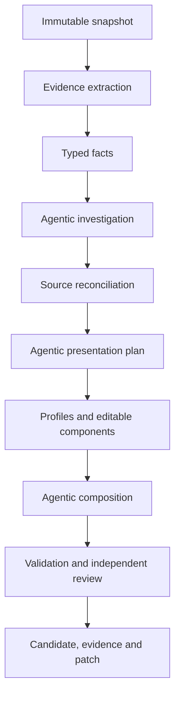

# Repository Presenter Research and Design Guidelines

Status: durable research record and implementation guidance  
Recorded through: 2026-09-02  
Legacy repository: `babar-raza/foss-readme-optimizer`  
Legacy source baseline used by the new project: `a8a163f7e9a7beeac1d2ef8b7c02e8e4bd5a7815`

## 1. Purpose and authority

This document preserves the useful investigation, reasoning, rejected approaches, measurements,
and design guidance developed before implementation began. It exists so a future agent can recover
the reasoning without relying on conversation history.

It is deliberately not another execution plan:

- [`EXECUTION_STATE_MACHINE.md`](EXECUTION_STATE_MACHINE.md) owns build order, gates, deliverables,
  and execution state.
- [`STATE_MACHINE.md`](STATE_MACHINE.md) owns production runtime states and transitions.
- This document explains why those contracts exist, records their empirical basis, and identifies
  conclusions that must be retained or revalidated.

Labels used below:

- **Observed** — directly inspected in source, state, history, workflows, or target repositories.
- **Measured** — produced from a bounded count or inventory at the recorded revision/date.
- **Inferred** — reasoned conclusion from observations; implementation must test it.
- **Decision** — selected direction for the new project.
- **Rejected** — approach considered and deliberately not selected.
- **Revalidate** — time-sensitive or incomplete observation that cannot remain permanently assumed.

## 2. Original problem

The legacy README optimizer accumulated extensive machinery but failed to provide a dependable,
current, contract-valid README transaction. The central problem was not absence of code, tests,
state, plans, or evidence. It was failure to convert those assets into the primary observable
result: one current repository-grounded README, independently accepted and immediately no-op
proven.

The new product must therefore optimize for completed repository outcomes rather than machinery
completion.

### 2.1 Intended product outcome recovered from `plans/idea.md`

**Observed:** the permanent intent is a central repository-presentation agent, not a link injector,
static template renderer, or one-time cleanup script.

The system must:

- establish a FOSS product as useful, credible, and professionally maintained before promotion;
- explain what it does, the problems it solves, supported capabilities/formats, installation,
  usage, limitations, and maintenance;
- place relevant Aspose and Enterprise Edition links only where they help the reader;
- continuously inventory and monitor authorized repositories;
- run autonomously on GitHub-hosted runners through schedules and explicit triggers;
- use repository-grounded facts and reconcile product-agent/current-README claims;
- employ agentic reasoning for interpretation, editorial planning, composition, review, and repair;
- keep deterministic control over safety, evidence, validation, state, effects, and idempotency;
- remain durable across ephemeral runners;
- update presentations after upstream changes without routine human operation; and
- eventually manage other repository presentation surfaces through the same core.

README health is foundational and cannot be displaced by social preview, metadata, research,
governance, or future-surface infrastructure.

## 3. Legacy-system investigation

### 3.1 Repository scale

**Measured during the 2026-09-01 audit:** approximately:

| Measure | Result |
|---|---:|
| Legacy repository commits since 2026-07-17 | 1,423 |
| First-party production Python | 171,345 lines |
| Vendored Aspose.org Python | 23,574 lines |
| Tests | 156,031 lines |
| `facts/` | 36,455 lines |
| `readme/` | 30,920 lines |
| `supervisor/` | 26,376 lines |
| `specialists/` | 20,682 lines |
| `presentation/` | 13,867 lines |
| `state/` | 6,627 lines |
| `capabilities/` | 6,485 lines |
| Foundation-oriented packages | approximately 18,690 lines |

These counts describe scale, not value. Large areas contain valuable implementation mixed with
historical lanes, product-specific fixes, proof scaffolding, compatibility paths, and orchestration
that should not be reproduced.

### 3.2 Live delivery state found during the audit

**Observed at legacy state reference `827881b...` on 2026-09-01:**

- registry/accountability denominator: 34;
- `facts_ready`: 1;
- `candidate_generated`: 0;
- no-op proven: 0;
- active task: null;
- durable transitions: 1,209;
- attempts: 247;
- ineffective attempts: 115;
- closed tasks: 81, including closures later shown not to establish the promised result.

The first candidate-focused task, PF02, had 159 transitions and 21 staleness regressions. PF04 had
to reopen because its proven-transaction runner had no production importer. This is strong evidence
that transition volume and task closure were decoupled from user-visible delivery.

### 3.3 Stale candidate evidence

**Observed:** an older finalized evidence area contained ten Python candidates from 2026-08-11/12,
but those artifacts were stale relative to current source and current control contracts.

Approximately 619 control-repository commits followed the last promotion without a corresponding
change to the canonical finalized candidate set. One old 3D/Python candidate was approximately 793
README lines and included weak generated API prose.

**Guideline:** candidate existence, historical approval, generated evidence, or task closure never
counts as current acceptance. Source, facts, candidate, validation, independent review, provider
calls, and no-op proof must form one current transaction.

### 3.4 Two generations of legacy product

**Observed:** the legacy repository contains:

1. A narrow deterministic `generate/run` path that detects four promotional gaps and writes a
   bounded owned span.
2. A much broader `supervise/verified_repository_presentation` path intended to perform agentic,
   repository-verified presentation work.

The narrow path remains useful only as historical behavior or a migration reader. It is not the
new product's foundation. The broader path contains significant reusable intelligence, but its
supervisor/mission/proof architecture became too elaborate to carry forward safely.

### 3.5 What was structurally sound

The following ideas were valuable and must not be lost:

- immutable source revision binding;
- exact preservation of original README bytes;
- hard repository allow-list;
- push-neutered read-only clones;
- separate read and write credentials;
- per-job custom-LLM routing and typed outputs;
- provider-call attribution and zero-call accounting;
- prompt registry and prompt hashes;
- ecosystem-aware public consumer-surface extraction;
- claim accountability and source-content dispositions;
- deterministic validation and independent review;
- component-scoped dependency hashes and invalidation;
- repository-scoped durable state and CAS;
- trigger deduplication, leases, recovery, effect reconciliation, and health reporting;
- no-op as a complete-transaction property;
- independent processability classification; and
- portfolio accounting that retains non-processable entries.

### 3.6 What caused failure or unnecessary drag

**Inferred from code/state/history:**

- the mission/task apparatus became a product of its own;
- multiple trusted/verified/POC/compatibility paths created ambiguous authority;
- proof machinery was built before one simple current transaction worked;
- state transitions could grow without narrowing the README defect;
- historical artifacts could look like progress despite stale dependencies;
- numerous specialist, capability, promotion, cohort, and lifecycle abstractions increased wiring
  risk;
- product-specific fact machinery accumulated without a clean plugin boundary;
- infrastructure and acceptance contracts expanded faster than visible output;
- runtime and project-development governance became entangled; and
- repeated retries could preserve the same causal owner instead of changing mechanism.

## 4. Target-repository research

### 4.1 Corpus scope

**Observed:** all 34 repositories listed in the legacy product registry were inspected at their
then-current default branches on 2026-09-01. They span 13 families and seven ecosystems.

| Family | Platforms | Presentation observation |
|---|---|---|
| 3D | Java, .NET, Python, TypeScript | Shared semantic portfolio structure. |
| Barcode | Python | Standard structure. |
| Cells | C++, Go, Java, .NET, Python, Rust, TypeScript | Standard structure. |
| Email | C++, .NET, Python | Standard structure. |
| Font | Python | Purposefully product-specific. |
| HTML | Python | Standard structure. |
| Note | Python | Standard structure. |
| Page | Python | Standard structure with visual-output content. |
| PDF | C++, Go, Java, .NET, Python, TypeScript | Five standard; TypeScript is a detailed product manual. |
| PSD | .NET, Python | README-only placeholders. |
| Slides | C++, Java, .NET, Python | Shared Slides-family presentation. |
| TeX | Python | Compact, output-oriented presentation. |
| Words | .NET, Python | Standard structure. |

Classification at the time of inspection:

- 25 repositories used substantially the same semantic README contract;
- seven had legitimate bespoke family/product compositions; and
- two PSD repositories lacked implementation evidence.

This classification must be frozen with exact revisions during the reuse/corpus gate and refreshed
before portfolio proof.

### 4.2 Standard does not mean identical

The 25 standard-shell repositories share a reader journey, not a universal prose body. Common
semantic identities are:

1. Identity and badges
2. Navigation
3. At a Glance
4. Key Capabilities
5. Installation
6. Dependencies
7. Quick Start
8. Additional Examples
9. API Reference
10. Documentation and Resources
11. Scope and Limitations
12. Development and Testing
13. License

Each repository must still supply its own facts, audience, emphasis, workflows, examples, API hubs,
limitations, development instructions, and coherent prose.

### 4.3 Legitimate variations

- **Font/Python:** variable-font-first workflows, generated outputs, CLI behavior, MCP server and
  review artifacts are central to the product story.
- **PDF/TypeScript:** extensive capabilities and examples justify a manual-like composition.
- **Slides family:** supported/unsupported behavior and edition choice are more useful than a
  generic API inventory.
- **Page/Python:** visual output evidence materially improves comprehension.
- **TeX/Python:** a compact output-oriented journey is more appropriate.
- **PSD/.NET and PSD/Python:** no implementation evidence means no README authoring.

Profiles must make these compositions expressible, but the planning agent must select and justify
the result from current evidence.

### 4.4 Live README refreshes and lineage gap

**Observed:** many target READMEs were refreshed during August 2026, including standard-shell
changes across 3D, Cells, Email, HTML, Note, Page, PDF, and Words. Other product repositories were
updated through independent release or product workflows.

This explains the apparent contradiction: useful live READMEs exist while the legacy optimizer's
current canonical state has no valid candidate. The live files are valuable source material and a
development corpus, but must be requalified because the legacy system cannot trace them to a
current complete transaction.

## 5. Factual authority and content guidance

### 5.1 Evidence hierarchy

The exact immutable repository snapshot is primary authority. Relevant evidence includes:

- Git identity, default branch, tags, releases, and history;
- manifests and lock files;
- public consumer surface, exports, namespaces, modules, and declarations;
- implementation source;
- tests and examples;
- build/CI configuration;
- license and community files;
- current README and repository assets; and
- verified package registry observations.

Product agents, Aspose.org pages, package pages, external documentation, SEO vocabulary, and
previous candidates are leads, oracles, and presentation evidence. They cannot override
contradictory repository/package evidence or solely support a public factual claim.

### 5.2 Field-to-evidence mapping

| README material | Expected evidence |
|---|---|
| Identity and repository links | Git metadata, registry and repository configuration. |
| Package/install command | Ecosystem manifests plus verified public consumer/package surface. |
| Dependencies/runtime | Manifests, lock files, native loading, build configuration and CI. |
| Quick Start | Tested example/test or independently verified public-consumer example. |
| Capabilities | Public symbols corroborated by examples, tests, formats and implementation. |
| API Reference | Parsed public/exported surface, grouped for reader utility. |
| Build/test instructions | Actual build files and CI. |
| Limitations | Explicit implementation boundaries, omissions and unsupported paths. |
| License | Repository license evidence; absence remains absence. |
| Images/links | Existing assets plus destination/context validation. |
| Positioning and journey | Agentic interpretation of accepted evidence. |

### 5.3 Preservation

Maintainer/product-agent README material is neither disposable nor automatically true. Every
meaningful unit must receive exactly one outcome: preserve, rewrite, move, correct, supersede,
omit with evidence, defer as unresolved, or classify as non-content.

The approved presentation contract owns tone, headings, organization, and formatting. Source prose
structure is not itself protected, but validated information and maintainer intent are.

## 6. Deterministic and agentic responsibilities

### 6.1 Agentic work

Agents must perform genuine judgment for:

- understanding the product and audience;
- identifying important workflows and evidence gaps;
- reconciling conflicting or stale claims;
- determining the visitor journey and useful section depth;
- selecting the best examples and API hubs;
- composing coherent repository-specific prose;
- independently reviewing factual and visitor quality; and
- choosing targeted causal repairs.

A candidate produced solely by phrase matching, rules, or template population fails the product
intent even if deterministic checks pass.

### 6.2 Deterministic work

Code owns:

- registry admission and processability;
- immutable snapshots and hashes;
- evidence extraction and provenance;
- state transitions, leases and recovery;
- prompt/model/component dependency identities;
- commands, code blocks, verified links, badges and diagram topology;
- claim and source-unit accountability;
- Markdown, structure, link, example and safety validation;
- caching and no-op decisions;
- credential isolation and authorization;
- GitHub effect execution and reconciliation; and
- terminal artifact production.

### 6.3 Correct composition flow



Profiles and templates constrain and enable presentation. They do not replace interpretation.

## 7. Template and modularity guidelines

### 7.1 Semantic components

Templates should be ordinary Markdown/Jinja files, with layout/order/applicability in YAML.
They may define presentation framing, stable headings, slots, and deterministic structure.

They must not hardcode:

- package names or versions;
- product capabilities or supported formats;
- install/build commands;
- public API claims;
- limitations;
- repository-specific links; or
- unsupported marketing statements.

Those values come from versioned typed facts and an accepted agentic plan. Missing or unresolved
required facts fail compilation.

### 7.2 Profiles

- Platform profiles contain ecosystem knowledge and validation requirements.
- Family profiles contain accepted recurring terminology, workflows, and composition hints.
- Repository profiles are reviewed declarative overlays used only for true residual exceptions.
- No profile may bypass evidence, force a fact, or predetermine the entire document.

### 7.2.1 Importing legacy profiles and catalogs (2026-09-02)

**Observed in the legacy source:** `config/policies/*.yml` (34 files) hardcode a per-product
`products_org_link`, `products_com_link`, label, and prohibited-term list each. `data/
aspose_org_links.json` is a generated catalog of 7,755 link records whose own provenance block
records only 44 as live-verified, at a probe dated a month before freeze; `data/aspose_com_links.json`
is the same shape. `data/families.json` (17 records) and `data/platform_priorities.json` (a seven-item
execution order) are different in kind: small, global, structural, and low-risk to pull in full.

Rule: a policy file or a catalog record is pulled only when the repository or family currently being
composed needs it, never as the full 34-file or 7,755-record set ahead of G4 — the same pull-based
discipline `EXECUTION_STATE_MACHINE.md` §7 requires of code, applied to data. The pulling work item
re-verifies what it pulls before writing the file record: the link target resolves now (the check
`README_CONTRACT.md` §5 already requires of every rendered link), and the label and terminology still
match current product reality. A stale or unverifiable entry is corrected or dropped, never carried
forward on the legacy catalog's word. Record what was checked, changed, and dropped in the file
record's `note`. A pulled profile or catalog value is a lead, in the same evidentiary tier as an
Aspose.org page (§5.1): it can corroborate `presentation_planning`'s link and ceiling choices, never
override contradictory repository evidence or stand alone as a public factual claim.

### 7.3 Component boundary

README is one component of Repository Presenter. Shared `core` services own snapshot, evidence,
artifacts, state, LLM access, validation primitives, authorization, and GitHub integration.

Future components may manage:

- repository description;
- homepage and topics;
- community/contribution/security files;
- release and package links;
- visual assets and social preview; and
- drift protection across those surfaces.

They consume public core contracts and must not depend on README-private implementation.

### 7.4 Extraction and platform independence (2026-09-02)

Knowledge extraction (`extractors/`, facts stage S2) and knowledge processing (`investigation/`,
`reconciliation/`, `composition/`, S3 onward) are independent: `facts.json` is the only artifact that
crosses the boundary; no processing module imports an extractor module directly. Within extraction,
each platform's module (`extractors/platforms/<ecosystem>.py`) depends only on `core/` and its own
file, sharing no import with any other ecosystem's module; only the registry
(`extractors/platforms/registry.py`) references more than one ecosystem, and only to register them.

**The registry is open-ended, not fixed at seven.** `ecosystem` is a pattern-constrained string in
the registry schema and model (`^[a-z][a-z0-9_]*$`), never a closed enum, and the extractor registry
holds plugins in a plain `{ecosystem: plugin}` dict that fails closed with `ConfigError` on anything
unregistered — verified in the built code, not just planned. G3 qualifies seven representatives
because that is what the frozen 34-repository portfolio needs; it proves the pattern generalizes, and
is a milestone, not a ceiling. An eighth ecosystem, or a fiftieth, enters exactly the same way at any
later gate: one plugin file implementing the same protocol, one test, one entry in the registry's
dict — nothing else changes. A repository in an ecosystem with no registered plugin stays
non-processable, correctly, until that plugin exists; that is the fail-closed default working, never
a defect to route around.

**Verified in the legacy source:** `ecosystems/registry.py` is already the sole file importing more
than one ecosystem module; `ecosystems/python.py` and `ecosystems/rust.py` import no sibling ecosystem
module. This one boundary was sound and this repository keeps it. Adding, fixing, or extending one
ecosystem's extractor must change only that file, its test, and its registration line — never another
ecosystem's file, the registry's dispatch logic, or any downstream stage. `REPOSITORY_LAYOUT.md` §2.1
states this as a placement and test requirement.

## 8. Autonomous GitHub operation

### 8.1 Trigger and monitoring model

Recommended initial cadence:

- frequent cheap remote-revision/open-proposal probe;
- daily changed/due repository processing;
- weekly complete discovery and all-surface freshness audit;
- `repository_dispatch` for product release/upstream-change notification;
- manual/workflow-call entry points for bounded diagnosis and integration; and
- recovery before new scheduling.

Scheduled polling remains the dependable recovery mechanism even if product workflows later emit
events.

### 8.2 Drift is broader than Git SHA

Track independently:

- source/default-branch revision and relevant file fingerprints;
- exact README blob and material-unit inventory;
- package/release observations with TTL;
- repository description/homepage/topics with TTL;
- presentation assets and observable GitHub state;
- prompts, models, schemas, extractors, validators, profiles and template components; and
- open presenter proposal state.

A changed repository should invalidate only dependent work. A test-only commit may require no
README update; a package identity change reopens installation; a new exported API reopens public
surface/capability/example analysis; an upstream README edit reopens reconciliation.

### 8.3 GitHub workflow boundary

Use three focused workflows:

1. `monitor.yml` — registry reconciliation, recovery, cheap probes, due-work matrix, health.
2. `present.yml` — isolated read-only repository transaction using the custom LLM.
3. `propose.yml` — separately authorized, repository-scoped PR creation/update.

GitHub Actions cache accelerates execution but is never authoritative durable state. Use
repository-scoped CAS state in a dedicated control-repository namespace plus immutable
content-addressed artifacts.

### 8.4 Publication

Initial autonomous update mode means open or update one presenter-owned PR. It does not mean direct
default-branch pushes.

Before a write:

- mint a fresh repository-scoped GitHub App token in the effect job;
- bind target repository, candidate hash, source revision, branch, PR intent, policy, and expiry;
- refetch source and cancel if stale;
- reconcile an uncertain prior effect before retrying; and
- preserve/reconcile overlapping upstream README edits.

Auto-merge can later be enabled by explicit repository policy after production proof.

## 9. Custom LLM guidance

### 9.1 Reusable legacy capability

The legacy custom-LLM implementation already supports:

- OpenAI-compatible `/chat/completions`;
- configurable base URL and API key;
- per-job model routing;
- deterministic sampling defaults;
- bounded transport retry;
- typed response validation;
- request/response hashes;
- attempt, latency and token accounting;
- prompt registry and prompt hashes;
- fixture clients; and
- cache-reuse/zero-call accounting.

This is a high-value reuse area and should be simplified, not rewritten casually.

### 9.2 Initial job set

Use a small governed set:

- `repository_investigation`;
- `source_reconciliation`;
- `presentation_planning`;
- `section_authoring`;
- `independent_review`; and
- `targeted_repair`.

The custom model may have a modest reliable context window. Supply bounded evidence dossiers and
small fact packets, but retain one final whole-document coherence step. An LLM cannot write exact
commands, APIs, links, badges, example code, or diagram topology without deterministic evidence.

### 9.3 Failure behavior

- Required route unavailable or deliberately disabled: block honestly.
- Malformed structured response: reject; do not loosen schema silently.
- One normal semantic attempt plus one targeted correction for an equivalent fingerprint.
- Third equivalent attempt prohibited until evidence, prompt, model, component, stage, or mechanism
  changes.
- Every physical provider attempt remains attributable to repository, revision, job, prompt, model,
  outcome, latency, and usage.

## 10. Legacy-code reuse findings

### 10.1 Quantified expectation

At audit time, approximately 31–37% of first-party production code appeared to contain behavior
worth carrying into the new repository:

- approximately 11% near-intact foundations;
- approximately 20–26% surgical extraction/refactoring; and
- approximately 63–69% not suitable for production migration.

This was an audit estimate, not a license to bulk copy. The execution gate must produce a file-level
reuse manifest and measured final result.

### 10.2 Reuse substantially intact

- LLM transport, attempt accounting, call schema/ledger, prompt registry/hygiene;
- Git safety and push blocking;
- allow-list loader and selected discovery/intake primitives;
- immutable repository snapshot and inspection;
- ecosystem/public consumer-surface parsers;
- evidence redaction and atomic writing;
- contextual link validation;
- selected deterministic public-quality validators;
- read-only GitHub API and preflight; and
- authorization data contracts.

### 10.3 Extract and refactor

- `ProductFactsV2` concepts and general repository facts;
- ecosystem consumer/example verification;
- format, identity, protected-content and interpretive evidence logic;
- README assessment, source disposition, preservation and document assembly;
- agentic section authoring and whole-document composition;
- presentation component compiler and claim validation;
- independent separated review;
- repository-scoped Git CAS, triggers, freshness, recovery and health; and
- product-specific fact logic converted into registered plugins.

### 10.4 Reference or fixture only

- bulk vendored Aspose.org tree;
- imported knowledge snapshots;
- previously generated candidates;
- old benchmark reports; and
- old acceptance/proof artifacts.

Useful mechanisms may be adapted natively with provenance and regression tests. Production must
not depend on a sibling checkout or an unbounded vendored system.

### 10.5 Retire

- legacy four-gap renderer and marker writer, except a migration reader if required;
- trusted transformation lane and trusted cohort machinery;
- Level-8 mission graph and mission command system;
- PF04/proven-transaction proof machinery;
- generic planner-driven capability/task graph;
- compatibility commands and duplicated lifecycle schemas;
- overlapping evidence manifest versions; and
- thirteen overlapping workflows (§16.3), replaced by three.

## 11. Tangible output and success contracts

Every README-component invocation returns exactly one public outcome:

| Outcome | Meaning |
|---|---|
| `candidate` | README, exact patch, facts/dispositions, evidence, validation, review and call summary exist. |
| `no_change` | Byte-identical accepted result with checksum-valid evidence and zero provider calls. |
| `insufficient_evidence` | No candidate; typed missing evidence and resume predicate. |
| `failed` | Bounded redacted diagnostic, causal state and retry/block classification. |

Internal runtime states may be richer, but no repository is left with an ambiguous external result.

The initial project is not done because it has code, tests, workflows, candidate files, task
closures, or evidence. It is done only when the GitHub-hosted system monitors the admitted
portfolio, produces independently accepted current candidates for all processable repositories,
proves zero-call no-op, responds to drift, and safely opens/updates authorized PRs.

## 12. Rejected approaches and cautionary lessons

### 12.1 Repair the legacy architecture wholesale

**Rejected:** it would preserve the ambiguity and complexity that prevented tangible delivery.
Reusable implementation should migrate behind new narrow contracts.

### 12.2 Build a deterministic README compiler

**Rejected:** typed facts plus platform/family templates alone cannot decide product meaning,
audience, emphasis, example quality, useful API depth, limitations, inherited-content correction,
or coherent prose.

### 12.3 Use one editable Markdown template

**Rejected:** the corpus demonstrates legitimate product/family compositions. Use a semantic shell,
editable components, profiles as evidence-aware hints, and agentic planning.

### 12.4 Give equal writing authority to multiple agents

**Rejected:** product/evidence agents provide technical truth and critique, while one central
composer owns final document coherence. An independent non-authoring reviewer owns acceptance
judgment.

### 12.5 Treat Aspose.org as permanent truth or runtime dependency

**Rejected:** it is an evolving development oracle and may contain defects. Repository/package
evidence remains authoritative.

### 12.6 Treat Git SHA as complete freshness

**Rejected:** package releases, metadata, proposals, presentation policy, prompts and external
surfaces can change independently.

### 12.7 Treat Actions cache/artifacts as durable mutable state

**Rejected:** caches can evict and artifacts expire. They are acceleration and review surfaces.

### 12.8 Build broad infrastructure before one transaction

**Rejected:** the first vertical slice must complete investigation through no-op and then a
disposable PR. Infrastructure is admitted only when the current/next proof consumes it.

## 13. Implementation heuristics

1. Lead every development increment with the observable repository outcome it unlocks.
2. Maintain one build cursor and one runtime state machine; do not create parallel authorities.
3. Port behavior with its tests and provenance, not files by reputation.
4. Keep orchestration small; stages call public seams and contain no domain implementation.
5. Add ecosystems and product families through registries/plugins, never expanding a central
   `if/elif` chain.
6. Preserve exact target revisions in corpus fixtures and refresh only at declared boundaries.
7. Validate model output before state advancement.
8. Route defects to the earliest causal stage; validation should not paper over extraction or
   planning errors.
9. Retain unaffected accepted work across repair and invalidation.
10. Run the exact production workflow in production-like conditions before claiming it works.
11. Keep write credentials physically absent from analysis jobs.
12. Continue safe unrelated repositories when one is retryable, blocked, or internally failed.
13. Expose honest portfolio health and a concrete resume predicate.
14. Measure provider cost, repair rate, false-positive drift, proposal acceptance, and update delay.
15. Do not let evidence production become a substitute for candidate delivery.

## 14. Items requiring revalidation

The implementation agent must not treat these dated findings as permanent:

- current default-branch revisions and README bytes of all 34 target repositories;
- registry denominator and processability classification;
- 25/7/2 composition grouping;
- package/release/public-consumer information;
- custom gateway models, context behavior, tool/structured-output reliability and limits;
- GitHub App installation coverage and permissions;
- live source counts and legacy module dependency closures;
- link targets, banners and repository assets;
- exact GitHub Actions behavior and supported action versions;
- whether a social-preview write API remains unavailable;
- the disposition of the legacy working-tree changes that were uncommitted at freeze (§16.2); and
- the legacy test-suite baseline at the frozen revision (§16.9), which must be re-measured if the
  frozen revision moves.

Revalidation updates evidence and, when necessary, the relevant authoritative contract. It does
not silently rewrite history.

## 15. Research reading order

A new implementation agent should read:

1. this document for context and design reasoning;
2. [`EXECUTION_STATE_MACHINE.md`](EXECUTION_STATE_MACHINE.md) for the current build gate;
3. [`project/state.yaml`](../project/state.yaml) for the live cursor;
4. [`STATE_MACHINE.md`](STATE_MACHINE.md) for the behavior being implemented;
5. [`plans/idea.md`](../plans/idea.md) for the product outcome and standing constraints, through
   the authority note at its top;
6. the reuse manifest's file records as pulls create them, and the corpus inventory once the G3
   census produces it; and
7. only the legacy modules explicitly named by the active reuse record.

This order prevents both context-free implementation and a return to reading the entire legacy
project as an undifferentiated authority.

## 16. Pre-migration verification (2026-09-02)

These measurements were taken before Gate 0 began, directly against the frozen legacy revision and
the legacy working tree, to test the claims in §3 and §10 and the seed dispositions in the reuse
manifest. Labels follow §1.

### 16.1 Frozen revision

**Observed:** `a8a163f7e9a7beeac1d2ef8b7c02e8e4bd5a7815` exists in the local legacy clone and was
its `main` HEAD: author Babar Raza, authored 2026-09-01 18:39 +05:00, subject "fix(readme): drop the
ungrounded Project Structure summary phrase (PWD-060-FOLLOWUP5)". The local clone is shallow (two
shallow roots), so the 1,423 commits in §3.1 are the visible history, not necessarily the complete
history; provenance reasoning beyond the shallow boundary needs the remote.

### 16.2 Working tree at freeze

**Observed:** the legacy working tree was dirty when the revision was frozen: 15 modified tracked
files (496 insertions, 77 deletions) and 9 untracked files. Modified production files:
`facts/portfolio_facts_readiness.py`, `presentation/verified_template_api_reference.py`,
`presentation/verified_template_example_presentation.py`, `presentation/verified_template_sections.py`,
`specialists/review_standard_mermaid_premises.py`, `supervisor/mission_execution_guard.py`, plus
seven of their tests. Modified documents: `plans/idea.md` (adds the "Upstream Defect Reporting"
section) and `plans/investigations/control/mission-resume-capsule.md`. Untracked: a golden-corpus
reconstruction investigation with its roster, taskcards, evidence directory, and five tools.

**Decision:** this repository's `plans/idea.md` deliberately carries the uncommitted worktree text
(so it includes Upstream Defect Reporting) and says so in its authority note. The code changes are
not part of the frozen revision. The default exclusion was applied on 2026-09-02 as owner item
OWNER-03 in `project/state.yaml`; the owner may override it by committing the changes upstream and
naming a new frozen revision. The manifest records each exclusion under
`source.working_tree_at_freeze.exclusions`.

### 16.3 Scale measurements

**Measured** from a `git archive` of the frozen revision:

| Measure | Result | Comparison with §3.1 |
|---|---:|---|
| First-party production Python (excluding vendored) | 171,345 lines | exact match |
| Vendored Aspose.org Python | 23,574 lines | exact match |
| Tests | 156,031 lines | exact match |
| Test files | 457 unit, 12 integration, 9 security, 5 fixtures | new |
| Unit tests collected | 5,669 (4 `live` tests deselected) | new |
| Workflow files | 13 | earlier text said eleven; corrected |
| Scheduled workflows | production daily 05:17 UTC and weekly Sunday 04:43 UTC; registry update weekly Monday 07:00 UTC; log-coverage audit daily 06:00 UTC | new |
| Registry entries | 34, all `active: true`; mode `full` 2, `dry_run` 29, `disabled` 3 | matches §4.1 |
| Registry by ecosystem | python 13, net 7, java 4, cpp 4, typescript 3, go 2, rust 1; 13 families | matches §4.1 |
| Registry at `df864ffd` (2026-08-20, the baseline commit named in `plans/idea.md`) | 33 entries | the TypeScript entry was admitted 2026-08-26 |
| Legacy `LICENSE` file | absent; README says "all rights reserved by default" | provenance recorded per ported file |

The two PSD repositories are `disabled` in the registry, consistent with their non-processable
classification.

### 16.4 Real production entry point

**Observed:** `.github/workflows/readme-agent-production.yml` runs `registry-preflight` (App token
scoped to one control repository), `recovery-sweep` (control-repository `contents: write` for
`refs/readme-agent-state`), then `readme-agent supervise --repo <repo> --resume-trigger-key <key>
--no-registry-heal --execution-profile github_observe` per matrix member, a serialized
`staging_effect` job with a separately minted target-scoped token, and `health-report`.

**Measured:** the static import closure of the `supervise` command is 760 modules and 154,167 of
194,919 first-party lines (79%), including 83 `supervisor`, 75 `specialists`, 43 `capabilities`,
22 retired-disposition, and 2 vendored modules. The legacy narrow `orchestrator` path closes at
122 modules and 16,385 lines.

**Inferred:** the production path is effectively the whole codebase. Reuse by entry point is
impossible; reuse must be by module with each import closure cut deliberately. This confirms §3.6.

### 16.5 Reuse-manifest seed coverage

**Measured:** the seed globs in the pre-audit manifest match 176 files and 56,767 lines, 29.1% of
first-party lines (port 2,558; extract 17,088; plugin 6,182; fixture 23,574; retire 7,365).
138,152 lines have no seed disposition: `facts` 30,995; `readme` 29,298; `specialists` 20,221;
`supervisor` 19,601; `presentation` 9,240; `capabilities` 6,485; `state` 5,239; root modules 4,782;
`verification` 4,769; `llm` 1,881; `validation` 1,602; `golden_set` 1,341; `registry` 1,176;
`profile` 331; `authorization` 295; `evidence` 288; `github_api` 279; `preflight` 261; `license`
49; `effects` 19.

**Inferred:** the 31–37% estimate in §10.1 cannot be confirmed from the seeds. `github_api`,
`preflight`, and `authorization`, which §10.2 names as reusable, had no manifest entry; they are now
seeded. Only the pull-based ledger and the G3 census can settle the fraction, and a census-first
audit of 138,152 unseeded lines would itself become the machinery project §3.6 warns against.

### 16.6 Import-closure findings

**Measured** by static AST analysis of the 156 seed-retained modules: 31 reach a `RETIRE` module and
13 reach `supervisor`, `capabilities`, or `specialists`. The chains, recorded in the manifest as
`CPL-01` to `CPL-08`:

- `CPL-01` — every `llm/*` module reaches the retired `readme/markers.py` through
  `prompt_registry` → `readme/facts.py::sha256_text` → `validation/registry.py` →
  `validation/rules/change_boundary.py` → `markers`. `call_transport` alone closes at 44 modules
  and 3,962 lines because of this; after the cut it should be a handful.
- `CPL-02` — `evidence/writer.py`, `state/git_backend.py`, `state/cas.py`, `state/recovery.py`,
  `state/health.py`, `state/freshness_contract.py`, and `registry/revision_store.py` reach
  `capabilities/schema.py` through `state/proposal_schema.py` (`OrgRepoRef`); that module has 62
  direct importers.
- `CPL-03` — `specialists/separated_readme_review.py` closes at 592 modules and 115,816 lines,
  including `readme/candidate_pipeline.py` via `capabilities.dispatcher` → `capabilities.registry`
  → `capabilities.check_install_path` → `orchestrator`. The contract is reusable; the module is not.
- `CPL-04` — the production `supervise` command imports `_durable_state_backend` from
  `commands_compatibility.py`, a retire-disposition module.
- `CPL-05` — `paths.runs_dir()` defaults to `Path.cwd() / "runs"`; 69 modules import `paths`.
- `CPL-06` — 15 production modules carry 30 references to `plans/investigations/...` paths; most
  are docstrings or comments, but `supervisor/proven_transaction_runner/pf04_evidence.py` loads the
  Level-8 mission graph from that tree and the 30-point rubric modules cite `RUBRIC_30.md` there.
  Each reference is classified as fixture, oracle, or dead when its module is pulled.
- `CPL-07` — `env.py` resolves `GH_TOKEN` then `GITHUB_PAT` unless
  `README_AGENT_PRODUCTION_AUTH=github_app`, in which case ambient tokens are ignored and a missing
  App token fails closed. The behavior `plans/idea.md` requires exists and is the only production
  mode to port.
- `CPL-08` — 11 `specialists` modules import `langgraph` or `langchain-core`;
  `separated_readme_review.py` does not import them directly.

Fan-in for orientation: `errors` 123 direct importers, `paths` 69, `capabilities.schema` 62, `env`
45, `readme.markers` 17. "Port nearly intact" therefore describes module bodies, never their
closures.

### 16.7 Non-Python contract assets

**Observed:** much of the presentation contract in `plans/idea.md` lives in assets the manifest's
Python globs did not cover:

- 17 prompt manifests under `prompts/` with schema fields `prompt_id`, `category`, `version`,
  `model_route`, `owner`, `runtime_consumer`, `output_contract`, `invalidation_scope`,
  `dependent_artifacts`, and `system`/`user_template` text;
- `templates/readme/repository-presentation-v1.json` (template version 1.21.0,
  `reference_status: requires_requalification`) with invariants for badge rows, minimum badges,
  Mermaid visual grammar, capability layout and column threshold, topology, and minimum/target
  inputs, capabilities, and outputs;
- `templates/readme/section-registry-v2.json` with 16 sections including Third-Party Notices,
  Security, Contributing, and License, plus nine unmapped badge and banner checks;
- 34 per-repository policy files under `config/policies/` (link targets, labels, UTM, talking
  points, prohibited terms, allowed domains);
- `data/products.json`, `aspose_org_links.json`, `aspose_com_links.json`, `families.json`,
  `platform_priorities.json`, and the frozen `aspose_benchmark_quality_profile.json`
  (`BenchmarkQualityProfileV1`, development-only, 31 audited, 26 clean);
- `docs/presentation-standard.md` (ten dimensions, first-screen rules, search-intent guidance);
- `golden-sample/`.

**Decision:** these now have seed dispositions in `EXECUTION_STATE_MACHINE.md` §7.2 and the
manifest's `expected_asset_dispositions`.

Legacy prompt to new job mapping (**Inferred**, to verify while pulling prompts in G1 and G2):

| New job | Legacy prompt(s) | Disposition |
|---|---|---|
| `repository_investigation` | `draft_product_truth` (partial) | Extract |
| `source_reconciliation` | `claim_disposition_check` plus `verified_source_*` code | Extract |
| `presentation_planning` | `plan_readme_composition` | Extract |
| `section_authoring` | `section_cluster_authoring` | Extract |
| `independent_review` | `independent_readme_review`, `blind_readme_quality_review`, `factual_readme_plan_review` | Extract, consolidate |
| `targeted_repair` | `repair_capability_selection` (partial) | Extract |
| none | `relationship_explained`, `trusted_readme_section_transform`, `trusted_readme_fidelity_review`, `supervisor_turn`, `specialist_selection_turn`, `merged_readme_review` | Retire |
| evaluate later | `presentation_standard_compliance`, `prose_quality_check`, `visual_asset_accuracy` | Reference until a gate consumes them |

### 16.8 Windows path-length hazard

**Observed:** `LongPathsEnabled` is 0 on the development machine. The longest tracked legacy path
is 220 characters and 86 exceed 150. Under a 161-character root, 1,348 tracked files are unreachable
to Python (`FileNotFoundError` on an existing file); under the developer worktree root
(63 characters) 25 files exceed the 260-character limit; under a drive-letter mapping none do.

**Guideline:** every clean-checkout measurement of the legacy repository on Windows uses a short
root (for example `subst W: <clone>`), and this repository keeps evidence and fixture paths short
enough that no tracked path exceeds roughly 200 characters.

### 16.9 Legacy test-suite baseline at the frozen revision

Two initial runs from a deep scratchpad path were invalidated by §16.8: the archive run reported
347 failures and 3,241 passes before its failure cap, the long-path clone run 487 failures, 5,173
passes, 1 skip, and 13 errors, and every sampled failure was a `FileNotFoundError` on an existing
file. The valid measurements are recorded below.

**Measured** with the legacy virtual environment (Python 3.13.2, pytest 9.1.1, `-n 8`, `-m "not
live"`), the full non-live `tests/` inventory:

| Run | Root | Tests | Passed | Failed | Errors | Skipped |
|---|---|---:|---:|---:|---:|---:|
| Clean frozen clone at `a8a163f7`, drive-letter mapped | 3 chars (real path 161) | 5,674 | 5,399 | 261 | 13 | 1 |
| Developer worktree, dirty (adds 9 tests) | 63 chars | 5,683 | 5,669 | 13 | 0 | 1 |

The two runs share exactly 13 failing tests; every failure in the developer worktree also fails in
the clean clone, and the clean clone's other 261 failures are environmental: 267 of its 269 failing
paths exceed 260 characters, because `Path.resolve()` expands the mapped drive back to the real
161-character root and pytest's temporary directories under `AppData\Local\Temp\pytest-of-*` reach
281 to 328 characters on their own. The `test_prompt_hygiene` `shutil.Error` failures and the
`test_readme_proposal_bundle_verifier` errors are the same defect class.

Failures reproducible in both environments and attributable to the frozen revision itself:

| Test | Class | Assessment |
|---|---|---|
| `test_verified_template_capabilities_seo_keyword_lineage` (3 tests) | `AssertionError` on rendered Key Capabilities titles | **Confirmed** pre-existing failure at `a8a163f7`; directly relevant to the search-intent lineage obligation in `plans/idea.md` |
| `test_portfolio_stage_transactions::test_candidate_transaction_observation_tampering_still_breaks_seal` | `DID NOT RAISE ValueError` | **Confirmed** pre-existing failure; a seal-integrity negative control does not fire |
| `test_portfolio_stage_transactions::test_candidate_transaction_observations_do_not_change_semantic_receipt` | `FileNotFoundError` on a 179-character path | **Probable** genuine failure (sibling of the seal test; path is under the limit) |
| `test_supervisor_loop::TestBasicLoop::test_local_poc_records_snapshot_and_profile_before_later_stages` | `FileNotFoundError` on a 185-character directory | **Uncertain**: path is under the limit, but a deeper child may not be |
| 7 tests in `test_portfolio_worker_integration`, `test_trusted_readme_extraction`, `test_trusted_transform_review` | `FileNotFoundError` on 281–282-character temporary paths | Environmental |

**Inferred:** the legacy suite at the frozen revision is close to green but not green: four
confirmed and up to two probable failures exist independent of environment, and two of the confirmed
failures sit inside behavior the reuse manifest expects to extract (SEO lineage in
`presentation/`, stage sealing in `supervisor/portfolio_stage_transactions`). The definitive
baseline is the legacy CI on a Linux runner, which has no path limit; it is recorded, or a local run
with `LongPathsEnabled` is, before the first pull in G1 ports any test.

### 16.10 Governance corrections made in this repository on 2026-09-02

- `plans/IDEA.md` renamed to `plans/idea.md`, the path every reference and the product owner use;
  the case matters on Linux runners.
- `plans/idea.md` named retired legacy authorities as live. An authority note at its top maps them
  to this repository's documents; `AGENTS.md` lists the file as product authority; and
  `EXECUTION_STATE_MACHINE.md` §12 maps every obligation to a gate. Obligations that previously had
  no gate: the presentation-contract invariants, search-intent lineage, the benchmark quality
  profile, local `act` proof, the Java proposal cohort, upstream defect reporting, Level 7 and 8
  certification, and separated portfolio counts.
- `project/state.yaml` used `PENDING` and `BLOCKED_BY_GATE` and a nested shape that
  `EXECUTION_STATE_MACHINE.md` §5 did not allow or show; §5 now matches the file.
- `EXECUTION_STATE_MACHINE.md` said eleven legacy workflows; thirteen exist. Its record example
  pointed at `src/repository_presenter/llm/transport.py` while the manifest used
  `core/llm/transport.py`; both now use `core/`.
- The manifest now records the verified revision, the dirty working tree, the verified baseline,
  the coupling findings, seed dispositions for the packages and assets it had omitted, and two
  additional acceptance predicates.
- A `.gitignore`, a `.gitattributes`, and a descriptive `README.md` were added.

## 17. Re-evaluation against the recovery direction (2026-09-02)

**Observed:** the recovery direction recorded in §2 and §12.8, and in the conversation that produced
this repository, was: one repository, the smallest end-to-end path to a visible concise candidate,
only essential blocking gates, a candidate saved at a stable reviewable path, per-candidate
dependency manifests instead of global hashes, a frozen acceptance contract while qualifying seven
representatives, and progress counted as 1/34, 7/34, 34/34.

**Observed:** revision 1 of `EXECUTION_STATE_MACHINE.md` did not follow that direction. It placed
four infrastructure gates before any README: a foundation with decision records and an evidence
framework, a census-first file-level audit of 171,345 legacy lines, every schema and transition rule,
and the full durable kernel with leases, fencing, recovery, and a GitHub App boundary. The first
candidate appeared at its seventh gate. §16.5 and §16.6 show why the audit gate alone would have
consumed weeks: 138,152 lines had no seed disposition and the "port intact" modules were entangled
at import level.

**Decision:** revision 2 re-sequences the plan around the outcome. G0 is a two-day foundation; G1
produces the first valid candidate for Aspose.3D FOSS for Python at a stable path with eleven
blocking checks and a sealed bundle; G2 proves that candidate survives change through per-candidate
dependency manifests and freezes acceptance contract v1; G3 qualifies seven representatives and runs
the legacy census; G4 adds hosted monitoring and the durable runtime for 34/34; G5 proves the
proposal effect; G6 hardens and deploys; G7 operates and expands. Legacy reuse became pull-based:
a file enters only when a gate needs it, with its record, tests, and a cut closure, and everything
unpulled is retired at the G3 census.

**Decision:** five guardrails from the legacy failure analysis became binding principles: just-in-
time infrastructure; every work item ends with an end-to-end run and no module lacks a production
importer; candidates are invalidated only through consumed inputs and no global hash exists;
validators and reviewers re-check rather than invalidate, and reviewer findings must be repairable;
governance is budgeted at 200 lines for `AGENTS.md`, 500 for the build plan, and eight gates.

**Accepted risks:** pull-based reuse can under-reuse valuable legacy behavior that no gate happens
to need; the census at G3 exists to make that visible. A two-day foundation may leave configuration
and error handling thin until G1 needs them; that is intended. The eleven blocking checks may let a
weak candidate through at G1 that contract v1 later catches; G1 accepts that because a human reads
the candidate before G2 begins.

## 18. Preferred libraries over bespoke code (2026-09-02)

`plans/idea.md` states this twice: "Battle-tested, proven tools and libraries are preferred over
new custom infrastructure. Building a bespoke mechanism where an established one already solves the
problem requires a documented reason — naming the proven alternative considered and why it was not
used — not a silent default choice," and again under "Prefer Battle-Tested Solutions": existing
solutions are "actively researched and evaluated before custom functionality is developed." Before
this section, `AGENTS.md`, `EXECUTION_STATE_MACHINE.md` principle 16, and `project/loop-prompt.md`
each carried a one-line paraphrase — but every occurrence paired "established libraries" with
"proven retained code" or "proven legacy modules," which reads as permission to port a legacy
module unexamined rather than as the evaluate-and-document duty `plans/idea.md` actually states. A
ported legacy module is not exempt from this test merely for having run in production; §16.6's
import-closure findings already show ported modules need seam cuts on their own terms.

### 18.1 The concrete failure this prevents

The PWD-060 cascade named in the recovery discussion (a project-tree diagram misclassified as
emoji, exposing a crash on a language-less code fence, exposing missing provenance, exposing an
evidence mismatch, ending in a deleted phrase) is a hand-rolled-text-handling failure chain. Each
fix exposed the next defect because no step used a real, tested parser for the input class it was
classifying. A maintained CommonMark parser and a maintained Unicode/emoji classifier do not
misclassify a box-drawing tree diagram as emoji; a regex-based approximation can. This is the
concrete stake behind the principle, not an abstract preference.

### 18.2 What the legacy code already got right, and wrong

Reading the legacy modules the manifest seeds for G1 (`retry.py`, `errors.py`, `llm/call_transport.py`,
`llm/live_client.py`) on 2026-09-02:

- `retry.py` is a thin, typed `pydantic` model wrapping `tenacity.Retrying` with a per-operation-
  class policy table (attempts, backoff bounds, jitter). This already follows the principle — the
  legacy project's own dependency comment records replacing an earlier bespoke retry loop with
  Tenacity for exactly this reason. Porting the policy table is fine; the mechanism underneath it
  should keep depending directly on `tenacity`, declared as such, not reimplemented.
- `errors.py` is a plain exception hierarchy with no third-party import. No library replaces a
  project's own typed error taxonomy; this is correctly bespoke and not a candidate for this rule.
- `llm/call_transport.py`, `llm/live_client.py`, and every `llm/*_client.py` module build the
  OpenAI-compatible chat-completions protocol — request construction, response parsing, retries,
  fail-closed errors — directly on `requests`. `plans/idea.md` already specifies "a configurable
  OpenAI-compatible gateway"; the official `openai` Python SDK accepts a custom `base_url` and
  `api_key` and already implements request construction, typed responses, retries, and streaming
  against that exact protocol. The manifest's seed dispositions for these modules (`PORT_NEARLY_INTACT`
  for `call_transport.py`; `EXTRACT_AND_REFACTOR` for `live_client.py` and `*_client.py`) predate
  this review and do not yet reflect an evaluation of the SDK. Before either is pulled, G1-W03
  evaluates the `openai` SDK against the gateway's actual compatibility and records the outcome
  either way in the pull's manifest file record — reuse it if it fits, and if it does not (the
  gateway diverges from the protocol in a way the SDK cannot express), the file record names that
  divergence as the documented reason, not a default. The call ledger and provider-call attribution
  logic in `call_ledger.py` and `call_schema.py` are project-specific accounting, not something an
  HTTP client replaces, and stay ported as seeded.

### 18.3 Registry

One entry per cross-cutting concern this project will need. "First choice" is the option to reach
for; a work item that departs from it records why in its commit and, if the concern maps to a
manifest entry, in that entry's `note` field.

| Concern | First choice | Why | First needed |
|---|---|---|---|
| OpenAI-compatible LLM gateway client | `openai` SDK against a configurable `base_url` | Implements the protocol `plans/idea.md` already specifies; see §18.2 | G1-W03 |
| Bounded retry with backoff | `tenacity` | Already proven in the legacy retry policy table; stdlib has no equivalent | G1-W01 (clone, package-registry checks) |
| Typed data validation | stdlib `dataclasses` for simple records; `pydantic` only where a work item needs parsing, coercion, or nested validation a dataclass cannot express cheaply | Avoid a project-wide dependency until a concrete need states it; §5's fact record and disposition types may not need it | Declared per work item, not pre-added |
| CommonMark/Markdown parsing for inherited-README material-unit extraction | `markdown-it-py` | Legacy's own justification stands: a real token stream, not regex, is what a validator needs to not misclassify real input (§18.1) | G1-W02 (facts stage, inherited-unit inventory) |
| HTTP client for package-registry and link checks | `httpx` (or `requests` if a work item finds a concrete reason to prefer it — either is an established library, so this is not a departure either way) | Both are proven; pick one and use it consistently rather than mixing | G1-W01 or W02, first network check |
| PEP 440 / version-range matching | `packaging` | Legacy's own justification: proven interpreter/version-range resolution, not textual comparison | G1-W02 (Python range fact) |
| Multi-language public-surface parsing (.NET, Java, C++, Go, Rust, TypeScript) | `tree-sitter` with per-language grammars | Legacy's own justification for Rust applies to every ecosystem G3 adds: a maintained grammar, not textual pattern matching, resolves visibility, exports, and re-exports correctly | G3, per ecosystem as it is added |
| Diffing for `README.patch` | stdlib `difflib`, unified format | A stdlib facility already solves this; no third-party dependency is a departure here, it is the default | G1-W01 (bundle stage) |
| Git operations | the `git` CLI via `subprocess`, never a custom client | The CLI is itself the established, battle-tested tool; a Python wrapper library adds a dependency without adding proven behavior | G1-W01 (snapshot) |
| Comment detection in generated example code, if a "no comments in visitor code" rule is adopted | `Pygments` lexers | Legacy's own justification: maintained lexers, not regexes that mistake URL-like string literals for comments | Only if `README_CONTRACT.md` adopts the rule; not yet decided |
| Dependency vulnerability and SBOM scanning | `pip-audit` | Already found a real CVE in the legacy project's own bootstrap `pip` the first time it ran | G6 (production readiness) |

A work item that needs a concern not listed here follows the same duty directly from `plans/idea.md`
§"Prefer Battle-Tested Solutions": research an existing option before writing one, and if none
fits, document why in the commit and add the concern to this table in the same change.

### 18.4 Model discovery and per-job routing (2026-09-02)

**Credentials.** The owner will not commit the gateway key, not even gitignored: `GPT_OSS_ENDPOINT`
(the OpenAI-compatible base URL) and `GPT_OSS_API_KEY` are process environment variables, already
present wherever this project runs; no `.env` is read or required for them. `GPT_OSS_MODEL` is an
optional override of a manifest's default route, for local experimentation only — it is never the
mechanism jobs use to pick a model day to day (below).

**Observed:** a `GET {GPT_OSS_ENDPOINT}/models` on 2026-09-02, authenticated, without printing the
key, returned HTTP 200 and seven entries: `qwen3-next`, `gpt-oss`, `qwen3-embedding-8b`,
`Qwen2.5-VL-7B`, `stable-diffusion-3.5-large`, plus two alias slots, `recommended` and `experimental`.
Only the first two are general-purpose chat/completion models suited to the six governed jobs;
`qwen3-embedding-8b` is an embedding model, `Qwen2.5-VL-7B` a vision-language model, and
`stable-diffusion-3.5-large` an image generator — none fit a job that returns typed prose or JSON
content units. The catalog is heterogeneous and gateway-controlled, not a small fixed set this
project can hardcode.

**Rule.** `preflight` (G1-W03) discovers the catalog from `/models`, not from an assumption, and
records it; it is not queried again mid-job. Each prompt manifest declares its own `model_route`,
chosen from the discovered catalog for that job's fit — reasoning depth for
`independent_review`/`targeted_repair`, lighter cost for `section_authoring`, and so on — as a
reviewed, versioned decision recorded in the manifest, exactly like every other manifest field
tracked in a candidate's `dependencies.json`. "Explore and use whichever fits" means this review,
done when a manifest is authored or updated, never a live per-call choice: principle 20 already
requires model route to be a stable, attributable input, and a route that varied call to call would
break no-op proof (S12) and per-candidate invalidation alike.

An alias route (`recommended`, `experimental`) is allowed in a manifest only if the ledger records
the concrete model ID the gateway actually served for every call, not just the alias name — an alias
can resolve differently over time on the gateway's side, and attribution must survive that. A model
that disappears from the catalog is `FAILED_INTERNAL` for any manifest still routed to it, fixed by
re-pointing the manifest to a discovered replacement, never by silently retrying another model.

## 19. Comparative research: a sibling system that shipped (2026-09-02)

**Observed:** `aspose.org`'s `readme-refresh` skill (`skills/readme-refresh.md`, 1,471 lines) and
its companion checks module (`readme_refresh_checks.py`, 11,002 lines, 115 `check_*` functions) —
18,532 lines total across the three core scripts — generate and validate READMEs for 31 products
in this same portfolio, accumulated over 57+ documented incidents from 2026-08-04 onward. Unlike
`foss-readme-optimizer`, it works: real PRs, real merges, a real portfolio in production.

**The load-bearing difference, not to lose sight of:** it is not fully autonomous. `approve` and
the PR merge step are explicitly documented as "never on this skill's own initiative, only on an
unambiguous, fresh instruction from the user in that turn," and composition itself happens inside
an interactive session — "the script does not write README prose — the agent reads `factpack.json`
and writes `readme.md` directly." `plans/idea.md` commits this project to scheduled, unattended
runs with no per-candidate human touch. That target is unchanged and correct, but this sibling
system's track record is evidence for its deterministic-extraction-and-validation layer, not proof
that unsupervised composition reaches the same quality — the two are different claims.

**Adopted directly into `README_CONTRACT.md` this session** (both real, confirmed defects on this
exact portfolio, not hypotheticals): the implementation-bridge non-disclosure rule ("via Java", "a
wrapper around X" — never anywhere in the document) and the Enterprise Edition anchor's family-vs-
platform precision (a platform anchor never leaks which implementation the resolved URL happens to
use). Both are now in §2's "Never present" list and the `enterprise_relationship` row.

**Recorded here, not yet built — each tagged with the gate whose work actually consumes it:**

- **Rewrite fidelity scoring** (a word-overlap score naming missing content for a
  `VERIFIED_REWRITE` disposition, not just the category label — the sibling system caught a
  reframe that silently dropped "returns a copy of the messages collected during the most recent
  run" while every categorical check passed). Belongs in `source_reconciliation` (S4) or validation
  (S9), first needed when G1-W04/W05 build those stages; `README_CONTRACT.md` §5's advisory list
  already names it.
- **Doc/code parity check** — a test failing if `README_CONTRACT.md`'s semantic shell or blocking-
  check list names something the real renderer/validator code doesn't implement, or vice versa
  (the sibling system's `check_readme_template_contract_parity.py`). Cannot be written before the
  renderer exists; first needed at G1-W05 once S7/S9 are real, as an acceptance criterion for that
  work item, not before.
- **Already-published self-diff tautology** — once a candidate has merged, re-running preservation
  tracking against the now-identical live README is a pure tautology and produces false failures
  (confirmed live on the sibling system: 158 of them, one product, before it added the check). Not
  relevant before G5 (proposal/update-vs-duplicate); a design note for whoever builds that gate.

**Deliberately not adopting**: the sibling system's per-product run-state-machine — file locks,
orphaned-session adoption, cross-session ownership checks. Real infrastructure it needs because
multiple human operators work the same portfolio concurrently; building it now would violate
principle 18 (infrastructure is just-in-time). G4's own leases/fencing/CAS design is this
project's answer to the same underlying problem, timed to when concurrent hosted runs actually
exist. Do not port theirs; do study its `--adopt-orphaned` liveness-check shape when G4 designs
its own.

## 20. Enterprise/backlink resolution: adopt the algorithm, not the data (2026-09-02)

**Observed, following up on §19 at the user's direction:** `aspose.org/data/aspose_com_targets.json`
(19.5 MB, real sitemap fetches from products/docs/reference/kb/blog.aspose.com, `http_status: 200`
and a `last_verified` timestamp on every entry, generated 2026-08-21) and its consumer,
`scripts/pipeline/lib/backlink_targets.py` (1,658 lines). This is a materially better-verified
source than the legacy `foss-readme-optimizer` catalog flagged in §7.2.1 (that one: 44 of 7,755
records ever live-checked). `resolve_backlink()` is the specific, reusable piece: family/platform
lookup with a canonical `PLATFORM_ALIASES` table (real bridge slugs — `python-cpp`, `go-cpp`,
`rust-cpp` — each a documented, hard-won correction), a platform-then-family fallback, and explicit
`AMBIGUOUS_PLATFORM_TARGETS` handling when two verified variants exist with no rule to pick between
them (never silently choosing one).

**Decision: adopt the resolution shape and the alias taxonomy as a design reference; do not pull
the data file or the module.** Three reasons, not just caution for its own sake:

1. **Wrong shape for the need.** That data file and module solve aspose.org's own problem — bulk,
   offline backlink resolution for SEO compliance across an entire site's worth of pages, plus
   anchor-slot registries and per-page link-quota policy this project has no use for.
   `enterprise_link` here is one lookup per candidate, not a portfolio-wide precomputed catalog; a
   live, on-demand check (`GET https://products.aspose.com/{family}/{platform}/`, falling back to
   `/{family}/`) is simpler, always current, and matches this project's own "verify what you
   actually use" rule (§7.2.1) better than ingesting 5,200 curated + 75,729 raw entries most
   candidates will never touch.
2. **Wrong source model.** `migration/reuse-manifest.yaml`'s pull-based reuse is scoped to one
   frozen revision of `foss-readme-optimizer`, retired and never changing again. `aspose.org` is a
   live, actively-developed sibling repository — pulling code or data from it is a different kind
   of dependency than migrating a dead system's parts, and would need its own, explicitly-decided
   sourcing model (a second reuse source, or a periodic-refresh boundary) before any file crosses
   over. That decision was not made here — flagged for the owner, not assumed.
3. **The genuinely portable part is small.** `resolve_backlink`'s core logic and the
   `PLATFORM_ALIASES`/`KNOWN_FAMILIES` tables are a few hundred lines of real, tested knowledge
   about this exact product portfolio's platform-naming quirks — worth reimplementing cleanly for
   `enterprise_link`'s own fact extractor, citing this research, not copy-pasted from a non-migration
   source.

**First needed**: G1-W04 (composition) — `enterprise_relationship` and `documentation_resources`
are exactly what's being built now. A minimal version for the canary: live HTTP check against
`products.aspose.com/{family}/{platform}/` then `/{family}/`, `family`/`platform`/`unresolved`
classification matching `README_CONTRACT.md` row 15's existing rule, omit the section on
`unresolved` — no bulk catalog required for one product. The alias table only matters once a second
ecosystem's platform-slug quirks show up (G2 onward); adapt entries from `PLATFORM_ALIASES` as
that need appears, not all at once now.

## 21. Two future components: research only, not scheduled (2026-09-02)

Per the owner: the metadata component and the upstream-defect logger (both named in `plans/idea.md`
— "Central Agent" responsibilities and the "Upstream Defect Reporting" section) will be logged and
implemented separately once the README component is done. Nothing here creates a gate or work item;
`EXECUTION_STATE_MACHINE.md` already carries their eventual seams (G6 item 4 and G7 items 4 and 5)
and is left alone. This section only records what already exists to draw from, so the research
isn't repeated or lost by the time either component starts.

### 21.1 Metadata (repository description, topics, social preview, org icon)

**The real, ready-to-adopt design already exists in `foss-readme-optimizer`, not aspose.org.**
`docs/github-surface-control.md` (102 lines) and `docs/repository-presentation-surface-model.md`
(83 lines) define five control classes covering every GitHub-repository-page surface, each with a
truth owner, a real documented API endpoint or its absence, and a forbidden-operations list:

| Class | Surfaces | Apply channel |
|---|---|---|
| A — repository-file | README, LICENSE, community files, issue/PR templates | Normal PR flow — already this project's native model |
| B — API/settings | description, homepage, topics, feature settings | `PATCH`/`PUT /repos/{owner}/{repo}[/topics]`; proposal-only until a write credential and apply gate exist |
| C — manual UI | social-preview image | No documented write API; prepare an asset + instructions, track a status machine, never claim applied without operator evidence |
| D — product-agent owned | releases, packages | Audit/handoff only, no writer, ever |
| E — GitHub-generated | contributors, languages, stars/forks/activity, page layout | Audit-only, never a quality gate |

This maps directly onto `plans/idea.md`'s own list ("repository description... topics, visuals,
and social-preview image... community, contribution, licensing, and security files... auditing
GitHub-generated information without treating it as directly editable metadata") almost clause for
clause — the framework already fits the product spec, not the other way round. Concrete,
transferable findings baked into those two documents, independently verified there:

- **License-file placement, not presence, is the highest-value target**: 28% of that project's own
  25-repository registry had real license content GitHub's Community Profile API didn't recognize
  (wrong filename or location) — a Class-A, file-only fix. Worth checking against this project's
  own 34 repositories when this component starts; plausibly a quick, high-value win.
- **GitHub Packages is universally unused**: confirmed empty on n8n, iText, EPPlus, SheetJS, and
  Apache PDFBox despite all being real, widely-distributed libraries. Never target populating it;
  validate the real external registry instead (already this project's own `installation` design).
- **Community-file quick-links are automatic** — GitHub renders the README/Contributing/License/
  Security row itself from file presence and Community-Profile-API recognition; nothing to build
  for that appearance beyond placing the files correctly (Class A).
- **The org-level icon/avatar is not covered by either document** — both are scoped to
  per-repository surfaces; an organization icon is shared across every repository in one Aspose
  GitHub org and would need its own control-class entry (likely B, via the orgs API, pending
  verification) when this component is actually scoped.

`src/readme_agent/capabilities/propose_metadata_changes.py` (150 lines) is a working, small,
already-correctly-scoped reference implementation of the Class-B slice: read current
description/homepage/topics via the real GitHub API, propose a value only where the field is
genuinely empty and governed facts support it, cite the facts, never PATCH. A reasonable
`EXTRACT_AND_REFACTOR` candidate when this component's own work item exists — not pulled now.

### 21.2 Upstream defect logger

**`aspose.org/scripts/pipeline/commands/foss/upstream_issue_workflow.py`** (2,059 lines) is a
working, production-proven implementation of close to exactly `plans/idea.md`'s own spec: fires
only after independent verification against evidence, deduplicated, never fabricates severity,
interim evidence-backed handoff until issue creation is authorized. Confirmed not present in the
`foss-readme-optimizer` migration source (including its `vendored_asposeorg/` subset) — this is the
one place to look when the time comes.

Real, transferable shape:

- **Two-tier state machine**: a `Finding` (`DISCOVERED → VERIFYING → VERIFIED →
  DUPLICATE_CHECKED → BUNDLED`, or a named terminal — `REJECTED_NOT_UPSTREAM`,
  `DUPLICATE_EXISTING`, `FIXED_UPSTREAM`, `PRIVATE_SECURITY_ROUTE`, `BLOCKED_MISSING_EVIDENCE`,
  `DEFERRED_LOW_PRIORITY`) and a `Bundle` (`BUNDLED → DRAFTED → INDEPENDENTLY_REVIEWED →
  READY_TO_CREATE → CREATED → REMOTE_VERIFIED`) — kept as two entity types with two lifecycles
  deliberately, not one graph, because a finding and a filed issue are genuinely different things.
- **A real GitHub Issue is created only via an explicit `--live` flag, never the default** — the
  same dry-run-first posture this project already requires for every effect (`AGENTS.md` Security
  and Effects). `severity == "critical"` unconditionally forces a private security route at
  classification time, never left to drafting-time judgment.
- **Deduplication is a real, read-only search across five GitHub surfaces** (issues, PRs, cross-repo
  issue search, commit messages, latest release) before a bundle may be drafted.
- **A bundle can never reach `INDEPENDENTLY_REVIEWED` on automated checks alone** — a real, separate
  positive reviewer verdict is structurally required before creation, matching this project's own
  "independent review... separate identity" invariant for README candidates.
- **The draft is composed from structured, already-verified fields, never by copying raw internal
  evidence text verbatim** — a real, confirmed leak (internal audit-trail phrasing reaching a public
  draft) was fixed by hand-editing the draft directly, not by re-deriving it, since the leak
  originated in the internal field itself.
- **Identity is re-verified on every call, dry-run or not** — a rehearsal whose preview doesn't
  reflect a real identity check would be a misleading rehearsal.

**Same sourcing caveat as §20**: this is a live sibling repository, not the frozen migration
source — the state-machine shape and safety mechanisms above are worth reimplementing cleanly for
this project's own upstream-defect logger, cited as precedent, not pulled as code, unless the owner
separately decides to treat `aspose.org` as a formal second reuse source.

**Already anticipated correctly**: `EXECUTION_STATE_MACHINE.md` G6 item 4 (interim handoff, seeded
by the real Aspose.Email FOSS for .NET `CS1929` case) and G7 item 4 (automated creation behind its
own authorization and deduplication ledger) already match this shape — this section grounds that
plan in a working reference, it does not change it.

## 22. The G1 canary candidate against a live comparable (2026-09-03)

**Why this matters more than a normal quality review**: `aspose-3d-foss/Aspose.3D-FOSS-for-Python`'s
live, currently-published `README.md` was confirmed byte-identical (`diff -B -b`) to aspose.org's
own regenerated candidate for the same product. That candidate cannot be rolled back and a reduced
version cannot be pushed over it. This project's own candidate for the same repository is therefore
not competing against an abstract quality bar — it is competing against what a real visitor already
sees today, and it currently loses on several fronts.

### 22.1 Confirmed defects in the sealed G1 bundle, with cause

- **Duplicated `scope_limitations` and `documentation_resources`.** `renderer.py` placed disposed
  inherited units after the section's own plan-driven content with no overlap check. Fixed as a
  contract rule in §3 above (placement is exclusive on fact-ID overlap); the code fix is
  `components/readme/composition/renderer.py`.
- **Missing Enterprise Edition link.** `plan.json` correctly omitted it — `enterprise_target_url`
  was `null` because nothing has ever computed it. §20 above already scopes the fix (a live
  `products.aspose.com/{family}/{platform}/` check); it was never built during G1-W04.
- **Missing banner image.** No fact kind, no shell row existed for it at all — not a deferred
  visual-asset decision (that's GitHub's social-preview surface, genuinely out of scope per
  `plans/idea.md`); a verified image-plus-homepage link is the same kind of fact as the Enterprise
  link and was simply never modeled. Added as shell row 3 above.
- **Missing At a Glance.** Every *input*-direction format fact (`.dae`, `.obj`, `.stl`) was
  `UNRESOLVED` while *output* formats (`.gltf`, `.stl`) were `SUPPORTED` — the bundled verification
  examples only build-and-save, never load an existing file, so input formats never get corroborating
  evidence even though the product genuinely reads them (the candidate's own opening sentence says
  so). A facts/verification-coverage gap, not a shell-rule gap; first relevant work: whichever future
  iteration extends example verification or adds static corroboration for a format claim, matching
  the "2-of-3 corroboration" pattern aspose.org already uses for exactly this problem.
- **Dependencies omitted entirely rather than stating verified-zero.** Fixed as a contract rule
  (row 9 above, `Required` not `Conditional`, four subsections, explicit-zero sentence).

### 22.2 The candidate's own review already caught three of these — and one repair attempt failed for a structural reason

`review.json` for the sealed bundle records `verdict_as_returned: REJECT_FACTUAL`, downgraded to
`ACCEPT` with seven advisory findings after `targeted_repair` (S11) re-raised on each. Three of the
seven (F04, F05, F06) are exactly the duplication defect above. **The repair attempt could not have
fixed it**: `targeted_repair` revises LLM-owned content units; this defect's cause is in the
deterministic renderer's placement logic, a layer no content revision touches. The process followed
its own rule correctly (one repair attempt per fingerprint, then advisory, never a second block) —
the gap is that an advisory finding caused by a code defect needs to reach that code, not just stay
advisory forever. §23 below makes this a durable rule. The other four advisory findings, also still
live in the sealed bundle and worth folding into the same repair pass:

- **F02** (`installation`): the candidate's install command doesn't disclose that the original
  README flagged the package as not yet published on PyPI — now covered by shell row 8's addition
  above.
- **F07** (`development_testing`): the shipped candidate still reads "run... a single test file with
  `python -m unittest tests`" — an incomplete command; the verified example fact names
  `python -m unittest tests.test_obj_importer`. Now covered by shell row 17's addition above.
- **F01** and **F03** are narrower wording judgment calls (a "current version" phrasing nuance; the
  non-standard "Hub APIs" sub-heading) — real, but lower priority than the five above; leave for the
  same repair pass to triage, not a contract change.

### 22.3 Portfolio-wide, from aspose.org's own operational reference

`docs/readme-refresh/current-operational-reference.md` §11 lists genuinely open items across their
31-product portfolio, current as of their last snapshot (2026-08-20) — useful both as things to
avoid and as evidence of where this project can concretely do better, not just avoid regressing:

- **Real per-language example verification exists only for Python** (partial for TypeScript);
  Java/.NET/Go/Rust/C++ get an honest `BLOCKED-WITH-REASON` stub, never an executed example. This
  project's own G3 (one verified representative per ecosystem, each with a negative control) is
  already scoped to do better across all seven ecosystems — this is independent confirmation the
  gate is pointed at a real, currently-unsolved gap in the comparable system, not a redundant one.
- **Fabricated API claims reached published candidates before being caught**: a hallucinated
  `SheetVisibility` API (`cells/java`), a hallucinated public `FontRepository` type (`pdf/go`), a
  false "PDF/X out of scope" claim (`pdf/java`), a stale fabricated dev-dependency claim
  (`words/python`, `slides/python`) — all found and fixed 2026-08-20, all real, all shipped for some
  period first. This is the concrete cautionary evidence for why this project's own
  fact-ID-binding-checked-before-render design (§3 above; `binding_errors` in
  `core/llm/jobs.py::_parse`) exists — the failure mode is real and has happened to a system that
  otherwise works well. Never weaken that binding check for convenience.
- **"Local ahead of live" has no general detection** (`W5`, open, blocked on design): their
  byte-compare `published` check can tell local-differs-from-live but not local-is-strictly-ahead.
  Worth remembering once this project's own G2 dependency-invalidation and eventual G5
  publish-vs-live reconciliation are designed, so the same structural gap isn't reintroduced.
- A specific, named, still-open content-quality defect: `pdf/cpp` carries "182 filler descriptions"
  in its API Reference (P4, deferred) — a reminder that "collapsed in `<details>`" (this project's
  own rule, §2 row 12) bounds visible length but says nothing about whether what's inside is
  curated or mechanically generated filler; `key_capabilities`/`api_reference`'s existing
  evidence-backed-description requirement already guards against this, worth keeping in mind as a
  review question when G2's acceptance profile is written.

## 23. Advisory review findings are deferred work, not resolved work (2026-09-03)

An advisory finding is not "done" because it stopped blocking. `EXECUTION_STATE_MACHINE.md` §9
already says a reviewer rejection routes to its causal stage, or — if unrepairable within
`targeted_repair`'s scope — becomes advisory and the *reviewer scope* gets fixed. §22.2 above is a
concrete case where the second half of that rule didn't happen: the finding went advisory and
nothing then routed it to the renderer. Any work item that touches a candidate's sealed bundle reads
that bundle's `review.json` `advisory` list first; a finding whose cause is a deterministic-code
defect (not a prose-quality judgment call) is real, tracked repair work, not accepted permanently.

## 24. Systematic shell comparison against the live portfolio (2026-09-03)

**Method.** A scripted structural census of **all 32** aspose.org candidates under
`reports/repo-presenter-regen-full/` (headings, badges, banner, Enterprise link count and section,
Mermaid fences, per-section fence and bullet counts, API table rows, `<details>` summaries, images,
visible-versus-total lines), plus full reads of `3d/python` (live byte-identical), `cells/java`,
`barcode/python`, `pdf/go`, `cells/rust`, and their machine-readable contract
(`data/readme_template_contract.json`: ten required sections, six section-body invariants each tied
to an enforcing check, 117 checks). Compared section by section against `README_CONTRACT.md` §2 and
against what `renderer.py` and `shell.py` actually emit for the G1 canary. A first pass on five
candidates reached a wrong conclusion on the API Reference (below); the census and the owner's
product decision corrected it. Portfolio-wide constants, all 32/32: banner present; exactly one
Enterprise link, always the closing paragraph of Scope and Limitations; exactly one Mermaid fence
with nothing else in At a Glance; every one of the twelve standard sections present. Visible lines
115–310; total lines 272–3,172; API table rows 11 (`tex/python`) to 1,026 (`pdf/java`).

| Aspect | Live portfolio convention | Was in this project | Decision |
|---|---|---|---|
| Badges | Evidence-driven per ecosystem (Maven Central + Java floor; CI + pkg.go.dev for Go; crates.io absent when unpublished); floor = license + one more | Fixed list, renderer hardcoded to `install_command:pip` and `package:python_requires` | Matched: badge registry keyed by ecosystem, floor rule (row 2). Generalises with G4-W02's second ecosystem |
| Banner | `[](products.aspose.org/{f}/{p}/)` on all 5 | absent, unmodeled | Matched (row 3) |
| Navigation | explicit `## Navigation` heading | headerless list | Matched (row 5) |
| At a Glance | present on all 5, including the generative one (no Starting Points); `flowchart TD`; one Starting Points node listing formats; single chain edge; ≤28-char tokens (hard gate) | condition required an input format, so the canary got none; `graph LR` with one node per input format and per-format edges | Matched and simplified: condition is three capabilities, inputs optional; single listing nodes; one edge per hop; label-geometry rule (§2.1) |
| Key Capabilities | 6–8 dense bullets naming real members; a limited capability says so inline with a link | bold title + one sentence | Kept ours, added the inline-limitation cross-reference (row 7) |
| Installation | registry install in every idiomatic form (Maven **and** Gradle), source-install fallback, verify command, runtime sentence | one `pip install` line | Matched (row 8) |
| Dependencies | always present, four subsections, explicit verified-zero sentence with manifest evidence | omitted when zero deps | Matched (row 9; §22) |
| Quick Start | one or two examples, each with a lead-in | one | Matched (row 10) |
| Additional Examples | lead-in, one visible flagship under a `###` heading, then one `<details>` holding the rest under task-named `###` headings | one `<details>` per example | Matched (row 12) — a visible flagship aids scanning (22 of 32 have one); the live anchors follow this shape |
| Project Structure | optional, when the old README had a tree; canonical box-drawing characters | no section id — a preserved tree would have no destination | Added (row 13) |
| API Reference | 32/32 present. Visible intro naming entry-point classes and the public type count; one `<details>` (summary text varies across nine wordings — "View the Supported Public API Surface" 13, "View the Core API Surface" 9, …); `### Core API` table on 22, module-grouped `###` tables on the rest; `#### Enumerations` (71 occurrences), `#### Interfaces` (22), `#### Structs`/`#### Traits` (Rust); `#### Detailed Member Reference` on 24/32 with `### Topic` groups of nested member bullets. Rows: 11 to 1,026. Quality gap, not a design gap: mechanical filler rows exist ("Class with 9 methods and 8 properties and 49 members"; "Class extending Exception"), and their own tracker carries "182 filler descriptions" on `pdf/cpp` | ≤12 curated hubs; no visible intro; summary "Hub APIs"; **bug**: 17 inherited units rendered visible below the closed `</details>` | **Matched and exceeded — the first-pass "deliberate divergence" was wrong and is withdrawn.** The owner's product decision: most FOSS repositories have no dedicated reference, so the README's complete API reference is required. `plans/idea.md` never forbade it (its line 107 names API Reference as a canonical destination for preserved APIs; line 117's "not a fact inventory" is about the composer's prose); the "no generated API inventory" phrase was this project's own governance overreach, now removed from the contract and loop prompt. Row 14: required, complete verified surface, standard summary text, kind-split tables, Detailed Member Reference — and the exceed: every description evidence-backed, filler rows structurally impossible because the table is deterministic from `public_symbol` facts |
| Documentation & Resources | `&` in the heading; bold link — em dash — one sentence; reference item states the public type count; repository-relative tracked docs; "Open an issue" line | "and"; LLM intro sentence; compact link list **and** a preserved descriptive list (duplication bug) | Matched: heading, item shape, type count, tracked docs, issues line, one list (row 15) |
| Scope and Limitations | bullets only, precise mechanism per bullet (`NotImplementedError`, `RuntimeError`, exact class); **Enterprise paragraph is the section's closing paragraph** | LLM scope sentence + bullets + duplicated preserved paragraphs; Enterprise as a separate later section | Matched: bullets with one optional scope sentence, precision rule, Enterprise paragraph moved to close the section (rows 16, 18). The owner's own reading — "the missing Enterprise link in the limitations section" — confirms this is where a reader expects it |
| Development and Testing | prose + fenced commands, suite-size sentence, release-workflow link | summary + bare asset list (`tests/`, `.github/workflows/`, `docs/`) + commands | Matched (row 17): assets named in prose, release link (8 of 32 carry one — conditional, not required), exact single-target command |
| License | fixed sentence + permissions + "provided without warranty" | prose from the license fact | Matched (row 20); 31 of 32 use the linked form |
| Length | Visible 115–310 lines across all 32; total 272–3,172, the difference almost entirely the collapsed reference | 300 visible / 600 total budget | Visible budget kept and set to 320 (the portfolio's own ceiling); the total cap was wrong once the complete reference is required and is removed — what is read stays short, what is looked up is complete. Also corrected: the "793-line candidate" this project's governance named as the failure was an *old* 3D/Python candidate (§3, line 114) whose defects were a split identifier and unverified filler; the live 3d/python being the same length is coincidence, not the failure |
| Images | `font/python` 5 (generated SVG/PNG previews), `page/python` 3 (rendered outputs), `words/python` 1 (embedded data-URI PNG), all inside Additional Examples under their own headings; `pdf/go` 1 preview in a Feature Showcase section linking the full asset. Their own history records excluding screenshots "because no template section exists" as a real defect (MT051) | no image handling beyond the banner; a preserved image unit would have had no destination | Matched: row 12 preserves verified repository-owned images inside Additional Examples with alt text and snapshot-resolved paths; row 11 adds Feature Showcase |
| Deliberate additional sections | Across all 32: Project Structure (4: `cells/go`, `cells/java`, `cells/rust`, `pdf/cpp`), Third-Party Notices (2: `pdf/cpp`, `pdf/go`), Feature Showcase (1: `pdf/go`). Nothing else. Every one exists because the repository genuinely carries that material | closed shell; a material inherited section with no row failed closed or was dumped | Matched: the deliberate-additions rule (§2, after the table) — a plan `deviation` naming the units or assets it rests on, at the row's position; the observed set is exactly the three rows added |
| Preserved-unit placement | disposition sidecars + retention report + gates | trailing append, no overlap check, no collapse awareness, excluded destination dropped silently | Three rules added (§3): exclusive on fact-ID overlap, inherits section visibility, excluded destination fails closed or re-routes |

**Where this project is already ahead, and should stay ahead**: fact-ID binding checked before render
(no fabricated API claim can reach a candidate — the failure class §22.3 shows reached production
in the comparable); a fresh-process zero-call no-op proof; per-candidate `dependencies.json`; a
visible-length budget; and, once G3 lands, executed example verification for every ecosystem rather
than Python alone. Matching the live portfolio's shape is the floor; these are the reasons a reader
should prefer this project's candidate.

## 25. Steering correction: converge before expanding (2026-09-03)

**The risk, measured.** Between 2026-09-02 and 2026-09-03 this file grew from 1,013 to 1,419 lines
and `README_CONTRACT.md` from 177 to 237, with three contract revisions, while `G2-W02`'s purpose
grew from "fix five defects" to a 3,077-character item spanning the whole revised shell — and
candidates stayed at 1/34. That is the legacy post-mortem's own line, "infrastructure and acceptance
contracts expanded faster than visible output" (§3.6), reappearing in the steering layer even while
the architecture the legacy lacked (per-candidate invalidation, no supervisor loop, a working
transaction at gate 2) is present and proven. Two contract citations of `plans/idea.md` were also
written before being verified against the file, and were wrong (§24). The corrections:

- **`G2-W02` split into three converging items.** (a) `G2-W02`: seal the deterministic rows already
  built plus the small remaining ones, superseding `65b1f577`; the interim candidate keeps the
  hub-list API Reference and says so. (b) `G2-W03`: the complete API Reference, with the extraction
  work below done first. (c) `G2-W04`: banner, Enterprise paragraph, At a Glance, images, the two
  optional rows. Each seals something a reader can see.
- **Contract revision hold** (its status line) until `G2-W02` seals; only a proved-wrong predicate may
  change. Gaps go in this file, not the contract.
- **Authority written once** (contract status line): `plans/idea.md` decides, the contract implements,
  aspose.org's output is an oracle — evidence, never a third authority.
- **A work-item size rule** in `loop-prompt.md`: about a thousand characters, a handful of iterations,
  split rather than widen.
- **My own discipline**: verify a `plans/idea.md` citation against the file before writing it into a
  rule; consolidate §19–§25 into one comparative-research section once `G2-W04` seals rather than
  keep appending.

**The API Reference extraction gap, for `G2-W03` — read before touching the facts stage.** Checked
on the sealed `65b1f577` bundle's `facts.json`: 1,918 `public_symbol` facts, every one with
presence-only evidence (`"line 15; class; public by name"` — a path, a line, a kind word inside a
free-text `detail`). Three specific gaps stand between that and row 14's "every description
evidence-backed":

1. **No descriptive evidence is extracted.** No docstring, no signature. The rule cannot be met from
   these facts as they stand; the extractor must record the symbol's docstring first line and its
   signature (or the class's public member names) as evidence fields.
2. **Re-export paths are separate facts.** `Box` is three facts (`aspose.threed.box`,
   `aspose.threed.entities.box`, `aspose.threed.entities.box.box`). The live README's table for this
   product has 305 rows; 1,918 raw facts collapse to roughly that once each symbol is recorded once at
   its canonical defining location, with its public re-export paths as evidence, not as duplicates.
3. **Kind is not a field.** "module"/"class" lives inside the `detail` string; the table's split by
   kind (`#### Enumerations`, `#### Interfaces`, …) needs a structured `symbol_kind` on the record.

And a budget consequence: `section_authoring` allows 8,000 output tokens (already the largest of the
six jobs) — not enough for one description per type in one call. Author the descriptions in bounded
batches keyed to the deduplicated type list, or derive the description deterministically from the
docstring first line where one exists and reserve the LLM for types without one — either is
consistent with §3's "renderer owns structure, LLM owns bound prose"; a single oversized call is not.

## 26. Advisory findings whose cause was code, verified against the artifacts (2026-09-04)

The candidate sealed at `65b1f577` after G2-W02–W04 matches the live README on every structural
axis (§24's twelve sections, banner, one fence, 343 API rows with no filler, 128 visible lines). Its
`review.json` carries five advisories under `verdict_as_returned: REJECT_PRESENTATION`. Checked each
against the rendered sections and the plan, not the reviewer's wording:

- **F03 and F05 are false alarms.** Installation has the source fallback, the verify command, and the
  runtime sentence; Scope and Limitations has six precise bullets naming `RuntimeError`,
  `NotImplementedError`, `IOService`. The reviewer's quotes were truncated to the first block.
- **F02 is real and code-caused.** Three of seven Key Capabilities describe a different capability
  than their title: comparing each `capability:N` unit's `fact_ids` with its plan slot's, slots 1, 6,
  and 7 overlap their own title's facts 2/5, 0/1, and 0/4 and best-match other slots. `binding_errors`
  checks that cited facts exist and are `SUPPORTED`; it never checks that they belong to the slot's
  planned fact set. The previous candidate showed the same symptom. Reader-visible: "Load multiple 3D
  formats" followed by a sentence about constructing meshes.
- **F04 is real and code-caused, for a different reason than the reviewer gave.** 343 rows against
  the live 305 is not "match the old README" — it is 14 duplicate pairs of the form
  `formats.ColladaLoadOptions` / `ColladaLoadOptions.ColladaLoadOptions`: the package `__init__`
  re-export and the class inside a same-named module survive the re-export collapse as two facts, the
  disambiguation rule then qualifies both, and each gets its own authored description. ~329 unique
  after collapse.
- **F01 is real and a coverage gap** (§22.1): no input format is `SUPPORTED`, so At a Glance has no
  Starting Points, and Outputs lists glTF and STL only while the product also writes OBJ and 3MF.
  Executed save-examples are the only corroboration today; `FileFormat` and importer/exporter plugin
  registrations are static evidence that would corroborate every format the product declares.
- Minor, prose: the Enterprise paragraph's second sentence adds "enhanced performance, and commercial
  licensing" — not a verified addition; the live version names PDF, PLY, USD, rendering, mesh operations.

**The process gap.** G2-W02–W04 were accepted under "zero advisory findings whose cause is
deterministic code" with F02 and F04 present. Cause was read off the reviewer's repair text — all five
are phrased as prose edits — instead of being tested. The durable fix: a finding's cause is decided by
whether a deterministic check can express it. Slot-bound facts and canonical-identity uniqueness both
can, so both become checks that block at S9 and never reach the reviewer as a judgment call; only a
finding no check could express is prose. `loop-prompt.md` §5 now says so; G2-W07 does the work.

**Gaps G2-W02 recorded (2026-09-03), for the rows it owned.** Neither is a contract change; both are
report lines under the revision hold:

1. Row 17's "single-target run copied exactly from its verified example fact": the facts stage
   executes example code, not build or test commands, so no fact verifies
   `python -m unittest tests.test_obj_importer`. The candidate keeps the inherited README's command
   block verbatim (reconciliation refuses to omit a shell-fenced block while build or install facts
   exist) rather than claiming verification. Executing one test target in the isolated workspace
   belongs with G2-W03's facts-stage work.
2. "A new sealed bundle supersedes 65b1f577 per `superseded_by`": a bundle is addressed by source
   revision, so a re-composition at the same revision cannot supersede itself by directory. The seal
   adopts a proven update in place and keeps the previous proof under `adopted`; that is the
   equivalent the evidence manifest records, and `superseded_by` stays for a newer source revision.
3. Row 6's Starting Points on the canary (G2-W04, 2026-09-04): the diagram renders without them
   because every `format:input.*` fact is UNRESOLVED, while the live README lists five inputs. The
   examples that read a file (`example:001`, `:007`, `:011`) do not execute in the isolated
   workspace, which has no fixture files, so no input format is verified; the outputs are verified
   because the writing examples run. The section itself now renders under the revised condition,
   as the contract requires for a product that creates from scratch. Provisioning fixtures for
   file-reading examples belongs with the facts stage, not the contract.

## 27. Production reassessment: what breaks consistency across reruns, and the durable design (2026-09-04)

Evidence base: four read-only code audits at HEAD `3a59a6b` (cache and determinism; planning and
authoring; review, repair and acceptance; fact extraction) plus a census of the sealed canary at
`65b1f577` (395 provider calls, 39 rejected outputs on disk, 27 repair attempts, 11 checks, 191
content units) and its predecessor `d9f3bfe5`. Every mechanism below is cited to a file and line;
every magnitude comes from one repository in one ecosystem and is indicative, not general. Where
the evidence is thin it is said.

### 27.1 Symptoms, measured

| Symptom | Measure | Where |
|---|---|---|
| Re-asked calls | 78 of 395 (20%); first-attempt invalid by job: reconciliation 31%, planning 32%, repair 26%, authoring 16%, review 17%; every one `OutputRejected` (schema, binding or check), none HTTP | `calls.jsonl` |
| Rejection families | repair: 69 of 76 "cites facts outside this section's set"; authoring: URL in text 11, identifier not a fact value 17, command in text 4, wrong slot set 2; planning: "exactly one decision for every shell section" 7; investigation: unknown fact ID 9; review: quote not in the candidate 3 | `runs/transactions/.../calls/*.rejected-*.json` |
| Accepted with known defects | `verdict_as_returned` REJECT_PRESENTATION became ACCEPT; five advisories, three marked "re-raised after the one repair attempt its fingerprint allows"; F02 and F04 were code defects (§26) | `review.json` |
| Unrepairable | 6 of 27 attempts: four "names no LLM-owned section" (a regex missed the section in a detail string), two "section is deterministic" | `repairs.json` |
| Plan drift | 34 distinct plans drawn for one revision; the two transactions chose 7 capabilities and 12 hubs versus 6 and 6, with different titles | `plan.json` ×2, ledger |
| Coverage | 6 of 12 examples and 5 of 7 formats never SUPPORTED; 59 units omitted before prose began | `content_units.json` |
| Structure leaks | 58 visible lines outside `<details>` (visibility is a string compare on the last emitted line); two raw bash fences after prose (`.code_block` bypasses the overlap rule) | `renderer.py:692-705`, `placement.py:124-128` |
| Wall clock | ~30 min per iteration: one local `pytest` pass ≈7 min (twelve `tests/test_cli.py` invalidation tests at ≈30 s each), ×3 interpreters at acceptance; LLM 3–9 min per composition, strictly serial (0 of 315 calls overlapped); CI watch 3 min | `--durations`, ledger |

### 27.2 Root causes (mechanisms, not symptoms)

- **RC1 Generation/validation asymmetry.** Constraints live in validators and in English inside the
  objective; the model is asked to reproduce structure the code already knows: the slot set
  (`authoring.py:351-383`), the shell decision list (code decides inclusion anyway,
  `planning.py:70-73`, then rejects a missing decision at `:123-134`), fact-ID spellings, allowed
  identifiers, forbidden URLs and commands, dispositions a rule forces
  (`reconciliation/dispositions.py:318`). The repair packet (`targeted.py:257-275`) carries the
  finding and the causal stage's output but not the section's fact set, which is why 69 of its 76
  rejections cite facts outside that set. Each rejection costs a stateful re-ask whose accepted
  answer depends on the rejected one (`jobs.py:425-436`); a second rejection fails the whole
  transaction closed (`jobs.py:422`).
- **RC2 Title and prose are never bound.** The Key Capabilities author receives the union of all
  slots' facts (27 for seven slots), slot names that are bare ordinals, and no titles
  (`authoring.py:205-216`; `title` occurs in that module only in a docstring and one objective
  sentence). Slot fact sets overlap (`example:002/004/009/012` sit in capabilities 1 and 2), so a
  fact-ID subset check cannot separate them even in principle. Title and sentence meet for the
  first time in `renderer.py:616`, joined positionally. Nothing in packet, guard, coherence or
  validator holds the one binding a reader checks.
- **RC3 The plan is redrawn from scratch and rendered in LLM order.** Planning receives every
  SUPPORTED fact (231 packet records), two upstream LLM artifacts, and no previous plan
  (`rounds.py:164-176`; no `previous_plan` anywhere). Every array that drives visible structure
  (capability order and count, hub order, example order, link order, the six-title two-column flip
  at `renderer.py:547-567`) is carried in the model's output order with no canonicalisation. A
  semantically identical re-plan renders as a different document.
- **RC4 Reproducibility is cache-derived, not model-derived.** The response cache is
  `runs/transactions/<repo>/<revision>/calls/` — gitignored, machine-local, per revision, excluded
  from the sealed bundle (`seal.py:54-65`). `identity:revision` (the commit SHA) is a fact in every
  job's packet (`extract.py:35-40`), so every upstream revision is a guaranteed cold cache even when
  no relevant fact changed. Temperature is 0 with strict `json_schema` (`jobs.py:148-164`) but there
  is no `seed`. Check 11 therefore proves that the cache was present, not that the pipeline is
  reproducible from the repository. On a GitHub-hosted runner `runs/` is always empty, so as built
  the zero-call proof can never pass hosted (G4).
- **RC5 Acceptance depends on directory history.** Whether a finding demotes to advisory depends on
  `repairs.json` in the transaction directory (`targeted.py:200-203`, `rounds.py:367-373`): the same
  review output blocks in a clean directory and accepts in this one. A finding whose causal stage
  is `unclear` or S9 can never block (`review.py:33-41,133`); one against a deterministic section
  auto-demotes (`review.py:191`); a three-character fact value inside the quote demotes
  (`review.py:160-167`); a prompt version bump reopens every fingerprint (`targeted.py:94`).
  `verdict = returned if findings or returned == ACCEPT else ACCEPT` (`review.py:277`).
- **RC6 Coverage defects dead-end as presentation advisories.** A finding that really means "a fact
  is UNRESOLVED" (F01: no input format verified) routes to presentation repair, which cannot touch a
  deterministic section (`targeted.py:100-116`), and becomes advisory. There is no per-row coverage
  record, no route from a finding to EXTRACTING, and file-reading examples are never executed
  (§22.1, §26).
- **RC7 The extraction environment is unfingerprinted and live network sits inside hashed facts.**
  `dependencies.json` records what was consumed from the repository, nothing about what consumed it:
  no Python version (the venv is cloned from `sys.executable`, `python_examples.py:109`), no OS, no
  extractor version, no resolved install manifest. The PyPI "latest 26.1.0" string is baked into
  `install_command:pip` evidence (`python_registry.py:50`), so an upstream release reopens
  EXTRACTING with no repository change; 17 of 38 link facts and the product-page probes are one
  HTTP status from flipping; a 120 s timeout turns SUPPORTED into CONTRADICTED; the stripped
  execution environment (`execution.py:21-48`) omits proxy and CA variables, so a proxied host
  demotes all 12 example facts at once; `examples.json` is cited by 23 facts but not sealed;
  `sorted(Path)` orders case-insensitively on Windows and case-sensitively on POSIX
  (`python_surface.py:271`).
- **RC8 Free text is a control plane.** The causal stage is regex-recovered from a bracketed prefix
  in the finding's prose (`review.py:231,243-245`); the target section is regex-extracted from a
  validator detail string (`targeted.py:48,143-149`, three repairs died there); invalidation keys on
  `details[0]` (`seal.py:372-373`); validators and renderer match substrings of evidence prose
  (`registry.py:392,425`; `renderer.py:115,254`).

### 27.3 Structural weaknesses (the design-level statements behind RC1–RC8)

- **W1 Constraints have three homes and no machine-readable source.** Contract prose, prompt
  English and validator code each restate the rules and drift apart: "cites its own title's facts"
  became "cites its own slot's fact IDs"; visibility inheritance exists only as a renderer string
  compare; the `.code_block` carve-out exists only in code.
- **W2 The evidence model has no provenance.** No retrieval time, no environment, and one
  polarity for "verified false" and "could not verify here"; volatile observations are hashed as
  facts.
- **W3 Acceptance mixes content with process history** — fingerprints, round budgets and prompt
  versions decide what ships.
- **W4 Determinism is asserted at the document level but guaranteed only by a gitignored
  directory.**
- **W5 The model reproduces structure the code owns**, then is punished for getting it wrong.

### 27.4 Preserve — proven, not to be redesigned

The S1–S12 split with a deterministic final verdict (`cli.py:368`); all eleven blocking checks; the
renderer owning every byte of Markdown; fact-bound content units; canonical serialisation
everywhere (`sort_keys`, sorted records, `dict.fromkeys` — unusually clean); per-candidate
`dependencies.json` with per-fact hashes and earliest-affected-stage evaluation; the frozen model
catalog with fail-closed routing; the two-attempt rule; `cache_stale` re-judging of stored
outputs; push-disabled clones and secret scans; seal, supersede and adopt-in-place; the loop's own
discipline (small commits, green CI, evidence per item).

### 27.5 The durable design

- **D1 Constructive generation.** The code emits each call's skeleton and a per-call JSON schema:
  slots enumerated with their allowed fact IDs as enums, fixed-length slot arrays,
  `additionalProperties: false`. Shell decisions leave the planner's output. Forced dispositions are
  computed in code; the model is asked only for the free ones. Allowed identifiers travel as a list
  (and as an enum where finite). The repair packet is the same skeleton plus the section's fact set
  and the slot's subject. Prose stays the model's — structure is constructive, interpretation is
  not (AGENTS.md's ban on mechanical template filling is about content, and holds).
- **D2 Title-bound capabilities.** The planner assigns pairwise-disjoint fact sets per capability
  or declares shared facts explicitly; each title travels in the authoring packet and the slot
  identity; a deterministic check confirms the unit cites only its slot's facts and that the
  title's identifiers and format names appear among the cited facts' values; contract check 4 says
  so (27.8).
- **D3 Anchored, canonical plans.** Planning receives the CURRENT bundle's accepted plan as anchor
  with the fact delta since; every deviation must cite a changed or new fact ID; layout arrays are
  canonically ordered (anchor order, then a stable key) before prompt serialisation and rendering.
- **D4 Portable reproducibility.** `identity:revision` leaves every job packet (the renderer keeps
  the fact). The call store is seeded from the sealed bundle's accepted artifacts by recomputed
  request hash, so a fresh clone — or a hosted runner — replays with zero calls; check 11 becomes a
  fresh-state proof (fresh process *and* empty `runs/`). Ledger records carry temperature,
  `max_tokens`, `response_format` and `derived_via_reask`. `dependencies.json` gains an environment
  class (Python version, OS, extractor version, resolved site manifest) that reopens EXTRACTING.
  Live probes record retrieval time and status; volatile observations leave the hashed fact;
  the execution environment passes proxy and CA variables; `examples.json` is sealed. `seed` is
  adopted if the gateway honours it (a discovery task, §18.4).
- **D5 Content-only acceptance.** A finding demotes only when a deterministic check contradicts it;
  `unclear` is classified by code from the section's owner; a re-raised finding never demotes — it
  is code-caused (§26: add the check) or it blocks; every failure record carries `section_id` and
  `causal_stage` as fields, retiring the regexes of RC8; required rows admit zero advisories before
  READY_FOR_PROPOSAL; advisory counts appear in the portfolio report. Contract §6 is revised (27.8).
- **D6 Coverage ledger and fixtures.** A per-row record of required fact kinds and their
  resolution with reason; a new blocking check fails closed when a required row's facts are
  unresolved and routes to EXTRACTING, never to repair; file-reading examples receive fixtures from
  the repository's test assets or from the saved output of an executed example. What still cannot
  execute stays UNRESOLVED, honestly.
- **D7 Throughput without weakening checks.** A session-scoped sealed-canary fixture for the twelve
  invalidation tests (≈7 → ≈2 min per pass); the local CI-equivalent on one interpreter with the
  hosted matrix authoritative; bounded fan-out (4) of independent jobs with the ledger written in
  logical-call order, after D1 has cut the re-ask share; consolidation of §19–§26 once G2-W07
  closes (its prerequisites cite them by number).

### 27.6 Validation and regression controls

1. **Rejection telemetry as a predicate**: first-attempt acceptance per job and re-ask share,
   computed from the sealed `calls.jsonl` by a test helper; G3 exit requires ≥95% and ≤5% on every
   representative.
2. **Fresh-state proof**: delete `runs/`, run `present`; byte-identical, zero calls — a test, and
   check 11's new meaning.
3. **Golden-delta perturbations** (fake gateway): change one fact → only units citing it change;
   add one capability fact → exactly one bullet changes; a new revision with identical facts →
   zero calls and an identical README.
4. **Plan stability**: shuffled planner arrays render identically; identical facts plus anchor
   yield an identical plan.
5. **Title-binding mutation**: swapping two capability sentences fails the check.
6. **Coverage ratios** (SUPPORTED examples/total, formats/declared) in the manifest, compared to the
   live oracle for each G3 representative.
7. **Environment fingerprint**: 3.11 versus 3.13 differs → EXTRACTING reopens.
8. **Structured routing**: a grep-enforced test that no regex over prose or detail strings decides
   routing or invalidation.
9. **Validator mutation tests** — the loop's existing pattern: every new check blocks on a
   synthetic violation.

### 27.7 Trade-offs, risks, limits

- D1 narrows the model's freedom over structure. The line is: structure constructive, prose free,
  coherence pass kept. Per-call schemas with large enums may exceed what the gateway's strict mode
  accepts — unverified for `qwen3-next`; fall back to post-validation for oversized enums and
  measure.
- D3 can entrench a stale plan. Deviations are forced whenever facts change, and a full re-plan is
  an explicit, reviewed update, not a side effect.
- D5 will lower the acceptance rate before it raises it: candidates that accept with advisories
  today will block. That is the correct direction for a production system and the honest cost.
- D4's seeding adds no storage (accepted outputs are already bundle artifacts); `seed` support and
  the served model's build stability are unknown — `model_route` is a name, not a pinned build.
- D6 cannot reach full coverage; examples needing external assets stay UNRESOLVED.
- Magnitudes come from one repository. Rates for .NET or Java may differ; the mechanisms do not.
- Cost: seven items before contract v1 freezes and the second ecosystem lands — roughly two days at
  the measured cadence. Freezing the contract before D2, D5 and D6 would freeze the wrong
  predicates.

### 27.8 Contract revisions these items carry (applied with their code, never before)

- Check 4: "…and the capability's title is supported by the facts its unit cites."
- §6: advisory demotion is content-only; a re-raised finding never demotes; required rows admit
  zero advisories before READY_FOR_PROPOSAL.
- New check 12 (coverage): a required row whose facts are unresolved fails closed and routes to
  EXTRACTING.
- Check 11: fresh-state proof (fresh process and empty `runs/`).
- §3 placement rule 3: visibility inheritance as a section property, and the `.code_block`
  carve-out documented or removed.

### 27.9 Queue

Execution order in `project/state.yaml` (list order is execution order; IDs are identities, not
positions), as restructured by §28 on the owner's go (2026-09-04): G2 — G2-W11 D7 fixture, G2-W12
D1, G2-W13 D2, G2-W16 D5, G2-W17 D6; G3 — G3-W01 Python cohort, G3-W02 freeze v1; G4 — G4-W01
shared extractor, G4-W02 to G4-W07 ecosystem cohorts; G5 — G5-W01 D3, G5-W02 D4, G5-W03 fan-out.
The entries below are the exact `next_ready_items` text; whichever session finds an entry absent
from `state.yaml` on a clean tree inserts it verbatim at the stated position (loop-prompt §2),
validates the schema, and commits that one file. **Moved — remove from `state.yaml` if present:**
G2-W09 → G3-W02, G2-W10 → G4-W02/W03, G2-W14 → G5-W01, G2-W15 → G5-W02, G2-W18 → G5-W03.
**Pending state edits, applied in the same commit:** `owner_items` `consumed_by` gate IDs
`G4_HOSTED_PORTFOLIO` → `G5_RERUN_DURABILITY_AND_HOSTED_OPERATION` and `G5_PROPOSAL_EFFECT_PROOF`
→ `G6_PROPOSAL_EFFECT_PROOF`; `current_gate.purpose` restated from the ESM G2 goal and exit
predicates; `migration/reuse-manifest.yaml` `census_gate` and `census_evidence` →
`G4_MULTI_LANGUAGE_COHORTS`.

```yaml
# G2 entries (already in state.yaml; listed so this block stays the single source)
- id: G2-W11
  status: PENDING
  purpose: "Cut the local verification cost that dominates every iteration without changing what is verified (RESEARCH_AND_GUIDELINES.md section 27.5 D7). The twelve invalidation-matrix tests in tests/test_cli.py each seal the canary from scratch, about 30 s each and about 7 minutes per pytest pass: seal once in a session-scoped fixture and have each test copy that sealed state before applying its perturbation. The local CI-equivalent runs on one interpreter with the hosted three-version matrix authoritative (loop-prompt.md section 3). Acceptance: every existing test still asserts what it asserted; a full local pytest pass on one interpreter takes under three minutes on this machine, the measurement recorded in the commit; hosted CI green on the pushed commit."
- id: G2-W12
  status: PENDING
  purpose: "Make every LLM job's structural constraints constructive instead of post-hoc (section 27.5 D1; cause RC1 in 27.2). The code emits each call's skeleton and a per-call JSON schema: slots enumerated with their allowed fact IDs as enums, fixed-length slot arrays, additionalProperties false. Shell section decisions leave the planner's output (code already decides them in planning.py condition_holds). Dispositions a reconciliation rule forces are computed in code and only the free ones are asked. Allowed identifiers travel as a list. The repair packet carries the same skeleton, the section's fact set, and the slot's subject. Prose stays the model's. Acceptance: on a fresh canary composition, first-attempt acceptance is at least 95 percent for every job and the re-ask share at most 5 percent, measured from the sealed calls.jsonl by a test helper; the rejection families of 27.1 (outside-section citation, wrong slot set, missing shell decision, non-fact identifier) cannot be produced by a schema-valid reply, proven by tests; rerun byte-identical with zero calls."
- id: G2-W13
  status: PENDING
  purpose: "Bind each capability's prose to its title, which nothing holds today (27.2 RC2: authoring packs the union of all slots' facts and never the titles; the renderer joins title and sentence positionally). The planner assigns pairwise-disjoint fact sets per capability or declares shared facts explicitly, enforced by plan_check; the title travels in the authoring packet and the slot identity; a deterministic check confirms each unit cites only its slot's facts and that the title's identifiers and format names appear among the cited facts' values; README_CONTRACT.md check 4 gains that sentence (27.8). Acceptance: swapping two capability sentences in a synthetic candidate fails the check; the canary's seven capabilities each describe their own title, judged by the check; re-seal byte-identical."
- id: G2-W16
  status: PENDING
  purpose: "Acceptance decided by content, never by directory history (27.2 RC5 and RC8). A reviewer finding demotes to advisory only when a deterministic check contradicts it; a finding with causal_stage unclear is classified by code from its section's owner, never auto-demoted; a finding re-raised after its one repair attempt never demotes: it is code-caused (section 26 rule: add the check) or it blocks; every failure record carries section_id and causal_stage as fields, retiring the bracket-prefix and detail-string regexes; the three-character substring demotion goes; required rows admit zero advisories before READY_FOR_PROPOSAL; README_CONTRACT.md section 6 is revised accordingly (27.8). Acceptance: the 65b1f577 review.json replayed under the new policy blocks on F02 and F04; a synthetic re-raised finding blocks; a grep-enforced test proves no regex over prose or detail strings decides routing or invalidation; canary re-seal ACCEPT with zero advisories."
- id: G2-W17
  status: PENDING
  purpose: "Coverage defects stop dead-ending as presentation advisories (27.2 RC6: six of twelve examples and five of seven formats never SUPPORTED, 59 units omitted). A per-row coverage ledger records each contract row's required fact kinds and their resolution with reason; a new blocking check 12 fails closed when a required row's facts are unresolved and routes to EXTRACTING, never to repair (27.8); file-reading examples receive fixtures from the repository's test assets (build_test_asset facts) or from the saved output of an executed example, and are executed; examples.json is sealed (its evidence path dangles today); live probes record retrieval time and status, and volatile observations such as the PyPI latest version string leave the hashed fact; the execution environment passes proxy and CA variables. Acceptance: the canary's example:001, :007 and :011 execute; input formats OBJ, STL, glTF and COLLADA reach SUPPORTED; the ledger and coverage ratios are in the bundle; re-seal byte-identical."
# G3, G4, G5 entries: append after the last G2 entry, in this order
- id: G3-W01
  status: PENDING
  purpose: "Python cohort (section 28.5): run the twelve remaining Python registry repositories through the existing pipeline in registry order, one transaction each, sealing every candidate that passes all eleven checks and recording an evidence-bound disposition with its resume predicate for every one that does not. Fix causes by failure class, never per repository: a class fixed once carries a test that a later cohort cannot regress. Family-specific format declarations and fixtures (section 27.5 D6) are added only where a repository's coverage ledger demands them. Acceptance: status prints the sealed count; the gate evidence manifest carries the cohort report (sealed, disposition, failure class per repository); every sealed bundle is fresh-process zero-call proven; hosted CI green."
- id: G3-W02
  status: PENDING
  purpose: "Freeze acceptance contract v1 after the Python cohort has sealed against it: the 30-point criterion-specific profile with hard disqualifiers, the blocking checks, and the advisory set, each with a version identifier recorded in every bundle's dependencies.json; a candidate built against another version reopens VALIDATING (section 28.5)."
- id: G4-W01
  status: PENDING
  purpose: "Shared multi-language surface extractor (section 28.5, RC-B): pull aspose.org's tree-sitter extraction engine (scripts/pipeline/extraction: api_surface.py, tree_helpers.py, lang/*.py, formats.py, format_signals.py, and their tests) from the pinned revision recorded as a second reuse-manifest source, one file record each with SHA-256, ported tests, and cut import closure; no runtime import of the sibling repository. Adapt its classes and claims to public_symbol, format, and package facts with file-and-line evidence behind PlatformPlugin. Record the legacy reuse census (totals by disposition; everything unpulled is RETIRE) and point the manifest's census_gate at this gate. Acceptance: the Python plugin's facts for the canary are unchanged or every difference is explained by a test; the extractor parses one fixture per language with a passing ported test; ruff, mypy, pytest green; hosted CI green."
- id: G4-W02
  status: PENDING
  purpose: ".NET plugin and cohort (section 28.5): manifest facts from csproj and nuspec, public surface through the shared extractor, examples compiled with dotnet build in the isolated workspace, a negative control that rejects one realistic invalid example, format signals through the shared engine, and the ecosystem-keyed badge registry generalised beyond Python; then the six active .NET repositories as a cohort with fixes by failure class and evidence-bound dispositions for failures (the Email .NET CS1929 build failure is a disposition, not a defect of the plugin; PSD-.NET is NON_PROCESSABLE). Acceptance: cohort report in the gate manifest; every sealed bundle zero-call proven; parity control (section 28.7 item 2) recorded per repository; hosted CI green."
- id: G4-W03
  status: PENDING
  purpose: "Java plugin and cohort (section 28.5): pom.xml facts, public surface through the shared extractor with the internal and impl package exclusion, examples compiled with javac or mvn -q compile, a negative control, format signals; then the four Java repositories as a cohort (two are registry mode full and are the first publication cohort in G6). Acceptance: cohort report; zero-call proofs; parity control per repository; hosted CI green."
- id: G4-W04
  status: PENDING
  purpose: "C++ plugin and cohort (section 28.5): CMake facts, public surface from headers through the shared extractor with internal-visibility handling, examples configured and built with cmake and the installed Build Tools, a negative control, format signals; then the four C++ repositories as a cohort. Acceptance: cohort report; zero-call proofs; parity control; hosted CI green."
- id: G4-W05
  status: PENDING
  purpose: "TypeScript plugin and cohort (section 28.5): package.json facts including exports and ESM/CJS shape, public surface through the shared extractor, examples type-checked with tsc --noEmit via npx, a negative control, format signals; then the two active TypeScript repositories as a cohort. Acceptance: cohort report; zero-call proofs; parity control; hosted CI green."
- id: G4-W06
  status: PENDING
  purpose: "Go plugin and cohort (section 28.5): go.mod facts, exported surface through the shared extractor with interface and struct-embedding handling, examples built with go build and vetted, a negative control, format signals; then the two Go repositories as a cohort. Acceptance: cohort report; zero-call proofs; parity control; hosted CI green."
- id: G4-W07
  status: PENDING
  purpose: "Rust plugin and cohort (section 28.5): Cargo.toml facts including edition and MSRV, pub surface and re-exports through the shared extractor, examples checked with cargo check, a negative control, format signals; then the one Rust repository. The toolchain (rustup) must be present; if absent the item is BLOCKED_EXTERNAL with the install command as its resume predicate. Acceptance: cohort report; zero-call proof; parity control; status prints 31 sealed candidates and 34 dispositions; hosted CI green."
- id: G5-W01
  status: PENDING
  purpose: "Stop the plan being redrawn from scratch (27.2 RC3: 34 plans for one revision; the two transactions chose different capability sets). Planning receives the CURRENT bundle's accepted plan as anchor with the fact delta since; every deviation from the anchor cites a changed or new fact ID and plan_check rejects unexplained ones; layout arrays (capabilities, hubs, examples, links, at-a-glance titles) are canonically ordered, anchor order first then a stable key, before prompt serialisation and before rendering. Acceptance: with the fake gateway, shuffled planner arrays render an identical README; identical facts plus anchor yield an identical plan; one added capability fact changes exactly one bullet and no other line (golden-delta test); every current candidate re-seals byte-identically or records its delta and cause."
- id: G5-W02
  status: PENDING
  purpose: "Make the sealed proof hold without this machine's runs/ directory (27.2 RC4: the cache is gitignored, per revision, keyed on a prompt that embeds identity:revision; a hosted runner always starts empty). Remove identity:revision from every job packet, the renderer keeps the fact; seed the call store from the sealed bundle's accepted artifacts by recomputed request hash so a fresh clone replays with zero provider calls; extend check 11 to a fresh-state proof (fresh process and empty runs/), the README_CONTRACT.md revision this item carries (27.8); record temperature, max_tokens, response_format and derived_via_reask per ledger record; add an environment class to dependencies.json (Python version, OS, extractor version, resolved site manifest) that reopens EXTRACTING; probe the gateway for seed support and adopt it if honoured (section 18.4). Acceptance: delete runs/, run present for every current candidate: byte-identical, zero calls, proven by a test; a new revision with unchanged facts reuses every call; running under 3.11 versus 3.13 reopens EXTRACTING."
- id: G5-W03
  status: PENDING
  purpose: "Issue independent one-shot jobs concurrently within one candidate's transaction (27.1: 0 of 315 calls overlapped; a composition burst is latency-bound). This is not repository-level parallelism: one coordinator, one state owner, repository workers stay serial per plans/idea.md. Section authoring calls, type batches and review units run with bounded concurrency of four and backoff on 429; the ledger is written in logical-call order so calls.jsonl stays deterministic; the cache and the no-op proof are unchanged. Acceptance: the canary composes byte-identically to the serial run with the fake gateway; cold composition wall-clock falls by at least half, measured and recorded; the gateway's rate-limit behaviour is discovered and recorded (section 18.4)."
```

## 28. The delivery process as a production problem: fastest path to every candidate without losing quality (2026-09-04)

§27 diagnosed the README pipeline. This section diagnoses the *delivery process* — the gate plan,
the work-item cadence, and where the owner's tokens and hours go — because at the measured cadence
the plan reaches 34/34 in eight to fourteen days of continuous running, and the owner has neither
the tokens nor the time. Evidence: the ESM gate sections, `project/state.yaml`, the cadence measured
in §27.1, the registry, the frozen legacy tree under `runs/legacy/`, and aspose.org's extraction
package at `D:\onedrive\Documents\GitHub\aspose.org\scripts\pipeline\extraction` (HEAD `b3ad363a`).
Estimates below are estimates; the mechanisms are cited.

### 28.1 Symptoms

- 1 of 34 candidates after three days of green, disciplined iteration.
- ~30 minutes per iteration, ~4 iterations per work item, ~40–60 items between here and 34/34 on
  the current plan: roughly 200 iterations, each re-reading governance, running a ~7-minute suite,
  and watching CI. The owner's spend scales with iterations, not with candidates.
- The registry is 13 Python, 7 .NET, 4 Java, 4 C++, 3 TypeScript, 2 Go, 1 Rust; 3 entries are
  `disabled` (PDF-TS and the two PSD), so the reachable ceiling is 31 READMEs and 34 dispositions.

### 28.2 Root causes

- **RC-A Work is organised by mechanism, not by candidate.** G2 stabilises, G3 builds seven
  plugins, G4 builds the durable runtime and hosted workflows *and then* processes the portfolio,
  G5–G7 publish and certify. Candidates — the only unit of progress §0 recognises — arrive last.
  §27.9 repeated the pattern by queuing eight mechanism items ahead of the second candidate.
- **RC-B Six ecosystems are planned as six bespoke plugins, each with its own surface extractor.**
  That is the single largest remaining cost. Two proven alternatives exist in trees this project
  already controls: aspose.org's tree-sitter extraction engine (`lang/{csharp,java,cpp,go,rust,
  typescript,python}.py`, `api_surface.py`, `formats.py`, `format_signals.py`; 10,328 lines; twelve
  extraction test modules; grammars via `tree_sitter_language_pack`) — the code that produced the
  API tables of the 32 live READMEs this project measures itself against (§24); and the legacy's
  ADAPT_AS_PLUGIN ecosystem modules (thin manifest parsers plus toolchain-backed example verifiers
  for .NET 353 lines, C++ 122, Rust 82, calling `dotnet`, `javac`/`mvn`, `go`, `cargo`, `cmake`,
  `tsc`). §18's registry already names tree-sitter as the first choice for exactly this.
- **RC-C Hosted autonomy is bundled with the portfolio.** G4's CAS, leases, recovery, `monitor.yml`
  and `present.yml` are needed for unattended operation, not for producing 31 candidates locally.
- **RC-D Per-iteration ceremony is fixed cost.** Seven minutes of tests (W11 fixes), three of CI
  watch, governance reading; ~35% of an item's wall clock is ceremony rather than change.
- **RC-E Rerun-durability work is scheduled before first candidates.** D3 (anchoring) and D4
  (portable proof) protect reruns over time and hosted runs; they do not change what the first
  candidate of a repository says. D1, D2, D5, D6 do.

### 28.3 Structural weakness

The plan optimises for architectural certainty in gate order (transaction → boundary → runtime →
portfolio) while the owner's constraint is candidates per token. Both are legitimate; the plan
never states which wins when they conflict, so the loop — correctly following the plan — spends its
budget on mechanisms. The fix is to make *candidates per token* the ordering principle for the rest
of the local portfolio, and to move everything that only matters for reruns or unattended hosted
operation behind 31/31.

### 28.4 Preserve

Every quality gate stays: the eleven blocking checks, independent review, the fresh-process
zero-call proof, D1 (cuts the 20% re-ask share and the fail-closed risk before running 30 more
repositories), D2 (title binding), D5 (content-only acceptance — without it, 31 READMEs would ship
with demoted-advisory defects), D6 (coverage ledger — the family-specific fixture work happens per
cohort, honestly). Every verifier keeps its negative control. The plugin protocol, the reuse-manifest
pull discipline (one file record, its tests, its import closure), the serial coordinator.

### 28.5 The restructured plan

Order by candidates per token. Gates keep their IDs and the eight-gate budget; G3–G7 content moves.

- **G2 (now)**: W08 → W11 → W12 D1 → W13 D2 → W16 D5 → W17 D6 → W09 freeze v1 → W10 second
  ecosystem (2/34). D3, D4, and W18 leave G2 (they return in G5).
- **G3 — Python cohort and freeze**: one cohort item runs the 12 remaining Python repositories
  through the existing pipeline: seal what passes, record an evidence-bound disposition for what
  does not, fix causes by failure class (one fix unblocks many), never per repository by hand.
  Up to 13/34. Contract v1 freezes after the cohort, when thirteen products have sealed against it.
- **G4 — Multi-language cohorts, local**: (1) pull aspose.org's extraction engine as the shared
  tree-sitter surface extractor behind `PlatformPlugin`, with its tests, from a pinned revision
  recorded as a second manifest source; the prohibition on a *runtime* dependency on the sibling
  system stays — files are copied with records, never imported from it. (2) Six thin ecosystem
  plugins — manifest parser, toolchain verifier with a negative control, format signals — each item
  running its cohort: .NET (6), Java (4), C++ (4), TypeScript (2), Go (2), Rust (1). 31/31 READMEs,
  34/34 dispositions, all local. This is the old G4 step 5 without steps 1–4.
- **G5 — Rerun durability and hosted operation**: D3, D4, W18, then the durable runtime and the
  hosted workflows (old G4 steps 1–4), with the old G4 exit predicates.
- **G6 — Proposal effect proof** (old G5, unchanged). **G7 — Production readiness and continuous
  operation** (old G6 and G7 merged; nothing dropped).

### 28.6 Cost, honestly estimated

| Path | Items to 31 READMEs | Loop time | Owner tokens |
|---|---|---|---|
| Current plan | ~40–60 | 8–14 days continuous | scales with ~200 iterations |
| Restructured | ~16 (5 in G2, 2 in G3, 8 in G4) | 2–3 days continuous | roughly one third |

The tool's own time (31 compositions at 3–9 minutes, re-sealed once after D3/D4 land) costs
gateway tokens, not owner tokens, and runs while the agent waits.

### 28.7 Validation and regression controls added by this plan

1. **Cohort report** per gate: sealed / disposition-recorded / failed, by failure class, in the gate
   evidence manifest; a class fixed once must not recur in a later cohort (test per class).
2. **Extractor parity**: for every G4 representative, the pulled extractor's verified public-type
   count is compared with the live README's API row count (§24 census); a shortfall is a coverage
   finding routed to EXTRACTING, never silently accepted.
3. **Negative control per verifier** (unchanged): each toolchain verifier rejects one realistic
   invalid example.
4. **Portfolio-level §27.6 controls**: rejection telemetry and coverage ratios become per-cohort
   predicates, which is what turns them from single-repository claims into evidence.
5. **Re-seal after D3/D4**: every candidate re-seals byte-identically or records the delta with its
   cause; that is the fresh-state proof's first real test.

### 28.8 Trade-offs, risks, limits

- Adapting aspose.org's extractor is the biggest bet and the biggest saving. Its output model
  (classes, claims, coverage) is not this project's fact model; a per-plugin adapter maps it onto
  `public_symbol`, `format`, and `package` facts with file-and-line evidence. Its known behaviours on
  these exact repositories are an asset; its defects, if any, are inherited and must be caught by
  the parity control and row-14 uniqueness. Unverified until the first pull.
- Toolchains: everything present on this machine except Rust (`winget install Rustlang.Rustup`).
  Compiled-example verification will fail on real repositories for real reasons (the Email .NET
  `CS1929` seed in G7); those are honest dispositions, not defects of this plan.
- Deferring D3/D4 means the first 31 candidates are proven only in fresh-process terms. They must
  be re-sealed after D3/D4 before any hosted or unattended run — G5 exists to make that explicit.
- Deferring the hosted runtime means refreshes are owner-triggered until G5. Acceptable now.
- The restructure changes the plan the recovery direction approved. Gate IDs and count are kept;
  content moves. The decision is the owner's and is recorded in `project/state.yaml` when taken.
- Cohort items are heavier than the size rule likes (~1,000 characters, a handful of iterations). A
  cohort splits by *failure class*, never by repository, when it runs long.

### 28.9 Queue proposal — not auto-merged

The owner said go on 2026-09-04. The entries below were moved into §27.9 (the only block
loop-prompt §2 merges), the G2 items D3, D4, and fan-out became G5-W01 to G5-W03, and the ESM
G2–G7 sections were rewritten in the same commit; this block stays as the proposal as recorded.

```yaml
# G3 - inserted when G3 opens, before any ecosystem representative
- id: G3-W01
  status: PENDING
  purpose: "Python cohort (section 28.5): run the twelve remaining Python registry repositories through the existing pipeline in registry order, one transaction each, sealing every candidate that passes all eleven checks and recording an evidence-bound disposition with its resume predicate for every one that does not. Fix causes by failure class, never per repository: a class fixed once carries a test that a later cohort cannot regress. Family-specific format declarations and fixtures (section 27.5 D6) are added only where a repository's coverage ledger demands them. Acceptance: status prints the sealed count; the gate evidence manifest carries the cohort report (sealed, disposition, failure class per repository); every sealed bundle is fresh-process zero-call proven; hosted CI green."
- id: G3-W02
  status: PENDING
  purpose: "Freeze acceptance contract v1 after the Python cohort has sealed against it: the 30-point criterion-specific profile with hard disqualifiers, the blocking checks, and the advisory set, each with a version identifier recorded in every bundle's dependencies.json; a candidate built against another version reopens VALIDATING (section 28.5)."
# G4 - inserted when G4 opens
- id: G4-W01
  status: PENDING
  purpose: "Shared multi-language surface extractor (section 28.5, RC-B): pull aspose.org's tree-sitter extraction engine (scripts/pipeline/extraction: api_surface.py, tree_helpers.py, lang/*.py, formats.py, format_signals.py, and their tests) from the pinned revision recorded as a second reuse-manifest source, one file record each with SHA-256, ported tests, and cut import closure; no runtime import of the sibling repository. Adapt its classes and claims to public_symbol, format, and package facts with file-and-line evidence behind PlatformPlugin. Acceptance: the Python plugin's facts for the canary are unchanged or every difference is explained by a test; the extractor parses one fixture per language with a passing ported test; ruff, mypy, pytest green; hosted CI green."
- id: G4-W02
  status: PENDING
  purpose: ".NET plugin and cohort (section 28.5): manifest facts from csproj and nuspec, public surface through the shared extractor, examples compiled with dotnet build in the isolated workspace, a negative control that rejects one realistic invalid example, format signals through the shared engine; then the six active .NET repositories as a cohort with fixes by failure class and evidence-bound dispositions for failures (the Email .NET CS1929 build failure is a disposition, not a defect of the plugin). Acceptance: cohort report in the gate manifest; every sealed bundle zero-call proven; parity control (section 28.7 item 2) recorded per repository; hosted CI green."
- id: G4-W03
  status: PENDING
  purpose: "Java plugin and cohort (section 28.5): pom.xml facts, public surface through the shared extractor with the internal and impl package exclusion, examples compiled with javac or mvn -q compile, a negative control, format signals; then the four Java repositories as a cohort (two are registry mode full and are the first publication cohort in G6). Acceptance: cohort report; zero-call proofs; parity control per repository; hosted CI green."
- id: G4-W04
  status: PENDING
  purpose: "C++ plugin and cohort (section 28.5): CMake facts, public surface from headers through the shared extractor with internal-visibility handling, examples configured and built with cmake and the installed Build Tools, a negative control, format signals; then the four C++ repositories as a cohort. Acceptance: cohort report; zero-call proofs; parity control; hosted CI green."
- id: G4-W05
  status: PENDING
  purpose: "TypeScript plugin and cohort (section 28.5): package.json facts including exports and ESM/CJS shape, public surface through the shared extractor, examples type-checked with tsc --noEmit via npx, a negative control, format signals; then the two active TypeScript repositories as a cohort. Acceptance: cohort report; zero-call proofs; parity control; hosted CI green."
- id: G4-W06
  status: PENDING
  purpose: "Go plugin and cohort (section 28.5): go.mod facts, exported surface through the shared extractor with interface and struct-embedding handling, examples built with go build and vetted, a negative control, format signals; then the two Go repositories as a cohort. Acceptance: cohort report; zero-call proofs; parity control; hosted CI green."
- id: G4-W07
  status: PENDING
  purpose: "Rust plugin and cohort (section 28.5): Cargo.toml facts including edition and MSRV, pub surface and re-exports through the shared extractor, examples checked with cargo check, a negative control, format signals; then the one Rust repository. The toolchain (rustup) must be present; if absent the item is BLOCKED_EXTERNAL with the install command as its resume predicate. Acceptance: cohort report; zero-call proof; parity control; status prints 31 sealed candidates and 34 dispositions; hosted CI green."
```
