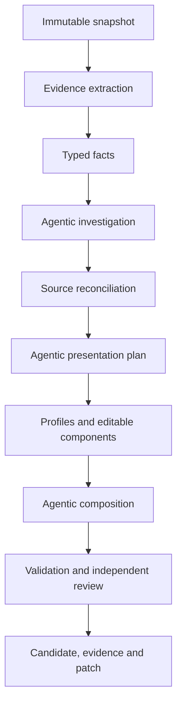

# Repository Presenter Research and Design Guidelines

Status: durable research record and implementation guidance  
Recorded through: 2026-09-02  
Legacy repository: `babar-raza/foss-readme-optimizer`  
Legacy source baseline used by the new project: `a8a163f7e9a7beeac1d2ef8b7c02e8e4bd5a7815`

## 1. Purpose and authority

This document preserves the useful investigation, reasoning, rejected approaches, measurements,
and design guidance developed before implementation began. It exists so a future agent can recover
the reasoning without relying on conversation history.

It is deliberately not another execution plan:

- [`EXECUTION_STATE_MACHINE.md`](EXECUTION_STATE_MACHINE.md) owns build order, gates, deliverables,
  and execution state.
- [`STATE_MACHINE.md`](STATE_MACHINE.md) owns production runtime states and transitions.
- This document explains why those contracts exist, records their empirical basis, and identifies
  conclusions that must be retained or revalidated.
- [`DECISION_LOG.md`](DECISION_LOG.md) is the append-only provisional decision log this document's
  own §31 grew into (split out 2026-09-08) — the loop's and lanes' running record of decisions made
  without stopping to ask, in the shape date · item · decision · alternative rejected · evidence ·
  reversal path. Read it alongside this document, not instead of it: this document is the durable
  "why"; the decision log is the dated "what happened since."

Labels used below:

- **Observed** — directly inspected in source, state, history, workflows, or target repositories.
- **Measured** — produced from a bounded count or inventory at the recorded revision/date.
- **Inferred** — reasoned conclusion from observations; implementation must test it.
- **Decision** — selected direction for the new project.
- **Rejected** — approach considered and deliberately not selected.
- **Revalidate** — time-sensitive or incomplete observation that cannot remain permanently assumed.

## 2. Original problem

The legacy README optimizer accumulated extensive machinery but failed to provide a dependable,
current, contract-valid README transaction. The central problem was not absence of code, tests,
state, plans, or evidence. It was failure to convert those assets into the primary observable
result: one current repository-grounded README, independently accepted and immediately no-op
proven.

The new product must therefore optimize for completed repository outcomes rather than machinery
completion.

### 2.1 Intended product outcome recovered from `plans/idea.md`

**Observed:** the permanent intent is a central repository-presentation agent, not a link injector,
static template renderer, or one-time cleanup script.

The system must:

- establish a FOSS product as useful, credible, and professionally maintained before promotion;
- explain what it does, the problems it solves, supported capabilities/formats, installation,
  usage, limitations, and maintenance;
- place relevant Aspose and Enterprise Edition links only where they help the reader;
- continuously inventory and monitor authorized repositories;
- run autonomously on GitHub-hosted runners through schedules and explicit triggers;
- use repository-grounded facts and reconcile product-agent/current-README claims;
- employ agentic reasoning for interpretation, editorial planning, composition, review, and repair;
- keep deterministic control over safety, evidence, validation, state, effects, and idempotency;
- remain durable across ephemeral runners;
- update presentations after upstream changes without routine human operation; and
- eventually manage other repository presentation surfaces through the same core.

README health is foundational and cannot be displaced by social preview, metadata, research,
governance, or future-surface infrastructure.

## 3. Legacy-system investigation

### 3.1 Repository scale

**Measured during the 2026-09-01 audit:** approximately:

| Measure | Result |
|---|---:|
| Legacy repository commits since 2026-07-17 | 1,423 |
| First-party production Python | 171,345 lines |
| Vendored Aspose.org Python | 23,574 lines |
| Tests | 156,031 lines |
| `facts/` | 36,455 lines |
| `readme/` | 30,920 lines |
| `supervisor/` | 26,376 lines |
| `specialists/` | 20,682 lines |
| `presentation/` | 13,867 lines |
| `state/` | 6,627 lines |
| `capabilities/` | 6,485 lines |
| Foundation-oriented packages | approximately 18,690 lines |

These counts describe scale, not value. Large areas contain valuable implementation mixed with
historical lanes, product-specific fixes, proof scaffolding, compatibility paths, and orchestration
that should not be reproduced.

### 3.2 Live delivery state found during the audit

**Observed at legacy state reference `827881b...` on 2026-09-01:**

- registry/accountability denominator: 34;
- `facts_ready`: 1;
- `candidate_generated`: 0;
- no-op proven: 0;
- active task: null;
- durable transitions: 1,209;
- attempts: 247;
- ineffective attempts: 115;
- closed tasks: 81, including closures later shown not to establish the promised result.

The first candidate-focused task, PF02, had 159 transitions and 21 staleness regressions. PF04 had
to reopen because its proven-transaction runner had no production importer. This is strong evidence
that transition volume and task closure were decoupled from user-visible delivery.

### 3.3 Stale candidate evidence

**Observed:** an older finalized evidence area contained ten Python candidates from 2026-08-11/12,
but those artifacts were stale relative to current source and current control contracts.

Approximately 619 control-repository commits followed the last promotion without a corresponding
change to the canonical finalized candidate set. One old 3D/Python candidate was approximately 793
README lines and included weak generated API prose.

**Guideline:** candidate existence, historical approval, generated evidence, or task closure never
counts as current acceptance. Source, facts, candidate, validation, independent review, provider
calls, and no-op proof must form one current transaction.

### 3.4 Two generations of legacy product

**Observed:** the legacy repository contains:

1. A narrow deterministic `generate/run` path that detects four promotional gaps and writes a
   bounded owned span.
2. A much broader `supervise/verified_repository_presentation` path intended to perform agentic,
   repository-verified presentation work.

The narrow path remains useful only as historical behavior or a migration reader. It is not the
new product's foundation. The broader path contains significant reusable intelligence, but its
supervisor/mission/proof architecture became too elaborate to carry forward safely.

### 3.5 What was structurally sound

The following ideas were valuable and must not be lost:

- immutable source revision binding;
- exact preservation of original README bytes;
- hard repository allow-list;
- push-neutered read-only clones;
- separate read and write credentials;
- per-job custom-LLM routing and typed outputs;
- provider-call attribution and zero-call accounting;
- prompt registry and prompt hashes;
- ecosystem-aware public consumer-surface extraction;
- claim accountability and source-content dispositions;
- deterministic validation and independent review;
- component-scoped dependency hashes and invalidation;
- repository-scoped durable state and CAS;
- trigger deduplication, leases, recovery, effect reconciliation, and health reporting;
- no-op as a complete-transaction property;
- independent processability classification; and
- portfolio accounting that retains non-processable entries.

### 3.6 What caused failure or unnecessary drag

**Inferred from code/state/history:**

- the mission/task apparatus became a product of its own;
- multiple trusted/verified/POC/compatibility paths created ambiguous authority;
- proof machinery was built before one simple current transaction worked;
- state transitions could grow without narrowing the README defect;
- historical artifacts could look like progress despite stale dependencies;
- numerous specialist, capability, promotion, cohort, and lifecycle abstractions increased wiring
  risk;
- product-specific fact machinery accumulated without a clean plugin boundary;
- infrastructure and acceptance contracts expanded faster than visible output;
- runtime and project-development governance became entangled; and
- repeated retries could preserve the same causal owner instead of changing mechanism.

## 4. Target-repository research

### 4.1 Corpus scope

**Observed:** all 34 repositories listed in the legacy product registry were inspected at their
then-current default branches on 2026-09-01. They span 13 families and seven ecosystems.

| Family | Platforms | Presentation observation |
|---|---|---|
| 3D | Java, .NET, Python, TypeScript | Shared semantic portfolio structure. |
| Barcode | Python | Standard structure. |
| Cells | C++, Go, Java, .NET, Python, Rust, TypeScript | Standard structure. |
| Email | C++, .NET, Python | Standard structure. |
| Font | Python | Purposefully product-specific. |
| HTML | Python | Standard structure. |
| Note | Python | Standard structure. |
| Page | Python | Standard structure with visual-output content. |
| PDF | C++, Go, Java, .NET, Python, TypeScript | Five standard; TypeScript is a detailed product manual. |
| PSD | .NET, Python | README-only placeholders. |
| Slides | C++, Java, .NET, Python | Shared Slides-family presentation. |
| TeX | Python | Compact, output-oriented presentation. |
| Words | .NET, Python | Standard structure. |

Classification at the time of inspection:

- 25 repositories used substantially the same semantic README contract;
- seven had legitimate bespoke family/product compositions; and
- two PSD repositories lacked implementation evidence.

This classification must be frozen with exact revisions during the reuse/corpus gate and refreshed
before portfolio proof.

### 4.2 Standard does not mean identical

The 25 standard-shell repositories share a reader journey, not a universal prose body. Common
semantic identities are:

1. Identity and badges
2. Navigation
3. At a Glance
4. Key Capabilities
5. Installation
6. Dependencies
7. Quick Start
8. Additional Examples
9. API Reference
10. Documentation and Resources
11. Scope and Limitations
12. Development and Testing
13. License

Each repository must still supply its own facts, audience, emphasis, workflows, examples, API hubs,
limitations, development instructions, and coherent prose.

### 4.3 Legitimate variations

- **Font/Python:** variable-font-first workflows, generated outputs, CLI behavior, MCP server and
  review artifacts are central to the product story.
- **PDF/TypeScript:** extensive capabilities and examples justify a manual-like composition.
- **Slides family:** supported/unsupported behavior and edition choice are more useful than a
  generic API inventory.
- **Page/Python:** visual output evidence materially improves comprehension.
- **TeX/Python:** a compact output-oriented journey is more appropriate.
- **PSD/.NET and PSD/Python:** no implementation evidence means no README authoring.

Profiles must make these compositions expressible, but the planning agent must select and justify
the result from current evidence.

### 4.4 Live README refreshes and lineage gap

**Observed:** many target READMEs were refreshed during August 2026, including standard-shell
changes across 3D, Cells, Email, HTML, Note, Page, PDF, and Words. Other product repositories were
updated through independent release or product workflows.

This explains the apparent contradiction: useful live READMEs exist while the legacy optimizer's
current canonical state has no valid candidate. The live files are valuable source material and a
development corpus, but must be requalified because the legacy system cannot trace them to a
current complete transaction.

## 5. Factual authority and content guidance

### 5.1 Evidence hierarchy

The exact immutable repository snapshot is primary authority. Relevant evidence includes:

- Git identity, default branch, tags, releases, and history;
- manifests and lock files;
- public consumer surface, exports, namespaces, modules, and declarations;
- implementation source;
- tests and examples;
- build/CI configuration;
- license and community files;
- current README and repository assets; and
- verified package registry observations.

Product agents, Aspose.org pages, package pages, external documentation, SEO vocabulary, and
previous candidates are leads, oracles, and presentation evidence. They cannot override
contradictory repository/package evidence or solely support a public factual claim.

### 5.2 Field-to-evidence mapping

| README material | Expected evidence |
|---|---|
| Identity and repository links | Git metadata, registry and repository configuration. |
| Package/install command | Ecosystem manifests plus verified public consumer/package surface. |
| Dependencies/runtime | Manifests, lock files, native loading, build configuration and CI. |
| Quick Start | Tested example/test or independently verified public-consumer example. |
| Capabilities | Public symbols corroborated by examples, tests, formats and implementation. |
| API Reference | Parsed public/exported surface, grouped for reader utility. |
| Build/test instructions | Actual build files and CI. |
| Limitations | Explicit implementation boundaries, omissions and unsupported paths. |
| License | Repository license evidence; absence remains absence. |
| Images/links | Existing assets plus destination/context validation. |
| Positioning and journey | Agentic interpretation of accepted evidence. |

### 5.3 Preservation

Maintainer/product-agent README material is neither disposable nor automatically true. Every
meaningful unit must receive exactly one outcome: preserve, rewrite, move, correct, supersede,
omit with evidence, defer as unresolved, or classify as non-content.

The approved presentation contract owns tone, headings, organization, and formatting. Source prose
structure is not itself protected, but validated information and maintainer intent are.

## 6. Deterministic and agentic responsibilities

### 6.1 Agentic work

Agents must perform genuine judgment for:

- understanding the product and audience;
- identifying important workflows and evidence gaps;
- reconciling conflicting or stale claims;
- determining the visitor journey and useful section depth;
- selecting the best examples and API hubs;
- composing coherent repository-specific prose;
- independently reviewing factual and visitor quality; and
- choosing targeted causal repairs.

A candidate produced solely by phrase matching, rules, or template population fails the product
intent even if deterministic checks pass.

### 6.2 Deterministic work

Code owns:

- registry admission and processability;
- immutable snapshots and hashes;
- evidence extraction and provenance;
- state transitions, leases and recovery;
- prompt/model/component dependency identities;
- commands, code blocks, verified links, badges and diagram topology;
- claim and source-unit accountability;
- Markdown, structure, link, example and safety validation;
- caching and no-op decisions;
- credential isolation and authorization;
- GitHub effect execution and reconciliation; and
- terminal artifact production.

### 6.3 Correct composition flow



Profiles and templates constrain and enable presentation. They do not replace interpretation.

## 7. Template and modularity guidelines

### 7.1 Semantic components

Templates should be ordinary Markdown/Jinja files, with layout/order/applicability in YAML.
They may define presentation framing, stable headings, slots, and deterministic structure.

They must not hardcode:

- package names or versions;
- product capabilities or supported formats;
- install/build commands;
- public API claims;
- limitations;
- repository-specific links; or
- unsupported marketing statements.

Those values come from versioned typed facts and an accepted agentic plan. Missing or unresolved
required facts fail compilation.

### 7.2 Profiles

- Platform profiles contain ecosystem knowledge and validation requirements.
- Family profiles contain accepted recurring terminology, workflows, and composition hints.
- Repository profiles are reviewed declarative overlays used only for true residual exceptions.
- No profile may bypass evidence, force a fact, or predetermine the entire document.

### 7.2.1 Importing legacy profiles and catalogs (2026-09-02)

**Observed in the legacy source:** `config/policies/*.yml` (34 files) hardcode a per-product
`products_org_link`, `products_com_link`, label, and prohibited-term list each. `data/
aspose_org_links.json` is a generated catalog of 7,755 link records whose own provenance block
records only 44 as live-verified, at a probe dated a month before freeze; `data/aspose_com_links.json`
is the same shape. `data/families.json` (17 records) and `data/platform_priorities.json` (a seven-item
execution order) are different in kind: small, global, structural, and low-risk to pull in full.

Rule: a policy file or a catalog record is pulled only when the repository or family currently being
composed needs it, never as the full 34-file or 7,755-record set ahead of G4 — the same pull-based
discipline `EXECUTION_STATE_MACHINE.md` §7 requires of code, applied to data. The pulling work item
re-verifies what it pulls before writing the file record: the link target resolves now (the check
`README_CONTRACT.md` §5 already requires of every rendered link), and the label and terminology still
match current product reality. A stale or unverifiable entry is corrected or dropped, never carried
forward on the legacy catalog's word. Record what was checked, changed, and dropped in the file
record's `note`. A pulled profile or catalog value is a lead, in the same evidentiary tier as an
Aspose.org page (§5.1): it can corroborate `presentation_planning`'s link and ceiling choices, never
override contradictory repository evidence or stand alone as a public factual claim.

### 7.3 Component boundary

README is one component of Repository Presenter. Shared `core` services own snapshot, evidence,
artifacts, state, LLM access, validation primitives, authorization, and GitHub integration.

Future components may manage:

- repository description;
- homepage and topics;
- community/contribution/security files;
- release and package links;
- visual assets and social preview; and
- drift protection across those surfaces.

They consume public core contracts and must not depend on README-private implementation.

### 7.4 Extraction and platform independence (2026-09-02)

Knowledge extraction (`extractors/`, facts stage S2) and knowledge processing (`investigation/`,
`reconciliation/`, `composition/`, S3 onward) are independent: `facts.json` is the only artifact that
crosses the boundary; no processing module imports an extractor module directly. Within extraction,
each platform's module (`extractors/platforms/<ecosystem>.py`) depends only on `core/`, the shared
ecosystem-agnostic surface façade and verifier base under `extractors/` (§29.6 E2–E3, from
2026-09-04), and its own file, sharing no import with any other ecosystem's module; only the registry
(`extractors/platforms/registry.py`) references more than one ecosystem, and only to register them.

**The registry is open-ended, not fixed at seven.** `ecosystem` is a pattern-constrained string in
the registry schema and model (`^[a-z][a-z0-9_]*$`), never a closed enum, and the extractor registry
holds plugins in a plain `{ecosystem: plugin}` dict that fails closed with `ConfigError` on anything
unregistered — verified in the built code, not just planned. G3 qualifies seven representatives
because that is what the frozen 34-repository portfolio needs; it proves the pattern generalizes, and
is a milestone, not a ceiling. An eighth ecosystem, or a fiftieth, enters exactly the same way at any
later gate: one plugin file implementing the same protocol, one test, one entry in the registry's
dict — nothing else changes. A repository in an ecosystem with no registered plugin stays
non-processable, correctly, until that plugin exists; that is the fail-closed default working, never
a defect to route around.

**Verified in the legacy source:** `ecosystems/registry.py` is already the sole file importing more
than one ecosystem module; `ecosystems/python.py` and `ecosystems/rust.py` import no sibling ecosystem
module. This one boundary was sound and this repository keeps it. Adding, fixing, or extending one
ecosystem's extractor must change only that file, its test, and its registration line — never another
ecosystem's file, the registry's dispatch logic, or any downstream stage. `REPOSITORY_LAYOUT.md` §2.1
states this as a placement and test requirement.

## 8. Autonomous GitHub operation

### 8.1 Trigger and monitoring model

Recommended initial cadence:

- frequent cheap remote-revision/open-proposal probe;
- daily changed/due repository processing;
- weekly complete discovery and all-surface freshness audit;
- `repository_dispatch` for product release/upstream-change notification;
- manual/workflow-call entry points for bounded diagnosis and integration; and
- recovery before new scheduling.

Scheduled polling remains the dependable recovery mechanism even if product workflows later emit
events.

### 8.2 Drift is broader than Git SHA

Track independently:

- source/default-branch revision and relevant file fingerprints;
- exact README blob and material-unit inventory;
- package/release observations with TTL;
- repository description/homepage/topics with TTL;
- presentation assets and observable GitHub state;
- prompts, models, schemas, extractors, validators, profiles and template components; and
- open presenter proposal state.

A changed repository should invalidate only dependent work. A test-only commit may require no
README update; a package identity change reopens installation; a new exported API reopens public
surface/capability/example analysis; an upstream README edit reopens reconciliation.

### 8.3 GitHub workflow boundary

Use three focused workflows:

1. `monitor.yml` — registry reconciliation, recovery, cheap probes, due-work matrix, health.
2. `present.yml` — isolated read-only repository transaction using the custom LLM.
3. `propose.yml` — separately authorized, repository-scoped PR creation/update.

GitHub Actions cache accelerates execution but is never authoritative durable state. Use
repository-scoped CAS state in a dedicated control-repository namespace plus immutable
content-addressed artifacts.

### 8.4 Publication

Initial autonomous update mode means open or update one presenter-owned PR. It does not mean direct
default-branch pushes.

Before a write:

- mint a fresh repository-scoped GitHub App token in the effect job;
- bind target repository, candidate hash, source revision, branch, PR intent, policy, and expiry;
- refetch source and cancel if stale;
- reconcile an uncertain prior effect before retrying; and
- preserve/reconcile overlapping upstream README edits.

Auto-merge can later be enabled by explicit repository policy after production proof.

## 9. Custom LLM guidance

### 9.1 Reusable legacy capability

The legacy custom-LLM implementation already supports:

- OpenAI-compatible `/chat/completions`;
- configurable base URL and API key;
- per-job model routing;
- deterministic sampling defaults;
- bounded transport retry;
- typed response validation;
- request/response hashes;
- attempt, latency and token accounting;
- prompt registry and prompt hashes;
- fixture clients; and
- cache-reuse/zero-call accounting.

This is a high-value reuse area and should be simplified, not rewritten casually.

### 9.2 Initial job set

Use a small governed set:

- `repository_investigation`;
- `source_reconciliation`;
- `presentation_planning`;
- `section_authoring`;
- `independent_review`; and
- `targeted_repair`.

The custom model may have a modest reliable context window. Supply bounded evidence dossiers and
small fact packets, but retain one final whole-document coherence step. An LLM cannot write exact
commands, APIs, links, badges, example code, or diagram topology without deterministic evidence.

### 9.3 Failure behavior

- Required route unavailable or deliberately disabled: block honestly.
- Malformed structured response: reject; do not loosen schema silently.
- One normal semantic attempt plus one targeted correction for an equivalent fingerprint.
- Third equivalent attempt prohibited until evidence, prompt, model, component, stage, or mechanism
  changes.
- Every physical provider attempt remains attributable to repository, revision, job, prompt, model,
  outcome, latency, and usage.

## 10. Legacy-code reuse findings

### 10.1 Quantified expectation

At audit time, approximately 31–37% of first-party production code appeared to contain behavior
worth carrying into the new repository:

- approximately 11% near-intact foundations;
- approximately 20–26% surgical extraction/refactoring; and
- approximately 63–69% not suitable for production migration.

This was an audit estimate, not a license to bulk copy. The execution gate must produce a file-level
reuse manifest and measured final result.

### 10.2 Reuse substantially intact

- LLM transport, attempt accounting, call schema/ledger, prompt registry/hygiene;
- Git safety and push blocking;
- allow-list loader and selected discovery/intake primitives;
- immutable repository snapshot and inspection;
- ecosystem/public consumer-surface parsers;
- evidence redaction and atomic writing;
- contextual link validation;
- selected deterministic public-quality validators;
- read-only GitHub API and preflight; and
- authorization data contracts.

### 10.3 Extract and refactor

- `ProductFactsV2` concepts and general repository facts;
- ecosystem consumer/example verification;
- format, identity, protected-content and interpretive evidence logic;
- README assessment, source disposition, preservation and document assembly;
- agentic section authoring and whole-document composition;
- presentation component compiler and claim validation;
- independent separated review;
- repository-scoped Git CAS, triggers, freshness, recovery and health; and
- product-specific fact logic converted into registered plugins.

### 10.4 Reference or fixture only

- bulk vendored Aspose.org tree;
- imported knowledge snapshots;
- previously generated candidates;
- old benchmark reports; and
- old acceptance/proof artifacts.

Useful mechanisms may be adapted natively with provenance and regression tests. Production must
not depend on a sibling checkout or an unbounded vendored system.

### 10.5 Retire

- legacy four-gap renderer and marker writer, except a migration reader if required;
- trusted transformation lane and trusted cohort machinery;
- Level-8 mission graph and mission command system;
- PF04/proven-transaction proof machinery;
- generic planner-driven capability/task graph;
- compatibility commands and duplicated lifecycle schemas;
- overlapping evidence manifest versions; and
- thirteen overlapping workflows (§16.3), replaced by three.

## 11. Tangible output and success contracts

Every README-component invocation returns exactly one public outcome:

| Outcome | Meaning |
|---|---|
| `candidate` | README, exact patch, facts/dispositions, evidence, validation, review and call summary exist. |
| `no_change` | Byte-identical accepted result with checksum-valid evidence and zero provider calls. |
| `insufficient_evidence` | No candidate; typed missing evidence and resume predicate. |
| `failed` | Bounded redacted diagnostic, causal state and retry/block classification. |

Internal runtime states may be richer, but no repository is left with an ambiguous external result.

The initial project is not done because it has code, tests, workflows, candidate files, task
closures, or evidence. It is done only when the GitHub-hosted system monitors the admitted
portfolio, produces independently accepted current candidates for all processable repositories,
proves zero-call no-op, responds to drift, and safely opens/updates authorized PRs.

## 12. Rejected approaches and cautionary lessons

### 12.1 Repair the legacy architecture wholesale

**Rejected:** it would preserve the ambiguity and complexity that prevented tangible delivery.
Reusable implementation should migrate behind new narrow contracts.

### 12.2 Build a deterministic README compiler

**Rejected:** typed facts plus platform/family templates alone cannot decide product meaning,
audience, emphasis, example quality, useful API depth, limitations, inherited-content correction,
or coherent prose.

### 12.3 Use one editable Markdown template

**Rejected:** the corpus demonstrates legitimate product/family compositions. Use a semantic shell,
editable components, profiles as evidence-aware hints, and agentic planning.

### 12.4 Give equal writing authority to multiple agents

**Rejected:** product/evidence agents provide technical truth and critique, while one central
composer owns final document coherence. An independent non-authoring reviewer owns acceptance
judgment.

### 12.5 Treat Aspose.org as permanent truth or runtime dependency

**Rejected:** it is an evolving development oracle and may contain defects. Repository/package
evidence remains authoritative.

### 12.6 Treat Git SHA as complete freshness

**Rejected:** package releases, metadata, proposals, presentation policy, prompts and external
surfaces can change independently.

### 12.7 Treat Actions cache/artifacts as durable mutable state

**Rejected:** caches can evict and artifacts expire. They are acceleration and review surfaces.

### 12.8 Build broad infrastructure before one transaction

**Rejected:** the first vertical slice must complete investigation through no-op and then a
disposable PR. Infrastructure is admitted only when the current/next proof consumes it.

## 13. Implementation heuristics

1. Lead every development increment with the observable repository outcome it unlocks.
2. Maintain one build cursor and one runtime state machine; do not create parallel authorities.
3. Port behavior with its tests and provenance, not files by reputation.
4. Keep orchestration small; stages call public seams and contain no domain implementation.
5. Add ecosystems and product families through registries/plugins, never expanding a central
   `if/elif` chain.
6. Preserve exact target revisions in corpus fixtures and refresh only at declared boundaries.
7. Validate model output before state advancement.
8. Route defects to the earliest causal stage; validation should not paper over extraction or
   planning errors.
9. Retain unaffected accepted work across repair and invalidation.
10. Run the exact production workflow in production-like conditions before claiming it works.
11. Keep write credentials physically absent from analysis jobs.
12. Continue safe unrelated repositories when one is retryable, blocked, or internally failed.
13. Expose honest portfolio health and a concrete resume predicate.
14. Measure provider cost, repair rate, false-positive drift, proposal acceptance, and update delay.
15. Do not let evidence production become a substitute for candidate delivery.

## 14. Items requiring revalidation

The implementation agent must not treat these dated findings as permanent:

- current default-branch revisions and README bytes of all 34 target repositories;
- registry denominator and processability classification;
- 25/7/2 composition grouping;
- package/release/public-consumer information;
- custom gateway models, context behavior, tool/structured-output reliability and limits;
- GitHub App installation coverage and permissions;
- live source counts and legacy module dependency closures;
- link targets, banners and repository assets;
- exact GitHub Actions behavior and supported action versions;
- whether a social-preview write API remains unavailable;
- the disposition of the legacy working-tree changes that were uncommitted at freeze (§16.2); and
- the legacy test-suite baseline at the frozen revision (§16.9), which must be re-measured if the
  frozen revision moves.

Revalidation updates evidence and, when necessary, the relevant authoritative contract. It does
not silently rewrite history.

## 15. Research reading order

A new implementation agent should read:

1. this document for context and design reasoning;
2. [`EXECUTION_STATE_MACHINE.md`](EXECUTION_STATE_MACHINE.md) for the current build gate;
3. [`project/state.yaml`](../project/state.yaml) for the live cursor;
4. [`STATE_MACHINE.md`](STATE_MACHINE.md) for the behavior being implemented;
5. [`plans/idea.md`](../plans/idea.md) for the product outcome and standing constraints, through
   the authority note at its top;
6. [`DECISION_LOG.md`](DECISION_LOG.md) for every decision made since, in date order — this
   document does not restate them;
7. the reuse manifest's file records as pulls create them, and the corpus inventory once the G3
   census produces it; and
8. only the legacy modules explicitly named by the active reuse record.

This order prevents both context-free implementation and a return to reading the entire legacy
project as an undifferentiated authority.

## 16. Pre-migration verification (2026-09-02)

These measurements were taken before Gate 0 began, directly against the frozen legacy revision and
the legacy working tree, to test the claims in §3 and §10 and the seed dispositions in the reuse
manifest. Labels follow §1.

### 16.1 Frozen revision

**Observed:** `a8a163f7e9a7beeac1d2ef8b7c02e8e4bd5a7815` exists in the local legacy clone and was
its `main` HEAD: author Babar Raza, authored 2026-09-01 18:39 +05:00, subject "fix(readme): drop the
ungrounded Project Structure summary phrase (PWD-060-FOLLOWUP5)". The local clone is shallow (two
shallow roots), so the 1,423 commits in §3.1 are the visible history, not necessarily the complete
history; provenance reasoning beyond the shallow boundary needs the remote.

### 16.2 Working tree at freeze

**Observed:** the legacy working tree was dirty when the revision was frozen: 15 modified tracked
files (496 insertions, 77 deletions) and 9 untracked files. Modified production files:
`facts/portfolio_facts_readiness.py`, `presentation/verified_template_api_reference.py`,
`presentation/verified_template_example_presentation.py`, `presentation/verified_template_sections.py`,
`specialists/review_standard_mermaid_premises.py`, `supervisor/mission_execution_guard.py`, plus
seven of their tests. Modified documents: `plans/idea.md` (adds the "Upstream Defect Reporting"
section) and `plans/investigations/control/mission-resume-capsule.md`. Untracked: a golden-corpus
reconstruction investigation with its roster, taskcards, evidence directory, and five tools.

**Decision:** this repository's `plans/idea.md` deliberately carries the uncommitted worktree text
(so it includes Upstream Defect Reporting) and says so in its authority note. The code changes are
not part of the frozen revision. The default exclusion was applied on 2026-09-02 as owner item
OWNER-03 in `project/state.yaml`; the owner may override it by committing the changes upstream and
naming a new frozen revision. The manifest records each exclusion under
`source.working_tree_at_freeze.exclusions`.

### 16.3 Scale measurements

**Measured** from a `git archive` of the frozen revision:

| Measure | Result | Comparison with §3.1 |
|---|---:|---|
| First-party production Python (excluding vendored) | 171,345 lines | exact match |
| Vendored Aspose.org Python | 23,574 lines | exact match |
| Tests | 156,031 lines | exact match |
| Test files | 457 unit, 12 integration, 9 security, 5 fixtures | new |
| Unit tests collected | 5,669 (4 `live` tests deselected) | new |
| Workflow files | 13 | earlier text said eleven; corrected |
| Scheduled workflows | production daily 05:17 UTC and weekly Sunday 04:43 UTC; registry update weekly Monday 07:00 UTC; log-coverage audit daily 06:00 UTC | new |
| Registry entries | 34, all `active: true`; mode `full` 2, `dry_run` 29, `disabled` 3 | matches §4.1 |
| Registry by ecosystem | python 13, net 7, java 4, cpp 4, typescript 3, go 2, rust 1; 13 families | matches §4.1 |
| Registry at `df864ffd` (2026-08-20, the baseline commit named in `plans/idea.md`) | 33 entries | the TypeScript entry was admitted 2026-08-26 |
| Legacy `LICENSE` file | absent; README says "all rights reserved by default" | provenance recorded per ported file |

The two PSD repositories are `disabled` in the registry, consistent with their non-processable
classification.

### 16.4 Real production entry point

**Observed:** `.github/workflows/readme-agent-production.yml` runs `registry-preflight` (App token
scoped to one control repository), `recovery-sweep` (control-repository `contents: write` for
`refs/readme-agent-state`), then `readme-agent supervise --repo <repo> --resume-trigger-key <key>
--no-registry-heal --execution-profile github_observe` per matrix member, a serialized
`staging_effect` job with a separately minted target-scoped token, and `health-report`.

**Measured:** the static import closure of the `supervise` command is 760 modules and 154,167 of
194,919 first-party lines (79%), including 83 `supervisor`, 75 `specialists`, 43 `capabilities`,
22 retired-disposition, and 2 vendored modules. The legacy narrow `orchestrator` path closes at
122 modules and 16,385 lines.

**Inferred:** the production path is effectively the whole codebase. Reuse by entry point is
impossible; reuse must be by module with each import closure cut deliberately. This confirms §3.6.

### 16.5 Reuse-manifest seed coverage

**Measured:** the seed globs in the pre-audit manifest match 176 files and 56,767 lines, 29.1% of
first-party lines (port 2,558; extract 17,088; plugin 6,182; fixture 23,574; retire 7,365).
138,152 lines have no seed disposition: `facts` 30,995; `readme` 29,298; `specialists` 20,221;
`supervisor` 19,601; `presentation` 9,240; `capabilities` 6,485; `state` 5,239; root modules 4,782;
`verification` 4,769; `llm` 1,881; `validation` 1,602; `golden_set` 1,341; `registry` 1,176;
`profile` 331; `authorization` 295; `evidence` 288; `github_api` 279; `preflight` 261; `license`
49; `effects` 19.

**Inferred:** the 31–37% estimate in §10.1 cannot be confirmed from the seeds. `github_api`,
`preflight`, and `authorization`, which §10.2 names as reusable, had no manifest entry; they are now
seeded. Only the pull-based ledger and the G3 census can settle the fraction, and a census-first
audit of 138,152 unseeded lines would itself become the machinery project §3.6 warns against.

### 16.6 Import-closure findings

**Measured** by static AST analysis of the 156 seed-retained modules: 31 reach a `RETIRE` module and
13 reach `supervisor`, `capabilities`, or `specialists`. The chains, recorded in the manifest as
`CPL-01` to `CPL-08`:

- `CPL-01` — every `llm/*` module reaches the retired `readme/markers.py` through
  `prompt_registry` → `readme/facts.py::sha256_text` → `validation/registry.py` →
  `validation/rules/change_boundary.py` → `markers`. `call_transport` alone closes at 44 modules
  and 3,962 lines because of this; after the cut it should be a handful.
- `CPL-02` — `evidence/writer.py`, `state/git_backend.py`, `state/cas.py`, `state/recovery.py`,
  `state/health.py`, `state/freshness_contract.py`, and `registry/revision_store.py` reach
  `capabilities/schema.py` through `state/proposal_schema.py` (`OrgRepoRef`); that module has 62
  direct importers.
- `CPL-03` — `specialists/separated_readme_review.py` closes at 592 modules and 115,816 lines,
  including `readme/candidate_pipeline.py` via `capabilities.dispatcher` → `capabilities.registry`
  → `capabilities.check_install_path` → `orchestrator`. The contract is reusable; the module is not.
- `CPL-04` — the production `supervise` command imports `_durable_state_backend` from
  `commands_compatibility.py`, a retire-disposition module.
- `CPL-05` — `paths.runs_dir()` defaults to `Path.cwd() / "runs"`; 69 modules import `paths`.
- `CPL-06` — 15 production modules carry 30 references to `plans/investigations/...` paths; most
  are docstrings or comments, but `supervisor/proven_transaction_runner/pf04_evidence.py` loads the
  Level-8 mission graph from that tree and the 30-point rubric modules cite `RUBRIC_30.md` there.
  Each reference is classified as fixture, oracle, or dead when its module is pulled.
- `CPL-07` — `env.py` resolves `GH_TOKEN` then `GITHUB_PAT` unless
  `README_AGENT_PRODUCTION_AUTH=github_app`, in which case ambient tokens are ignored and a missing
  App token fails closed. The behavior `plans/idea.md` requires exists and is the only production
  mode to port.
- `CPL-08` — 11 `specialists` modules import `langgraph` or `langchain-core`;
  `separated_readme_review.py` does not import them directly.

Fan-in for orientation: `errors` 123 direct importers, `paths` 69, `capabilities.schema` 62, `env`
45, `readme.markers` 17. "Port nearly intact" therefore describes module bodies, never their
closures.

### 16.7 Non-Python contract assets

**Observed:** much of the presentation contract in `plans/idea.md` lives in assets the manifest's
Python globs did not cover:

- 17 prompt manifests under `prompts/` with schema fields `prompt_id`, `category`, `version`,
  `model_route`, `owner`, `runtime_consumer`, `output_contract`, `invalidation_scope`,
  `dependent_artifacts`, and `system`/`user_template` text;
- `templates/readme/repository-presentation-v1.json` (template version 1.21.0,
  `reference_status: requires_requalification`) with invariants for badge rows, minimum badges,
  Mermaid visual grammar, capability layout and column threshold, topology, and minimum/target
  inputs, capabilities, and outputs;
- `templates/readme/section-registry-v2.json` with 16 sections including Third-Party Notices,
  Security, Contributing, and License, plus nine unmapped badge and banner checks;
- 34 per-repository policy files under `config/policies/` (link targets, labels, UTM, talking
  points, prohibited terms, allowed domains);
- `data/products.json`, `aspose_org_links.json`, `aspose_com_links.json`, `families.json`,
  `platform_priorities.json`, and the frozen `aspose_benchmark_quality_profile.json`
  (`BenchmarkQualityProfileV1`, development-only, 31 audited, 26 clean);
- `docs/presentation-standard.md` (ten dimensions, first-screen rules, search-intent guidance);
- `golden-sample/`.

**Decision:** these now have seed dispositions in `EXECUTION_STATE_MACHINE.md` §7.2 and the
manifest's `expected_asset_dispositions`.

Legacy prompt to new job mapping (**Inferred**, to verify while pulling prompts in G1 and G2):

| New job | Legacy prompt(s) | Disposition |
|---|---|---|
| `repository_investigation` | `draft_product_truth` (partial) | Extract |
| `source_reconciliation` | `claim_disposition_check` plus `verified_source_*` code | Extract |
| `presentation_planning` | `plan_readme_composition` | Extract |
| `section_authoring` | `section_cluster_authoring` | Extract |
| `independent_review` | `independent_readme_review`, `blind_readme_quality_review`, `factual_readme_plan_review` | Extract, consolidate |
| `targeted_repair` | `repair_capability_selection` (partial) | Extract |
| none | `relationship_explained`, `trusted_readme_section_transform`, `trusted_readme_fidelity_review`, `supervisor_turn`, `specialist_selection_turn`, `merged_readme_review` | Retire |
| evaluate later | `presentation_standard_compliance`, `prose_quality_check`, `visual_asset_accuracy` | Reference until a gate consumes them |

### 16.8 Windows path-length hazard

**Observed:** `LongPathsEnabled` is 0 on the development machine. The longest tracked legacy path
is 220 characters and 86 exceed 150. Under a 161-character root, 1,348 tracked files are unreachable
to Python (`FileNotFoundError` on an existing file); under the developer worktree root
(63 characters) 25 files exceed the 260-character limit; under a drive-letter mapping none do.

**Guideline:** every clean-checkout measurement of the legacy repository on Windows uses a short
root (for example `subst W: <clone>`), and this repository keeps evidence and fixture paths short
enough that no tracked path exceeds roughly 200 characters.

### 16.9 Legacy test-suite baseline at the frozen revision

Two initial runs from a deep scratchpad path were invalidated by §16.8: the archive run reported
347 failures and 3,241 passes before its failure cap, the long-path clone run 487 failures, 5,173
passes, 1 skip, and 13 errors, and every sampled failure was a `FileNotFoundError` on an existing
file. The valid measurements are recorded below.

**Measured** with the legacy virtual environment (Python 3.13.2, pytest 9.1.1, `-n 8`, `-m "not
live"`), the full non-live `tests/` inventory:

| Run | Root | Tests | Passed | Failed | Errors | Skipped |
|---|---|---:|---:|---:|---:|---:|
| Clean frozen clone at `a8a163f7`, drive-letter mapped | 3 chars (real path 161) | 5,674 | 5,399 | 261 | 13 | 1 |
| Developer worktree, dirty (adds 9 tests) | 63 chars | 5,683 | 5,669 | 13 | 0 | 1 |

The two runs share exactly 13 failing tests; every failure in the developer worktree also fails in
the clean clone, and the clean clone's other 261 failures are environmental: 267 of its 269 failing
paths exceed 260 characters, because `Path.resolve()` expands the mapped drive back to the real
161-character root and pytest's temporary directories under `AppData\Local\Temp\pytest-of-*` reach
281 to 328 characters on their own. The `test_prompt_hygiene` `shutil.Error` failures and the
`test_readme_proposal_bundle_verifier` errors are the same defect class.

Failures reproducible in both environments and attributable to the frozen revision itself:

| Test | Class | Assessment |
|---|---|---|
| `test_verified_template_capabilities_seo_keyword_lineage` (3 tests) | `AssertionError` on rendered Key Capabilities titles | **Confirmed** pre-existing failure at `a8a163f7`; directly relevant to the search-intent lineage obligation in `plans/idea.md` |
| `test_portfolio_stage_transactions::test_candidate_transaction_observation_tampering_still_breaks_seal` | `DID NOT RAISE ValueError` | **Confirmed** pre-existing failure; a seal-integrity negative control does not fire |
| `test_portfolio_stage_transactions::test_candidate_transaction_observations_do_not_change_semantic_receipt` | `FileNotFoundError` on a 179-character path | **Probable** genuine failure (sibling of the seal test; path is under the limit) |
| `test_supervisor_loop::TestBasicLoop::test_local_poc_records_snapshot_and_profile_before_later_stages` | `FileNotFoundError` on a 185-character directory | **Uncertain**: path is under the limit, but a deeper child may not be |
| 7 tests in `test_portfolio_worker_integration`, `test_trusted_readme_extraction`, `test_trusted_transform_review` | `FileNotFoundError` on 281–282-character temporary paths | Environmental |

**Inferred:** the legacy suite at the frozen revision is close to green but not green: four
confirmed and up to two probable failures exist independent of environment, and two of the confirmed
failures sit inside behavior the reuse manifest expects to extract (SEO lineage in
`presentation/`, stage sealing in `supervisor/portfolio_stage_transactions`). The definitive
baseline is the legacy CI on a Linux runner, which has no path limit; it is recorded, or a local run
with `LongPathsEnabled` is, before the first pull in G1 ports any test.

### 16.10 Governance corrections made in this repository on 2026-09-02

- `plans/IDEA.md` renamed to `plans/idea.md`, the path every reference and the product owner use;
  the case matters on Linux runners.
- `plans/idea.md` named retired legacy authorities as live. An authority note at its top maps them
  to this repository's documents; `AGENTS.md` lists the file as product authority; and
  `EXECUTION_STATE_MACHINE.md` §12 maps every obligation to a gate. Obligations that previously had
  no gate: the presentation-contract invariants, search-intent lineage, the benchmark quality
  profile, local `act` proof, the Java proposal cohort, upstream defect reporting, Level 7 and 8
  certification, and separated portfolio counts.
- `project/state.yaml` used `PENDING` and `BLOCKED_BY_GATE` and a nested shape that
  `EXECUTION_STATE_MACHINE.md` §5 did not allow or show; §5 now matches the file.
- `EXECUTION_STATE_MACHINE.md` said eleven legacy workflows; thirteen exist. Its record example
  pointed at `src/repository_presenter/llm/transport.py` while the manifest used
  `core/llm/transport.py`; both now use `core/`.
- The manifest now records the verified revision, the dirty working tree, the verified baseline,
  the coupling findings, seed dispositions for the packages and assets it had omitted, and two
  additional acceptance predicates.
- A `.gitignore`, a `.gitattributes`, and a descriptive `README.md` were added.

## 17. Re-evaluation against the recovery direction (2026-09-02)

**Observed:** the recovery direction recorded in §2 and §12.8, and in the conversation that produced
this repository, was: one repository, the smallest end-to-end path to a visible concise candidate,
only essential blocking gates, a candidate saved at a stable reviewable path, per-candidate
dependency manifests instead of global hashes, a frozen acceptance contract while qualifying seven
representatives, and progress counted as 1/34, 7/34, 34/34.

**Observed:** revision 1 of `EXECUTION_STATE_MACHINE.md` did not follow that direction. It placed
four infrastructure gates before any README: a foundation with decision records and an evidence
framework, a census-first file-level audit of 171,345 legacy lines, every schema and transition rule,
and the full durable kernel with leases, fencing, recovery, and a GitHub App boundary. The first
candidate appeared at its seventh gate. §16.5 and §16.6 show why the audit gate alone would have
consumed weeks: 138,152 lines had no seed disposition and the "port intact" modules were entangled
at import level.

**Decision:** revision 2 re-sequences the plan around the outcome. G0 is a two-day foundation; G1
produces the first valid candidate for Aspose.3D FOSS for Python at a stable path with eleven
blocking checks and a sealed bundle; G2 proves that candidate survives change through per-candidate
dependency manifests and freezes acceptance contract v1; G3 qualifies seven representatives and runs
the legacy census; G4 adds hosted monitoring and the durable runtime for 34/34; G5 proves the
proposal effect; G6 hardens and deploys; G7 operates and expands. Legacy reuse became pull-based:
a file enters only when a gate needs it, with its record, tests, and a cut closure, and everything
unpulled is retired at the G3 census.

**Decision:** five guardrails from the legacy failure analysis became binding principles: just-in-
time infrastructure; every work item ends with an end-to-end run and no module lacks a production
importer; candidates are invalidated only through consumed inputs and no global hash exists;
validators and reviewers re-check rather than invalidate, and reviewer findings must be repairable;
governance is budgeted at 200 lines for `AGENTS.md`, 500 for the build plan, and eight gates.

**Accepted risks:** pull-based reuse can under-reuse valuable legacy behavior that no gate happens
to need; the census at G3 exists to make that visible. A two-day foundation may leave configuration
and error handling thin until G1 needs them; that is intended. The eleven blocking checks may let a
weak candidate through at G1 that contract v1 later catches; G1 accepts that because a human reads
the candidate before G2 begins.

## 18. Preferred libraries over bespoke code (2026-09-02)

`plans/idea.md` states this twice: "Battle-tested, proven tools and libraries are preferred over
new custom infrastructure. Building a bespoke mechanism where an established one already solves the
problem requires a documented reason — naming the proven alternative considered and why it was not
used — not a silent default choice," and again under "Prefer Battle-Tested Solutions": existing
solutions are "actively researched and evaluated before custom functionality is developed." Before
this section, `AGENTS.md`, `EXECUTION_STATE_MACHINE.md` principle 16, and `project/loop-prompt.md`
each carried a one-line paraphrase — but every occurrence paired "established libraries" with
"proven retained code" or "proven legacy modules," which reads as permission to port a legacy
module unexamined rather than as the evaluate-and-document duty `plans/idea.md` actually states. A
ported legacy module is not exempt from this test merely for having run in production; §16.6's
import-closure findings already show ported modules need seam cuts on their own terms.

### 18.1 The concrete failure this prevents

The PWD-060 cascade named in the recovery discussion (a project-tree diagram misclassified as
emoji, exposing a crash on a language-less code fence, exposing missing provenance, exposing an
evidence mismatch, ending in a deleted phrase) is a hand-rolled-text-handling failure chain. Each
fix exposed the next defect because no step used a real, tested parser for the input class it was
classifying. A maintained CommonMark parser and a maintained Unicode/emoji classifier do not
misclassify a box-drawing tree diagram as emoji; a regex-based approximation can. This is the
concrete stake behind the principle, not an abstract preference.

### 18.2 What the legacy code already got right, and wrong

Reading the legacy modules the manifest seeds for G1 (`retry.py`, `errors.py`, `llm/call_transport.py`,
`llm/live_client.py`) on 2026-09-02:

- `retry.py` is a thin, typed `pydantic` model wrapping `tenacity.Retrying` with a per-operation-
  class policy table (attempts, backoff bounds, jitter). This already follows the principle — the
  legacy project's own dependency comment records replacing an earlier bespoke retry loop with
  Tenacity for exactly this reason. Porting the policy table is fine; the mechanism underneath it
  should keep depending directly on `tenacity`, declared as such, not reimplemented.
- `errors.py` is a plain exception hierarchy with no third-party import. No library replaces a
  project's own typed error taxonomy; this is correctly bespoke and not a candidate for this rule.
- `llm/call_transport.py`, `llm/live_client.py`, and every `llm/*_client.py` module build the
  OpenAI-compatible chat-completions protocol — request construction, response parsing, retries,
  fail-closed errors — directly on `requests`. `plans/idea.md` already specifies "a configurable
  OpenAI-compatible gateway"; the official `openai` Python SDK accepts a custom `base_url` and
  `api_key` and already implements request construction, typed responses, retries, and streaming
  against that exact protocol. The manifest's seed dispositions for these modules (`PORT_NEARLY_INTACT`
  for `call_transport.py`; `EXTRACT_AND_REFACTOR` for `live_client.py` and `*_client.py`) predate
  this review and do not yet reflect an evaluation of the SDK. Before either is pulled, G1-W03
  evaluates the `openai` SDK against the gateway's actual compatibility and records the outcome
  either way in the pull's manifest file record — reuse it if it fits, and if it does not (the
  gateway diverges from the protocol in a way the SDK cannot express), the file record names that
  divergence as the documented reason, not a default. The call ledger and provider-call attribution
  logic in `call_ledger.py` and `call_schema.py` are project-specific accounting, not something an
  HTTP client replaces, and stay ported as seeded.

### 18.3 Registry

One entry per cross-cutting concern this project will need. "First choice" is the option to reach
for; a work item that departs from it records why in its commit and, if the concern maps to a
manifest entry, in that entry's `note` field.

| Concern | First choice | Why | First needed |
|---|---|---|---|
| OpenAI-compatible LLM gateway client | `openai` SDK against a configurable `base_url` | Implements the protocol `plans/idea.md` already specifies; see §18.2 | G1-W03 |
| Bounded retry with backoff | `tenacity` | Already proven in the legacy retry policy table; stdlib has no equivalent | G1-W01 (clone, package-registry checks) |
| Typed data validation | stdlib `dataclasses` for simple records; `pydantic` only where a work item needs parsing, coercion, or nested validation a dataclass cannot express cheaply | Avoid a project-wide dependency until a concrete need states it; §5's fact record and disposition types may not need it | Declared per work item, not pre-added |
| CommonMark/Markdown parsing for inherited-README material-unit extraction | `markdown-it-py` | Legacy's own justification stands: a real token stream, not regex, is what a validator needs to not misclassify real input (§18.1) | G1-W02 (facts stage, inherited-unit inventory) |
| HTTP client for package-registry and link checks | `httpx` (or `requests` if a work item finds a concrete reason to prefer it — either is an established library, so this is not a departure either way) | Both are proven; pick one and use it consistently rather than mixing | G1-W01 or W02, first network check |
| PEP 440 / version-range matching | `packaging` | Legacy's own justification: proven interpreter/version-range resolution, not textual comparison | G1-W02 (Python range fact) |
| Multi-language public-surface parsing (.NET, Java, C++, Go, Rust, TypeScript) | `tree-sitter` with per-language grammars | Legacy's own justification for Rust applies to every ecosystem G3 adds: a maintained grammar, not textual pattern matching, resolves visibility, exports, and re-exports correctly | G4 (the shared extractor, §29.6 E2), then per ecosystem |
| Diffing for `README.patch` | stdlib `difflib`, unified format | A stdlib facility already solves this; no third-party dependency is a departure here, it is the default | G1-W01 (bundle stage) |
| Git operations | the `git` CLI via `subprocess`, never a custom client | The CLI is itself the established, battle-tested tool; a Python wrapper library adds a dependency without adding proven behavior | G1-W01 (snapshot) |
| Comment detection in generated example code, if a "no comments in visitor code" rule is adopted | `Pygments` lexers | Legacy's own justification: maintained lexers, not regexes that mistake URL-like string literals for comments | Only if `README_CONTRACT.md` adopts the rule; not yet decided |
| Dependency vulnerability and SBOM scanning | `pip-audit` | Already found a real CVE in the legacy project's own bootstrap `pip` the first time it ran | G6 (production readiness) |

A work item that needs a concern not listed here follows the same duty directly from `plans/idea.md`
§"Prefer Battle-Tested Solutions": research an existing option before writing one, and if none
fits, document why in the commit and add the concern to this table in the same change.

### 18.4 Model discovery and per-job routing (2026-09-02)

**Credentials.** The owner will not commit the gateway key, not even gitignored: `GPT_OSS_ENDPOINT`
(the OpenAI-compatible base URL) and `GPT_OSS_API_KEY` are process environment variables, already
present wherever this project runs; no `.env` is read or required for them. `GPT_OSS_MODEL` is an
optional override of a manifest's default route, for local experimentation only — it is never the
mechanism jobs use to pick a model day to day (below).

**Observed:** a `GET {GPT_OSS_ENDPOINT}/models` on 2026-09-02, authenticated, without printing the
key, returned HTTP 200 and seven entries: `qwen3-next`, `gpt-oss`, `qwen3-embedding-8b`,
`Qwen2.5-VL-7B`, `stable-diffusion-3.5-large`, plus two alias slots, `recommended` and `experimental`.
Only the first two are general-purpose chat/completion models suited to the six governed jobs;
`qwen3-embedding-8b` is an embedding model, `Qwen2.5-VL-7B` a vision-language model, and
`stable-diffusion-3.5-large` an image generator — none fit a job that returns typed prose or JSON
content units. The catalog is heterogeneous and gateway-controlled, not a small fixed set this
project can hardcode.

**Rule.** `preflight` (G1-W03) discovers the catalog from `/models`, not from an assumption, and
records it; it is not queried again mid-job. Each prompt manifest declares its own `model_route`,
chosen from the discovered catalog for that job's fit — reasoning depth for
`independent_review`/`targeted_repair`, lighter cost for `section_authoring`, and so on — as a
reviewed, versioned decision recorded in the manifest, exactly like every other manifest field
tracked in a candidate's `dependencies.json`. "Explore and use whichever fits" means this review,
done when a manifest is authored or updated, never a live per-call choice: principle 20 already
requires model route to be a stable, attributable input, and a route that varied call to call would
break no-op proof (S12) and per-candidate invalidation alike.

An alias route (`recommended`, `experimental`) is allowed in a manifest only if the ledger records
the concrete model ID the gateway actually served for every call, not just the alias name — an alias
can resolve differently over time on the gateway's side, and attribution must survive that. A model
that disappears from the catalog is `FAILED_INTERNAL` for any manifest still routed to it, fixed by
re-pointing the manifest to a discovered replacement, never by silently retrying another model.

## 19. Comparative research: a sibling system that shipped (2026-09-02)

**Observed:** `aspose.org`'s `readme-refresh` skill (`skills/readme-refresh.md`, 1,471 lines) and
its companion checks module (`readme_refresh_checks.py`, 11,002 lines, 115 `check_*` functions) —
18,532 lines total across the three core scripts — generate and validate READMEs for 31 products
in this same portfolio, accumulated over 57+ documented incidents from 2026-08-04 onward. Unlike
`foss-readme-optimizer`, it works: real PRs, real merges, a real portfolio in production.

**The load-bearing difference, not to lose sight of:** it is not fully autonomous. `approve` and
the PR merge step are explicitly documented as "never on this skill's own initiative, only on an
unambiguous, fresh instruction from the user in that turn," and composition itself happens inside
an interactive session — "the script does not write README prose — the agent reads `factpack.json`
and writes `readme.md` directly." `plans/idea.md` commits this project to scheduled, unattended
runs with no per-candidate human touch. That target is unchanged and correct, but this sibling
system's track record is evidence for its deterministic-extraction-and-validation layer, not proof
that unsupervised composition reaches the same quality — the two are different claims.

**Adopted directly into `README_CONTRACT.md` this session** (both real, confirmed defects on this
exact portfolio, not hypotheticals): the implementation-bridge non-disclosure rule ("via Java", "a
wrapper around X" — never anywhere in the document) and the Enterprise Edition anchor's family-vs-
platform precision (a platform anchor never leaks which implementation the resolved URL happens to
use). Both are now in §2's "Never present" list and the `enterprise_relationship` row.

**Recorded here, not yet built — each tagged with the gate whose work actually consumes it:**

- **Rewrite fidelity scoring** (a word-overlap score naming missing content for a
  `VERIFIED_REWRITE` disposition, not just the category label — the sibling system caught a
  reframe that silently dropped "returns a copy of the messages collected during the most recent
  run" while every categorical check passed). Belongs in `source_reconciliation` (S4) or validation
  (S9), first needed when G1-W04/W05 build those stages; `README_CONTRACT.md` §5's advisory list
  already names it.
- **Doc/code parity check** — a test failing if `README_CONTRACT.md`'s semantic shell or blocking-
  check list names something the real renderer/validator code doesn't implement, or vice versa
  (the sibling system's `check_readme_template_contract_parity.py`). Cannot be written before the
  renderer exists; first needed at G1-W05 once S7/S9 are real, as an acceptance criterion for that
  work item, not before.
- **Already-published self-diff tautology** — once a candidate has merged, re-running preservation
  tracking against the now-identical live README is a pure tautology and produces false failures
  (confirmed live on the sibling system: 158 of them, one product, before it added the check). Not
  relevant before G5 (proposal/update-vs-duplicate); a design note for whoever builds that gate.

**Deliberately not adopting**: the sibling system's per-product run-state-machine — file locks,
orphaned-session adoption, cross-session ownership checks. Real infrastructure it needs because
multiple human operators work the same portfolio concurrently; building it now would violate
principle 18 (infrastructure is just-in-time). G4's own leases/fencing/CAS design is this
project's answer to the same underlying problem, timed to when concurrent hosted runs actually
exist. Do not port theirs; do study its `--adopt-orphaned` liveness-check shape when G4 designs
its own.

## 20. Enterprise/backlink resolution: adopt the algorithm, not the data (2026-09-02)

**Observed, following up on §19 at the user's direction:** `aspose.org/data/aspose_com_targets.json`
(19.5 MB, real sitemap fetches from products/docs/reference/kb/blog.aspose.com, `http_status: 200`
and a `last_verified` timestamp on every entry, generated 2026-08-21) and its consumer,
`scripts/pipeline/lib/backlink_targets.py` (1,658 lines). This is a materially better-verified
source than the legacy `foss-readme-optimizer` catalog flagged in §7.2.1 (that one: 44 of 7,755
records ever live-checked). `resolve_backlink()` is the specific, reusable piece: family/platform
lookup with a canonical `PLATFORM_ALIASES` table (real bridge slugs — `python-cpp`, `go-cpp`,
`rust-cpp` — each a documented, hard-won correction), a platform-then-family fallback, and explicit
`AMBIGUOUS_PLATFORM_TARGETS` handling when two verified variants exist with no rule to pick between
them (never silently choosing one).

**Decision: adopt the resolution shape and the alias taxonomy as a design reference; do not pull
the data file or the module.** Three reasons, not just caution for its own sake:

1. **Wrong shape for the need.** That data file and module solve aspose.org's own problem — bulk,
   offline backlink resolution for SEO compliance across an entire site's worth of pages, plus
   anchor-slot registries and per-page link-quota policy this project has no use for.
   `enterprise_link` here is one lookup per candidate, not a portfolio-wide precomputed catalog; a
   live, on-demand check (`GET https://products.aspose.com/{family}/{platform}/`, falling back to
   `/{family}/`) is simpler, always current, and matches this project's own "verify what you
   actually use" rule (§7.2.1) better than ingesting 5,200 curated + 75,729 raw entries most
   candidates will never touch.
2. **Wrong source model.** `migration/reuse-manifest.yaml`'s pull-based reuse is scoped to one
   frozen revision of `foss-readme-optimizer`, retired and never changing again. `aspose.org` is a
   live, actively-developed sibling repository — pulling code or data from it is a different kind
   of dependency than migrating a dead system's parts, and would need its own, explicitly-decided
   sourcing model (a second reuse source, or a periodic-refresh boundary) before any file crosses
   over. That decision was not made here — flagged for the owner, not assumed.
3. **The genuinely portable part is small.** `resolve_backlink`'s core logic and the
   `PLATFORM_ALIASES`/`KNOWN_FAMILIES` tables are a few hundred lines of real, tested knowledge
   about this exact product portfolio's platform-naming quirks — worth reimplementing cleanly for
   `enterprise_link`'s own fact extractor, citing this research, not copy-pasted from a non-migration
   source.

**First needed**: G1-W04 (composition) — `enterprise_relationship` and `documentation_resources`
are exactly what's being built now. A minimal version for the canary: live HTTP check against
`products.aspose.com/{family}/{platform}/` then `/{family}/`, `family`/`platform`/`unresolved`
classification matching `README_CONTRACT.md` row 15's existing rule, omit the section on
`unresolved` — no bulk catalog required for one product. The alias table only matters once a second
ecosystem's platform-slug quirks show up (G2 onward); adapt entries from `PLATFORM_ALIASES` as
that need appears, not all at once now.

## 21. Two future components: research only, not scheduled (2026-09-02)

Per the owner: the metadata component and the upstream-defect logger (both named in `plans/idea.md`
— "Central Agent" responsibilities and the "Upstream Defect Reporting" section) will be logged and
implemented separately once the README component is done. Nothing here creates a gate or work item;
`EXECUTION_STATE_MACHINE.md` already carries their eventual seams (G6 item 4 and G7 items 4 and 5)
and is left alone. This section only records what already exists to draw from, so the research
isn't repeated or lost by the time either component starts.

### 21.1 Metadata (repository description, topics, social preview, org icon)

**The real, ready-to-adopt design already exists in `foss-readme-optimizer`, not aspose.org.**
`docs/github-surface-control.md` (102 lines) and `docs/repository-presentation-surface-model.md`
(83 lines) define five control classes covering every GitHub-repository-page surface, each with a
truth owner, a real documented API endpoint or its absence, and a forbidden-operations list:

| Class | Surfaces | Apply channel |
|---|---|---|
| A — repository-file | README, LICENSE, community files, issue/PR templates | Normal PR flow — already this project's native model |
| B — API/settings | description, homepage, topics, feature settings | `PATCH`/`PUT /repos/{owner}/{repo}[/topics]`; proposal-only until a write credential and apply gate exist |
| C — manual UI | social-preview image | No documented write API; prepare an asset + instructions, track a status machine, never claim applied without operator evidence |
| D — product-agent owned | releases, packages | Audit/handoff only, no writer, ever |
| E — GitHub-generated | contributors, languages, stars/forks/activity, page layout | Audit-only, never a quality gate |

This maps directly onto `plans/idea.md`'s own list ("repository description... topics, visuals,
and social-preview image... community, contribution, licensing, and security files... auditing
GitHub-generated information without treating it as directly editable metadata") almost clause for
clause — the framework already fits the product spec, not the other way round. Concrete,
transferable findings baked into those two documents, independently verified there:

- **License-file placement, not presence, is the highest-value target**: 28% of that project's own
  25-repository registry had real license content GitHub's Community Profile API didn't recognize
  (wrong filename or location) — a Class-A, file-only fix. Worth checking against this project's
  own 34 repositories when this component starts; plausibly a quick, high-value win.
- **GitHub Packages is universally unused**: confirmed empty on n8n, iText, EPPlus, SheetJS, and
  Apache PDFBox despite all being real, widely-distributed libraries. Never target populating it;
  validate the real external registry instead (already this project's own `installation` design).
- **Community-file quick-links are automatic** — GitHub renders the README/Contributing/License/
  Security row itself from file presence and Community-Profile-API recognition; nothing to build
  for that appearance beyond placing the files correctly (Class A).
- **The org-level icon/avatar is not covered by either document** — both are scoped to
  per-repository surfaces; an organization icon is shared across every repository in one Aspose
  GitHub org and would need its own control-class entry (likely B, via the orgs API, pending
  verification) when this component is actually scoped.

`src/readme_agent/capabilities/propose_metadata_changes.py` (150 lines) is a working, small,
already-correctly-scoped reference implementation of the Class-B slice: read current
description/homepage/topics via the real GitHub API, propose a value only where the field is
genuinely empty and governed facts support it, cite the facts, never PATCH. A reasonable
`EXTRACT_AND_REFACTOR` candidate when this component's own work item exists — not pulled now.

### 21.2 Upstream defect logger

**`aspose.org/scripts/pipeline/commands/foss/upstream_issue_workflow.py`** (2,059 lines) is a
working, production-proven implementation of close to exactly `plans/idea.md`'s own spec: fires
only after independent verification against evidence, deduplicated, never fabricates severity,
interim evidence-backed handoff until issue creation is authorized. Confirmed not present in the
`foss-readme-optimizer` migration source (including its `vendored_asposeorg/` subset) — this is the
one place to look when the time comes.

Real, transferable shape:

- **Two-tier state machine**: a `Finding` (`DISCOVERED → VERIFYING → VERIFIED →
  DUPLICATE_CHECKED → BUNDLED`, or a named terminal — `REJECTED_NOT_UPSTREAM`,
  `DUPLICATE_EXISTING`, `FIXED_UPSTREAM`, `PRIVATE_SECURITY_ROUTE`, `BLOCKED_MISSING_EVIDENCE`,
  `DEFERRED_LOW_PRIORITY`) and a `Bundle` (`BUNDLED → DRAFTED → INDEPENDENTLY_REVIEWED →
  READY_TO_CREATE → CREATED → REMOTE_VERIFIED`) — kept as two entity types with two lifecycles
  deliberately, not one graph, because a finding and a filed issue are genuinely different things.
- **A real GitHub Issue is created only via an explicit `--live` flag, never the default** — the
  same dry-run-first posture this project already requires for every effect (`AGENTS.md` Security
  and Effects). `severity == "critical"` unconditionally forces a private security route at
  classification time, never left to drafting-time judgment.
- **Deduplication is a real, read-only search across five GitHub surfaces** (issues, PRs, cross-repo
  issue search, commit messages, latest release) before a bundle may be drafted.
- **A bundle can never reach `INDEPENDENTLY_REVIEWED` on automated checks alone** — a real, separate
  positive reviewer verdict is structurally required before creation, matching this project's own
  "independent review... separate identity" invariant for README candidates.
- **The draft is composed from structured, already-verified fields, never by copying raw internal
  evidence text verbatim** — a real, confirmed leak (internal audit-trail phrasing reaching a public
  draft) was fixed by hand-editing the draft directly, not by re-deriving it, since the leak
  originated in the internal field itself.
- **Identity is re-verified on every call, dry-run or not** — a rehearsal whose preview doesn't
  reflect a real identity check would be a misleading rehearsal.

**Same sourcing caveat as §20**: this is a live sibling repository, not the frozen migration
source — the state-machine shape and safety mechanisms above are worth reimplementing cleanly for
this project's own upstream-defect logger, cited as precedent, not pulled as code, unless the owner
separately decides to treat `aspose.org` as a formal second reuse source.

**Already anticipated correctly**: `EXECUTION_STATE_MACHINE.md` G6 item 4 (interim handoff, seeded
by the real Aspose.Email FOSS for .NET `CS1929` case) and G7 item 4 (automated creation behind its
own authorization and deduplication ledger) already match this shape — this section grounds that
plan in a working reference, it does not change it.

## 22. The G1 canary candidate against a live comparable (2026-09-03)

**Why this matters more than a normal quality review**: `aspose-3d-foss/Aspose.3D-FOSS-for-Python`'s
live, currently-published `README.md` was confirmed byte-identical (`diff -B -b`) to aspose.org's
own regenerated candidate for the same product. That candidate cannot be rolled back and a reduced
version cannot be pushed over it. This project's own candidate for the same repository is therefore
not competing against an abstract quality bar — it is competing against what a real visitor already
sees today, and it currently loses on several fronts.

### 22.1 Confirmed defects in the sealed G1 bundle, with cause

- **Duplicated `scope_limitations` and `documentation_resources`.** `renderer.py` placed disposed
  inherited units after the section's own plan-driven content with no overlap check. Fixed as a
  contract rule in §3 above (placement is exclusive on fact-ID overlap); the code fix is
  `components/readme/composition/renderer.py`.
- **Missing Enterprise Edition link.** `plan.json` correctly omitted it — `enterprise_target_url`
  was `null` because nothing has ever computed it. §20 above already scopes the fix (a live
  `products.aspose.com/{family}/{platform}/` check); it was never built during G1-W04.
- **Missing banner image.** No fact kind, no shell row existed for it at all — not a deferred
  visual-asset decision (that's GitHub's social-preview surface, genuinely out of scope per
  `plans/idea.md`); a verified image-plus-homepage link is the same kind of fact as the Enterprise
  link and was simply never modeled. Added as shell row 3 above.
- **Missing At a Glance.** Every *input*-direction format fact (`.dae`, `.obj`, `.stl`) was
  `UNRESOLVED` while *output* formats (`.gltf`, `.stl`) were `SUPPORTED` — the bundled verification
  examples only build-and-save, never load an existing file, so input formats never get corroborating
  evidence even though the product genuinely reads them (the candidate's own opening sentence says
  so). A facts/verification-coverage gap, not a shell-rule gap; first relevant work: whichever future
  iteration extends example verification or adds static corroboration for a format claim, matching
  the "2-of-3 corroboration" pattern aspose.org already uses for exactly this problem.
- **Dependencies omitted entirely rather than stating verified-zero.** Fixed as a contract rule
  (row 9 above, `Required` not `Conditional`, four subsections, explicit-zero sentence).

### 22.2 The candidate's own review already caught three of these — and one repair attempt failed for a structural reason

`review.json` for the sealed bundle records `verdict_as_returned: REJECT_FACTUAL`, downgraded to
`ACCEPT` with seven advisory findings after `targeted_repair` (S11) re-raised on each. Three of the
seven (F04, F05, F06) are exactly the duplication defect above. **The repair attempt could not have
fixed it**: `targeted_repair` revises LLM-owned content units; this defect's cause is in the
deterministic renderer's placement logic, a layer no content revision touches. The process followed
its own rule correctly (one repair attempt per fingerprint, then advisory, never a second block) —
the gap is that an advisory finding caused by a code defect needs to reach that code, not just stay
advisory forever. §23 below makes this a durable rule. The other four advisory findings, also still
live in the sealed bundle and worth folding into the same repair pass:

- **F02** (`installation`): the candidate's install command doesn't disclose that the original
  README flagged the package as not yet published on PyPI — now covered by shell row 8's addition
  above.
- **F07** (`development_testing`): the shipped candidate still reads "run... a single test file with
  `python -m unittest tests`" — an incomplete command; the verified example fact names
  `python -m unittest tests.test_obj_importer`. Now covered by shell row 17's addition above.
- **F01** and **F03** are narrower wording judgment calls (a "current version" phrasing nuance; the
  non-standard "Hub APIs" sub-heading) — real, but lower priority than the five above; leave for the
  same repair pass to triage, not a contract change.

### 22.3 Portfolio-wide, from aspose.org's own operational reference

`docs/readme-refresh/current-operational-reference.md` §11 lists genuinely open items across their
31-product portfolio, current as of their last snapshot (2026-08-20) — useful both as things to
avoid and as evidence of where this project can concretely do better, not just avoid regressing:

- **Real per-language example verification exists only for Python** (partial for TypeScript);
  Java/.NET/Go/Rust/C++ get an honest `BLOCKED-WITH-REASON` stub, never an executed example. This
  project's own G3 (one verified representative per ecosystem, each with a negative control) is
  already scoped to do better across all seven ecosystems — this is independent confirmation the
  gate is pointed at a real, currently-unsolved gap in the comparable system, not a redundant one.
- **Fabricated API claims reached published candidates before being caught**: a hallucinated
  `SheetVisibility` API (`cells/java`), a hallucinated public `FontRepository` type (`pdf/go`), a
  false "PDF/X out of scope" claim (`pdf/java`), a stale fabricated dev-dependency claim
  (`words/python`, `slides/python`) — all found and fixed 2026-08-20, all real, all shipped for some
  period first. This is the concrete cautionary evidence for why this project's own
  fact-ID-binding-checked-before-render design (§3 above; `binding_errors` in
  `core/llm/jobs.py::_parse`) exists — the failure mode is real and has happened to a system that
  otherwise works well. Never weaken that binding check for convenience.
- **"Local ahead of live" has no general detection** (`W5`, open, blocked on design): their
  byte-compare `published` check can tell local-differs-from-live but not local-is-strictly-ahead.
  Worth remembering once this project's own G2 dependency-invalidation and eventual G5
  publish-vs-live reconciliation are designed, so the same structural gap isn't reintroduced.
- A specific, named, still-open content-quality defect: `pdf/cpp` carries "182 filler descriptions"
  in its API Reference (P4, deferred) — a reminder that "collapsed in `<details>`" (this project's
  own rule, §2 row 12) bounds visible length but says nothing about whether what's inside is
  curated or mechanically generated filler; `key_capabilities`/`api_reference`'s existing
  evidence-backed-description requirement already guards against this, worth keeping in mind as a
  review question when G2's acceptance profile is written.

## 23. Advisory review findings are deferred work, not resolved work (2026-09-03)

An advisory finding is not "done" because it stopped blocking. `EXECUTION_STATE_MACHINE.md` §9
already says a reviewer rejection routes to its causal stage, or — if unrepairable within
`targeted_repair`'s scope — becomes advisory and the *reviewer scope* gets fixed. §22.2 above is a
concrete case where the second half of that rule didn't happen: the finding went advisory and
nothing then routed it to the renderer. Any work item that touches a candidate's sealed bundle reads
that bundle's `review.json` `advisory` list first; a finding whose cause is a deterministic-code
defect (not a prose-quality judgment call) is real, tracked repair work, not accepted permanently.

## 24. Systematic shell comparison against the live portfolio (2026-09-03)

**Method.** A scripted structural census of **all 32** aspose.org candidates under
`reports/repo-presenter-regen-full/` (headings, badges, banner, Enterprise link count and section,
Mermaid fences, per-section fence and bullet counts, API table rows, `<details>` summaries, images,
visible-versus-total lines), plus full reads of `3d/python` (live byte-identical), `cells/java`,
`barcode/python`, `pdf/go`, `cells/rust`, and their machine-readable contract
(`data/readme_template_contract.json`: ten required sections, six section-body invariants each tied
to an enforcing check, 117 checks). Compared section by section against `README_CONTRACT.md` §2 and
against what `renderer.py` and `shell.py` actually emit for the G1 canary. A first pass on five
candidates reached a wrong conclusion on the API Reference (below); the census and the owner's
product decision corrected it. Portfolio-wide constants, all 32/32: banner present; exactly one
Enterprise link, always the closing paragraph of Scope and Limitations; exactly one Mermaid fence
with nothing else in At a Glance; every one of the twelve standard sections present. Visible lines
115–310; total lines 272–3,172; API table rows 11 (`tex/python`) to 1,026 (`pdf/java`).

| Aspect | Live portfolio convention | Was in this project | Decision |
|---|---|---|---|
| Badges | Evidence-driven per ecosystem (Maven Central + Java floor; CI + pkg.go.dev for Go; crates.io absent when unpublished); floor = license + one more | Fixed list, renderer hardcoded to `install_command:pip` and `package:python_requires` | Matched: badge registry keyed by ecosystem, floor rule (row 2). Generalises with G4-W10's second ecosystem |
| Banner | `[](products.aspose.org/{f}/{p}/)` on all 5 | absent, unmodeled | Matched (row 3) |
| Navigation | explicit `## Navigation` heading | headerless list | Matched (row 5) |
| At a Glance | present on all 5, including the generative one (no Starting Points); `flowchart TD`; one Starting Points node listing formats; single chain edge; ≤28-char tokens (hard gate) | condition required an input format, so the canary got none; `graph LR` with one node per input format and per-format edges | Matched and simplified: condition is three capabilities, inputs optional; single listing nodes; one edge per hop; label-geometry rule (§2.1) |
| Key Capabilities | 6–8 dense bullets naming real members; a limited capability says so inline with a link | bold title + one sentence | Kept ours, added the inline-limitation cross-reference (row 7) |
| Installation | registry install in every idiomatic form (Maven **and** Gradle), source-install fallback, verify command, runtime sentence | one `pip install` line | Matched (row 8) |
| Dependencies | always present, four subsections, explicit verified-zero sentence with manifest evidence | omitted when zero deps | Matched (row 9; §22) |
| Quick Start | one or two examples, each with a lead-in | one | Matched (row 10) |
| Additional Examples | lead-in, one visible flagship under a `###` heading, then one `<details>` holding the rest under task-named `###` headings | one `<details>` per example | Matched (row 12) — a visible flagship aids scanning (22 of 32 have one); the live anchors follow this shape |
| Project Structure | optional, when the old README had a tree; canonical box-drawing characters | no section id — a preserved tree would have no destination | Added (row 13) |
| API Reference | 32/32 present. Visible intro naming entry-point classes and the public type count; one `<details>` (summary text varies across nine wordings — "View the Supported Public API Surface" 13, "View the Core API Surface" 9, …); `### Core API` table on 22, module-grouped `###` tables on the rest; `#### Enumerations` (71 occurrences), `#### Interfaces` (22), `#### Structs`/`#### Traits` (Rust); `#### Detailed Member Reference` on 24/32 with `### Topic` groups of nested member bullets. Rows: 11 to 1,026. Quality gap, not a design gap: mechanical filler rows exist ("Class with 9 methods and 8 properties and 49 members"; "Class extending Exception"), and their own tracker carries "182 filler descriptions" on `pdf/cpp` | ≤12 curated hubs; no visible intro; summary "Hub APIs"; **bug**: 17 inherited units rendered visible below the closed `</details>` | **Matched and exceeded — the first-pass "deliberate divergence" was wrong and is withdrawn.** The owner's product decision: most FOSS repositories have no dedicated reference, so the README's complete API reference is required. `plans/idea.md` never forbade it (its line 107 names API Reference as a canonical destination for preserved APIs; line 117's "not a fact inventory" is about the composer's prose); the "no generated API inventory" phrase was this project's own governance overreach, now removed from the contract and loop prompt. Row 14: required, complete verified surface, standard summary text, kind-split tables, Detailed Member Reference — and the exceed: every description evidence-backed, filler rows structurally impossible because the table is deterministic from `public_symbol` facts |
| Documentation & Resources | `&` in the heading; bold link — em dash — one sentence; reference item states the public type count; repository-relative tracked docs; "Open an issue" line | "and"; LLM intro sentence; compact link list **and** a preserved descriptive list (duplication bug) | Matched: heading, item shape, type count, tracked docs, issues line, one list (row 15) |
| Scope and Limitations | bullets only, precise mechanism per bullet (`NotImplementedError`, `RuntimeError`, exact class); **Enterprise paragraph is the section's closing paragraph** | LLM scope sentence + bullets + duplicated preserved paragraphs; Enterprise as a separate later section | Matched: bullets with one optional scope sentence, precision rule, Enterprise paragraph moved to close the section (rows 16, 18). The owner's own reading — "the missing Enterprise link in the limitations section" — confirms this is where a reader expects it |
| Development and Testing | prose + fenced commands, suite-size sentence, release-workflow link | summary + bare asset list (`tests/`, `.github/workflows/`, `docs/`) + commands | Matched (row 17): assets named in prose, release link (8 of 32 carry one — conditional, not required), exact single-target command |
| License | fixed sentence + permissions + "provided without warranty" | prose from the license fact | Matched (row 20); 31 of 32 use the linked form |
| Length | Visible 115–310 lines across all 32; total 272–3,172, the difference almost entirely the collapsed reference | 300 visible / 600 total budget | Visible budget kept and set to 320 (the portfolio's own ceiling); the total cap was wrong once the complete reference is required and is removed — what is read stays short, what is looked up is complete. Also corrected: the "793-line candidate" this project's governance named as the failure was an *old* 3D/Python candidate (§3, line 114) whose defects were a split identifier and unverified filler; the live 3d/python being the same length is coincidence, not the failure |
| Images | `font/python` 5 (generated SVG/PNG previews), `page/python` 3 (rendered outputs), `words/python` 1 (embedded data-URI PNG), all inside Additional Examples under their own headings; `pdf/go` 1 preview in a Feature Showcase section linking the full asset. Their own history records excluding screenshots "because no template section exists" as a real defect (MT051) | no image handling beyond the banner; a preserved image unit would have had no destination | Matched: row 12 preserves verified repository-owned images inside Additional Examples with alt text and snapshot-resolved paths; row 11 adds Feature Showcase |
| Deliberate additional sections | Across all 32: Project Structure (4: `cells/go`, `cells/java`, `cells/rust`, `pdf/cpp`), Third-Party Notices (2: `pdf/cpp`, `pdf/go`), Feature Showcase (1: `pdf/go`). Nothing else. Every one exists because the repository genuinely carries that material | closed shell; a material inherited section with no row failed closed or was dumped | Matched: the deliberate-additions rule (§2, after the table) — a plan `deviation` naming the units or assets it rests on, at the row's position; the observed set is exactly the three rows added |
| Preserved-unit placement | disposition sidecars + retention report + gates | trailing append, no overlap check, no collapse awareness, excluded destination dropped silently | Three rules added (§3): exclusive on fact-ID overlap, inherits section visibility, excluded destination fails closed or re-routes |

**Where this project is already ahead, and should stay ahead**: fact-ID binding checked before render
(no fabricated API claim can reach a candidate — the failure class §22.3 shows reached production
in the comparable); a fresh-process zero-call no-op proof; per-candidate `dependencies.json`; a
visible-length budget; and, once G3 lands, executed example verification for every ecosystem rather
than Python alone. Matching the live portfolio's shape is the floor; these are the reasons a reader
should prefer this project's candidate.

## 25. Steering correction: converge before expanding (2026-09-03)

**The risk, measured.** Between 2026-09-02 and 2026-09-03 this file grew from 1,013 to 1,419 lines
and `README_CONTRACT.md` from 177 to 237, with three contract revisions, while `G2-W02`'s purpose
grew from "fix five defects" to a 3,077-character item spanning the whole revised shell — and
candidates stayed at 1/34. That is the legacy post-mortem's own line, "infrastructure and acceptance
contracts expanded faster than visible output" (§3.6), reappearing in the steering layer even while
the architecture the legacy lacked (per-candidate invalidation, no supervisor loop, a working
transaction at gate 2) is present and proven. Two contract citations of `plans/idea.md` were also
written before being verified against the file, and were wrong (§24). The corrections:

- **`G2-W02` split into three converging items.** (a) `G2-W02`: seal the deterministic rows already
  built plus the small remaining ones, superseding `65b1f577`; the interim candidate keeps the
  hub-list API Reference and says so. (b) `G2-W03`: the complete API Reference, with the extraction
  work below done first. (c) `G2-W04`: banner, Enterprise paragraph, At a Glance, images, the two
  optional rows. Each seals something a reader can see.
- **Contract revision hold** (its status line) until `G2-W02` seals; only a proved-wrong predicate may
  change. Gaps go in this file, not the contract.
- **Authority written once** (contract status line): `plans/idea.md` decides, the contract implements,
  aspose.org's output is an oracle — evidence, never a third authority.
- **A work-item size rule** in `loop-prompt.md`: about a thousand characters, a handful of iterations,
  split rather than widen.
- **My own discipline**: verify a `plans/idea.md` citation against the file before writing it into a
  rule; consolidate §19–§25 into one comparative-research section once `G2-W04` seals rather than
  keep appending.

**The API Reference extraction gap, for `G2-W03` — read before touching the facts stage.** Checked
on the sealed `65b1f577` bundle's `facts.json`: 1,918 `public_symbol` facts, every one with
presence-only evidence (`"line 15; class; public by name"` — a path, a line, a kind word inside a
free-text `detail`). Three specific gaps stand between that and row 14's "every description
evidence-backed":

1. **No descriptive evidence is extracted.** No docstring, no signature. The rule cannot be met from
   these facts as they stand; the extractor must record the symbol's docstring first line and its
   signature (or the class's public member names) as evidence fields.
2. **Re-export paths are separate facts.** `Box` is three facts (`aspose.threed.box`,
   `aspose.threed.entities.box`, `aspose.threed.entities.box.box`). The live README's table for this
   product has 305 rows; 1,918 raw facts collapse to roughly that once each symbol is recorded once at
   its canonical defining location, with its public re-export paths as evidence, not as duplicates.
3. **Kind is not a field.** "module"/"class" lives inside the `detail` string; the table's split by
   kind (`#### Enumerations`, `#### Interfaces`, …) needs a structured `symbol_kind` on the record.

And a budget consequence: `section_authoring` allows 8,000 output tokens (already the largest of the
six jobs) — not enough for one description per type in one call. Author the descriptions in bounded
batches keyed to the deduplicated type list, or derive the description deterministically from the
docstring first line where one exists and reserve the LLM for types without one — either is
consistent with §3's "renderer owns structure, LLM owns bound prose"; a single oversized call is not.

## 26. Advisory findings whose cause was code, verified against the artifacts (2026-09-04)

The candidate sealed at `65b1f577` after G2-W02–W04 matches the live README on every structural
axis (§24's twelve sections, banner, one fence, 343 API rows with no filler, 128 visible lines). Its
`review.json` carries five advisories under `verdict_as_returned: REJECT_PRESENTATION`. Checked each
against the rendered sections and the plan, not the reviewer's wording:

- **F03 and F05 are false alarms.** Installation has the source fallback, the verify command, and the
  runtime sentence; Scope and Limitations has six precise bullets naming `RuntimeError`,
  `NotImplementedError`, `IOService`. The reviewer's quotes were truncated to the first block.
- **F02 is real and code-caused.** Three of seven Key Capabilities describe a different capability
  than their title: comparing each `capability:N` unit's `fact_ids` with its plan slot's, slots 1, 6,
  and 7 overlap their own title's facts 2/5, 0/1, and 0/4 and best-match other slots. `binding_errors`
  checks that cited facts exist and are `SUPPORTED`; it never checks that they belong to the slot's
  planned fact set. The previous candidate showed the same symptom. Reader-visible: "Load multiple 3D
  formats" followed by a sentence about constructing meshes.
- **F04 is real and code-caused, for a different reason than the reviewer gave.** 343 rows against
  the live 305 is not "match the old README" — it is 14 duplicate pairs of the form
  `formats.ColladaLoadOptions` / `ColladaLoadOptions.ColladaLoadOptions`: the package `__init__`
  re-export and the class inside a same-named module survive the re-export collapse as two facts, the
  disambiguation rule then qualifies both, and each gets its own authored description. ~329 unique
  after collapse.
- **F01 is real and a coverage gap** (§22.1): no input format is `SUPPORTED`, so At a Glance has no
  Starting Points, and Outputs lists glTF and STL only while the product also writes OBJ and 3MF.
  Executed save-examples are the only corroboration today; `FileFormat` and importer/exporter plugin
  registrations are static evidence that would corroborate every format the product declares.
- Minor, prose: the Enterprise paragraph's second sentence adds "enhanced performance, and commercial
  licensing" — not a verified addition; the live version names PDF, PLY, USD, rendering, mesh operations.

**The process gap.** G2-W02–W04 were accepted under "zero advisory findings whose cause is
deterministic code" with F02 and F04 present. Cause was read off the reviewer's repair text — all five
are phrased as prose edits — instead of being tested. The durable fix: a finding's cause is decided by
whether a deterministic check can express it. Slot-bound facts and canonical-identity uniqueness both
can, so both become checks that block at S9 and never reach the reviewer as a judgment call; only a
finding no check could express is prose. `loop-prompt.md` §5 now says so; G2-W07 does the work.

**Gaps G2-W02 recorded (2026-09-03), for the rows it owned.** Neither is a contract change; both are
report lines under the revision hold:

1. Row 17's "single-target run copied exactly from its verified example fact": the facts stage
   executes example code, not build or test commands, so no fact verifies
   `python -m unittest tests.test_obj_importer`. The candidate keeps the inherited README's command
   block verbatim (reconciliation refuses to omit a shell-fenced block while build or install facts
   exist) rather than claiming verification. Executing one test target in the isolated workspace
   belongs with G2-W03's facts-stage work.
2. "A new sealed bundle supersedes 65b1f577 per `superseded_by`": a bundle is addressed by source
   revision, so a re-composition at the same revision cannot supersede itself by directory. The seal
   adopts a proven update in place and keeps the previous proof under `adopted`; that is the
   equivalent the evidence manifest records, and `superseded_by` stays for a newer source revision.
3. Row 6's Starting Points on the canary (G2-W04, 2026-09-04): the diagram renders without them
   because every `format:input.*` fact is UNRESOLVED, while the live README lists five inputs. The
   examples that read a file (`example:001`, `:007`, `:011`) do not execute in the isolated
   workspace, which has no fixture files, so no input format is verified; the outputs are verified
   because the writing examples run. The section itself now renders under the revised condition,
   as the contract requires for a product that creates from scratch. Provisioning fixtures for
   file-reading examples belongs with the facts stage, not the contract.

## 27. Production reassessment: what breaks consistency across reruns, and the durable design (2026-09-04)

Evidence base: four read-only code audits at HEAD `3a59a6b` (cache and determinism; planning and
authoring; review, repair and acceptance; fact extraction) plus a census of the sealed canary at
`65b1f577` (395 provider calls, 39 rejected outputs on disk, 27 repair attempts, 11 checks, 191
content units) and its predecessor `d9f3bfe5`. Every mechanism below is cited to a file and line;
every magnitude comes from one repository in one ecosystem and is indicative, not general. Where
the evidence is thin it is said.

### 27.0 Decisions in force (read this first; updated 2026-09-11, PHASE1/F3)

The loop reads this list every iteration and the subsection an item cites; whole sections only when
diagnosing. Each line names where the detail lives.

- **Currency note (2026-09-11).** This list predates the arrival-list era: rulings on G4-W17
  arrival items 0–49 live in `docs/DECISION_LOG.md` (§31, append-only; an entry stands until a
  later entry names it with `REVERSES`), and the PHASE1 sprint's standing rulings (item 49
  declined; RC-03 and PA-05 deferred; NEW-A..E authorized; Cells-Cpp re-seal policy; venv freeze)
  are recorded there dated 2026-09-11. `plans/sprint/PHASE1-SPRINT-PLAN.md` is the sprint
  reference. This subsection stays the index for pre-arrival-era decisions D1–D7 below; it is
  refreshed at each gate change, not per item — per-item currency is the DECISION_LOG's job.

- **D1 constructive generation — landed (W12).** Per-call schemas for four jobs; measured
  first-attempt acceptance 85–92%; the regression floor is 85% (27.10 f/u 3). Remaining prose
  families (URL, command in a sentence) become referential in **G2-W20**. The gateway answers
  HTTP 400 for `pattern` in strict `json_schema`: never use `pattern`; use enums, `minItems`/
  `maxItems`, `maxLength` (27.10).
- **D2 title binding — landed (W13). D5 content-only acceptance — W16 in progress** (bounded review
  output landed; a re-raised finding blocks, never demotes). **D6 coverage ledger — W17.**
  **D3 anchoring, D4 portable proof, fan-out — G5** (27.10: anchoring cannot help a first candidate).
- **`seed` is honoured** by `qwen3-next` (two identical calls, identical bytes; `catalog.json`),
  declared per manifest, versioned. Cold-run determinism is measured by **G2-W23**.
- **Thresholds** come from at least three sealed compositions, never one (27.10 f/u 3).
- **Repair routing**: structured fields, never regex over prose (W16); one plan-level escalation
  when a content-stage repair would need a slot-set change (**G2-W22**, 27.2 decision).
- **Contract**: a revision lands only with its item's code and tests (27.8); v1 freezes at G3-W02.
- **Queue**: §27.9 is the single source for queued item text — moved entries, pending edits, and
  purposes are reconciled from it (loop-prompt §2).
- **Reuse**: aspose.org is a second reuse source under the pull discipline; vendor boundary; never a
  runtime import; minimal closure only; every pulled file tested (§29, loop-prompt §3).
- **Toolchains** are provisioned workspace-locally by the loop, never system-wide (29.6 E5).
- **Autonomy**: the loop never asks. Every decision is taken on first principles, recorded as
  `PROVISIONAL` in §31 with the alternative rejected, and acted on in the same iteration; the owner
  reviews §31 asynchronously and may reverse. `stop: true` only for done, all-remaining-items-owner-
  blocked, or a prohibition (loop-prompt §5, §7, §9; §30).
- **Scope is not the loop's to grow** (30.8). Autonomy covers *how* to close queued items, never
  *what* to add: the loop proposes new work in §31 and only the owner admits it to §27.9; no new
  blocking check without a sealed defect, a mutation test, and a subsumption review, and never a
  check about a check; blocking checks stay ≤ 15 without an owner decision; from G3 on, three
  accepted items without the candidate count rising means the next item must raise it. G2's queue
  is frozen at W22, W17, W20, W23 — no new G2 items, by the owner's rule too.
- **Throughput (30.9, 2026-09-05 21:40)**: full suite once per commit with `pytest -n auto` (32
  cores; the serial 7-minute suite cost 33% of the day); `present` on the canary only when a
  predicate closes or at acceptance; push and continue. **G2-W17 accepts when the coverage ledger,
  receipt sealing, volatile-observation sealing, and the proxy/CA environment hold** — fixtures for
  file-reading examples move to G3-W01 as failure-class fixes; **G2-W23 is folded into G3-W01**
  (cold-run measurement in the preflight, the parity test); its floor fix already landed at `9e5f780`.
- **Throughput, second pass (30.9 B–E)**: close as many predicates per iteration as the budget
  allows, one commit each; grep or Read with offsets before whole-file reads; commit bodies ≤ 120
  words; **G3-W03** (facts cache keyed by tree hash + extractor version + environment fingerprint,
  wheel cache, per-stage timings) runs only if G3-W01's preflight measures a median facts stage
  above 90 s per repository (30.9 decision 7); otherwise it is deferred behind G3-W02.
- **Third pass (30.9 decisions 7–9, 2026-09-05 23:05)**: G2's exit predicates restated to what the
  rules allow (85 floor, zero blocking findings, zero required-row advisories, ledger in the bundle;
  no per-job 95%, no blocking check before a sealed defect, no suite wall-clock as a gate);
  `parallel_repository_work_allowed: true` for the lanes; the cohort census is §28.10.
- **Order to 31/31**: G2 (W17 closes it) → G3: **the Python cohort first** — facts-only preflight
  over the twelve (§28.10 confirms each failure class), then compositions in **up to three repository
  lanes** — W03 only on the preflight's measurement, then freeze → G4 second source, spec layer,
  extractor, six cohorts → G5 durability and hosted (§28).

### 27.1 Symptoms, measured

| Symptom | Measure | Where |
|---|---|---|
| Re-asked calls | 78 of 395 (20%); first-attempt invalid by job: reconciliation 31%, planning 32%, repair 26%, authoring 16%, review 17%; every one `OutputRejected` (schema, binding or check), none HTTP | `calls.jsonl` |
| Rejection families | repair: 69 of 76 "cites facts outside this section's set"; authoring: URL in text 11, identifier not a fact value 17, command in text 4, wrong slot set 2; planning: "exactly one decision for every shell section" 7; investigation: unknown fact ID 9; review: quote not in the candidate 3 | `runs/transactions/.../calls/*.rejected-*.json` |
| Accepted with known defects | `verdict_as_returned` REJECT_PRESENTATION became ACCEPT; five advisories, three marked "re-raised after the one repair attempt its fingerprint allows"; F02 and F04 were code defects (§26) | `review.json` |
| Unrepairable | 6 of 27 attempts: four "names no LLM-owned section" (a regex missed the section in a detail string), two "section is deterministic" | `repairs.json` |
| Plan drift | 34 distinct plans drawn for one revision; the two transactions chose 7 capabilities and 12 hubs versus 6 and 6, with different titles | `plan.json` ×2, ledger |
| Coverage | 6 of 12 examples and 5 of 7 formats never SUPPORTED; 59 units omitted before prose began | `content_units.json` |
| Structure leaks | 58 visible lines outside `<details>` (visibility is a string compare on the last emitted line); two raw bash fences after prose (`.code_block` bypasses the overlap rule) | `renderer.py:692-705`, `placement.py:124-128` |
| Wall clock | ~30 min per iteration: one local `pytest` pass ≈7 min (twelve `tests/test_cli.py` invalidation tests at ≈30 s each), ×3 interpreters at acceptance; LLM 3–9 min per composition, strictly serial (0 of 315 calls overlapped); CI watch 3 min | `--durations`, ledger |

### 27.2 Root causes (mechanisms, not symptoms)

- **RC1 Generation/validation asymmetry.** Constraints live in validators and in English inside the
  objective; the model is asked to reproduce structure the code already knows: the slot set
  (`authoring.py:351-383`), the shell decision list (code decides inclusion anyway,
  `planning.py:70-73`, then rejects a missing decision at `:123-134`), fact-ID spellings, allowed
  identifiers, forbidden URLs and commands, dispositions a rule forces
  (`reconciliation/dispositions.py:318`). The repair packet (`targeted.py:257-275`) carries the
  finding and the causal stage's output but not the section's fact set, which is why 69 of its 76
  rejections cite facts outside that set. Each rejection costs a stateful re-ask whose accepted
  answer depends on the rejected one (`jobs.py:425-436`); a second rejection fails the whole
  transaction closed (`jobs.py:422`).
- **RC2 Title and prose are never bound.** The Key Capabilities author receives the union of all
  slots' facts (27 for seven slots), slot names that are bare ordinals, and no titles
  (`authoring.py:205-216`; `title` occurs in that module only in a docstring and one objective
  sentence). Slot fact sets overlap (`example:002/004/009/012` sit in capabilities 1 and 2), so a
  fact-ID subset check cannot separate them even in principle. Title and sentence meet for the
  first time in `renderer.py:616`, joined positionally. Nothing in packet, guard, coherence or
  validator holds the one binding a reader checks.
- **RC3 The plan is redrawn from scratch and rendered in LLM order.** Planning receives every
  SUPPORTED fact (231 packet records), two upstream LLM artifacts, and no previous plan
  (`rounds.py:164-176`; no `previous_plan` anywhere). Every array that drives visible structure
  (capability order and count, hub order, example order, link order, the six-title two-column flip
  at `renderer.py:547-567`) is carried in the model's output order with no canonicalisation. A
  semantically identical re-plan renders as a different document.
- **RC4 Reproducibility is cache-derived, not model-derived.** The response cache is
  `runs/transactions/<repo>/<revision>/calls/` — gitignored, machine-local, per revision, excluded
  from the sealed bundle (`seal.py:54-65`). `identity:revision` (the commit SHA) is a fact in every
  job's packet (`extract.py:35-40`), so every upstream revision is a guaranteed cold cache even when
  no relevant fact changed. Temperature is 0 with strict `json_schema` (`jobs.py:148-164`) but there
  is no `seed`. Check 11 therefore proves that the cache was present, not that the pipeline is
  reproducible from the repository. On a GitHub-hosted runner `runs/` is always empty, so as built
  the zero-call proof can never pass hosted (G4).
- **RC5 Acceptance depends on directory history.** Whether a finding demotes to advisory depends on
  `repairs.json` in the transaction directory (`targeted.py:200-203`, `rounds.py:367-373`): the same
  review output blocks in a clean directory and accepts in this one. A finding whose causal stage
  is `unclear` or S9 can never block (`review.py:33-41,133`); one against a deterministic section
  auto-demotes (`review.py:191`); a three-character fact value inside the quote demotes
  (`review.py:160-167`); a prompt version bump reopens every fingerprint (`targeted.py:94`).
  `verdict = returned if findings or returned == ACCEPT else ACCEPT` (`review.py:277`).
- **RC6 Coverage defects dead-end as presentation advisories.** A finding that really means "a fact
  is UNRESOLVED" (F01: no input format verified) routes to presentation repair, which cannot touch a
  deterministic section (`targeted.py:100-116`), and becomes advisory. There is no per-row coverage
  record, no route from a finding to EXTRACTING, and file-reading examples are never executed
  (§22.1, §26).
- **RC7 The extraction environment is unfingerprinted and live network sits inside hashed facts.**
  `dependencies.json` records what was consumed from the repository, nothing about what consumed it:
  no Python version (the venv is cloned from `sys.executable`, `python_examples.py:109`), no OS, no
  extractor version, no resolved install manifest. The PyPI "latest 26.1.0" string is baked into
  `install_command:pip` evidence (`python_registry.py:50`), so an upstream release reopens
  EXTRACTING with no repository change; 17 of 38 link facts and the product-page probes are one
  HTTP status from flipping; a 120 s timeout turns SUPPORTED into CONTRADICTED; the stripped
  execution environment (`execution.py:21-48`) omits proxy and CA variables, so a proxied host
  demotes all 12 example facts at once; `examples.json` is cited by 23 facts but not sealed;
  `sorted(Path)` orders case-insensitively on Windows and case-sensitively on POSIX
  (`python_surface.py:271`).
- **RC8 Free text is a control plane.** The causal stage is regex-recovered from a bracketed prefix
  in the finding's prose (`review.py:231,243-245`); the target section is regex-extracted from a
  validator detail string (`targeted.py:48,143-149`, three repairs died there); invalidation keys on
  `details[0]` (`seal.py:372-373`); validators and renderer match substrings of evidence prose
  (`registry.py:392,425`; `renderer.py:115,254`).

**Measured (the loop, 2026-09-04, G2-W13).** RC2's overlap is real on the canary: of seven
capabilities, five facts sit in two or more (`public_symbol:aspose.threed.scene` in 1 and 2,
`example:002`/`example:004` in 4, 5 and 6, `example:005` in 3, 4 and 5, `example:010` in 3 and 6).
With the plan rule in force the planner declared every one of them in `shared_fact_ids` — six of
seven capabilities carry a declaration — and the one live rejection it earned
(`fact example:002 is cited by capabilities 4, 5, 6`) was corrected on its single re-ask. Title
support was judged on all seven and flagged none: every canary title is ordinary prose
(`Support keyframe animation`, `Assign and configure materials`), so it names no identifier and no
recorded format, and the check has nothing to require. It separates the synthetic pair the subset
check cannot (two capabilities that both declare one example, their sentences exchanged). Three
compositions were sealed while the title travelled in the packet: with no further instruction all
seven sentences opened by restating their own title verbatim; with the packet also saying to name
the products, none restated the title and all seven opened with the product name instead, which
§8 already forbids as a template sentence; with the packet saying only that a unit never restates
its title and never opens with the product name, format names returned to their canonical
spellings (`OBJ`, `glTF`, `3MF` rather than `.obj`, `.gltf`, `.3mf`) and all seven again opened
with their title's words. Advisories across the three: 5, 0, 2; each verdict ACCEPT, each
validation 10 pass, 0 fail, 1 pending. `README_CONTRACT.md` row 7 requires a description to name
the classes or members it rests on and §8 forbids the product-name template; neither addresses a
description that repeats its title.

**Decision (owner, 2026-09-05), closing the gap the loop measured above.** The routing table in
`targeted.py` gains one rule: a repair attempt at a content stage (S6/S7/S8, all currently
collapsed to S6) that fails because its own binding proves the requested revision would change the
plan's slot set or example selection — S6's per-task schema requires exactly the plan's existing
slots, so a fix that would add, drop, or re-choose one is a planning decision by construction, never
inferred from the finding's prose — escalates **once** to a plan-level repair at S5
(`presentation_planning`), carrying the finding's context; the revised plan then re-enters S6
through S8 normally, under the same two-attempt and one-fingerprint-per-defect rules as any other
repair. A repair that still cannot produce a schema-valid revision after the escalation blocks, as
today. This is the same principle dependency evaluation already applies to pre-composition changes
(reopen at the earliest affected stage), extended to a gap discovered at repair time rather than
before it. Owned by G2-W22, split from G2-W16 on 2026-09-05 because the extension pushed W16 past the size rule; W16's re-seal predicate now names the sealed candidate's replay, and the fresh-composition ACCEPT predicate travels with W22.

**Measured (the loop, 2026-09-05, G2-W16).** Bounding `independent_review`'s schema (`findings`
`maxItems` 16; `text`, `quote`, `repair` each `maxLength`) moved the manifest to a new version, so
the canary's next composition made a fresh, uncached review call rather than replaying the stored
v6-era verdict. The reply named five presentation findings, one against `quick_start` (F01) whose
suggested repair - drop the first example, keep only the second - asks for something no S6
revision can do: `section_authoring`'s per-task schema requires the plan's exact slot set
(`lead_in`, `lead_in:2`) filled once each, and dropping an example is a planning decision (S5),
not an authoring one. `targeted_repair`'s own reply failed that requirement on both of its
attempts (the manifest's one internal re-ask included), so the repair job itself was unable to
produce a schema-valid revision - a different failure from a defect the loop knows in advance no
stage can reach. `repair_defect` (rounds.py) now catches this and records the fingerprint
unrepairable at this attempt rather than letting the exception cross the CLI boundary raw; the
resulting BC-10 failure blocks under this item's own rule (a re-raised finding is code-caused or
it blocks) rather than crashing, and the immediate rerun is byte-identical with zero further
provider calls. The sealed candidate (`65b1f577`, built under manifest v6) is untouched and stays
`READY_FOR_PROPOSAL`; a fresh composition on the canary under manifest v7 currently ends
`EXIT_INCONSISTENT` on this finding, which is not yet closed by any work item.

**Measured (the loop, 2026-09-05, G2-W16, second entry).** That `EXIT_INCONSISTENT` did not
survive a clean transaction. `repairs.json` persists across `present` invocations in one
transaction directory, and a review defect's fingerprint carries `targeted_repair`'s own hash, so
the directory the paragraph above describes held attempts recorded before and after each fix of
that iteration - layered diagnostic state, not one composition's judgment. Deleting the
transaction directory (disposable, under `runs/`) and composing from scratch under
`independent_review` v7 and `targeted_repair` v7 returned **ACCEPT with zero findings and zero
advisories on the first review**, no repair round at all: 24 provider calls, 3 rejections,
87.5 per cent first attempt, `validation` 10 pass, 0 fail, 1 pending, and the update adopted and
reproduced byte for byte with zero calls. The three rejections were the known families, each
corrected on its single re-ask: the shared-fact plan rule G2-W13 added, and a URL and a command
written as prose in two units, which is the pair G2-W20 is queued to make referential. Two
observations the run leaves standing. First, the quick_start repair that could not fill both
slots did succeed once `targeted_repair`'s prompt said in words that the causal stage's slot set
is fixed and a finding reading as "drop a slot" is answered by revising the slots that exist;
whether the reviewer should have named S5 for it is untested. Second, a dotted call still renders
with its parentheses outside the code span - `` `Scene.open` ``() - and a chained call leaves the
rest outside it entirely, as in `` `FileFormat.get_format_by_extension` ``().create_save_options();
BC-07 passes, and §6 rule 8 names a split identifier a defect even when every check passes. The
API reference is unchanged at 337 rows and the visible budget improved from 237 to 228 lines.
On the acceptance predicate that asks for the `65b1f577` `review.json` replayed under the new
policy: that document no longer carries the five advisories §26 records - today it carries zero
findings and zero advisories - so there is no stored artifact to replay. F02 and F04 as §26
describes them can no longer reach a reviewer at all: a unit citing another slot's facts fails
check 4 at S9 (`authoring.py`, "cites facts outside its slot's planned set", G2-W07 and G2-W13)
and two facts at one canonical defining location fail row 14 at S9 (`registry.py`, "one fact per
canonical defining location"), both blocking before S10 runs.

**Measured (the loop, 2026-09-05, RC7 observed on the canary).** RC7's link volatility invalidated
the sealed candidate during a verification run, from one network hiccup and nothing else. A
`present` whose extraction re-probed `https://pypi.org/project/aspose-3d-foss/` recorded
`UNCHECKED: unreachable: ReadTimeout`, so `link_target:008` moved SUPPORTED (confidence 1.0) to
UNRESOLVED (0.5). That is one altered fact record, which reopened EXTRACTING and re-composed
everything downstream; BC-06 then failed at EXTRACTING on the same unreachable link, and because a
factual failure invalidates an accepted candidate (`STATE_MACHINE.md` §9), `manifest.json` moved to
`INVALIDATED` and `repository-presenter status` read 0/34. The probe answered HTTP 200 in 1.06 s
about four minutes later; re-running restored every fact, replayed every stage from the store with
zero provider calls, and re-sealed, and a second run proved the no-op again at
`READY_FOR_PROPOSAL`, 1/34. Two artifacts of the recovery are worth naming: the degraded round
wrote an entry into the transaction's `repairs.json`, which persists across invocations, so the
re-seal carried a `repairs.json` recording a defunct attempt until that file was deleted; and a
bundle that stops recording a file keeps the file on disk, since seal does not prune what its
manifest no longer names. Nothing about the repository or the world changed in those four minutes.

**PROVISIONAL (the loop, 2026-09-05, G2-W16's replay predicate restated).** The predicate read
"the 65b1f577 review.json replayed under the new policy blocks on F02 and F04". Three iterations
measured it unmeetable as written: that `review.json` is the live artifact of a bundle re-sealed
many times since §26 was written, and it now carries zero findings and zero advisories, so the five
advisories §26 records exist only as §26's prose — there is no stored artifact to replay, and
reconstructing one would be a fixture I wrote, not evidence. What the predicate was after is
provable another way, and already is: the two defects §26 calls code-caused can no longer reach a
reviewer at all. A capability unit citing another slot's facts fails check 4 at S9
(`test_check_four_blocks_a_unit_citing_another_slots_facts`), and two facts at one canonical
defining location fail row 14 at S9 (`test_row_fourteen_refuses_two_facts_at_one_canonical_location`),
both before S10 runs. The predicate is restated to that, and the item is accepted against the
restatement. **The alternative not taken:** reconstruct the five findings from §26's prose as a
fixture and replay them through `review_document`. It was rejected because the fixture's fields —
`criterion`, `causal_stage`, the exact quotes — are not in §26, so the replay would test wording I
chose rather than a defect the system produced, and a passing result would assert something never
observed. If the owner prefers that fixture, it is a §27.9-shaped entry, not work done here.

**Measured (the loop, 2026-09-05, G2-W22).** A from-scratch composition of the canary, the
transaction directory deleted first, under `presentation_planning` v9 and the escalation: 6 review
findings, 2 advisories, 5 repairs, 4 of them re-raised, `EXIT_INCONSISTENT`. Zero escalations - no
repair's binding proved a slot-set change, so the rule this item adds never fired, and the block is
elsewhere. The six: a command written as prose in Development and Testing (`pip install -e .` where
the verified fact reads `python3 -m pip install -e .`), an API-reference omission, a
scope-limitations omission, a quick-start example claim, an enterprise-relationship preservation
claim, and one claim the document contradicts. (Corrected 2026-09-05 by the count below: the
Additional Examples introduction that finding called duplicated does appear twice, so that
finding was sound; the ones the document contradicts are the four named below.) Every round-two finding named S7, which `review_defects` maps to
S6, so each shared a fingerprint with its round-one finding in the same section and blocked as
re-raised. Two further facts. The planner failed twice, before the v9 wording, on `shared_fact_ids`:
it read "shared" as facts a capability shares but does not itself list, declaring
`public_symbol:aspose.threed.scene` shared by capabilities 2 and 3 while only capability 1 cited it.
And deleting a transaction directory destroys the call store a sealed bundle's zero-call replay
depends on: the bundle keeps its recorded proof and still counts, but reproducing it byte for byte
afterwards would need the same 24 replies again. Both reruns of the rejected composition are
identical with zero provider calls at every stage.

**Measured (the loop, 2026-09-05, G2-W17).** The canary's blocking review findings were counted
against the candidate's own bytes. Of the six that blocked the 2026-09-05 composition, four were
claims the document contradicts: the API reference "omits" `ColladaLoadOptions`, `GltfSaveOptions`,
`ObjSaveOptions` and `StlSaveOptions`, which occur in it 1, 5, 3 and 4 times; scope and limitations
"omits" the COLLADA export note, which is the finding's own quote, located in the candidate;
Development and Testing "uses `pip install -e .` instead of the verified `python3 -m pip install
-e .`", where the candidate contains the verified form once and the bare form never; and the quick
start "contradicts the verified example that uses positional arguments `Box(10, 20, 30)`", a string
in neither the candidate, the original README, nor any fact - `example:002` is keyword-argument
code, verbatim, and it is what the candidate renders. The repair loop spent five attempts and four
re-raises on that set. Separately, the 33 `public_symbol` facts that are UNRESOLVED are not a
coverage gap: each is a deep-module duplicate of a SUPPORTED re-export (`aspose.threed.formats.
collada.ColladaLoadOptions.ColladaLoadOptions` behind `aspose.threed.formats.ColladaLoadOptions`),
and every class the reviewer called missing is in the document. Six of twelve examples stay
UNRESOLVED on `NEEDS_INPUT`: `example:001`, `:003` and `:006` open a `.obj`, `:007` a `.gltf`,
`:011` a `.dae`, and the repository carries no model file of any kind (751 `.py`, 9 `.md`, 4
`.txt`, 1 `.yml`, no data assets). Of the executed examples only `:002` writes a file the tree
keeps, `crate.gltf`, and `:004` writes `ball.stl`; the one example that saves a `.obj`, `:008`, is
CONTRADICTED by the product's own `ObjExporter` (`stream.write(content)`, `TypeError: a bytes-like
object is required, not 'str'`), so no executed example can produce a `.obj` and nothing anywhere
produces a COLLADA file. After the absence rule landed, a re-reviewed composition returned ten
findings: four advisory (one refuted by the absence rule, three by the renderer-owned-section
rule) and six blocking, of which three allege an omission - `AGENTS.md`, `IOService`, the
top-level `ColladaSaveOptions` duplicate - that the candidate contains 1, 3 and 2 times while
leaving `absent` empty, and one lists `Box(2.0, 1.0, 1.0)`, a string in no fact value and not in
the original README. The reviewer filled `absent` on four of ten findings at its first version.
Both reruns of the composition are identical, every stage reused, zero provider calls.

**Measured (the loop, 2026-09-05, G2-W17, second).** With `absent` checked both ways - a claim the
candidate contains, and a claim that occurs in no fact value and nowhere in the original README -
the canary's composition reached `ACCEPT`: 0 blocking findings, 8 advisories, all eleven checks
PASS, and the update was adopted by a fresh process that reproduced it byte for byte with zero
provider calls. Of the 8 advisories, 5 are refuted because the candidate contains what they say it
lacks (`python3 -m pip install -e .`, `AGENTS.md`, `34 test files`, whole import lines, a
four-sentence COLLADA paragraph), 1 because it asks for `pip install -e '.[dev]'`, which no fact
value and no line of the original README holds, and 2 by the renderer-owned-section rule. The
sealed candidate this produced is **not committed**: its `calls.jsonl` measures 80.0% first-attempt
acceptance against the 85 floor of §27.6 control 1. The cause is the control's subject, not the
model. That ledger is a transaction's whole history - 309 records, 65 provider calls, 41 logical
calls, four prompt versions - where the two compositions the floor rests on were single
compositions of 46 and about 24 provider calls that called `targeted_repair` **zero** times. This
one called it 22 times, and repair is the job with the lowest first-attempt rate: authoring 19/21
(90.5%), review 10/13 (76.9%), repair 17/22 (77.3%), planning 4/7 (57.1%). No job regressed against
§27.10's measured per-job rates (repair 74%, review 83%); the aggregate fell because the mix moved
toward repair. An aggregate over a varying job mix is not a stable control.

**Measured (the loop, 2026-09-05, G2-W17, third: a rejected mechanism).** A `claim` enum
(`absence` / `contradiction` / `judgement`) was added to the review schema so that a validity check
could require an absence claim to name its missing text. The reviewer classified **all eleven**
findings as `judgement` and returned six near-identical findings of the form "the candidate's X
section is not in the same order as the original README's X section" - a template, where the same
composition had previously produced six substantive findings. The mechanism was reverted in the
same iteration. A shape the constrained party declares is not a constraint: the enum gave the model
a branch with no obligations and it took it. What survived is the rule that reads the model's
output against the candidate and the evidence, neither of which the model controls.

**Measured (the loop, 2026-09-05, G2-W17, fourth).** The seal now keeps only the ledger records of
the logical calls the composition consumed, made or reused. On the canary that is 312 records and
**28 provider calls**, where the transaction holds 327 records and 65 provider calls across four
prompt versions. First-attempt acceptance on the composition's own calls is **82.1%** (5 rejected
of 28): `repository_investigation` 1/1, `source_reconciliation` 1/1, `section_authoring` 16/18
(88.9%), `presentation_planning` 2/3, `independent_review` 3/5. The five rejections are named. Two
are `section_authoring` calls carrying exactly the two prose families §27.0's D1 line leaves to
**G2-W20** - three link units wrote `https://` with the host (`docs.aspose.org`, `kb.aspose.org`,
`reference.aspose.org`) as a non-fact identifier, and a summary unit wrote `pip install` as text.
One is `presentation_planning`'s `shared_fact_ids` family, whose wording the v9 prompt fixed after
this call was made. Two are `independent_review` quoting a heading that is not the candidate's text.
Without W20's two, the same composition measures 89.3%, above the 85 floor; with them it is below
it, so the accepting bundle stays uncommitted for a second iteration. The gate's own exit predicate
asks 95%.

**Measured (the loop, 2026-09-05, G2-W20).** A slot now carries `renders` - the material the
deterministic renderer prints beside it, from the slot's own facts - and `fact_ids` is a per-call
enum of the section's accepted set. Re-authoring the canary under `section_authoring` v11 made 18
authoring calls, 16 accepted first (88.9%), and **neither prose family this item owns appeared in
any rejection**: no URL, no host as a non-fact identifier, no command in text, where the same two
calls carried six and one such rejection on 2026-09-05 before the change. The rendered Development
and Testing sentence now reads "Install the package in editable mode and run the full test suite
with unittest, or execute a specific test file to validate individual components", with the
commands only in the blocks the renderer prints. The two rejections that remain are a different
family the enum does not reach - `cites facts outside its slot's planned set` (the enum carries the
section's set; the slot's narrower set varies per unit, which uniform array items cannot express)
and `identifiers that are not accepted fact values` (`Scene.add_child_node`, `test_obj_importer`).
Blocking review findings fell from 6 to 3; the composition still ends `EXIT_INCONSISTENT`, and both
reruns are identical with zero provider calls at every stage.

**Measured (the loop, 2026-09-05, G2-W17).** Every one of the canary's twelve `example` facts
names `examples.json` as the evidence for its outcome, and the bundle did not carry that file: the
verification receipt lived only in the gitignored transaction, so a reader of the sealed candidate
could not see why an example was SUPPORTED or UNRESOLVED, and a fresh clone had no way to recover
it. The seal now writes it, and `repairs.json` beside it, and the bundle is 13 files. Sealing it
exposed a second defect the CLI's invalidation tests caught immediately: the receipt embedded the
disposable workspace by absolute path in every traceback, so the same verification sealed different
bytes under a different project root - four matrix tests failed on `examples.json changed` where
nothing about the repository had changed. The run's own path is now replaced by `<workspace>`
before the receipt is written, in either separator; the canary's receipt carries six such tokens
and no absolute path, the bundle re-sealed with a presentation-only update, and a fresh process
reproduced it byte for byte with zero provider calls.

**Measured (the loop, 2026-09-05, G2-W17, RC7).** `install_command:pip` carried
`package registry: found; latest 26.1.0; manifest version published` as hashed evidence, so every
release PyPI published would have rewritten the fact and reopened EXTRACTING for a repository that
had not changed - the same shape as the `ReadTimeout` that reopened EXTRACTING and invalidated the
bundle earlier that day. The evidence now reads `package registry: found; manifest version
published`, and the volatile part travels in a sealed `probes.json`: 15 records on the canary, 14
link reads and one registry read, each with its HTTP status and its duration, the registry record
carrying `latest 26.1.0` as its observation. No `latest` string survives anywhere in the hashed
evidence. Sealing the record exposed the same defect the receipt had: timing differs on every run,
so the first re-seal withdrew the no-op proof with `probes.json changed since the last seal`.
`probes.json` joins `calls.jsonl` and the manifest as a file that carries a clock by design and is
not compared byte for byte - three files, none of which a candidate depends on. The bundle is 14
files, the update was adopted by a fresh process with zero provider calls, and the run after it was
a no-op.

**Measured (the loop, 2026-09-05, G2-W17, fixtures).** An example that reads a file is now offered
one an executed example of the same README wrote, when the repository ships none: the pool is keyed
by extension, filled in ordinal order from runs that exited zero, and consulted only after a
repository file of that name and then of that extension have failed. A second pass gives the
examples that lacked an input one more attempt against the complete pool, so a producer may appear
after its consumer. On the canary that moves **executed from 6 to 7 of 12**: `example:007` opens
`model.gltf` and now runs on `crate.gltf`, the file `example:002` writes, recorded in the receipt as
`staged as model.gltf from example 2's output crate.gltf`. The four that remain are the three
opening a `.obj` and the one opening a `.dae`: no executed example writes either, because the only
`.obj` producer is `example:008`, which the product's own `ObjExporter` fails with `TypeError: a
bytes-like object is required, not 'str'`, and nothing anywhere produces COLLADA. A half-written
file from a failed run is never handed on - only a run that exited zero contributes. The input
formats OBJ, STL, glTF and COLLADA are all SUPPORTED from the product's own format declarations,
and were before this change. The composition that followed the new fact ended `EXIT_INCONSISTENT`
on seven findings, six of them prose judgments about ordering and density that the same document
did not attract an hour earlier: composition variance (27.10), not a family this item owns.

**Measured (the loop, 2026-09-05, G2-W17, the repair ledger's scope).** The canary's composition
of that evening reported seven blocking findings and nineteen re-raised, with **no repair
attempted**: `repairs.json` is written into the transaction, the transaction outlives its
compositions, and a defect fingerprint is only a source, a section, a stage and a criterion plus
the judge's identity - never the composition being judged. So the first round of a rebuilt
composition found each of its defects already attempted against a document that no longer existed,
took the re-raised branch, and stopped before repairing anything. The ledger is now scoped by the
inputs its composition was built from - the revision, the facts, and the prompt set - which every
round of one composition shares, a replay reproduces, and a rebuilt composition never matches; a
rebuilt composition is exactly the changed evidence the contract's one-attempt rule asks for. Two
identities were tried and rejected first: the round-one document digest, which a repair changes by
rewriting the stored response round one consumes, and the planning request hash, which an
escalation moves mid-loop. **Parallel suite (same day).** `pytest -n auto` runs 500 tests in 104
to 113 seconds against 175 at `-n 4`, both under the 120-second ceiling. Three `tests/test_cli.py`
invalidation tests fail intermittently under `-n auto` and never serially or on a clean re-run:
each builds a virtual environment and installs the clone to verify examples, and enough of them at
once exhausts the machine. Four consecutive full runs: green, green with three lost, green.

**Measured (the loop, 2026-09-05, G2-W17, the repair loop engaging).** With the ledger scoped to
its composition, the canary's repair loop attempted **seven repairs where it had attempted none**,
and blocking findings fell from seven to four; all six advisories were refuted, by the absence rule
and the renderer-owned rule. The composition still ends `EXIT_INCONSISTENT`. Before that run the
review failed closed a second time on quote location: the reviewer quoted the install verification
as one flattened string, fence and all, and the fence's language tag survived where the candidate's
own fence line dropped it - `verify the install: bash python -c ...` against `verify the install:
python -c ...`. Two rejections, then a `JobError` instead of a verdict; the normaliser now drops a
fence marker and its language wherever it appears, as it already did for a Mermaid label's
quotation marks. The four findings that remain: one calls Key Capabilities' phrasing generic, one
says Enterprise Relationship omits a link, and **two are the original README contradicting a
verified fact** - the candidate renders 337 public types and 34 test files, both computed from
facts, and the reviewer prefers the original's stale 305 and 33. The contract already says an
inherited README unit is maintainer text, not evidence; the reviewer's packet does not enforce it
for a `presentation` finding that cites no fact at all.

**Measured (the loop, 2026-09-05, G2-W17, the renderer's own sentences).** Two of the canary's four
remaining findings disputed counts the renderer computes: the candidate says 337 verified public
types and 34 test files, the reviewer preferred the original README's 305 and 33. The facts carry
exactly 337 SUPPORTED symbols of kind class or enum, and the clone holds exactly 34 files under
`tests/`, so the renderer is right and the original is stale maintainer text - which the contract
already refuses as evidence, but only for a `factuality` finding that cites a fact. The renderer now
names the sentences it writes into a section an LLM otherwise owns - the suite size, the release
line, the surface count, the reference count - and a finding whose quote sits inside them is the
reviewer's own defect, as one against a deterministic section already is. Verified against the
canary's own review without recomposing: both count findings refute, the other two stand. Reaching
that took two corrections the first attempt missed - the inventory omitted the API-reference
sentence, and a quote may span two adjacent renderer sentences - and a **third normalisation
asymmetry**: the candidate carries `[publish workflow](.github/workflows/publish.yml)` where the
reviewer quotes the words it clicked. After the Mermaid label's quotation marks and the fence's
language tag, the rule is now explicit in `_normalized`: a reviewer quotes what it reads, and every
piece of syntax the renderer wrapped around it is ours to strip.

### 27.3 Structural weaknesses (the design-level statements behind RC1–RC8)

- **W1 Constraints have three homes and no machine-readable source.** Contract prose, prompt
  English and validator code each restate the rules and drift apart: "cites its own title's facts"
  became "cites its own slot's fact IDs"; visibility inheritance exists only as a renderer string
  compare; the `.code_block` carve-out exists only in code.
- **W2 The evidence model has no provenance.** No retrieval time, no environment, and one
  polarity for "verified false" and "could not verify here"; volatile observations are hashed as
  facts.
- **W3 Acceptance mixes content with process history** — fingerprints, round budgets and prompt
  versions decide what ships.
- **W4 Determinism is asserted at the document level but guaranteed only by a gitignored
  directory.**
- **W5 The model reproduces structure the code owns**, then is punished for getting it wrong.

### 27.4 Preserve — proven, not to be redesigned

The S1–S12 split with a deterministic final verdict (`cli.py:368`); all eleven blocking checks; the
renderer owning every byte of Markdown; fact-bound content units; canonical serialisation
everywhere (`sort_keys`, sorted records, `dict.fromkeys` — unusually clean); per-candidate
`dependencies.json` with per-fact hashes and earliest-affected-stage evaluation; the frozen model
catalog with fail-closed routing; the two-attempt rule; `cache_stale` re-judging of stored
outputs; push-disabled clones and secret scans; seal, supersede and adopt-in-place; the loop's own
discipline (small commits, green CI, evidence per item).

### 27.5 The durable design

- **D1 Constructive generation.** The code emits each call's skeleton and a per-call JSON schema:
  slots enumerated with their allowed fact IDs as enums, fixed-length slot arrays,
  `additionalProperties: false`. Shell decisions leave the planner's output. Forced dispositions are
  computed in code; the model is asked only for the free ones. Allowed identifiers travel as a list
  (and as an enum where finite). The repair packet is the same skeleton plus the section's fact set
  and the slot's subject. Prose stays the model's — structure is constructive, interpretation is
  not (AGENTS.md's ban on mechanical template filling is about content, and holds).
- **D2 Title-bound capabilities.** The planner assigns pairwise-disjoint fact sets per capability
  or declares shared facts explicitly; each title travels in the authoring packet and the slot
  identity; a deterministic check confirms the unit cites only its slot's facts and that the
  title's identifiers and format names appear among the cited facts' values; contract check 4 says
  so (27.8).
- **D3 Anchored, canonical plans.** Planning receives the CURRENT bundle's accepted plan as anchor
  with the fact delta since; every deviation must cite a changed or new fact ID; layout arrays are
  canonically ordered (anchor order, then a stable key) before prompt serialisation and rendering.
- **D4 Portable reproducibility.** `identity:revision` leaves every job packet (the renderer keeps
  the fact). The call store is seeded from the sealed bundle's accepted artifacts by recomputed
  request hash, so a fresh clone — or a hosted runner — replays with zero calls; check 11 becomes a
  fresh-state proof (fresh process *and* empty `runs/`). Ledger records carry temperature,
  `max_tokens`, `response_format` and `derived_via_reask`. `dependencies.json` gains an environment
  class (Python version, OS, extractor version, resolved site manifest) that reopens EXTRACTING.
  Live probes record retrieval time and status; volatile observations leave the hashed fact;
  the execution environment passes proxy and CA variables; `examples.json` is sealed. `seed` is
  adopted if the gateway honours it (a discovery task, §18.4).
- **D5 Content-only acceptance.** A finding demotes only when a deterministic check contradicts it;
  `unclear` is classified by code from the section's owner; a re-raised finding never demotes — it
  is code-caused (§26: add the check) or it blocks; every failure record carries `section_id` and
  `causal_stage` as fields, retiring the regexes of RC8; required rows admit zero advisories before
  READY_FOR_PROPOSAL; advisory counts appear in the portfolio report. Contract §6 is revised (27.8).
- **D6 Coverage ledger and fixtures.** A per-row record of required fact kinds and their
  resolution with reason; a new blocking check fails closed when a required row's facts are
  unresolved and routes to EXTRACTING, never to repair; file-reading examples receive fixtures from
  the repository's test assets or from the saved output of an executed example. What still cannot
  execute stays UNRESOLVED, honestly.
- **D7 Throughput without weakening checks.** A session-scoped sealed-canary fixture for the twelve
  invalidation tests (≈7 → ≈2 min per pass); the local CI-equivalent on one interpreter with the
  hosted matrix authoritative; bounded fan-out (4) of independent jobs with the ledger written in
  logical-call order, after D1 has cut the re-ask share; consolidation of §19–§26 once G2-W07
  closes (its prerequisites cite them by number).

### 27.6 Validation and regression controls

1. **Rejection telemetry as a predicate**: first-attempt acceptance per job and re-ask share,
   computed from the sealed `calls.jsonl` by a test helper; G3 exit requires ≥95% and ≤5% on every
   representative.
2. **Fresh-state proof**: delete `runs/`, run `present`; byte-identical, zero calls — a test, and
   check 11's new meaning.
3. **Golden-delta perturbations** (fake gateway): change one fact → only units citing it change;
   add one capability fact → exactly one bullet changes; a new revision with identical facts →
   zero calls and an identical README.
4. **Plan stability**: shuffled planner arrays render identically; identical facts plus anchor
   yield an identical plan.
5. **Title-binding mutation**: swapping two capability sentences fails the check.
6. **Coverage ratios** (SUPPORTED examples/total, formats/declared) in the manifest, compared to the
   live oracle for each G3 representative.
7. **Environment fingerprint**: 3.11 versus 3.13 differs → EXTRACTING reopens.
8. **Structured routing**: a grep-enforced test that no regex over prose or detail strings decides
   routing or invalidation.
9. **Validator mutation tests** — the loop's existing pattern: every new check blocks on a
   synthetic violation.

### 27.7 Trade-offs, risks, limits

- D1 narrows the model's freedom over structure. The line is: structure constructive, prose free,
  coherence pass kept. Per-call schemas with large enums may exceed what the gateway's strict mode
  accepts — unverified for `qwen3-next`; fall back to post-validation for oversized enums and
  measure.
- D3 can entrench a stale plan. Deviations are forced whenever facts change, and a full re-plan is
  an explicit, reviewed update, not a side effect.
- D5 will lower the acceptance rate before it raises it: candidates that accept with advisories
  today will block. That is the correct direction for a production system and the honest cost.
- D4's seeding adds no storage (accepted outputs are already bundle artifacts); `seed` support and
  the served model's build stability are unknown — `model_route` is a name, not a pinned build.
- D6 cannot reach full coverage; examples needing external assets stay UNRESOLVED.
- Magnitudes come from one repository. Rates for .NET or Java may differ; the mechanisms do not.
- Cost: seven items before contract v1 freezes and the second ecosystem lands — roughly two days at
  the measured cadence. Freezing the contract before D2, D5 and D6 would freeze the wrong
  predicates.

### 27.8 Contract revisions these items carry (applied with their code, never before)

- Check 4: "…and the capability's title is supported by the facts its unit cites."
- §6: advisory demotion is content-only; a re-raised finding never demotes; required rows admit
  zero advisories before READY_FOR_PROPOSAL.
- New check 12 (coverage): a required row whose facts are unresolved fails closed and routes to
  EXTRACTING — admitted only when a sealed candidate exhibits the defect (loop-prompt §6 rule 14;
  §31, 2026-09-05). None does at `65b1f577`; the G3 cohort supplies the evidence or shows the
  check unnecessary.
- §6, two-reader rule (owner, 2026-09-06 00:15, §31; lands with G3-W01 before its step two): a
  review finding classified as a prose judgment — no deterministic check expresses it (§26) — on a
  required row blocks READY_FOR_PROPOSAL only when a second independent review under a different
  seed raises an equivalent finding (same section, same fingerprint class); a single-reader finding
  is recorded in `review.json` as `single_reader_advisory` and does not block. Deterministic checks
  and code-caused findings are untouched. Evidence: the canary's composition of 2026-09-05 23:36,
  unsealed by one such finding after its single repair.
- §6 (G2-W17, 2026-09-05): a finding that alleges an absence states what it claims is missing as
  text the code can look for, and a required row admits zero advisories *left standing* - a finding
  a deterministic check refuted is not deferred work and never blocks.
- §7 (G2-W17, 2026-09-05): the bundle's file list names `examples.json`, `probes.json` and
  `repairs.json`, and says why - a bundle carries every artifact its own facts cite as evidence,
  so nothing a fact points at is left dangling outside the seal; `probes.json` records what a live
  read cost and any reading that moves without the repository, and carries a clock, so it is not
  compared byte for byte in the no-op proof.
- Check 11 (G5-W02, 2026-09-07): fresh-state proof (fresh process and empty `runs/`) - landed in
  the row's own wording; the mechanism that makes the claim true for every job kind (seeding for
  `section_authoring`/`independent_review`) is not yet complete, so the claim is honest for the
  three seedable jobs only until it lands.
- §3 placement rule 3: visibility inheritance as a section property, and the `.code_block`
  carve-out documented or removed.

### 27.9 Queue

Execution order in `project/state.yaml` (list order is execution order; IDs are identities, not
positions), as restructured by §28 and §29 on the owner's go (2026-09-04): G2 — G2-W11 D7 fixture,
G2-W12 D1 (accepted 2026-09-04 at the measured 91.7/8.3, §27.10), G2-W19 sampling determinism
probe, G2-W21 output-shaping code as a recorded dependency, G2-W13 D2, G2-W16 D5 (review output
bounded), G2-W22 plan-level repair escalation (split from W16, 2026-09-05), G2-W17 D6 (accepts on
the ledger, sealing, volatile observations, proxy/CA environment; fixtures move to G3-W01), G2-W20
referential links and commands; G2-W23 folded into G3-W01 on 2026-09-05 (30.9); G3 — G3-W01 Python
cohort first (its preflight measures; census §28.10), G3-W03 facts cache only if that measurement
admits it (30.9 decision 7); G4 — G4-W10 layered plugins and generic shared code, G4-W09 shared
surface extractor carrying the second reuse source's schema and records (G4-W08 folded in,
2026-09-05 23:30, §28.12), then G4-W11 .NET, **G4-W17 shared-code fixes the lanes and the Python dispositions need** (moved
ahead 2026-09-06 09:00; stays active while any lane is open), **G3-W04 Python second pass** (inserted
07:45 — the first pass sealed one of eleven); in lanes — G4-W12
Java (lane C), G4-W14 TypeScript then G4-W13 C++ (lane B), G4-W15 Go then G4-W16 Rust (lane D); then
G3-W02 freeze v1 after
every cohort (moved 2026-09-05 23:30, §28.12); G5 — G5-W01 D3, G5-W02 D4, G5-W03 fan-out. Each
cohort item carries a time box (§28.12). The entries below are the exact
`next_ready_items` text; whichever session finds an entry absent from `state.yaml` on a clean tree
inserts it verbatim at the stated position (loop-prompt §2), validates the schema, and commits that
one file. **Moved — remove from `state.yaml` if present:** G2-W09 → G3-W02, G2-W10 → G4-W11/W12,
G2-W14 → G5-W01, G2-W15 → G5-W02, G2-W18 → G5-W03, and the §28 drafts G4-W01 → G4-W09, G4-W02 →
G4-W11, G4-W03 → G4-W12, G4-W04 → G4-W13, G4-W05 → G4-W14, G4-W06 → G4-W15, G4-W07 → G4-W16
(superseded by §29 on 2026-09-04; IDs are never reused); **G2-W23 → G3-W01** (folded, 2026-09-05,
30.9); **G4-W08 → G4-W09** (folded, 2026-09-05 23:30, §28.12 — remove G4-W08 from the queue);
**G3-W02** moved behind G4-W16 and **G4-W13** moved behind G4-W15 (2026-09-05 23:30, §28.12; the
entries below stand at their new positions); **G4-W14, G4-W15, G4-W16, G4-W13 → lane B**
(2026-09-06 01:20, §28.12 "Lane B": their text lives verbatim in `project/lanes/lane-b.yaml`, worked
by the lane-B agent on branch `lane-b`; the primary removes them from `next_ready_items` and never
re-inserts them). **G4-W12 → lane C** (`project/lanes/lane-c.yaml`, 2026-09-06 08:00) and **G4-W15, G4-W16 → lane D**
(`project/lanes/lane-d.yaml`; lane B keeps G4-W14 and G4-W13 — its file drops W15/W16 at its next
between-run edit).
**Pending state edits, applied in the same commit:** `owner_items` `consumed_by` gate IDs
`G4_HOSTED_PORTFOLIO` → `G5_RERUN_DURABILITY_AND_HOSTED_OPERATION` and `G5_PROPOSAL_EFFECT_PROOF`
→ `G6_PROPOSAL_EFFECT_PROOF`; `current_gate.purpose` restated from the ESM G2 goal and exit
predicates; `migration/reuse-manifest.yaml` `census_gate` and `census_evidence` →
`G4_MULTI_LANGUAGE_COHORTS`.

```yaml
# G2 entries already in state.yaml (the active item is not repeated here); an entry is "absent" only
# if it is in neither next_ready_items, active_work_item, nor the accepted evidence
- id: G2-W19
  status: PENDING
  purpose: "Sampling determinism probe (section 27.5 D4, pulled forward on the 2026-09-04 composition-variance measurement in 27.10): probe the gateway for seed support per section 18.4's discovery pattern with one bounded call per served model; if honoured, add seed to Sampling and to the request payload (the cache key rotates once, recorded) and prove by test that two identical requests return identical content, through the fake gateway and live on one canary job; if not honoured, record the finding in 27.10 and in the ledger. Either way, every sealed bundle's manifest records the composition's advisory count and blocking failures so variance is measured per composition rather than sampled by accident. Acceptance: the probe result is recorded; seed is adopted or its absence recorded; the canary re-seals byte-identically with zero calls; hosted CI green."
- id: G2-W12
  status: PENDING
  purpose: "Make every LLM job's structural constraints constructive instead of post-hoc (section 27.5 D1; cause RC1 in 27.2). The code emits each call's skeleton and a per-call JSON schema: slots enumerated with their allowed fact IDs as enums, fixed-length slot arrays, additionalProperties false. Shell section decisions leave the planner's output (code already decides them in planning.py condition_holds). Dispositions a reconciliation rule forces are computed in code and only the free ones are asked. Allowed identifiers travel as a list. The repair packet carries the same skeleton, the section's fact set, and the slot's subject. Prose stays the model's. Acceptance: on a fresh canary composition, first-attempt acceptance is at least 95 percent for every job and the re-ask share at most 5 percent, measured from the sealed calls.jsonl by a test helper; the rejection families of 27.1 (outside-section citation, wrong slot set, missing shell decision, non-fact identifier) cannot be produced by a schema-valid reply, proven by tests; rerun byte-identical with zero calls."
- id: G2-W21
  status: PENDING
  purpose: "Every code path that shapes rendered bytes is a recorded dependency (G2's own promise; the gap the loop named at d147b4a): dependencies.json's component classes gain the composition package's normalisation logic (authoring.py's canonical_abbreviations and the unit_checks rewrites, and any validator normalisation that mutates output) as a versioned component that reopens COMPOSING, beside shell and renderer; the invalidation-matrix test gains the case that a normalisation change altering output reopens COMPOSING and one that does not yields NONE. Insert before G2-W13. Acceptance: the new matrix case passes; the canary's dependencies.json records the component; re-seal byte-identical with zero calls; hosted CI green."
- id: G2-W13
  status: PENDING
  purpose: "Bind each capability's prose to its title, which nothing holds today (27.2 RC2: authoring packs the union of all slots' facts and never the titles; the renderer joins title and sentence positionally). The planner assigns pairwise-disjoint fact sets per capability or declares shared facts explicitly, enforced by plan_check; the title travels in the authoring packet and the slot identity; a deterministic check confirms each unit cites only its slot's facts and that the title's identifiers and format names appear among the cited facts' values; README_CONTRACT.md check 4 gains that sentence (27.8). Acceptance: swapping two capability sentences in a synthetic candidate fails the check; the canary's seven capabilities each describe their own title, judged by the check; re-seal byte-identical."
- id: G2-W16
  status: PENDING
  purpose: "Acceptance decided by content, never by directory history (27.2 RC5 and RC8). A reviewer finding demotes to advisory only when a deterministic check contradicts it; a finding with causal_stage unclear is classified by code from its section's owner, never auto-demoted; a finding re-raised after its one repair attempt never demotes: it is code-caused (section 26 rule: add the check) or it blocks; every failure record carries section_id and causal_stage as fields, retiring the bracket-prefix and detail-string regexes; the three-character substring demotion goes; required rows admit zero advisories before READY_FOR_PROPOSAL; README_CONTRACT.md section 6 is revised accordingly (27.8); independent_review's output is bounded (a capped findings list with anchored quotes) so its token budget never truncates, and a truncation is a defect routed to the prompt manifest, never a retry (the reviewer truncated at 6000 tokens during W12). Acceptance: the 65b1f577 review.json replayed under the new policy blocks on F02 and F04; a synthetic oversized review is bounded, not truncated; a synthetic re-raised finding blocks; a grep-enforced test proves no regex over prose or detail strings decides routing or invalidation; canary re-seal ACCEPT with zero advisories."
- id: G2-W22
  status: PENDING
  purpose: "Plan-level repair escalation (section 27.2 decision of 2026-09-05; split from G2-W16 for size): a repair attempt at a content stage that fails because its own binding proves the requested revision would change the plan's slot set or example selection (S6's per-task schema requires exactly the plan's slots, so such a fix is a planning decision by construction, never inferred from prose) escalates once to a plan-level repair at S5 carrying the finding's context; the revised plan re-enters S6 through S8 under the same two-attempt and one-fingerprint rules; a repair still unable to produce a schema-valid revision after escalation blocks as today. Acceptance: a synthetic finding whose fix drops or adds a plan slot escalates once and round-trips to ACCEPT; one still unrepairable after escalation blocks; the canary's fresh composition under the bounded-review manifest ends ACCEPT with zero advisories rather than EXIT_INCONSISTENT; rerun byte-identical with zero calls; hosted CI green."
- id: G2-W17
  status: PENDING
  purpose: "Coverage defects stop dead-ending as presentation advisories (27.2 RC6: six of twelve examples and five of seven formats never SUPPORTED, 59 units omitted). A per-row coverage ledger records each contract row's required fact kinds and their resolution with reason; check 12 (a required row whose facts are unresolved fails closed and routes to EXTRACTING, never to repair, 27.8) is admitted only when a sealed candidate exhibits that defect - none does at 65b1f577, every required row has SUPPORTED facts - so per loop-prompt section 6 rule 14 it waits for the G3 cohort and is proposed in section 31 when a cohort candidate shows the gap (reviewer decision 2026-09-05); file-reading examples receive fixtures from the repository's test assets (build_test_asset facts) or from the saved output of an executed example, and are executed; examples.json is sealed (its evidence path dangles today); live probes record retrieval time and status, and volatile observations such as the PyPI latest version string leave the hashed fact; the execution environment passes proxy and CA variables. Acceptance: the canary's example:001, :007 and :011 execute; input formats OBJ, STL, glTF and COLLADA reach SUPPORTED; the ledger and coverage ratios are in the bundle; re-seal byte-identical."
- id: G2-W20
  status: PENDING
  purpose: "Referential links and commands in authored units (D1 completion; the two prose families W12 left post-validated because the gateway answers HTTP 400 for a pattern in strict json_schema, 27.10): an authored unit never writes a URL or a command as text; it references link_target and install_command facts by ID from a per-call enum the packet and schema carry for the slot, and the renderer emits the link or command deterministically from the fact; unit_checks keeps rejecting a literal URL or command. Insert after G2-W17, before G3-W01. Acceptance: a synthetic reply with a literal URL is rejected while the referential form renders the same link; section_authoring first-attempt acceptance reaches at least 97 percent on the re-seal, measured by the ledger helper; the canary re-seals byte-identically or with its recorded delta; hosted CI green."
# G3, G4, G5 entries: append after the last G2 entry, in this order
- id: G3-W01
  status: PENDING
  purpose: "Python cohort (section 28.5; 30.9; census 28.10). Step one, before any composition: a facts-only pass (a present flag that stops after S2 with the processability and coverage record) over all twelve remaining Python registry repositories, recording every failure class with zero provider calls, plus per-repository stage timings (venv, install, examples, probes), fixture availability by suffix, and registry publication status; each anticipated class in 28.10 is confirmed or refuted here before any fix. In the same preflight, the cold-run determinism measurement folded in from G2-W23 (delete the canary's runs/ transaction, present once from cold, compare byte for byte to the sealed bundle, record the result and any differing stage in 27.10; identical demotes G5-W02's bundle-seeding to a fallback). Before step two, the two-reader rule lands with a test (27.8; owner decision 2026-09-06 00:15, section 31): a review finding classified as a prose judgment on a required row blocks only when a second independent review under a different seed raises an equivalent finding (same section, same fingerprint class); a single-reader finding is recorded in review.json as single_reader_advisory and the candidate seals - the canary's fresh composition of 2026-09-05 23:36 already exhibits the class. Step two: compose the twelve in up to three repository lanes (separate transactions, serialised aggregation, per plans/idea.md; lanes scaled from the first lane's rate-limit evidence), sealing every candidate that passes all eleven checks and recording an evidence-bound disposition with its resume predicate for every one that does not. Fix by failure class with a regression test each, never per repository - including fixtures for file-reading examples from test assets or an executed example's output, moved here from G2-W17. The loop reads the cohort report, never a per-repository bundle, unless a failure class needs the look. Time box 6 hours from promotion (section 28.12): inside it, fix by failure class in yield order (published package, no native dependency, fixtures present, tests present first); at the box, seal what passes, give every other repository an evidence-bound disposition naming its failure class and resume predicate, and accept. Add the test that section 27.9 and state.yaml agree on every non-active queued item. Acceptance: preflight report, cold-run measurement, and cohort report (sealed, disposition, failure class per repository) in the gate evidence manifest; status prints the sealed count; every sealed bundle fresh-process zero-call proven; hosted CI green."
- id: G3-W03
  status: PENDING
  purpose: "Facts-stage cache and stage timings (30.9 B; owner admission, section 31; order per 30.9 decision 7). A present whose source tree hash, extractor version, and environment fingerprint (Python version, OS, resolved site manifest - the RC7 record of 27.5 D4) match a stored result reuses facts.json, examples.json, and the probe records from runs/facts-cache under that key and skips venv creation, pip install, example execution, and the live probes; any mismatch runs the stage and stores the result. pip installs use a per-revision wheel cache and preinstalled build dependencies rather than fetching them from PyPI on every run. The CLI prints per-stage wall-clock (S1 snapshot; S2 facts with venv, install, examples, probes; S3 to S12) and the sealed manifest records them. Runs after G3-W01's step-one preflight and only if the preflight's measured median facts stage exceeds 90 seconds per repository; otherwise it is deferred behind G3-W02, recorded in section 31. Acceptance: the no-op rerun of the sealed canary completes in under 30 seconds with zero provider calls and identical bytes; a changed tree or fingerprint invalidates the cache, proven by test; timings appear in present output and the manifest; hosted CI green."
- id: G4-W10
  status: PENDING
  purpose: "Layered plugins and ecosystem-generic shared code (section 29.6 E3-E5): EcosystemSpec (ecosystem, language, manifest globs, source suffixes, fence aliases, registry template, badge templates, install-command template, symbol separator); shared RegistryProbe on httpx ported nearly intact from the legacy ecosystems/registry_request.py with resolver.py's lessons (Maven via repo1.maven.org never search.maven.org, crates.io named User-Agent, C++ has no registry); ExampleVerifier base on core/execution.py with a disposable profile environment, per-ecosystem timeouts, lockfile flags, resolved versions in the receipt, BLOCKED_TOOLCHAIN to UNRESOLVED never CONTRADICTED; renderer badges, Installation, fence language, REGISTRY_NAMES, _LANGUAGE_ALIASES, PLATFORM_SLUGS, and bounded_records depth all read from the spec; the Python plugin re-expressed as a spec with its facts unchanged; plugin registration discoverable by module name (platforms/<ecosystem>.py exposes PLUGIN; registry.py imports by ecosystem name and never lists plugins), so lane B (section 28.12) adds TypeScript, Go, Rust and C++ without editing a shared file; docs/REPOSITORY_LAYOUT.md section 2.1 restated so a platform module imports core/, the shared surface facade and verifier base, and its own file. Acceptance: canary re-seals byte-identically; a synthetic net spec renders csharp fences, a NuGet badge, and a dotnet install block in a test; toolchain-absent and network-off tests; hosted CI green."
- id: G4-W09
  status: PENDING
  purpose: "Shared surface extractor (section 29.6 E2): vendor aspose.org's 17-file extraction closure (named in section 29.2) plus extraction/package_manifest.py, commands/foss/dependency_extract.py, lib/publication_probe.py and lib/package_registries.py (section 29.12) under extractors/surface/_vendor/aspose_extraction at revision 16d75e95d4 (the checkout's committed HEAD on 2026-09-06; re-pinned from b3ad363a; the 509-file dirty working tree recorded, never pulled), one file record each, mypy and ruff overrides confined to _vendor, recorded patches only (sorted package-root and csproj picks, case-sensitive suffix matching, MAX_FILES a constant, family vocabularies as parameters). Minimal closure only, never wholesale; a file no test exercises is not pulled; known upstream defects (section 29) are patched by record or quarantined behind the facade. Folded in from G4-W08 (2026-09-05, section 28.12): schemas/reuse-manifest.schema.json gains a sources array with the legacy source's fields per source and a per-record source_id (tests/test_schemas.py updated); aspose.org is recorded as the second source at D:/onedrive/Documents/GitHub/aspose.org pinned to b3ad363aaf69ce4d00d9aa02ecc59616b9705814 with working_tree_at_freeze DIRTY, honestly, with the seed dispositions (scripts/pipeline/extraction/** EXTRACT_AND_REFACTOR, its tests ported, the legacy vendored_asposeorg/** superseded as fixtures) and census_gate G4_MULTI_LANGUAGE_COHORTS; extractors/surface/_vendor/ is named in docs/REPOSITORY_LAYOUT.md under the vendor-boundary rule. Time box 4 hours together with G4-W10 (section 28.12). A typed SurfaceExtractor facade normalises node types to symbol_kind, maps :: + and generics to slug-safe values, emits defined_at from the declaring file and line, and serves surface, format, and manifest facts; beside it a ManifestReader facade over the vendored package_manifest.parse_manifest (identity, floor) and dependency_extract.extract_dependencies (the contract row 9 snapshot: required, optional, native and system, development, with versions), and a RegistryProbe facade over publication_probe for every registry (section 29.12); first consumer the .NET spec's surface_facts, no cohort. Port the site-independent extraction tests (about 19 of 25); pin the three tree-sitter packages exactly with a parse-probe test per language. Acceptance: canary facts unchanged; run-twice and shuffled-order determinism identical; vendor-boundary grep test; parity control implemented; hosted CI green."
- id: G4-W11
  status: PENDING
  purpose: ".NET spec and cohort (section 29.6 E3-E6): identity, floor and the dependency snapshot from the vendored ManifestReader (aspose.org package_manifest and dependency_extract, section 29.12; the legacy ecosystems/dotnet.py only for a field they lack), surface through the shared extractor with the C# preprocessor rules, a fresh verifier on the base (dotnet build in the isolated workspace, restore disabled where a lock exists, NuGet config redirected; tools resolved with shutil.which including .cmd shims), registry facts through the vendored RegistryProbe, a negative control that rejects one realistic invalid example; then the six active .NET repositories as a cohort with fixes by failure class and evidence-bound dispositions (the Email .NET CS1929 build failure; PSD-.NET NON_PROCESSABLE). Parity per repository; a reflection-stub corroboration (E6) only if parity fails. Time box 5 hours from promotion (section 28.12): yield order from the section 28.11 census; at the box, seal what passes, dispositions for the rest, accept. Acceptance: cohort report in the gate manifest; every sealed bundle zero-call proven; hosted CI green."
- id: G4-W17
  status: PENDING
  purpose: "Shared-code fixes the lanes propose (owner, 2026-09-06 08:00; section 28.12 Lanes). While lanes B, C and D compose their cohorts they may not edit composition/, review/, repair/, the renderer, prompts/, core/ or the facades; each shared-code defect they meet is a PROPOSAL entry in their lane log (docs/RESEARCH_LANE_B.md, _C, _D) with the exact file, defect, repository and finding, and the repository gets a disposition naming that proposal. This item lands those fixes in arrival order, each with a mutation test, every class a round exposes in the same iteration, and after each landing notifies nothing - the reviewer re-spawns the lane, whose re-run converts the dispositions. Time box 90 minutes per landing pass (owner, 2026-09-06 10:45, after the arrival list grew to 22 items across three lane cycles with nothing yet landed and G4-W11 ran 67 minutes past its own unrelated box with no mechanical check noticing - the shape of unbounded machinery growth this project exists to avoid, RESEARCH section 30.8): land item (0) always first (the single highest-leverage fix, corroborated by three lanes independently); at each 90-minute box, stop, run `repository-presenter status`, and report the actual sealed-candidate delta since the box opened - zero landed items in a box is not itself a failure (arrival-list triage and a hard multi-facade fix can each cost a full box) but two consecutive zero-delta boxes is a stop-and-escalate signal: freeze new PROPOSAL intake, land only items with two or more corroborating lanes, and record a section 31 entry naming which items are cut for now. Runs BEFORE G3-W04 (reordered 2026-09-06 09:00: lane B's first cohort sealed nothing for want of shared fixes, and the Python dispositions need the same prompts) and stays active while any lane has an open item; it never composes a lane repository itself and never edits a lane path. Acceptance: every PROPOSAL recorded before the item's last iteration is either landed with its test or declined with a reason in section 31; hosted CI green. Arrival list (reviewer-maintained; land in this order except (0), which precedes everything - it is the single highest-leverage fix found so far): (0) validation/registry.py _check_install (BC-02) marks an install command SUPPORTED only when a registry confirms the package published, so no unpublished repository in the whole portfolio - BarCode, Email, Note in the sealed Python cohort report, four of four C++ repositories here, two of two remaining TypeScript repositories - can ever pass it; admit a verified source build (clone, configure, build or compile succeeding) as an alternate SUPPORTED path when the registry says not-yet-published, recorded as which path supported the fact - refinement confirmed independently by lane D's Rust reading (crates.io answers 404 to a conclusive check, not just \"not yet\"): the admitted fact is a **source** install kind, never a registry command, so renderer.py's published-package branch must not render \"install the published package from crates.io\" / `cargo add` / `pip install <name>` for a package no registry lists - it renders the source-build fallback instead [lane B, Cells/Email/PDF/Slides C++; lane D, Cells Rust; the Python and TypeScript unpublished repositories]. (1) prompts/source_reconciliation - the packet names the sections that render nothing for this repository (no registry package, no licence file) so a unit is never placed into an empty section [lane B, 3D TypeScript, BLOCKED_RECONCILIATION at S4]; (2) core/llm CallStore.reject - the rejected-reply filename is the longest path any transaction writes; shorten it (hash prefix) so a 260-character Windows limit is not hit from a long checkout root [lane B, Cells TypeScript, BLOCKED_ENVIRONMENT]; (3) core/ecosystems.spec_for discovers SPEC by module name as registry.py discovers PLUGIN, so a lane never edits a shared table [lane B]; (4) the surface facade's _KINDS lacks abstract_class_declaration [lane B]; (5) the renderer's _IMPORT verify line is Python-shaped; read it from the spec [lane B]; (6) tests/.../test_registry.py asserts known_ecosystems() literally - make it discovery-based so registering an ecosystem needs no shared test edit [lane B]; (7) the prompt changes the Python dispositions name for BarCode, Email and Note (G3-W01 cohort report) - authoring and planning; (8) extractors/surface/registry.py maps go to \"goproxy\" while the vendored adapter table is keyed \"go_modules\", and observe() passes no module_path (the Go adapter reads candidate[\"module_path\"], so fixing only the key raises KeyError) - the proxy is never probed, install_command:go stays UNRESOLVED, and BC-02 fails closed on it [lane D, both Go repositories, BLOCKED_SHARED_CODE]; (9) extractors/surface/extractor.py _KINDS has no entry for the vendored engine's Go kinds (type_spec, the literal function), so every Go type renders unknown and the Core API table is empty [lane D]; items (8) and (9) land together - (9) alone leaves BC-02 failing, (8) alone leaves an empty API table - and unblock both Go dispositions on re-run; (10) renderer.py _installation appends a hard-coded pip install . block for any ecosystem with an executed example, and EcosystemSpec's docstring names a source_install field the dataclass lacks [lane D, confirmed independently by lane B - the same hard-coded block, every non-Python ecosystem]; (11) renderer.py _IMPORT matches only Python-shaped imports, so a Go, Rust or C# import path never matches an executed example and spec.verify_command never renders [lane D, confirmed for Rust's `use` syntax too]; when it lands, also skip the Verify-the-install block entirely for a spec that declares no verify_command, rather than rendering an empty bash fence [lane D]; (12) extractors/surface/registry.py::observe() passes candidate={\"name\": ...} with no group or artifact coordinate, so the vendored _maven_check's own group-and-artifact address to maven-metadata.xml can never be built and no Java install fact reaches SUPPORTED - blocks all four Java repositories at S4 (3D, Cells) or BC-02 (Slides, PDF); a three-line patch is in docs/RESEARCH_LANE_C.md [lane C, all four Java repositories, BLOCKED_RECONCILIATION or BLOCKED_VALIDATION]; item (12) lands with (8)-(9) as the next batch - all three are \"no install fact reaches SUPPORTED for an entire ecosystem\", the same shape once per registry; (13) EcosystemSpec.badge() formats one {package} token, so no Maven Central badge URL fits and Java renders no package badge [lane C]; (14) floor_declaration reads one manifest field per ecosystem, but a POM states the Java floor as maven.compiler.release, .target, or .source - all three appear across this cohort [lane C]; (15) reconciliation/dispositions.py::normalize raises instead of folding a placement into a section that renders nothing, the same shape as (1) but at the code layer - (1) stops the packet from choosing an impossible placement, (15) is the fallback so the same recurring defect (net.py, lane B's 3D TypeScript, all four Java repositories) does not crash a composition it could not have prevented [lane B, lane C]; (16) composition/planning.py rejects a whole candidate for a trimmable ceiling breach (duplicate api_hubs, Aspose links over the limit) that a targeted re-ask could close instead [lane C]; (17) source_reconciliation rejects a candidate whole for a coverage count error (missing or duplicated units) a targeted re-ask would close [lane C]; (18) authored prose leaking the literal phrase \"fact id\" is caught by BC-07 at S9 but recorded unrepairable rather than routed to a re-ask [lane C]; (19) extractors/surface/extractor.py's surface_symbols discards the vendored engine's own visibility field, so an ecosystem publishes symbols the engine already marked internal [lane B, C++ internal headers]; (20) composition/authoring.py _FORBIDDEN matches \"- \" or \"* \" anywhere in a unit rather than only at line start, rejecting authored prose that legitimately contains that substring (\"workbook- or sheet-scoped\") - anchor both to ^ [lane B, Cells C++, BLOCKED_AUTHORING]; (21) a planned limitation whose only supporting vocabulary is a non-public identifier is unauthorable by construction, and the current retry re-asks authoring instead of the planning stage that chose it [lane B, Slides C++, prompts/repository_investigation.yaml and planning]. Checked and ruled out for Rust, so not re-proposed: the registry-key mismatch of (8) (REGISTRY_TYPES[\"rust\"] and the vendored adapter both read \"cargo\", observe passes candidate[\"name\"] correctly) and the missing-surface-kind gap of (9) (_KINDS already carries struct_item, enum_item, trait_item, impl_item; only the literal \"function\" kind is missing, the same one item (9) already fixes for Go). After (0) lands, every BLOCKED_VALIDATION(BC-02) disposition on an unpublished repository across every lane and the Python cohort is a candidate for re-run - the reviewer re-spawns every lane with such a disposition. After (1)-(2) land, the reviewer re-spawns lane B on TypeScript; after (8)-(9) and (12) land, the reviewer re-spawns lane D on the two Go dispositions before G4-W16 and lane C on its four Java dispositions; after (0), (1) and (15) land, lane B on its four C++ dispositions; after (0) lands, lane D on its one Rust disposition. Lane D's re-run of that one disposition (2026-09-06 14:05, PR #8, 15b958c) proved (0) end to end for the first time - BC-02 passes, measured against a real `cargo build` (38.93s, exit 0), not assumed - and found two new classes, added as (22) and (23) ahead of the rest: (22) validation/registry.py's _NARRATION guard (BC-07) matches its nine phrases as a bare substring with no word boundary and no exemption for a value that is itself a SUPPORTED public_symbol fact - the bare word \"validator\" reads a repository's own public type (`WorkbookValidator`) as internal narration, and no composition can pass without lying about the surface; the fix is word-boundary matching plus a public_symbol-fact and code-span exemption, needed on every repository whose public surface happens to contain a guarded word, not this one alone [lane D, Cells Rust, hard blocker; corroborated 2026-09-06 by lane C's Java re-run, same public type WorkbookValidator, Cells Java's only remaining blocker - second ecosystem, same product family, land this ahead of (25)-(30)]. (23) a VERIFIED_REWRITE placement's dropped protected command (BC-08) is recorded unrepairable because the Failure carries no section_id even though the disposition names a destination_section the repair loop may re-author - carry that section id into the failure, and state in the authoring prompt that every command a VERIFIED_REWRITE-placed unit names is kept; this silently strands any repository hitting this shape, not only Rust's [lane D, Cells Rust; resume predicate: after (22) alone the candidate may already seal - re-run to confirm before assuming (23) also blocks]. Escalation-delta correction (owner, 2026-09-06 14:15, after two checkpoints both read \"0 delta\" on a count that cannot move without a lane re-run this item never performs itself): the two-consecutive-zero-delta signal is landed G4-W17 items with no lane re-run following within one box, not the bare sealed-candidate count - a checkpoint where an item landed and the reviewer's mechanized unblock notification (tools/reviewer/unblock_monitor.py) fired is not zero-delta even if no seal resulted yet. (24), ahead of everything - lane B's C++ re-run (2026-09-06 15:05) proved item (0)'s gate never opens for a registry-less ecosystem: extract.py's _source_build_fact only admits polarity CONTRADICTED, and cpp has no REGISTRY_TYPES entry so its install fact starts and stays UNRESOLVED. Two parts landed together: _source_build_fact admits UNRESOLVED too, but ONLY when entry.ecosystem not in REGISTRY_TYPES (never for a registry-having ecosystem's transient UNRESOLVED, which stays failing-closed); platforms/cpp.py's EcosystemSpec.source_install gets `cmake -S . -B build`, measured working for all four C++ repositories. PDF and Cells C++ have no other blocker - this alone may seal both. Mutation test: a registry-having ecosystem's UNRESOLVED install fact must not flip to SUPPORTED even with an EXECUTED receipt. (25) composition/planning.py recomputes the additional_examples condition at S5 after quick starts consume examples, so a repository whose plan takes all its examples (Email C++, exactly 2) is rejected twice for a placement it did not make and cannot withdraw [lane B, Email C++, BLOCKED_PLANNING]. (26) validation/registry.py's _COMMAND/_PLACING reads a hyphenated package name in prose (python-pptx) as a shell command, then requires VERIFIED_REWRITE to preserve it verbatim - the same class awaits python-docx, go-*, git-*, cargo-* [lane B, Slides C++, BC-08]. After (24) lands, the reviewer re-runs lane B's remaining C++ dispositions; after (25) or (26) land, re-run the specific repository each names. (27), portfolio-wide, land ahead of (25)/(26): core/facts.py::bounded_records's SYMBOL_CAP = 150 truncates public_symbol facts in document.facts order (not by relevance or class), so any repository whose public surface exceeds roughly 150 symbols loses its core classes to the investigation and composition packets entirely once truncation lands mid-alphabet - confirmed on Aspose.PDF for Go (1,467 symbols; truncation stops inside bmpdevice.*, so Document and every documented method are invisible to the model, which then cites public_symbol:savehtml and fails at S4/S9) [lane D, PDF Go, BLOCKED_SHARED_CODE - INVESTIGATION_PACKET_TRUNCATES_A_LARGE_SURFACE]. PDF's other four ecosystems (Java, .NET, C++) carry comparably large surfaces and the 16000-token source_reconciliation truncation on PDF logged above is a sibling symptom - both are suspects for the same defect, not yet measured per ecosystem. Fix: raise symbol_cap well above any current portfolio surface (interim: 2000) as the immediate unblock; record as a follow-up, not tonight's scope, that a flat document-order cap is the wrong shape long-term - a class-balanced or usage-frequency-ordered admission would survive a future larger surface without a second manual bump. Mutation test: a fixture with over 150 symbols must still surface its last-defined top-level class in bounded_records's output. (28) review/independent/review.py::review_checks rejects the entire review's output when any single finding's quote fails quote_located - but the reviewer compares candidate prose against the upstream README too, and quoting the upstream original instead of the candidate is a natural slip that costs every good finding to save the one bad one [lane D, PDF Go, 7 of 8 findings usable, BC-10 left unjudged]. Same shape as (16)/(17), fold not reject, landed d707693 - fold the unusable finding out and keep the rest instead of failing the whole review. (29) composition/authoring.py's quick_start section renders README_CONTRACT row 10's section order independently of which example _bound already bound to that slot, so prose can describe one example (LoadWorkbook) directly above a fence for a different one (NewWorkbook()); BC-04 checks fact-ID membership, not prose-to-neighbor-fence correspondence, so it passes silently [lane D, PDF Go]. Bind the quick-start prose to the same example _bound chose, not to the row's declared order. (30) the targeted_repair packet never states that a slot's fact set is fixed and only prose may move, costing one rejected round and one false unrepairable record whenever a repair attempt tries to add or drop a fact instead [lane D]. (31), land ahead of every item above except (0): data/registry.json's one remaining disabled PDF entry (aspose-pdf-foss/Aspose.PDF-FOSS-for-TypeScript) is not a genuine non-processable repository - it is a stale config flag. Verified two ways: an independent, real verify-examples --typescript-runner end-to-end run (npm install, build, execution) against the pinned commit 197de270 on 2026-09-03, recorded outside this repository at aspose.org/reports/repo-presenter-regen-full/pdf/typescript/upstream-issues.md, produced two real, evidence-backed findings - proof the repository clones, builds, and its examples execute; and lane B's own G4-W14 disposition record (evidence/build/lanes/lane-b/G4-W14.json) states plainly no clone was attempted and names its own resume predicate: the registry entry's mode becomes dry_run and the repository clones, the plugin and verifier need no change to take it. The invalid index-pack clone failure this flag traces back to did not reproduce on lane B's 2026-09-06 TypeScript run either (09:05 entry above). Fix: flip this one entry's mode from disabled to dry_run in data/registry.json, matching every other PDF entry; run the standard pipeline exactly as for the other five PDF ecosystems - no plugin or verifier change needed, per the lane's own resume predicate. A one-line config change, already fully diagnosed, with a plausible sixth PDF README as the payoff, at effectively zero risk. Ceiling correction: this repository was wrongly counted among the portfolio's 3 permanently non-processable entries; the true permanently non-processable set is only the two PSD repositories (data/registry.json mode disabled, portfolio-census NOT CLONED / 2-line README, no manifest - independently re-checked 2026-09-06 against aspose.org's own regen-full reports tree, which has no psd/ output either) - so the reachable ceiling is 32 READMEs, not 31, on 34 dispositions. (32) validation/registry.py's Aspose-link ceiling (BC-06) counts the whole rendered document, but planning's own trim (item 16) only reaches the plan's own links list - a VERIFIED_MOVE unit preserved verbatim can carry its own links, pushing the document over the ceiling with no plan-level list left to trim; the S5 repair re-asked planning and got back a byte-identical list, since planning genuinely has nothing left to change [lane C, 3D Java, BC-06, only blocker]. The ceiling check or the repair route needs to see preserved-unit links too, not only the planned list. (33) validation/registry.py's BC-10 rejects a shape README_CONTRACT itself mandates - the renderer's own ADDITIONAL_EXAMPLES_SUMMARY structure and a separate enterprise section - and routes the repair to authoring, which cannot change renderer-owned structure [lane C, Slides Java, BC-10 REJECT_PRESENTATION, only blocker]. Route this class of BC-10 finding to the renderer boundary, not authoring, or the review check exempts renderer-mandated shapes it is itself the source of. (34) two small items from the same Java re-run: item 13 fitted the Maven badge's image URL but not its landing-page URL, so Java still drops a badge the live READMEs carry [lane C]; and a repair that made no change to a unit is nonetheless recorded repaired rather than unchanged [lane C] - land both as one-line fixes with the rest of this batch. Process finding, not a code proposal: a lane that seals a candidate must update project/state.yaml's progress.current_candidates for repository-presenter status and test_status_reports_this_repository_cursor to stay green - the loop-prompt-lane.md prohibition on lanes ever touching state.yaml makes this impossible to honour and still seal, and on 2026-09-06 20:0X cost a lost update (lane C's PR and the primary's concurrent Cells C++ commit each read current_candidates as 4 and each wrote 5, leaving 5 recorded against 6 real sealed bundles until lane C's own follow-up PR corrected it to 6). See loop-prompt-lane.md's new narrow carve-out for this field, added the same day. (35) core/config.py's DEFAULT_TIMEOUT_SECONDS = 360 is too small for this portfolio's largest source_reconciliation packet: PDF-TypeScript's 391 inherited units hit it twice, identically, confirmed by the 21:11 entry above - not a fluke, a real ceiling. This is the same shape as SYMBOL_CAP before it was raised: a constant fitted to whatever repositories were measured early, broken by whichever repository turns out to be portfolio-largest on that axis, discovered by a production timeout rather than a test. Fix as a class, not one number: raise DEFAULT_TIMEOUT_SECONDS against the largest measured packet with headroom, not a guess; check investigation/dossier.py's UNIT_CAP = 80 against this same 391-unit case before assuming it is unaffected; and for every such ceiling in core/ (this one, UNIT_CAP, MAX_TIMEOUT_SECONDS, CLONE_TIMEOUT_SECONDS, any output-token budget), add a test asserting it exceeds max(portfolio measured value) - so the next repository that exceeds one fails fast in the suite, never a slow timeout in a real job with hours left on the clock. Also from the same entry, lower priority: run_present prints a bare traceback for RetryableOperationError instead of the usual clean PresenterError message - catch it the same way; and PDF-TypeScript's 87 example candidates all read not_verified with none EXECUTED or FAILED, not yet investigated, worth a look independent of the timeout before this repository's next attempt. (36), land ahead of (32)-(34): composition/authoring.py::prose_nouns (source_prose/_NOT_PROSE, ~line 713) admits a proper noun only when the README spells it in running prose outside a code span - PDF Go's S6 rejected twice on ZapfDingbats, a Standard-14 font name no public_symbol fact spells (0 of 1,467) and this README only spells inside backticks; TrueType/OpenType/Type1C/DeviceCMYK/DeviceRGB/DeviceN/PostScript in the same document pass only because that README happens to spell those outside backticks, and Type0 from the same sentence fails identically - the same class as items (20)/(22)/(26), a check fitted to one example's shape [lane D, PDF Go, BLOCKED_SHARED_CODE / SOURCE_CODE_SPAN_NOUN_IS_UNWRITABLE, only blocker; advanced to S6 for the first time in this repository's history after item 27 landed - 8 capabilities, 6 workflows, 4 problems, 6 limitations, 7 of 8 S6 sections clean on first attempt]. Fix: admit a code-span proper noun when no public_symbol fact spells it bare or as any dotted suffix - nouns render unwrapped and carry no claim, so this is safe by the function's own reasoning. Subordinate, land alongside: authoring.py::unit_checks (~line 932) rejects a section's whole output for one stray token in one unit rather than folding that unit out, the same d707693 fold-not-reject shape as (16)/(17) - would have kept seven clean S6 sections through this exact rejection. Resume predicate: rerun `present --repo aspose-pdf-foss/Aspose-PDF-FOSS-for-Go` after landing; S7-S11 unmeasured for this repository, not yet claimed clear. (37), land first of this batch: review/independent/review.py's presentation_defect (the reviewer's-own-defect exemption for a finding against deterministic, renderer-owned content) returns early on criterion != presentation, so a factuality-labeled finding against the exact same deterministic content never gets the same exemption absence_defect already applies regardless of label [lane C, Cells Java, BC-10 REJECT_FACTUAL, 2 of 3 surviving findings: F01 quoted content unit 0 of the LLM-owned opening section but was labeled identity - a deterministic section - so repair trusted the wrong label and abandoned a fixable finding; F03 quoted the renderer's own rendering of a SUPPORTED dependency:none fact, contradicted nine lines below by the repository's own Development Dependencies list]. Fix: apply the deterministic-section/verified-content exemption before the criterion switch, the same way absence_defect already does, not gated on the finding's self-reported criterion label. (38) repair/targeted.py and rounds.py route a finding by the reviewer's self-reported section_id label, not by where its quote is actually located - when the label is wrong (as in F01 above), repair targets the wrong stage entirely and the finding is never fixable by construction [lane C, Cells Java]. Route by located quote position first, label second. (39) a factuality finding with both fact_ids and absent empty passes every deterministic refutation check by construction - nothing in scope_defect's factuality path can refute a claim that names no fact and claims nothing is absent [lane C, Cells Java, F07: its own quote IS the sentence it calls missing, byte-identical on re-ask, repair recorded it repaired and it re-raised]. The same review reply correctly filled absent for two sibling findings (F05/F06, both refuted) - the gap is specific to the empty-both case, not a missing capability. Fix in review.py and enforce prompts/independent_review.yaml lines 149-157's existing but unenforced requirement that a factuality finding always names fact_ids or absent, never neither. (40), highest leverage of this batch - two repositories, not one: prompts/source_reconciliation's fact_ids field on a disposition record accepts only an ID already present in the packet, never a section name, a field name, or an inferred namespace the model reasonably names when the packet itself has no closer match [G3-W04, sole remaining blocker for Python PDF and Page, RECONCILIATION_EMITS_A_SCHEMA_KEY_AS_A_FACT_ID / RECONCILIATION_CITES_A_FACT_ID_THAT_DOES_NOT_EXIST]. (41) prompts/presentation_planning's packet carries no example polarity, so planning cannot avoid picking a CONTRADICTED example for the quick start slot [G3-W04, Python HTML, PLAN_PICKS_A_CONTRADICTED_EXAMPLE_FOR_THE_QUICK_START]. (42) the same prompt lets a planned capability title name a format with no verified fact behind it [G3-W04, Python Note, PLANNED_CAPABILITY_TITLE_NAMES_AN_UNVERIFIED_FORMAT]. (43) BC-07 judges a renderer-generated API Reference heading as authored narration prose - the same shape as item (33)'s Slides Java finding, now measured a second time on a different ecosystem [G3-W04, Python BarCode, API_REFERENCE_HEADING_JUDGED_AS_PROSE]. Two more recorded by G3-W04 but not yet admitted here, lower priority (single repository each, not blocking a second): the example runner ignoring a declared requires-python floor (Words, already a standalone section 31 PROPOSAL) and the fixture pool needing to learn from an example's own FileNotFoundError path (Font). (44) composition/authoring.py::allowed_identifiers (~lines 814-820) adds a SUPPORTED fact's whole value string to the allowed set, but only extracts identifier_tokens() for kind example - an identifier spelled verbatim inside a multi-line inherited_unit code_block (a SUPPORTED fact of a different kind) enters as one opaque string, so a legitimate token cited from inside it never individually matches [lane C, Cells Java, S6 development_testing/summary rejected twice on index.html, verbatim in inherited_unit:047.code_block, a real upstream Maven command - the whole carrier value passes, the token inside it does not]. The same function feeds renderer.py:110 and validation/registry.py:514 (BC-04) - fixing authoring alone only moves the rejection to BC-04, so the fix belongs in allowed_identifiers itself: extract identifier_tokens() for every SUPPORTED fact kind that can carry embedded code, not example alone. Cells Java's resume predicate is this item together with (39) - neither alone reaches a seal; (39) clears F07 at BC-10, (44) clears the earlier S6 block this item names. (45), urgent - a soundness gap in an exemption that already shipped, not a new capability: review.py's _quoted_verified_fact (item 16's landing, recovered and shipped this session as PROPOSAL P16) folds a presentation finding whose quote contains any SUPPORTED public_symbol's bare name, length >= 3, as a whole word. On a large surface this collides with ordinary English: measured live on the sealed Aspose.Cells-FOSS-for-Rust candidate (2,084 symbols), common short identifiers that are also legitimate Rust constructor/conversion idioms - new, from, fmt, cells - matched two of that seal's seven review findings by coincidental word overlap alone, folding them out before BC-10 could weigh them [lane D, measured, not hypothetical - this is not a future risk, it already happened once]. The seal is honest against the code as landed and is not itself invalidated by this (loop-prompt.md rule 3: a reviewer re-checks, it does not invalidate; only a factual, safety, or protected-content failure does, and this finding does not yet show either of the two folded findings was a real factual defect). Fix: distinguish a quote that actually references the symbol (backticked, dotted-path, or CamelCase form) from a quote that merely contains the same short token as ordinary prose - a bare lowercase word match is not enough evidence on a large surface. Once landed, re-run Cells-Rust's review stage specifically and read what the two previously-folded findings actually say - if either is a real factual defect, it needs its own resolution even though the candidate is already sealed; if both are false positives even under the corrected rule, record that and close it. (46) composition/authoring.py's less-than/HTML guard treats a shell/path token containing a bare angle bracket as an HTML tag opener, so BC-08's own demanded protected command (go run ./_examples/name-in-angle-brackets) is unwritable prose - the same guard-fitted-to-one-example's-shape class as items (20)/(22)/(26)/(43) [lane D, PDF Go, BC08_PROTECTED_COMMAND_IS_UNWRITABLE_PROSE]. (47) validation/registry.py's _check_links raises an anchor-to-a-dropped-heading failure with no section_id, the same shape item (23) already fixed for BC-08's dropped-protected-content case, one check over [lane D, PDF Go, BC06_PRESERVED_ANCHOR_TO_A_HEADING_THE_CANDIDATE_DROPPED]. (48) the sealed-bytes regression control depends on extractors emitting facts in the same order bundles store them sorted in - a real invariant with no rule stating it anywhere, silently relied on [lane D, found the hard way when Cells Rust's dependency facts came out in Cargo.toml order and the sealed README could not re-render from its own bundle]. State the invariant explicitly in shared code, not just in the test that happened to catch one violation of it. (49), from an independent external audit (2026-09-07, AUD-001 extended): a quick-start lead-in can describe an action its own code block does not perform, and nothing currently checks correspondence between the two. Measured on the sealed Aspose.3D for Python candidate (65b1f577): the lead-in reads - Import an OBJ file and inspect its geometry by reading the control points and polygons of each entity - but the code that follows constructs a new Box primitive and saves it as glTF - no file is imported, no geometry is inspected, no control points or polygons are read. This is not a renderer defect (unlike items already fixed this session) and not a case for hand-editing the candidate's prose, which would fabricate content outside the evidence pipeline (rule 12) - it needs a check that routes the mismatch to S6 re-authoring the same way other content defects already are. Deterministic full verification (does the lead-in's claimed action match the code's actual calls) is a hard, general problem; a narrower, safe first check is feasible: flag when a quick-start lead-in's stated verb (import, open, load, read) has no corresponding call in its own code block, using the same surface facts (public_symbol, import_path) already available at S9. Needs its own design pass before landing, not a rushed pattern match - recorded as a PROPOSAL, not an admitted fix, pending that design. Diagnosis sharpened 2026-09-07 (third review, R4): checked directly against facts.json - the lead-in's own fact_ids correctly cite example:002, and example:002's actual value IS the Box/glTF code the README renders beneath it. The binding is correct; item (29)'s already-landed slot-binding fix does not apply here and would not have caught this. The defect is a pure authoring hallucination: asked to describe example:002, the model wrote prose describing an unrelated action (file import) that example:002 never performs. A narrow, evidence-grounded check is now concretely scoped, not attempted here given the risk of an untested heuristic under deadline pressure: for a quick-start lead-in, if its prose asserts a file-import/open/load action and its own cited example fact contains no matching open/load/read call, flag it the same way unit_checks already flags an unverified identifier - grounded entirely in the unit's own fact_ids and its own example's fact value, (55) core/git_safety/git.py::run_git + tests/support.py::init_git_repository - run_git forwards os.environ wholesale, so GIT_DIR (which git exports into every hook environment and which outranks both cwd and -C) makes a fixture repository resolve to the surrounding one; init_git_repository asserts only git init exit status and a no-op re-init of an existing repo exits 0, so the guard never catches it. Together: fixture commits land on the live branch, git config user.name Test overwrites the real identity, and core.bare gets flipped. Measured 2026-09-11 - 16 and 8 fixture commits on two live lane branches, two commits on main mis-authored, core.bare true twice, and the suite 43 failed/14 errors under the hook while identical by hand it was green. Fix: run_git scrubs GIT_DIR/GIT_WORK_TREE/GIT_INDEX_FILE/GIT_OBJECT_DIRECTORY/GIT_ALTERNATE_OBJECT_DIRECTORIES/GIT_COMMON_DIR/GIT_NAMESPACE, and init_git_repository refuses a directory that already resolves inside a repository rather than trusting rc 0. The hook path is already closed by 9fe49e0; this is the production path, which the CLI uses to clone and verify snapshots [lane D P23-adjacent + lane C PROPOSAL U, both live-validated, PHASE1 supervisor-admitted 2026-09-11]. (56) core/llm/jobs.py - a truncated reply (finish_reason length) is discarded without storing its body, the one rejection class that keeps no evidence of itself, so a decode runaway can only be diagnosed by replaying the request by hand. Store the truncated body like every other rejection class [lane C PROPOSAL T, PHASE1 supervisor-admitted 2026-09-11]. (50) evidence/facts/extract.py::_source_build_fact + validation/registry.py BC-02 — BC-02 consults a per-repository receipt for the exact command it names: the honest measured command with an evidence sentence stating exactly what was proven (Cells-TS: npm install exit 0 in 16.3s; 3D-TS: npm run build exit 0 in 6.9s), never a fabricated compile claim [lane B PROPOSAL, RESEARCH_LANE_B 617-645; Cells-TS and 3D-TS, BLOCKED_VALIDATION BC-02; owner-authorized 2026-09-11, PHASE1/F4]. (51) composition/renderer.py ~793-800 — license rendering demands both license:spdx AND license:file, so an MIT-by-policy repository with no LICENSE file cannot render its true license; render from the spdx fact alone with the honest qualifier, per the 2026-09-06 20:05 DIRECTIVE rule 1 [3D-TS, BC-06; owner-authorized 2026-09-11, PHASE1/F4]. (52) evidence/facts/python_examples.py ~173-183 — the example runner creates the verification venv with sys.executable regardless of the repository's requires-python, so a repository declaring an upper bound below the tool's own 3.13 fails before any example runs; select the matching pinned interpreter (runs/verify 3.11/3.12) for venv creation [G3-W04, Words-Python, EXAMPLE_RUNNER_IGNORES_REQUIRES_PYTHON; owner-authorized 2026-09-11, PHASE1/F4]. (53) evidence/facts/python_examples.py ~297-305 — _serviceable is literal-scan based, so an example that opens a path it builds at runtime never gets a fixture staged; feed the FileNotFoundError's own missing path back as one second staging attempt [G3-W04, Font-Python, EXAMPLE_OPENS_A_PATH_IT_BUILDS_AT_RUNTIME; owner-authorized 2026-09-11, PHASE1/F4]. (54) docs/README_CONTRACT.md row 10 + SEMANTIC_SHELL + planning schema — quick_start Required becomes conditional on bool(verified_examples), rendered as any other conditional row; lands ONLY through the contract revision protocol (code and tests in the same commit) with a measured zero-sealed-byte-movement acceptance line (every sealed candidate has a verified quick start, so rendering is unchanged), per the 2026-09-06 20:05 DIRECTIVE rules 2 and 4 [Words-.NET, BLOCKED_CONTRACT_GAP, all 5 examples CONTRADICTED; owner-authorized 2026-09-11, PHASE1/F4]. "
- id: G3-W04
  status: PENDING
  purpose: "Python cohort, second pass (owner, 2026-09-06 07:45; section 28.12 revision; section 31). The ten dispositioned Python repositories re-run against everything that landed since 03:05, with the two blockers the first pass recorded removed: (1) prompt changes no longer cost a seal - dependency evaluation routes a prompt, template or model-route change to VALID_UPDATE_AVAILABLE (ESM G2 work item 2), so a sealed bundle stays current and counted and its re-seal is G5-W02's; edit the composition prompts the dispositions of BarCode, Email and Note name, with the re-ask and rejection rates measured (27.10); (2) fact coverage: measure the vendored surface reader (G4-W09 facade) against the native Python reader on BarCode, Cells and PDF - public symbols found, and whether each identifier a rejected unit named appears; where the facade finds what the native reader missed, Python reads surface through the facade and parity becomes a recorded measurement. Then every failure class the re-run exposes is fixed in the same iteration it is found (loop-prompt section 6 rule 4 limits mechanism churn, not the number of deterministic fixes with a mutation test each). Yield order: Words, PDF, Cells, Note, Email, BarCode, Font, HTML, TeX, Page. Time box 3 hours from promotion; at the box, seal what passes, dispositions with the new failure class for the rest, accept. Acceptance: second-pass cohort report in the G3 gate manifest; status prints the sealed count; every sealed bundle zero-call proven; no check weakened; hosted CI green."
- id: G3-W02
  status: PENDING
  purpose: "Freeze acceptance contract v1 after every cohort has sealed against it (moved behind the cohorts 2026-09-05, section 28.12): the 30-point criterion-specific profile with hard disqualifiers, the blocking checks, and the advisory set, each with a version identifier recorded in every bundle's dependencies.json; a candidate built against another version reopens VALIDATING (section 28.5)."
- id: G5-W01
  status: PENDING
  purpose: "Stop the plan being redrawn from scratch (27.2 RC3: 34 plans for one revision; the two transactions chose different capability sets). Planning receives the CURRENT bundle's accepted plan as anchor with the fact delta since; every deviation from the anchor cites a changed or new fact ID and plan_check rejects unexplained ones; layout arrays (capabilities, hubs, examples, links, at-a-glance titles) are canonically ordered, anchor order first then a stable key, before prompt serialisation and before rendering. Acceptance: with the fake gateway, shuffled planner arrays render an identical README; identical facts plus anchor yield an identical plan; one added capability fact changes exactly one bullet and no other line (golden-delta test); every current candidate re-seals byte-identically or records its delta and cause."
- id: G5-W02
  status: PENDING
  purpose: "Make the sealed proof hold without this machine's runs/ directory (27.2 RC4: the cache is gitignored, per revision, keyed on a prompt that embeds identity:revision; a hosted runner always starts empty). Remove identity:revision from every job packet, the renderer keeps the fact; seed the call store from the sealed bundle's accepted artifacts by recomputed request hash so a fresh clone replays with zero provider calls; extend check 11 to a fresh-state proof (fresh process and empty runs/), the README_CONTRACT.md revision this item carries (27.8); record temperature, max_tokens, response_format and derived_via_reask per ledger record; add an environment class to dependencies.json (Python version, OS, extractor version, resolved site manifest) that reopens EXTRACTING; probe the gateway for seed support and adopt it if honoured (section 18.4). Acceptance: delete runs/, run present for every current candidate: byte-identical, zero calls, proven by a test; a new revision with unchanged facts reuses every call; running under 3.11 versus 3.13 reopens EXTRACTING."
- id: G5-W03
  status: PENDING
  purpose: "Issue independent one-shot jobs concurrently within one candidate's transaction (27.1: 0 of 315 calls overlapped; a composition burst is latency-bound). This is not repository-level parallelism: one coordinator, one state owner, repository workers stay serial per plans/idea.md. Section authoring calls, type batches and review units run with bounded concurrency of four and backoff on 429; the ledger is written in logical-call order so calls.jsonl stays deterministic; the cache and the no-op proof are unchanged. Acceptance: the canary composes byte-identically to the serial run with the fake gateway; cold composition wall-clock falls by at least half, measured and recorded; the gateway's rate-limit behaviour is discovered and recorded (section 18.4)."
```

### 27.10 Composition variance and the D3 question (2026-09-04, evening)

**Measurement (the loop's, during G2-W12).** Four successive compositions of the canary at the
same revision, while the per-call schemas cut re-asks from 20% to 15% (first-attempt acceptance
80% → 85.3%), produced 10 advisories, then 7, then 0, then a blocking BC-07 failure
(`abbreviation 'glb' is not in its canonical form GLB`, which the repair loop declared
unrepairable), then 7. Re-ask rate and composition quality are close to independent; the second
decides whether a candidate seals. The loop stopped and asked whether D3 (anchored plans, G5-W01)
should move back ahead of the cohorts, and why a casing repair came back unrepairable.

**Decisions (owner, 2026-09-04).**

1. **D3 stays in G5.** Anchoring binds a plan to the *previous accepted plan of the same
   repository*; a first candidate has none, so D3 cannot reduce first-candidate variance — the
   thing the cohorts spend budget on. D3's canonical-ordering half reduces render variance for
   semantically equal plans, which is not the variance observed.
2. **The observed variance has three sources, each with an owner already in the queue.**
   (a) Model sampling across identical requests — temperature 0 with no `seed` (§27.2 RC4).
   → **G2-W19**, a small slice of D4 pulled forward: probe the gateway for `seed`, adopt it if
   honoured, and record advisory count and blocking failures per composition in the manifest so
   variance is measured, never sampled by accident. (b) Reviewer variance in advisory counts →
   **D5 / G2-W16**: acceptance decided by content makes the reviewer's mood irrelevant to sealing.
   (c) Deterministic prose faults the model produces and the repair loop cannot route — the
   casing slip is the worked example: BC-07's detail carries no `section:` prefix, so
   `targeted.py`'s `_DETAIL_SECTION` regex finds no section and the router answers "the failing
   detail names no LLM-owned section" (§27.2 RC8, §29.2 F-notes). → **W12, now**: the code owns
   `_ABBREVIATIONS`, so casing is normalised constructively in the renderer's prose path with the
   check retained; the same treatment for URLs and hostnames in sentences, commands in sentences,
   and the edition named twice — the four prose families the re-sealed ledger names. Structured
   routing fields replace the regex in **W16**.
3. **Land the reconciliation per-call schema now, with the casing normalisation.** The re-seal it
   needs is W12's own acceptance; a seal blocked by a fault the code can normalise is not a reason
   to hold verified work.
4. **"Re-run until it seals" stays forbidden** (loop-prompt §5). The answer to variance is fewer
   causes of variance and a deterministic seal, never more samples.

**What this does not settle.** Whether `qwen3-next` honours `seed` is unknown until G2-W19 probes
it. If it does not, first-candidate variance remains bounded only by (b) and (c), and the cohort
items must budget for it honestly: a composition that fails a blocking check is a disposition with
its cause, not a retry.

**Follow-up, measured (2026-09-04, late).** W12 accepted at `53960a5` with its predicates rewritten
to what the gateway allows: 91.7% first-attempt acceptance and 8.3% re-ask (from 80/20); three of
four structural families schema-impossible with tests; casing and the repeated edition name
normalised constructively; the reconciliation enum at 100%. The gateway answers **HTTP 400 for a
strict `json_schema` carrying `pattern`** — §27.7's anticipated fallback, now measured — so the URL
and command families stayed post-validated. `seed` is **accepted** by `qwen3-next` (HTTP 200,
recorded in `runs/preflight/catalog.json`); whether it is honoured is W19's identical-content test.
Three gaps the loop named, now owned: (1) URLs and commands become *referential* — fact IDs from a
per-call enum, rendered deterministically — which needs no `pattern` (**G2-W20**); (2) a
normalisation that changes rendered bytes is not a recorded dependency, so the invalidation matrix
is blind to it — the gate's own promise, so it stays in G2 (**G2-W21**), not G5; (3) the reviewer
truncated at its 6,000-token budget and the code correctly refused to retry — bounded review output
is added to **G2-W16**.

**Follow-up 3 (2026-09-04, 21:00) — thresholds and what "honoured" means.** With `seed` adopted the
next composition measured 87.5% (3 of 24 rejected) against 91.7% (2 of 24) before it: one rejection
is four points at this sample size. The loop's correction is accepted as the rule from here:

1. **A threshold is never fitted to one sample.** A predicate or regression floor is set from at
   least three sealed compositions — at the observed minimum less one rejection's worth — and
   restated when the data moves, never tightened to a lucky run. The regression control holds 85%
   now; W12's accepted record (91.7/8.3) stands as the measurement it was, not as a gate. G2's
   exit-rate predicate is judged after G2-W20 lands, over the last three sealed compositions.
2. **"Honoured" is measured by the probe, not by compositions.** Extend the preflight seed probe
   to send the *same* bounded completion twice with the same seed, bypassing the store, and compare
   content bytes: identical → `honoured`; different → `accepted, non-deterministic`. Two calls, one
   answer, no composition sampled for a kinder result (which stays forbidden). W19 accepts on the
   wording the probe supports. If the answer is non-deterministic, `seed` stays — declared,
   versioned, harmless — and first-candidate variance rests on D5 (W16), referential units (W20),
   and content-only acceptance, budgeted honestly in the cohorts.
3. **Ownership of measured findings.** The loop may append a dated, facts-only paragraph to the
   RESEARCH section its work item names (this one for W19; §29 for G4 items) — measurements,
   never decisions or rewrites of the owner's text. A measurement that lives only in a commit
   message is a measurement the next iteration cannot read.

**Measured (the loop, 2026-09-04, G2-W19).** The seed probe now sends the same bounded completion
twice with the same seed and compares content bytes, per follow-up 3. Against `qwen3-next`, the
one model all six manifests route to: the request is accepted (HTTP 200) and the two replies are
byte-identical, so the probe records `honoured`. Conditions, because they bound the reading:
`temperature` 0, `max_tokens` 24, the same single-message request both times, the call store
bypassed. Identical content under `temperature` 0 is also what `temperature` 0 alone would tend to
produce, so this measures that seed is accepted and that repeated identical requests agree; it
does not isolate seed's contribution from greedy decoding. `runs/preflight/catalog.json` carries
the result per routed model. The composition after `seed` was adopted measured 24 calls with 3
rejected (87.5%), against 24 with 2 (91.7%) before it; both are single compositions and neither
is a threshold.

**Probe and measurement (the loop, 2026-09-05, G2-W20; §18.4's discovery pattern).** The gateway
was asked whether it honours `prefixItems` in a strict `json_schema`, the keyword that can give
each array position its own constraint where uniform `items` cannot. Two bounded structured calls
per shape, `temperature` 0, `seed` 1, the store bypassed. Both shapes returned HTTP 200 and both
replies validated, so acceptance alone settles nothing; the discriminating call instructed the
model to cite the wrong fact. Under uniform `items` it obeyed the instruction and cited `fact:b`
for slot `alpha`; under `prefixItems` it cited `fact:a` anyway, for that position only. The
keyword is therefore honoured **and enforced**, unlike `pattern`, which this gateway answers with
HTTP 400. Authoring adopted it: one entry per slot, in the task's order, pinning the slot and the
fact IDs the plan assigned it. On the canary that removed the family outright - `section_authoring`
went from 16 of 18 first-attempt with two rejections (one of them `cites facts outside its slot's
planned set`) to **15 of 16 (93.8%)** with one, the identifier family (`test_obj_importer`,
`tests.test_obj_importer`, named from the command block the renderer prints). The 97% this item
asks for means zero rejections in sixteen calls, so that family is what remains. Separately, the
same run failed closed: the reviewer quoted the At a Glance node `c2` by its label without the
quotation marks Mermaid wraps it in, `quote_located` found nothing, and two rejections ended the
transaction on a `JobError` rather than a verdict. A label's quotation marks are the diagram's
syntax, so the normaliser now drops them, and the review returned a verdict on the next run. Both
reruns are identical with zero provider calls at every stage.

**Measurement (the loop's, during G3-W01, 2026-09-06).** Seven cohort compositions ran in three
lanes after the facts-only preflight; none sealed, and the seven failures fall into three classes.
Five of seven — TeX, BarCode, Note, Email and Slides — ended at `section_authoring` after both
attempts on the *same* token: `TeX`, `BarCode`, `OneNote`, `EmailMessage`, `PowerPoint`, each an
`identifiers that are not accepted fact values` rejection. `identifier_tokens` cannot separate a
product or format name from a class name by shape, and its all-capital carve-out (U3D, 3MF) does
not reach a CamelCase one; the re-ask cannot help, because the sentence needs the word. Over all
twelve extracted repositories, admitting a capitalised token the source README spells in running
prose — outside every fenced block, code span, link destination, URL and tag — and the product
name's own segments, minus everything the facts already license as an identifier, adds **1 to 13
tokens per repository** (median 4): `OpenType`, `TrueType`, `PostScript`, `OpenDocument`,
`SpreadsheetML`, `PowerPoint`, `LaTeX`, `MiKTeX`, `HarfBuzz`, `QuickJS`, `ReportLab`, the WHATWG
interface names Aspose.HTML implements, and the PDF and DOC structure names (`AcroForm`,
`ExtGState`, `PlcSpaMom`). Requiring every dotted segment to be capitalised and no underscore
keeps `ws.tables`, `io.BytesIO`, `class_list`, `app.xml` and `CHANGELOG.md` identifiers. TeX's
other two strays, `TeXJob` and `TeXJob.messages`, stay rejected — all ten of its examples are
`CONTRADICTED`, so no fact records the class — which is the check working. The other two classes
are one each: Cells reached validation and failed BC-07 on `abbreviation 'xlsx' is not in its
canonical form XLSX`, unrepairable — the `glb` defect of 2026-09-04 above, recurring; and Page
ended at `source_reconciliation` after two rejections of `inherited_unit:011.heading`, whose
section renders nothing at this revision. The `xlsx` was written by Aspose.Cells' own docstring,
lifted into an API Reference row: the one prose path decision 2(c) did not reach, since a
docstring belongs to no LLM-owned section and no repair can rewrite it. `_symbol_description`
now normalises what it returns, exactly as the authored-prose path does, with BC-07 retained.
After both fixes, TeX and Email cleared the opening and failed further in — `TeXJob` (whose ten
examples are all `CONTRADICTED`) and `email.message`, a lowercase module path the noun rule
deliberately excludes. Under §28.12 rule (4) each is a disposition, not a third attempt.

**Measurement (the loop's, G3-W01, 2026-09-06, later).** Recomposed against the two fixes, Cells
and Note each advanced a stage and stopped on a different cause. Cells reached `independent_review`
and failed closed twice: both rejected findings were quotes that **trail off** — `subgraph
StartingPoints["Starting Points"]...` and `Open an existing \`input.xlsx\` workbook...` — whose
single normalised fragment is exact candidate text (verified against the rendered README: 43 and
39 characters, present in the 35,942-character normalised haystack). `quote_located` handled an
ellipsis only *between* two fragments, and the eighty-character anchor cannot reach a quote this
short, so a reviewer abbreviating one line ended the transaction on a `JobError` rather than a
verdict — the third instance of that failure mode after the Mermaid label quotes and the
flattened fence. A single fragment now counts when the quote really carried an ellipsis. Note
stopped at `section_authoring` on `capability:4`, titled "Export pages to PDF" while
`format:output.pdf` is `UNRESOLVED`: the check is right — the title claims what the repository
does not prove — but it fires at S6, where the plan is already fixed and a re-ask can only
rewrite prose. `plan_checks` now asks the same question at S5, beside the rule that already
governs the At a Glance formats, where the model can choose another title.

**Measurement (the loop's, G3-W01, 2026-09-06, the two-reader rule).** With the quote fix, Cells
and Slides both reached a verdict and both stopped at BC-10 `REJECT_PRESENTATION`. Cells repaired
four findings and Slides two, escalating one; what stood was **four findings on Cells and three
on Slides, every one of them `criterion: presentation` at `causal_stage: S6`** — key capabilities
"omits critical details from the original", the Detailed Member Reference, a scope limitation's
wording, the opening's example list. The repair loop's own reasons are `no failing check names an
LLM-owned section` and `section structure is deterministic; its blocks change only when facts
change`: nothing the loop can act on, which is §26's definition of a prose judgment. That is the
class §27.8's two-reader rule names, on the required rows where an advisory left standing blocks,
and it is now the dominant sealing risk exactly as the owner predicted — two of two repositories
that reached review. The rule landed here: a presentation finding on a required row is read a
second time under a different seed (the same prompt, so the prompt hash and every recorded
dependency are unchanged), and blocks only if the second read raises a finding of the same class
— same section, same stage, same criterion. Otherwise it is recorded `single_reader_advisory`,
which neither blocks nor counts as an advisory left standing, and the candidate seals. The second
read costs one call and can only remove a finding from the blocking set: a read that fails its
own checks corroborates nothing, so corroboration can never turn a sealing candidate into a
failed transaction.

**Measurement (the loop's, G3-W01, 2026-09-06, what two readers agree on).** Recomposed under the
rule, Cells and Slides both read twice. The rule acted — Cells' `opening` finding and Slides'
`scope_limitations` finding became `single_reader_advisory` — and the second reader **corroborated
the rest**: three classes on Cells (`key_capabilities`, `api_reference`, `scope_limitations`),
two on Slides (`additional_examples`, `structure`). Both candidates still fail BC-10, and that is
the rule working, not failing: two independent reads agree. Reading the five texts, every one is
an **absence claim carrying an empty `absent` list** — "omits critical details from the original",
"omits the Markdown export example entirely", "omits the 'Links' section entirely" — and every one
also carries `fact_ids: []`. §6's rule from G2-W17 already says an absence claim states what is
missing as text the code can look for; these state it only in prose, so `absence_defect` has
nothing to check and the finding stands on assertion alone. Two of the five are refutable on
existing precedent without touching that rule: Slides' `structure` finding asks for a "Links"
section the semantic shell does not define, which is the same case `presentation_defect` already
makes for a deterministic section (the repair loop prints exactly this: *section structure is
deterministic; its blocks change only when facts change*); and Cells' `api_reference` finding
quotes `#### Detailed Member Reference`, a heading the renderer emits because contract row 14
requires it, which is the case `rendered_defect` already makes for a renderer-written sentence.
Both are recorded in §31 rather than landed here: this iteration has already changed the review
twice, and loop-prompt §6 rule 4 says stop.

**Measurement (the loop's, G3-W01, 2026-09-06, the cold-run determinism question folded in from
G2-W23).** The canary's `runs/transactions/` and `runs/clones/` were deleted and `present` run once
from cold at the same source revision `65b1f577`, then compared byte for byte with the sealed
bundle. **It does not reproduce it, and it does not seal.** Every one of the thirteen shared
artifacts differs — `facts.json` included — and `dependencies.json` and `manifest.json` are absent
because the run never reached a seal: validation ends 9 pass, 1 fail, 1 pending, the failure being
BC-10 `REJECT_PRESENTATION` after two repair rounds that repaired nothing. The cold reviewer raised
two findings the second reader corroborated: `key_capabilities`, that the Triangulate polygons
capability attributes the implementation to the wrong type, and `development_testing`, that the
section omits the AGENTS.md reference and the publish workflow link. Six classes were corroborated
in all. **The differing stage is S2 onward — there is no single one.** Two consequences follow.
G5-W02's bundle seeding is *not* demoted to a fallback: a sealed bundle is the only copy of its own
composition, and the zero-call proof rests on the stored calls, not on reproducibility. And the
two-reader rule is not a rubber stamp — on a fresh composition of the very repository that is
already sealed, two independent readers agreed six times.

## 28. The delivery process as a production problem: fastest path to every candidate without losing quality (2026-09-04)

§27 diagnosed the README pipeline. This section diagnoses the *delivery process* — the gate plan,
the work-item cadence, and where the owner's tokens and hours go — because at the measured cadence
the plan reaches 34/34 in eight to fourteen days of continuous running, and the owner has neither
the tokens nor the time. Evidence: the ESM gate sections, `project/state.yaml`, the cadence measured
in §27.1, the registry, the frozen legacy tree under `runs/legacy/`, and aspose.org's extraction
package at `D:\onedrive\Documents\GitHub\aspose.org\scripts\pipeline\extraction` (HEAD `b3ad363a`).
Estimates below are estimates; the mechanisms are cited.

### 28.1 Symptoms

- 1 of 34 candidates after three days of green, disciplined iteration.
- ~30 minutes per iteration, ~4 iterations per work item, ~40–60 items between here and 34/34 on
  the current plan: roughly 200 iterations, each re-reading governance, running a ~7-minute suite,
  and watching CI. The owner's spend scales with iterations, not with candidates.
- The registry is 13 Python, 7 .NET, 4 Java, 4 C++, 3 TypeScript, 2 Go, 1 Rust; the reachable
  ceiling is the enabled-entry count in `data/registry.json`, never a number restated here (a
  hardcoded "31" stood on this line for five days after item 31 re-enabled PDF-TS; corrected
  2026-09-11, PHASE1/F3) — plus 34 dispositions.

### 28.2 Root causes

- **RC-A Work is organised by mechanism, not by candidate.** G2 stabilises, G3 builds seven
  plugins, G4 builds the durable runtime and hosted workflows *and then* processes the portfolio,
  G5–G7 publish and certify. Candidates — the only unit of progress §0 recognises — arrive last.
  §27.9 repeated the pattern by queuing eight mechanism items ahead of the second candidate.
- **RC-B Six ecosystems are planned as six bespoke plugins, each with its own surface extractor.**
  That is the single largest remaining cost. Two proven alternatives exist in trees this project
  already controls: aspose.org's tree-sitter extraction engine (`lang/{csharp,java,cpp,go,rust,
  typescript,python}.py`, `api_surface.py`, `formats.py`, `format_signals.py`; 10,328 lines; twelve
  extraction test modules; grammars via `tree_sitter_language_pack`) — the code that produced the
  API tables of the 32 live READMEs this project measures itself against (§24); and the legacy's
  ADAPT_AS_PLUGIN ecosystem modules (thin manifest parsers plus toolchain-backed example verifiers
  for .NET 353 lines, C++ 122, Rust 82, calling `dotnet`, `javac`/`mvn`, `go`, `cargo`, `cmake`,
  `tsc`). §18's registry already names tree-sitter as the first choice for exactly this.
- **RC-C Hosted autonomy is bundled with the portfolio.** G4's CAS, leases, recovery, `monitor.yml`
  and `present.yml` are needed for unattended operation, not for producing 31 candidates locally.
- **RC-D Per-iteration ceremony is fixed cost.** Seven minutes of tests (W11 fixes), three of CI
  watch, governance reading; ~35% of an item's wall clock is ceremony rather than change.
- **RC-E Rerun-durability work is scheduled before first candidates.** D3 (anchoring) and D4
  (portable proof) protect reruns over time and hosted runs; they do not change what the first
  candidate of a repository says. D1, D2, D5, D6 do.

### 28.3 Structural weakness

The plan optimises for architectural certainty in gate order (transaction → boundary → runtime →
portfolio) while the owner's constraint is candidates per token. Both are legitimate; the plan
never states which wins when they conflict, so the loop — correctly following the plan — spends its
budget on mechanisms. The fix is to make *candidates per token* the ordering principle for the rest
of the local portfolio, and to move everything that only matters for reruns or unattended hosted
operation behind 31/31.

### 28.4 Preserve

Every quality gate stays: the eleven blocking checks, independent review, the fresh-process
zero-call proof, D1 (cuts the 20% re-ask share and the fail-closed risk before running 30 more
repositories), D2 (title binding), D5 (content-only acceptance — without it, 31 READMEs would ship
with demoted-advisory defects), D6 (coverage ledger — the family-specific fixture work happens per
cohort, honestly). Every verifier keeps its negative control. The plugin protocol, the reuse-manifest
pull discipline (one file record, its tests, its import closure), the serial coordinator.

### 28.5 The restructured plan

Order by candidates per token. Gates keep their IDs and the eight-gate budget; G3–G7 content moves.

- **G2 (now)**: W08 → W11 → W12 D1 → W13 D2 → W16 D5 → W17 D6 → W09 freeze v1 → W10 second
  ecosystem (2/34). D3, D4, and W18 leave G2 (they return in G5).
- **G3 — Python cohort and freeze**: one cohort item runs the 12 remaining Python repositories
  through the existing pipeline: seal what passes, record an evidence-bound disposition for what
  does not, fix causes by failure class (one fix unblocks many), never per repository by hand.
  Up to 13/34. Contract v1 freezes after the cohort, when thirteen products have sealed against it.
- **G4 — Multi-language cohorts, local**: (1) pull aspose.org's extraction engine as the shared
  tree-sitter surface extractor behind `PlatformPlugin`, with its tests, from a pinned revision
  recorded as a second manifest source; the prohibition on a *runtime* dependency on the sibling
  system stays — files are copied with records, never imported from it. (2) Six thin ecosystem
  plugins — manifest parser, toolchain verifier with a negative control, format signals — each item
  running its cohort: .NET (6), Java (4), C++ (4), TypeScript (2), Go (2), Rust (1). 31/31 READMEs,
  34/34 dispositions, all local. This is the old G4 step 5 without steps 1–4.
- **G5 — Rerun durability and hosted operation**: D3, D4, W18, then the durable runtime and the
  hosted workflows (old G4 steps 1–4), with the old G4 exit predicates.
- **G6 — Proposal effect proof** (old G5, unchanged). **G7 — Production readiness and continuous
  operation** (old G6 and G7 merged; nothing dropped).

### 28.6 Cost, honestly estimated

| Path | Items to 31 READMEs | Loop time | Owner tokens |
|---|---|---|---|
| Current plan | ~40–60 | 8–14 days continuous | scales with ~200 iterations |
| Restructured | ~16 (5 in G2, 2 in G3, 8 in G4) | 2–3 days continuous | roughly one third |

The tool's own time (31 compositions at 3–9 minutes, re-sealed once after D3/D4 land) costs
gateway tokens, not owner tokens, and runs while the agent waits.

### 28.7 Validation and regression controls added by this plan

1. **Cohort report** per gate: sealed / disposition-recorded / failed, by failure class, in the gate
   evidence manifest; a class fixed once must not recur in a later cohort (test per class).
2. **Extractor parity**: for every G4 representative, the pulled extractor's verified public-type
   count is compared with the live README's API row count (§24 census); a shortfall is a coverage
   finding routed to EXTRACTING, never silently accepted.
3. **Negative control per verifier** (unchanged): each toolchain verifier rejects one realistic
   invalid example.
4. **Portfolio-level §27.6 controls**: rejection telemetry and coverage ratios become per-cohort
   predicates, which is what turns them from single-repository claims into evidence.
5. **Re-seal after D3/D4**: every candidate re-seals byte-identically or records the delta with its
   cause; that is the fresh-state proof's first real test.

### 28.8 Trade-offs, risks, limits

- Adapting aspose.org's extractor is the biggest bet and the biggest saving. Its output model
  (classes, claims, coverage) is not this project's fact model; a per-plugin adapter maps it onto
  `public_symbol`, `format`, and `package` facts with file-and-line evidence. Its known behaviours on
  these exact repositories are an asset; its defects, if any, are inherited and must be caught by
  the parity control and row-14 uniqueness. Unverified until the first pull.
- Toolchains: everything present on this machine except Rust (`winget install Rustlang.Rustup`).
  Compiled-example verification will fail on real repositories for real reasons (the Email .NET
  `CS1929` seed in G7); those are honest dispositions, not defects of this plan.
- Deferring D3/D4 means the first 31 candidates are proven only in fresh-process terms. They must
  be re-sealed after D3/D4 before any hosted or unattended run — G5 exists to make that explicit.
- Deferring the hosted runtime means refreshes are owner-triggered until G5. Acceptable now.
- The restructure changes the plan the recovery direction approved. Gate IDs and count are kept;
  content moves. The decision is the owner's and is recorded in `project/state.yaml` when taken.
- Cohort items are heavier than the size rule likes (~1,000 characters, a handful of iterations). A
  cohort splits by *failure class*, never by repository, when it runs long.

### 28.9 Queue proposal — not auto-merged

The owner said go on 2026-09-04. The entries below were moved into §27.9 (the only block
loop-prompt §2 merges), the G2 items D3, D4, and fan-out became G5-W01 to G5-W03, and the ESM
G2–G7 sections were rewritten in the same commit; this block stays as the proposal as recorded.

```yaml
# G3 - inserted when G3 opens, before any ecosystem representative
- id: G3-W01
  status: PENDING
  purpose: "Python cohort (section 28.5): run the twelve remaining Python registry repositories through the existing pipeline in registry order, one transaction each, sealing every candidate that passes all eleven checks and recording an evidence-bound disposition with its resume predicate for every one that does not. Fix causes by failure class, never per repository: a class fixed once carries a test that a later cohort cannot regress. Family-specific format declarations and fixtures (section 27.5 D6) are added only where a repository's coverage ledger demands them. Acceptance: status prints the sealed count; the gate evidence manifest carries the cohort report (sealed, disposition, failure class per repository); every sealed bundle is fresh-process zero-call proven; hosted CI green."
- id: G3-W02
  status: PENDING
  purpose: "Freeze acceptance contract v1 after the Python cohort has sealed against it: the 30-point criterion-specific profile with hard disqualifiers, the blocking checks, and the advisory set, each with a version identifier recorded in every bundle's dependencies.json; a candidate built against another version reopens VALIDATING (section 28.5)."
# G4 - inserted when G4 opens
- id: G4-W01
  status: PENDING
  purpose: "Shared multi-language surface extractor (section 28.5, RC-B): pull aspose.org's tree-sitter extraction engine (scripts/pipeline/extraction: api_surface.py, tree_helpers.py, lang/*.py, formats.py, format_signals.py, and their tests) from the pinned revision recorded as a second reuse-manifest source, one file record each with SHA-256, ported tests, and cut import closure; no runtime import of the sibling repository. Adapt its classes and claims to public_symbol, format, and package facts with file-and-line evidence behind PlatformPlugin. Acceptance: the Python plugin's facts for the canary are unchanged or every difference is explained by a test; the extractor parses one fixture per language with a passing ported test; ruff, mypy, pytest green; hosted CI green."
- id: G4-W02
  status: PENDING
  purpose: ".NET plugin and cohort (section 28.5): manifest facts from csproj and nuspec, public surface through the shared extractor, examples compiled with dotnet build in the isolated workspace, a negative control that rejects one realistic invalid example, format signals through the shared engine; then the six active .NET repositories as a cohort with fixes by failure class and evidence-bound dispositions for failures (the Email .NET CS1929 build failure is a disposition, not a defect of the plugin). Acceptance: cohort report in the gate manifest; every sealed bundle zero-call proven; parity control (section 28.7 item 2) recorded per repository; hosted CI green."
- id: G4-W03
  status: PENDING
  purpose: "Java plugin and cohort (section 28.5): pom.xml facts, public surface through the shared extractor with the internal and impl package exclusion, examples compiled with javac or mvn -q compile, a negative control, format signals; then the four Java repositories as a cohort (two are registry mode full and are the first publication cohort in G6). Acceptance: cohort report; zero-call proofs; parity control per repository; hosted CI green."
- id: G4-W04
  status: PENDING
  purpose: "C++ plugin and cohort (section 28.5): CMake facts, public surface from headers through the shared extractor with internal-visibility handling, examples configured and built with cmake and the installed Build Tools, a negative control, format signals; then the four C++ repositories as a cohort. Acceptance: cohort report; zero-call proofs; parity control; hosted CI green."
- id: G4-W05
  status: PENDING
  purpose: "TypeScript plugin and cohort (section 28.5): package.json facts including exports and ESM/CJS shape, public surface through the shared extractor, examples type-checked with tsc --noEmit via npx, a negative control, format signals; then the two active TypeScript repositories as a cohort. Acceptance: cohort report; zero-call proofs; parity control; hosted CI green."
- id: G4-W06
  status: PENDING
  purpose: "Go plugin and cohort (section 28.5): go.mod facts, exported surface through the shared extractor with interface and struct-embedding handling, examples built with go build and vetted, a negative control, format signals; then the two Go repositories as a cohort. Acceptance: cohort report; zero-call proofs; parity control; hosted CI green."
- id: G4-W07
  status: PENDING
  purpose: "Rust plugin and cohort (section 28.5): Cargo.toml facts including edition and MSRV, pub surface and re-exports through the shared extractor, examples checked with cargo check, a negative control, format signals; then the one Rust repository. The toolchain (rustup) must be present; if absent the item is BLOCKED_EXTERNAL with the install command as its resume predicate. Acceptance: cohort report; zero-call proof; parity control; status prints 31 sealed candidates and 34 dispositions; hosted CI green."
```

### 28.10 Python cohort census (owner, 2026-09-05, static; read-only shallow clones outside the repository)

Prepared so G3-W01's preflight confirms failure classes against a known picture instead of finding
them one repository at a time. Nothing here is a fix: each class is confirmed or refuted by the
preflight before any code changes (§30 A7 — measured over anticipated), then fixed once by class.

| Family | Manifest / layout | Python | Third-party deps | `.py` | README lines | Fences reading a file | Fixture files in tree | CI wf | PyPI |
|---|---|---|---|---|---|---|---|---|---|
| PDF | pyproject / src | ≥3.11 | cryptography, asn1crypto | 367 | 926 | 13 of 13 | 18 | 4 | not published |
| BarCode | pyproject / src | ≥3.12 | Pillow | 130 | 262 | 0 of 6 | 0 | 0 | not published |
| Cells | pyproject / flat | ≥3.7 | pycryptodome, olefile | 87 | 397 | 6 of 6 | 4 (no `.xlsx`) | 0 | 26.7.0 |
| Email | pyproject / flat | ≥3.10 | none | 18 | 411 | 5 of 6 | 4 | 2 | 26.3 |
| Font | pyproject + setup.py / src | ≥3.10 | none | 102 | 486 | 8 of 8 | 142 | 0 | not published |
| HTML | pyproject / src | ≥3.10 | skia-python | 302 | 609 | 0 of 7 | 4 | 0 | not published |
| Note | pyproject / src | ≥3.10 | none | 32 | 528 | 12 of 12 | 38 | 2 | 26.3.2 |
| Page | pyproject + setup.py / src | ≥3.10 | none | 134 | 576 | 5 of 8 | 2268 | 0 | not published |
| PSD | none | – | – | 0 | 2 | – | 0 | 0 | – (NON_PROCESSABLE) |
| Slides | pyproject / flat | ≥3.10 | lxml | 624 | 456 | 15 of 15 | 13 | 2 | 26.8.0 |
| TeX | pyproject / src | ≥3.10 | none | 119 | 368 | 1 of 10 | 30 | 0 | not published |
| Words | pyproject / flat | ≥3.10 | olefile, fpdf2 | 115 | 655 | 11 of 12 | 16 | 0 | 26.7.0 |

No native binaries; every third-party dependency has a cp313/win_amd64 or pure wheel; every README
carries 3–7 images to preserve. G3 can therefore seal at most 12 of 34 (the canary plus eleven).

Anticipated failure classes, by repositories affected: **(1) fixtures for file-reading examples** —
9 repositories, 6 of them entirely; `stage_fixtures` already takes a same-suffix tree file or an
earlier example's output, so the likely gaps are Cells (no `.xlsx` in the tree: a create-then-save
example must run before its readers) and directory-qualified literals. **(2) Unpublished packages**
— 6 of 12; check 2, row 8's "not yet published" sentence and the badge floor (licence plus the
Python-floor badge) have never run, the canary being published; seven repositories carry no CI
workflow. **(3) Format declarations** — the declarations extractor is 3D-specific (`FileFormat.py`,
`register_plugin`); five repositories carry a Save/Load format enum in another shape. At a Glance is
conditional so nothing blocks, and executed examples' load/save literals still yield formats — class
1 drives class 3. **(4) Large READMEs** (926, 655, 609, 576 lines) — the reviewer's output was
bounded in W16; the reconciler's one-disposition-per-unit output may not be. **(5) Layouts** — four
flat packages, seven `src/`, two with both `setup.py` and `pyproject`; BarCode's `>=3.12` floor.
**(6) The gateway's rate limit under lanes** — unknown until measured; 429 handling is G5-W03's, so
the loop scales lanes from the first lane's evidence.

### 28.11 Portfolio census, non-Python (owner, 2026-09-05 23:55; static; read-only shallow clones outside the repository)

Same method as §28.10 for the 21 remaining registry rows; machine-readable copy with per-repository
detail, the toolchain probe, and a digest of aspose.org's per-product `upstream-issues.md` in
`project/portfolio-census.json` (owner planning data, never a runtime input).

| Repository | Eco | Manifest / identity | Floor | Deps | Src/Hdr | README ln | Fences (lang) | File-literal fences | Img | Tests | CI | Lic | Fixtures | Registry |
|---|---|---|---|---|---|---|---|---|---|---|---|---|---|---|
| 3D .NET | net | 3 csproj · Aspose.3D.Converter | netcoreapp3.1…net10.0 | 4 | 298/0 | 629 | csharp 7, bash 3 | 4 | 4 | y | 0 | y | 2 | NuGet not found |
| 3D Java | java | pom · org.aspose:aspose-3d-foss | java 21 | 1 | 273 | 457 | java 10, xml 1 | 4 | 5 | y | 1 | y | 1 | Maven Central |
| 3D TypeScript | ts | package.json + tsconfig · @aspose/3d | ts ^5.8 | 1 | 176 | 523 | typescript 9, bash 4 | 6 | 3 | y | 0 | **none** | 0 | npm not found |
| Cells .NET | net | 1 csproj + sln · Aspose.Cells.FOSS | net8.0, netstandard2.0 | 1 | 287 | 535 | csharp 9, bash 4 | 9 | 5 | **n** | 0 | n | 119 | NuGet |
| Cells C++ | cpp | 4 CMakeLists · aspose_cells_foss_cpp | C++17 | 0 | 157/129 | 598 | cpp 7, cmake 2 | 2 | 5 | y | 0 | n | 4 | source build |
| Cells Go | go | go.mod · …/Aspose.Cells-FOSS-for-Go/**v26** | go 1.24.5 | 0 | 30 | 507 | go 10, bash 4 | 9 | 5 | y | 0 | y | 0 | proxy lists versions |
| Cells Java | java | pom · org.aspose:aspose-cells-foss | java 17 | 2 | 206 | 515 | java 3, bash 2 | 3 | 5 | y | 1 | n | 105 | Maven Central |
| Cells Rust | rust | Cargo.toml · aspose-cells-foss-rust | edition 2021 | 7 | 249 | 717 | rust 7, toml 2 | 1 | 3 | n | 2 | y | 2 | crates.io not found |
| Cells TypeScript | ts | package.json + tsconfig · **excel-cells** (not Aspose-branded; zip fetch, 44 files) | ts ^5.9 | 3 | 37 | 343 | typescript 3, bash 2 | 3 | 3 | **n** | 0 | **none** | 0 | npm not found |
| Email .NET | net | 5 csproj · Aspose.Email.Foss | net8.0 | 4 | 60 | 320 | csharp 4, bash 3 | 4 | 4 | y | 0 | y | 0 | NuGet |
| Email C++ | cpp | 3 CMakeLists · AsposeEmailFoss | C++17 | 0 | 29/35 | 476 | cpp 4, **powershell 3** | 3 | 3 | y | 0 | y | 3 | source build |
| PDF Go | go | go.mod · …/aspose-pdf-foss-for-go | go 1.24 | 0 | 271 | 913 | go 6, bash 2 | 2 | 7 | y | 2 | y | 69 | proxy lists versions |
| PDF .NET | net | 2 csproj + sln · Aspose.PDF.FOSS | net8.0 | 6 | 1205 | **1724** | csharp 12, xml 1 | 12 | 5 | y | 1 | y | 4 | NuGet |
| PDF C++ | cpp | 2 CMakeLists · Aspose_PDF_FOSS | C++20 | 2 | 381/301 | 899 | cpp 11, bash 2 | 8 | 5 | y | 1 | y | 173 | source build |
| PDF Java | java | pom · org.aspose:aspose-pdf-foss | java 11 | 1 | 1106 | **1666** | java 9, bash 2 | 4 | 5 | y | 2 | y | 1 | Maven Central |
| PDF TypeScript | ts | `disabled` — clone failed twice; disposition only | | | | | | | | | | | | |
| PSD .NET | net | **no manifest, 1 file, 2-line README** → NON_PROCESSABLE | | | | | | | | | | | | |
| Slides .NET | net | 2 csproj + sln · Aspose.Slides.FOSS | net8.0, net10.0 | 5 | 408 | 539 | csharp 9, bash 2 | 7 | 4 | y | 2 | y | 7 | NuGet not found |
| Slides C++ | cpp | 2 CMakeLists + **conanfile** · AsposeSlidesFoss | none stated | 8 | 220/264 | 601 | cpp 10, bash 5 | 10 | 4 | y | 1 | y | 5 | source build |
| Slides Java | java | pom · org.aspose:aspose-slides-foss | java 21 | 5 | 362 | 488 | java 8 | 8 | 4 | y | 2 | y | 4 | Maven Central |
| Words .NET | net | **11 csproj** + sln (identity to confirm; census picked Aspose.Foundation) | net462, net8.0, netstandard2.0 | 19 | 3373 | 961 | csharp 5, bash 3 | 5 | 1 | y | 0 | y | 5794 | NuGet not found |

**Machine (verified 2026-09-05 23:55).** dotnet 10.0.204 · JDK 21.0.11 · Maven 3.9.16 and npx 11.8
present **as `.cmd` shims** — `subprocess` without the extension reports them absent, so every
verifier resolves tools with `shutil.which(name) or shutil.which(name + ".cmd")` and calls the
resolved path · cmake 4.4.1; cl.exe/MSBuild absent, so **OWNER-06 was met on 2026-09-06 01:50 with a
workspace-local GCC 16.2 (WinLibs, MinGW-w64 UCRT) and Ninja 1.13.2 under `C:\tools\rp-toolchains`**
(`TOOLCHAIN_PATHS.txt` names the binaries; prepend the g++ and ninja directories to the *subprocess*
PATH, never the user's; a cmake `-G Ninja` C++20 probe configured, built and ran) · node 24.13 ·
go 1.26.4 · gradle, cargo, rustup absent (Rust provisions workspace-locally, LANE-B-00 / W16).

**What the table says the cohorts will meet.** .NET: three of six unpublished (3D, Slides, Words);
Words is a 11-project solution with a net462 target (a .NET Framework reference assembly pack the
SDK restores from NuGet — usually fine offline-free, to be measured) and 5,794 fixture-like files;
Cells .NET has no tests. Java: all four on Maven Central, floors 11/17/21 under JDK 21, one pom each
— the cheapest cohort after Python. C++: GCC 16.2 + Ninja per OWNER-06 (MSVC absent, so an MSVC-only construct in a repository becomes a disposition); Slides C++ carries a conanfile
(8 deps — conan is not installed; `cmake` with FetchContent would be the fallback, else disposition);
Email C++'s README fences are PowerShell. TypeScript: 3D has no licence file (badge floor is
licence-based — the floor cannot be met; row 2 records that honestly); Cells TypeScript has no
licence and no tests either, and its package name is `excel-cells`; both TypeScript `git clone`s
failed twice with `fetch-pack: invalid index-pack output` (Cells then fetched as a zip; PDF-TS is
`disabled` and its zip hit the Windows path limit — disposition only) — the loop's pinned clone will
show whether the repositories themselves are at fault.
Go: Cells Go's module path carries a `/v26` major suffix (install line and `go get` must use it);
neither has fixture files, but few examples read files. Rust: unpublished on crates.io; 7 deps.

**aspose.org's per-product `upstream-issues.md` (32 files, gitignored there, read-only).** Its
composing agent recorded every example that failed to run and every product bug it hit; the digest
is in the census JSON. Read a repository's file (≤ 240 lines) before composing it: those examples
will fail verification here too and belong in dispositions or omission, not in a second attempt.

### 28.12 Deadline plan (owner, 2026-09-05 23:30): candidates before Monday

**Facts.** The owner's deadline is 2026-09-07 00:00 +05:00 — about 24.5 hours from this writing.
Measured rate over the last 24 hours: 6.0 hours per accepted item; queue 15 items, of which 7 produce
candidates (G3-W01, G4-W11 to G4-W16). Toolchains on this machine: dotnet 10.0.204; JDK 21 with Maven
3.9.16 (no gradle); cmake 4.4.1 with a workspace-local GCC 16.2 + Ninja under `C:\tools\rp-toolchains`
(OWNER-06 met 2026-09-06 01:50 without admin; MSVC absent); node 24 (tsc through `npx typescript`);
go; no cargo/rustup (LANE-B-00 provisions workspace-locally).

**Arithmetic.** At 6 h/item the seven candidate-producing items alone need ~42 h. Two things must be
true at once: the rate roughly halves (xdist, three lanes, no CI waiting, W03 deferred — §30.9 expected
this), and nothing that does not produce candidates runs before the deadline unless a cohort item
needs it. Each cohort item therefore carries a **time box** in §27.9: fix by failure class inside it;
at the box, seal what passes, give every other repository an evidence-bound disposition naming its
failure class and resume predicate, accept, move on. That is the honest shape of "done by Monday" —
a disposition is a truthful record, a rushed README is not.

**Order and boxes (the loop's yardstick; local time, Sunday 2026-09-06).**
1. W17 closes and G2 accepts — by 01:00.
2. G3-W01 Python cohort (11): preflight by 02:00; compositions in three lanes; box 6 h → by 08:00.
3. G4-W10 spec layer, then G4-W09 vendored extractor with the second-source records (G4-W08 folded
   in): together the minimum the .NET cohort needs; box 4 h → by 12:00. §29's reuse audit is what
   makes this box possible — pull, do not write.
4. G4-W11 .NET (5): box 5 h → 17:00. 5. G4-W12 Java (4): box 3 h → 20:00.
6. G4-W14 TypeScript (2) and G4-W15 Go (2): box 2 h each → 24:00.
7. Spill, after the deadline, in this order: G4-W13 C++ (consumes OWNER-06), G4-W16 Rust, G3-W02
   freeze v1 (after every cohort — freezing against 13 products before 31 exist was never the point),
   G3-W03 cache (only on the preflight's measurement), G5-W01 to G5-W03, G6, G7.

**Cut order when behind the yardstick** — (a) the facts cache; (b) the freeze; (c) E6 corroborations
and parity beyond one repository per ecosystem; (d) a fixture or format fix whose class affects one
repository (disposition instead); (e) C++ until the compiler lands. **Never cut:** the eleven blocking
checks, the honesty of every disposition, the zero-call proof, the vendor boundary, one full suite
before each commit.

**Lane B (owner, 2026-09-06 01:20).** A second loop takes the small ecosystem cohorts — G4-W14
TypeScript, G4-W15 Go, G4-W16 Rust, then G4-W13 C++ — in its own git worktree on branch `lane-b`,
under `project/loop-prompt-lane-b.md`, with `project/lanes/lane-b.yaml` as its cursor (the four
entries moved there verbatim from §27.9; one source each), `docs/RESEARCH_LANE_B.md` as its log,
disjoint owned paths (its four platform modules and tests, its repositories' bundles, its lane
evidence), and PRs merged after green CI. It starts with `LANE-B-00` (toolchains: verify the
workspace-local GCC/Ninja, provision rustup under `C:\tools\rp-toolchains`) and waits for G4-W10 and
G4-W09 on `main` before its first cohort. The reviewer spawns it (Opus subagent, worktree isolation),
supervises it through the same check, messages it with `Reviewer:` corrections, and re-spawns it if it
ends early. Gain: TypeScript, Go, Rust and C++ inside the deadline instead of the spill; the primary's
track (Python, .NET, Java) is unchanged. Risks: the account's usage cap arrives sooner with two Opus
loops (lane B pauses first); a shared-file need in a lane cohort becomes a `PROPOSAL` plus a
disposition, never a patch outside the lane's paths.

**Revision at 07:45 Sunday (owner) — what the first seven hours showed and what changes.** Measured
00:50–07:36 from the transcript: 37 iterations averaging 11 minutes, 41 commits, tool wall-clock only
23% (the suite 61 min of it, still 2.4 full runs per commit) — the loop is no longer tool-bound; it
is bound by *iterations per sealed candidate*. G3-W01 accepted at 03:05 at its box with **one seal
(Slides) and ten dispositions**; G4-W10 and G4-W09 accepted by 04:33; the .NET cohort has fixed
eight failure classes since 04:40 without a seal yet. Three causes, in order of weight: (1) **the
loop froze every prompt edit** after reasoning that a prompt change "costs a sealed candidate that
cannot be re-earned" (§31 09:40) — that reading is wrong under the ESM: G2 work item 2 routes a
prompt, template or model-route change to `VALID_UPDATE_AVAILABLE`, the sealed bundle stays current
and counted, and the re-seal is G5-W02's; three Python dispositions (BarCode, Email, Note) name a
prompt change as their resume predicate and were parked behind G5 for nothing; (2) **fact coverage**
— the .NET surface emitted no namespace symbols, Python's native reader misses identifiers the
authored prose legitimately needs, and every such gap becomes a deterministic rejection, two repairs,
and a disposition; the vendored reader is in and unmeasured for Python; (3) **one or two fixes per
iteration** — the loop reads §6 rule 4 as "stop after two changes to the review this iteration",
so a composition round that exposes six classes costs four iterations. Decisions: prompts are edited
freely for the cohorts (re-seal is G5's); **G3-W04**, a three-hour Python second pass, runs after the
.NET box and before Java, re-running the ten dispositioned repositories with the prompt fixes and the
façade-vs-native surface measurement; every class a composition round exposes is fixed in that
iteration (rule 4 limits mechanism churn, not fix count); the full suite runs once per commit
(third reading). **Forecast, honest:** with lane B on TypeScript from 07:40 and these changes, the
achievable range by 00:00 Monday is roughly 8–15 sealed candidates, not 31; the portfolio completes
on Monday. What would have made Sunday different: the prompt freeze and the coverage gap should have
been caught by the reviewer at 04:00 — its hourly wake did not fire between 22:56 and 07:36 (the
owner's session sat in plan mode), and lane B waited three hours for the spawn it was owed at 04:33.

**Lanes C and D (owner, 2026-09-06 08:00).** The shared layer is in, so the remaining ecosystem work
splits by disjoint platform modules: **lane C** takes G4-W12 Java (`project/lanes/lane-c.yaml`),
**lane D** takes G4-W15 Go then G4-W16 Rust (`lane-d.yaml`), lane B keeps G4-W14 TypeScript then
G4-W13 C++. One generic prompt, `project/loop-prompt-lane.md`, parameterised by lane name; branches
`<lane>/<ITEM>`, PR labels `lane-b/c/d`. What a lane may not touch is exactly what every cohort will
need touched sooner or later — `composition/`, `review/`, `repair/`, the renderer, `prompts/`,
`core/`, the façades — so each such defect is a **`PROPOSAL`** in the lane's log plus a disposition,
and the primary carries **G4-W17**, a standing shared-code fix service after G3-W04 that lands the
proposals in arrival order (every class in the same iteration, a test each); the reviewer re-spawns
the lane whose dispositions the landing unblocks. Lanes write fresh verifiers on the base with the
legacy as a read-only reference and never write the reuse manifest, `pyproject.toml` or the lock.
Cost and limit: four Opus workers reach the account's usage cap sooner; if it trips, every worker
stops until the reset — lanes stop first, the primary last. Machine: four concurrent `pytest -n auto`
runs share 32 cores and slow each other; the gateway's rate limit under four composers is unmeasured
(429s are recorded; a lane that meets them scales to one composition at a time).

**How the loop uses the census (§28.10, §28.11).** (1) Inside a cohort, run repositories in yield
order — published package, no native dependency, fixture files present, tests present — so the first
seals come early and the failure classes surface on the cheapest repositories. (2) Facts-only preflight
over the whole cohort before any composition. (3) Fix the biggest failure class first; one class, one
fix, one test. (4) A repository whose blocker is a toolchain, or an unknown class after one attempt,
gets a disposition — never a second bespoke attempt (§5's two-attempt rule). (5) Read the cohort
report and the census row, never a bundle. (6) Provision toolchains before the cohort item that needs
them, workspace-locally, while an earlier item's compositions run in their lanes.

## 29. Ecosystem extraction: what the queued G4 items would really do, and the durable plugin design (2026-09-04)

Two read-only audits: aspose.org's `scripts/pipeline/extraction` at `b3ad363aaf69ce4d00d9aa02ecc59616b9705814`
(the tree that produced the API tables of the 32 live READMEs, §24), and this project's plugin
boundary, shared code, reuse machinery, and the frozen legacy's ecosystem modules and verifiers.
Every claim below is cited; line estimates are estimates.

### 29.1 The question

Six ecosystems are queued as six plugins. Would the loop write them from scratch, and what would it
cost to reuse proven code instead — aspose.org's engine, the legacy's verifiers, battle-tested tools
— or to build them in parallel?

### 29.2 What the loop would do with G4-W01 to G4-W07 as written

- **F1 Authority conflict.** `plans/idea.md` lines 361–363: the sibling pipeline's extraction modules
  are "a development-only reference. Any lesson must be reimplemented behind this project's
  contracts." G4-W01 says "pull." §0 ranks `state.yaml` above `idea.md`, but a careful agent flags
  the contradiction, and the first-principles review that §0 mandates after fifteen minutes without
  narrowing would most likely resolve toward reimplementation — the slow path — or stall.
- **F2 Schema wall.** `schemas/reuse-manifest.schema.json` allows exactly one `source` (object,
  `additionalProperties: false`, `runtime_dependency_allowed: {const: false}`), no `sources`, no
  per-record source. "A second reuse-manifest source" is not expressible; the loop must change the
  schema and `tests/test_schemas.py` first.
- **F3 The wrong copy is the easy copy.** The legacy vendors an older aspose.org extraction
  (`runs/legacy/.../vendored_asposeorg/scripts/pipeline/extraction`, 8,760 lines, disposition
  `FIXTURE_OR_ORACLE_ONLY`) — a single-source pull with no schema change, but it lacks `lang/` and
  `format_signals.py`; every file differs from the live tree.
- **F4 Typing tax.** `mypy` is `strict`; the minimal closure is 17 files / ~10,500 untyped lines.
  Without a sanctioned vendor boundary the loop spends its budget annotating a fork.
- **F5 Importer rule.** "A module with no production importer is a defect" — the extractor cannot
  land alone; its first consumer must land in the same item.
- **F6 Shared-code leaks the plugins cannot fix from their own file** (loop-prompt §3: a platform
  module imports only `core/` and itself): fence language is `entry.ecosystem` (`renderer.py:590,
  628, 634`; `validation/registry.py:438, 848` — a .NET README would get ```` ```net ````); the badge
  row and Installation are hard-coded to `install_command:pip` and `package:python_*`
  (`renderer.py:157–183, 425–490`); `REGISTRY_NAMES` is keyed `dotnet`/`node` while the registry
  says `net`/`typescript` and has no `cpp` (`composition/components/ecosystems.py:12–19`);
  `_LANGUAGE_ALIASES` knows only Python (`extractors/examples/selection.py:8–10`); `PLATFORM_SLUGS`
  lacks `typescript`; `bounded_records` bounds symbol depth by counting dots (`core/facts.py:161`),
  meaningless for `::`. Each plugin item would trip these in turn.
- **F7 Verifiers.** The legacy's .NET, Java, Go, and TypeScript verifiers run in Docker on pinned
  SDK images with pydantic schemas and a snapshot closure (~1,500 lines; Java drags `env`, the
  `CPL-07` module) — not pullable here. Only `example_verifiers/{common,cpp,rust}.py` (240 lines)
  and the six `ecosystems/*.py` manifest readers (356 lines, zero third-party imports) are.
- **F8 Slugs.** `fact_id` slugs accept `^[a-z0-9]+([._-][a-z0-9]+)*$`; `Aspose::ThreeD::Scene` and
  C# nested `Outer+Inner` must be mapped, not passed through.

### 29.3 Root causes

- **RC-E1 The authority text conflates runtime independence with code provenance.** The recovery
  direction rightly banned reading sibling assets at runtime (idea.md 109, 112; manifest 577–578)
  and, in the same breath, banned reuse of the code. The legacy's bulk vendoring (23,574 lines, §10)
  was a failure of *discipline*, not of provenance; the cure was records, tests, and closure — the
  pull discipline this project already has — not reimplementation.
- **RC-E2 Single-source reuse machinery** designed for one migration.
- **RC-E3 A monolithic plugin protocol.** `PlatformPlugin` has seven methods and one implementation,
  1,697 source lines; nothing separates the pure static surface (deterministic), the manifest reader
  (pure), the registry probe (a network observation), and the toolchain verifier (environment-
  dependent). "Add an ecosystem" therefore means "write all four," six times.
- **RC-E4 Python assumptions baked into shared code** (F6).
- **RC-E5 Strictness without a vendor boundary** (F4, F5).
- **RC-E6 No verifier design for compiled ecosystems** in this project's execution model
  (subprocess with an allow-listed environment, 300-second ceiling) — the legacy's answer was
  Docker.

### 29.4 Structural weaknesses

W1 plugin = monolith with mixed determinism classes; W2 governance has one category for all
external code; W3 the renderer is Python-shaped; W4 "reimplement lessons" is the wrong invariant —
the right one is "no runtime import, every pulled line under a record, a test, and a typed façade."

### 29.5 Preserve

The registry-of-entries shape ("ecosystems are added as entries, never as new call sites"); the
closed fact model (kinds, slug IDs, evidence required); the pull discipline; no runtime import of
sibling trees; negative controls per verifier; the execution boundary; the extractor-parity control
(§28.7); the polarity mapping `EXECUTED/COMPILED → SUPPORTED`, `FAILED/TIMED_OUT → CONTRADICTED`,
`NEEDS_INPUT/NOT_VERIFIED/BLOCKED_TOOLCHAIN → UNRESOLVED`.

### 29.6 The durable design

- **E1 Formal second reuse source.** Amend idea.md 361–363 to: the sibling pipeline's extraction
  modules and their tests are a reuse source under the same pull discipline as the legacy — pinned
  revision, one file record each, ported tests, cut closure — and runtime independence is unchanged.
  Extend the manifest schema with `sources` (each with the legacy source's fields; the sibling's
  `working_tree_at_freeze` recorded as `DIRTY`, honestly, like OWNER-03) and a per-record
  `source_id`.
- **E2 A vendored, typed boundary.** The engine lands under
  `extractors/surface/_vendor/aspose_extraction/` at the pin, with its ~15 absolute imports
  rewritten, `mypy` and `ruff` per-path overrides confined to that directory, and every production
  access through a typed `SurfaceExtractor` façade with its own tests. Recorded patches only:
  sort the package-root pick (`package_root.py:44–53`) and the `.csproj` pick (`:58`,
  `package_manifest.py:104`); case-sensitive suffix matching instead of `rglob` (Windows matches
  `.PY`); `MAX_FILES` a constant, not an environment variable; family vocabularies as parameters.
  The façade normalises raw grammar node types to this project's `symbol_kind` enum, maps
  `::`/`+`/generics to slug-safe values, and emits `defined_at` from the member's true declaring
  file and line — the engine already carries both for every type and member.
- **E3 Layered plugins.** `PlatformPlugin` becomes a declarative composition: `EcosystemSpec`
  (ecosystem, tree-sitter language, manifest globs, source suffixes, fence aliases, registry
  template, badge templates, install-command template, symbol separator) plus one
  `ExampleVerifier`. The shared `SurfaceExtractor` serves `surface_facts`, `format_claims`, and
  `format_declarations`; the shared `RegistryProbe` (legacy `ecosystems/registry_request.py`, 61
  pure lines with every URL template, Go-proxy escaping, NuGet lowercasing, plus the load-bearing
  lessons in `resolver.py`: Maven via `repo1.maven.org` never `search.maven.org`; crates.io needs a
  named User-Agent; C++ has no registry) serves `registry_facts`; `ManifestReader` per ecosystem is
  the legacy's ~50–90-line module. Adding an ecosystem is one spec, one verifier, one negative-
  control test — exactly G7's rule.
- **E4 Ecosystem-generic shared code.** Fence language, badges, Installation, `REGISTRY_NAMES`,
  aliases, slugs, symbol depth all read from the spec. One item, before the first non-Python cohort.
- **E5 Verifier design for compiled ecosystems.** Fresh, thin verifiers on `core/execution.py`:
  disposable profile environment (the legacy `common.py` idea — HOME, APPDATA, CARGO_HOME, NuGet
  config redirected to the workspace), per-ecosystem timeouts up to the ceiling, `--locked`/
  `--no-restore`/lockfiles where the repository provides them, resolved dependency versions captured
  into the receipt (the environment class of §27.5 D4). A toolchain this machine lacks is
  provisioned by the verifier base workspace-locally with a pinned version under `runs/toolchains/`
  — as the 3.11 and 3.12 interpreters already are under `runs/verify/` — never system-wide, never a
  PATH or profile edit, the version recorded in the receipt; the same function serves G5's hosted
  runners. `BLOCKED_TOOLCHAIN` means provisioning itself failed — UNRESOLVED, never CONTRADICTED. Pull `example_verifiers/{common,cpp,rust}.py` with a
  small cut; write .NET, Java, Go, TypeScript fresh (~100 lines each).
- **E6 Compiler-emitted corroboration, admitted just-in-time.** Where the toolchain already runs,
  a second independent surface is cheap: `javap -public` after `javac`, a reflection stub after
  `dotnet build`, `go doc -all`, `tsc --declaration`. Agreement with tree-sitter confirms; a
  disagreement is a parity finding routed to EXTRACTING. Admit per ecosystem only when the parity
  control (§28.7 item 2) fails — the engine returns "reachability unknown" for Java, C++, and Go.

### 29.7 Validation and regression controls

1. Extractor parity per repository against the live README's API rows (§28.7 item 2).
2. Ported golden tests (≈19 of 25 modules unchanged, 5 with a one-line import swap).
3. Determinism: extract twice and on a shuffled file order — identical facts; a case-sensitivity
   test that passes on Windows and Linux.
4. Kind normalisation: every raw node type maps to the enum; unknown → UNRESOLVED, never dropped.
5. Slug safety for `::`, `+`, generics; every fact carries file-and-line evidence (adapter test).
6. Vendor boundary: a grep-enforced test that nothing outside the façade imports `_vendor`, and
   nothing imports a sibling path.
7. Verifier controls per ecosystem: the negative control; toolchain absent → BLOCKED_TOOLCHAIN →
   UNRESOLVED; network off → registry UNRESOLVED, never CONTRADICTED; timeout → TIMED_OUT recorded.
8. Grammar pinning: exact `tree-sitter`, `tree-sitter-language-pack`, `tree-sitter-c-sharp`
   versions in the lock, and a parse-probe test per language that fails loudly on a node-type change.

### 29.8 Parallel building, assessed

Governance: one `active_work_item` (schema: a single object), `shared_code_items_in_progress`
(`const: 1`), `parallel_repository_work_allowed: false`, and idea.md 229–233: at most three
disjoint repository workers after isolation proof, serial coordinator, delegation only when
measured throughput improves. G4-W01 is shared code and must be serial and first; every plugin item
also runs its cohort (repository work). Parallel agents would need schema changes, the flag flipped,
an isolation proof, and would touch the legacy's failure mode (agent hierarchies, §12). The saving
is small: with E3, authoring a plugin is roughly one iteration, six in series ≈ 3–5 hours; the
cohort compositions (19 repositories × 3–9 minutes) are tool time and run in the background across
iterations; the real cost is failure-class fixes, which parallelism does not reduce. Decision: no
parallel agents for plugins; the tool runs cohorts in the background; the three-worker allowance is
spent on G5 lanes as idea.md intended.

### 29.9 Trade-offs, risks, limits

- A vendored fork of ~10,500 lines: pinned, patched only by record, re-synced deliberately. The
  upstream keeps evolving; we do not track it. The `lang/` layer there is a seam, not the locus —
  `api_surface.py` (3,765 lines) still holds ~20 inline language branches; we inherit that shape.
- The `mypy` relaxation is real but confined to `_vendor/`; the façade is strict.
- Format detection is regex-over-identifiers with hand-curated denylists and an exemption for a
  heuristic its maintainers chose not to fix; treat `formats` as a signal. Our contract already
  requires a second independent corroboration before a format is SUPPORTED.
- Reachability is unknown for Java, C++, Go in the engine (`export_surface` returns `None`); E6 is
  the fallback, admitted per ecosystem on evidence.
- Java's `internal`/`impl` exclusion is on by default and can drop real API — a spec parameter,
  checked by parity.
- C++ has no registry: `install_command` stays UNRESOLVED and Installation renders the contract's
  source-build fallback.
- Compiled verification depends on network restores and machine state; E5 records what it can and
  says UNRESOLVED when it cannot. Windows here, Ubuntu in CI: tests must not depend on either.
- Estimates: G4-W01 as two items (source amendment and schema; vendor, façade, adapter, first
  consumer) ≈ 4–6 hours; E4 ≈ 2 hours; six plugins ≈ 3–5 hours authoring plus cohorts ≈ 2–3 hours
  tool time plus failure-class fixes ≈ 4–8 hours. G4 ≈ 16–24 hours against 25–40 from scratch, and
  parity with the oracle's extraction by construction rather than by convergence.

### 29.10 Decision required

E1 amends `plans/idea.md`, the plan's authority. The owner decides whether aspose.org becomes a
formal second reuse source under the pull discipline. On a go, the owner applies the amendment,
the schema seed, and the revised G4 queue below through §27.9 at a clean checkpoint. Until then
G4-W01 as queued still says "pull," and the loop would meet F1–F8 in order.

### 29.11 Revised G4 queue (the owner said go on 2026-09-04; merged through §27.9)

The §28 drafts G4-W01 to G4-W07 are superseded and listed as moved in §27.9; IDs are never reused.

- **G4-W08** Second reuse source and schema: idea.md 361–363 amended (done, with the loop-prompt §0
  and §3 rules); `sources[]` and per-record `source_id` in the manifest schema and tests; aspose.org
  pinned at `b3ad363a…` with its dirty working tree recorded; disposition seeds for
  `scripts/pipeline/extraction/**` (EXTRACT_AND_REFACTOR → `extractors/surface/_vendor/`) and its
  tests; `extractors/surface/_vendor/` named in `REPOSITORY_LAYOUT.md`.
- **G4-W10** Ecosystem-generic shared code (E4) plus `EcosystemSpec`, `RegistryProbe` (legacy
  `registry_request.py` ported nearly intact on `httpx`), verifier base with the disposable profile.
- **G4-W09** Shared surface extractor: vendor the 17-file closure with records, rewritten imports,
  the recorded determinism patches, `mypy`/`ruff` overrides confined to `_vendor/`; the typed
  `SurfaceExtractor` façade with kind normalisation, slug mapping, `defined_at`; ~19 ported tests;
  the parity control; first production consumer = the .NET spec's `surface_facts` (no cohort yet).
- **G4-W11…W16** .NET, Java, C++, TypeScript, Go, Rust: one spec, one manifest reader (legacy
  `ecosystems/*.py` pulled), one verifier (cpp/rust pulled with a small cut; the rest fresh), one
  negative control, then the cohort with fixes by failure class and honest dispositions. Parity and
  E6 corroboration per ecosystem when parity fails.

### 29.12 Reuse audit, second pass (owner, 2026-09-06 00:10; aspose.org checkout at HEAD `16d75e95d4`, 509 dirty files)

**What `/readme-refresh` is**, read in its own operational reference (`docs/readme-refresh/`): an
agent-composed README system over a factpack (~20 verified detector fields plus old-README unit
inventories), a deterministic battery of ~103–122 `check_*` gates (about 64 hard), a disposition per
unit, a candidate store of 32 READMEs with an `upstream-issues.md` per product — and **example
verification that is real for Python only** (`python_verification_runner_v2`); every other language
is an "honest BLOCKED-WITH-REASON stub" (its open item TC-HARDEN-01, P1). Its "30/30 clean" is
deterministic gates plus human-accepted stubs, not compiled examples. Our check 3 therefore still
needs per-ecosystem verifiers, and there is nothing to pull for them there (the legacy has cpp and
rust; the rest are short commands on the verifier base).

**What is real, portfolio-wide, and fits behind our facades** — pulled as file records at
`16d75e95d4`, vendor boundary, recorded patches only:

| aspose.org module | Lines | Serves our | Fit |
|---|---|---|---|
| `extraction/api_surface.py`, `tree_helpers.py`, `lang/{csharp,java,cpp,typescript,go,rust,python}.py` | 3765 + 1009 + ~1500 | public-symbol facts | planned (29.2, W09) |
| `extraction/formats.py` + `format_signals.py` | 2047 + 337 | format facts for all seven languages (I/O methods, exporter dicts, ctor imports, save dispatch, enum cross-reference) — replaces our 3D-specific declarations module | W09: in the closure already; the facade names it |
| `extraction/package_manifest.py` | 417 | manifest identity and floor for python/dotnet/java/js/go/rust/cpp — pure functions, no Scout dependency | W09 → ManifestReader facade; W11–W16 stop pulling the legacy readers |
| `commands/foss/dependency_extract.py` | 1114 | contract row 9's dependency snapshot: required / optional / native-system / development per ecosystem with versions (csproj shortest-path pick, nuspec, Maven, go.mod, npm, CMake FetchContent runtime heuristic) and `cross_reference_dependency_claims` | W09 → dependency facts; self-contained by its own design (stdlib; its overrides file is aspose.org data we do not pull) |
| `lib/publication_probe.py` + `lib/package_registries.py` | 264 + registry adapters | live registry fact for PyPI, NuGet, Maven Central, npm, Go proxy, crates.io with metadata findings | W10/W09 → the shared RegistryProbe, replacing the legacy `registry_request.py` port |
| `extraction/snippets.py` | 1061 | tiered snippet discovery (README fences, tests, examples) with continuation chains | optional: when every README example of a repository fails verification, a test-derived snippet gives Quick Start a verified example — pull only when a cohort needs it |
| `commands/foss/readme_refresh_checks.py` (~120 checks) | part of 21k | reference implementations for rules our contract already states (At a Glance shape, licence template, API Reference collapsed, dependency subheadings, narration leaks, enterprise link once, no bridges or forum links) | read when writing a check we own; never pulled wholesale (§6 rules 13–15) |
| `evidence/*`, `verification/*` (token verification against its knowledge model), `knowledge/`, `data/*.json` | — | not facts from the snapshot | read-only reference; `diagram_archetypes.json` and the `upstream-issues.md` files inform the census (§28.11) and dispositions |

**Consequences, applied to §27.9 tonight.** W09 pulls `package_manifest`, `dependency_extract`,
`publication_probe` (+ `package_registries`) alongside the extraction closure and re-pins to
`16d75e95d4` (`b3ad363a` was 2026-09-04's HEAD; the working tree is dirty — 509 files — recorded
honestly; committed content only). W11–W16 take identity, floor, dependencies and registry facts
from those facades and pull a legacy reader only for a field they lack; their verifiers stay
(`dotnet build`, `mvn -q compile` or `javac`, `npx tsc --noEmit`, `go build` + `go vet`, `cargo
check`, `cmake`) and each resolves its tool with `shutil.which(name) or shutil.which(name + ".cmd")`
and calls the resolved path — Maven and npx are `.cmd` shims on this machine (§28.11). aspose.org
notes that cells/cpp ships a NuGet package: the vendored probe decides from the manifest, so "C++
has no registry" is a per-repository fact, not a rule.

**Risks and limits.** Dirty upstream tree (pull committed HEAD only). The modules assume
`scripts/pipeline` on `sys.path` (`from extraction.tree_helpers import …`) — the facade fixes imports
by recorded patch. Three tree-sitter packages pinned exactly (29.x). `dependency_extract` reads an
overrides file we do not carry — pass none, record it. `snippets.py` walks test directories — our
example policy (README fences first, processability first) is unchanged. None of this verifies an
example: the verifiers and the toolchains (OWNER-06 for C++) remain the cohorts' critical path.

## 30. Autonomous execution: what stops the loop, and the design that keeps it running (2026-09-05)

§27 fixed the pipeline, §28 the plan, §29 the ecosystems. This section is about the machine that
executes them: the loop, the human it waits on, and the computer it runs on. Evidence: the loop's own
session transcript (timestamps, `ScheduleWakeup` calls, re-arm prompts), `git log`, the ledgers, and
this machine's power and sync configuration.

### 30.1 Symptoms

- **Eleven of the last forty-eight hours were lost to stops the loop's own rules do not sanction.**
  At 17:53 on 09-04 it called `ScheduleWakeup {stop: true}` to ask whether D3 should move ("I'd
  rather you steer than have me pick"); resumed 18:17. At 20:56 it paused for the owner's read on
  W19's wording; resumed 21:36. At 00:38 on 09-05 it stopped "at a clean checkpoint" with W16 in
  progress and one predicate closed; nothing ran until a re-arm at 09:50 — nine hours.
- The night before (09-04 00:07–09:26) it ran fourteen iterations unattended under the prompt
  "Follow project/loop-prompt.md exactly for one bounded iteration, then schedule the next wakeup
  per its own section 7." The system can run all night; something about the day made it stop.
- Cadence when running: 25–40 minutes per iteration, 4–9 iterations per item, 16 G2 items accepted
  in ~30 running hours.

### 30.2 Root causes

- **RC-L1 The owner is a synchronous dependency.** Governance assigns thresholds, wording, plan
  order, and contract changes to the owner; when the loop meets one it has two honest options —
  stop, or decide and risk overreach — and it chose to stop (17:53, 20:56). Both stops were good
  judgment under the rules as written; the rules were the defect.
- **RC-L2 Task-shaped re-arm prompts.** The 00:03 re-arm read "Resume G2-W16 (READY): …" — a task.
  The loop completed the task and closed out; §7's "stop only when" did not override a prompt that
  framed the whole engagement as one bounded job. The neutral prompt the night before did not have
  this shape. The owner (this session) wrote those resume texts.
- **RC-L3 No channel for a provisional decision.** §0 allowed the loop to append facts, not
  decisions; a decision it needed had nowhere to go but a stop.
- **RC-L4 The owner's own cadence.** Sixteen governance pushes in a day cancelled the loop's CI runs
  and changed files mid-iteration; each cost re-orientation. The manual `state.yaml` scripts depended
  on this session being alive.
- **RC-L5 Reading load.** §0 made the loop read §27 (463 lines) and §29 (202) before most changes;
  ~800 lines per iteration across the reading list.

**Ruled out (measured):** the machine (AC sleep and hibernate both never); the gateway (0 non-200
responses in 816 ledger rows); OneDrive (no account registered in HKCU; the folder name is a legacy
path); Windows file locks (the `PermissionError` hits are the code's own `rmtree` handling).

### 30.3 Structural weakness

A human sits inside an asynchronous system as a synchronous dependency. Every question the loop
could not answer alone became idle time equal to the owner's absence.

### 30.4 Preserve

Fail-closed stops for safety, credentials, effects, and unmet owner items; the loop's habit of
measuring rather than guessing and reporting what it did not do; the honest "I need a read" — now
written down instead of blocking.

### 30.5 Design

- **A1 Decision protocol** (loop-prompt §5). Provisional-and-recorded for thresholds from data,
  wording, intra-gate order, measured fallbacks, restated predicates, and anything §27–§29 already
  sanction — a dated `PROVISIONAL` paragraph in the item's RESEARCH section, with the alternative
  not taken; the owner reviews at the next check-in and may reverse. Scope growth is queued, never
  done. **Revised the same day (owner, 2026-09-05):** there is no stop-and-ask class at all. The
  owner's words: the goal is absolute, the agent must not ask questions, and the human was only an
  intermediary relaying the loop's concerns to the steering session — a bottleneck by construction.
  Contract sentences a sealed defect or the live oracle demands, and interpretations of
  `plans/idea.md` where it is silent, are decided and recorded too (§31, §27.8). What remains are
  prohibitions (never write a product repository, widen a credential, publish, or weaken a check)
  and owner items for actions only a human can physically perform — recorded, skipped around,
  never waited on. The first-principles order the loop decides by is in loop-prompt §5.
- **A2 Canonical re-arm text** (loop-prompt §9): one line, no checkpoint facts in the prompt.
- **A3 Hardened §7**: `stop: true` only under the enumerated conditions; a clean checkpoint, the end
  of a slice, the hour, and the owner's absence are named as non-reasons.
- **A4 Single-source queue** (loop-prompt §2): §27.9 governs queued item text; the loop reconciles
  purposes for non-active items, so the owner's scripts are no longer load-bearing.
- **A5 Reading load**: §27.0 (this file) is the every-iteration read; subsections by citation; whole
  sections only when diagnosing.
- **A6 Owner cadence** (this session's rule for itself): batch governance pushes into at most two
  windows a day unless the loop is blocked; never edit a file the active item names mid-iteration.
- **A7 Cohort preflight** (G3-W01): a facts-only pass over all twelve Python repositories before any
  composition — every failure class known with zero provider calls, fixed by class, then compose.
- **A8 Cold-run determinism measurement** (G2-W23): with `seed` honoured, does a cold run reproduce
  the sealed bytes? If yes, D4's bundle-seeding is a fallback and RC4 is largely closed by `seed`
  alone; if no, the differing stage is named. One composition of tool time, high information.

### 30.6 Validation and regression controls

1. Unsanctioned `stop: true` events per day: 0 (the loop's report names any stop and its §7 clause).
2. Iterations per 24 hours: ≥30 running unattended, against 14–20 today.
3. Provisional decisions: listed in §27.0 at each owner check-in, each reversed or confirmed.
4. §27.9 ↔ `state.yaml` parity test (G2-W23) — a drift is a failing test, not a manual script.
5. Time from a loop question to its answer: measured in the transcript; the target is zero blocking
   questions outside the owner-only class.

### 30.7 Trade-offs, risks, limits

- Provisional decisions will sometimes be wrong. Every one is dated, recorded with the road not
  taken, and reversible in git; the owner-only class is narrow and explicit. The alternative — nine
  idle hours per question — is measured.
- The loop may still pause on a genuine owner-only question; that is correct, and rarer.
- A3 cannot prevent a stop the harness itself causes (context limit, a crash); the canonical
  re-arm text makes recovery one line.
- The cohorts' per-repository surprises remain the largest unknown for the calendar; A7 moves their
  discovery to tool time but does not remove the fixes.
- Estimate, with A1–A3 in force and the machine on AC: G2's five remaining items ≈ 12–15 running
  hours; G3 ≈ 10–12; G4 ≈ 20–28. Roughly 45–55 running hours ≈ 2–2.5 unattended days to 31/31,
  against ≈ 4 days at today's effective 14 running hours per day. The unattended day is the lever.

### 30.8 Autonomy without the legacy's growth (owner, 2026-09-05)

**The question.** With no human in the path, what stops a loop that may decide anything from
becoming the legacy — 619 commits, validators on validators, no tangible outcome? A bad decision is
a reversal; a bad decision *loop* is the failure this project exists to escape.

**Symptoms already visible here, honestly.** Fourteen G2 items accepted while the candidate count
stayed at 1/34 since G1 — the legacy's numerical shape, even though every item traces to a measured
defect on the one sealed candidate and each landed green. Blocking checks 11, a twelfth queued.
`RESEARCH_AND_GUIDELINES.md` grew ~1,500 lines in three days, almost all of it the owner's. The
differences from the legacy are real (defect-traced, measured rates, one ordered queue, honest
records) but they are differences of discipline, not of structure — nothing *mechanical* yet stops
the shape from continuing.

**Root cause.** The legacy's engine was self-authorized scope: the agent that found a gap was the
agent that admitted the work to fix it, so every defect became machinery and machinery found more
defects. Yesterday's autonomy rules gave this loop the same power in one sentence ("scope growth is
queued") without saying who admits the queue. Cleverness of either model is not the variable —
both will add machinery if the rules reward closing items; §6 rule 9 says closed items are not
progress, but nothing measured it.

**Structural weakness.** No separation between *executing* scope and *admitting* scope, and no
ceiling coupled to the outcome unit (candidates).

**Preserve.** Defect-traced additions; §6's prohibitions; the document budgets; the §26 rule that a
check exists only for a sealed defect; the loop's demonstrated restraint so far (its first two §31
entries are measured and small).

**Controls (design).**
- **C1 Admission gate.** Autonomy covers *how* to close queued items, never *what* to add. The loop
  proposes new work in §31 in §27.9 shape; only the owner admits it (moves it into §27.9 /
  `state.yaml`). Meanwhile the loop continues the queue — it is full through 31/31 — restating a
  blocked predicate to what is proven rather than widening.
- **C2 Outcome tripwire.** Every report carries "items accepted since the candidate count last
  rose". From G3 on, at 3 the next item must raise the count (a composition or cohort item) or a
  §31 entry says why not, and no new check is admitted until it does. G2 is exempt only for its
  frozen queue (W22, W17, W20, W23); no new G2 items, by the owner's rule as much as the loop's.
- **C3 Check ceiling and admission criteria.** A new blocking check needs a sealed candidate's
  measured defect, a mutation test, and a subsumption review against the existing checks; blocking
  checks stay ≤ 15 without an owner decision recorded in §27.9; **no meta-checks** — a check whose
  subject is another check's record rather than the candidate is the legacy's signature and is
  forbidden outright.
- **C4 Precedent and oscillation.** Decisions follow §31 precedent unless the evidence differs and
  the entry says how; a subject reversed twice is frozen until the owner rules.
- **C5 Governance freeze for the loop.** The loop writes measurements and §31 entries (≤ 6 lines),
  never new sections or rules. Governance growth is the owner's, budgeted: `RESEARCH_AND_GUIDELINES.md`
  is consolidated after G2 closes and does not exceed 2,700 lines before then.
- **C6 Review cadence without a human relay.** The owner's steering session reviews §31 and
  proposals asynchronously. A live message channel from the loop to that session was considered and
  declined: it would make the loop wait on whether the steering session is awake — the dependency
  §30 removed. If review latency itself becomes the bottleneck, the steering session can run as a
  reviewer loop on a slow cadence (a cheap check of §31 for new entries; a full review only when
  there are some) — an owner choice with a token cost, not a loop dependency.

**Validation and regression controls.** The report's metric block each iteration (items since the
count last rose; blocking checks; §31 entries today; re-ask share; iterations on the active item);
a test that the blocking-check count is ≤ 15; the §27.9/state parity test (G2-W23); the owner's
review confirming or reversing each §31 entry; a gate cannot accept more items than its ESM Work
list plus the owner-admitted queue.

**Trade-offs and limits.** C1 delays genuinely needed new work by the owner's review latency — hours,
not the legacy's months — and the loop is never idle meanwhile. C2 may force a composition before a
check the loop believes it needs; that is the intended pressure, and the check can still be
proposed. C3's ceiling is a judgment (15), chosen so that the twelve contract checks plus a small
margin fit; it is revisited only by the owner. None of this makes a wrong decision impossible; it
makes a wrong *direction* visible within three items instead of three months.

### 30.9 Throughput, measured (owner, 2026-09-05 21:40)

The owner rejected the "stops cost the day" account, correctly: only ~2 hours were caps and stops,
yet G2's exit slipped more than twelve. The loop's transcript from 09:50 to 21:37 (11.8 hours)
answers where the time went: **tool wall-clock 7.7 hours (65%)**, of which **pytest 3.8 hours (33%,
209 invocations, the full suite ~7 minutes)**, **canary compositions 1.8 hours (15%, 116 runs, 8–10
minutes when composition reopens)**, other shell chains 1.6 hours, CI watching 0.4. Model thinking,
reading and writing: ~4.1 hours (35%). Iterations averaged 44 minutes; 15 ran.

**What went wrong.** G2-W11 was accepted "against a predicate rewritten to what the measurement
proves" — the suite stayed at ~7 minutes, and every estimate since assumed the sub-3-minute suite
W11 was queued to deliver. The loop also ran the full suite several times per iteration and a canary
composition after most edits, both permitted by the rules as written. This machine has 32 cores and
`pytest-xdist` was never installed.

**Decisions (owner).** (1) `pytest -n auto`; the full local CI-equivalent runs once, immediately
before the commit; focused tests while changing; a test that cannot run in parallel is fixed, not
exempted. (2) `present` on the canary only when a predicate that names the candidate closes, and
at acceptance. (3) Push and continue; red CI is the next Orient's first work. (4) G2-W17 accepts
when the coverage ledger, receipt sealing, volatile-observation sealing, and the proxy/CA environment
hold; fixtures for file-reading examples move to G3-W01 as failure-class fixes driven by real cohort
repositories. (5) G2-W23 is folded into G3-W01 (cold-run measurement in the preflight; parity test);
its floor fix landed at `9e5f780`. (6) G3-W01 composes in up to three repository lanes — the
concurrency `plans/idea.md` admits once the transaction is stable, which G2 proves.

**Expected.** Iterations ~20–25 minutes (pytest −6 minutes × ~3 runs, one fewer composition, no CI
wait); roughly twice the items per running hour. G2 exits within one or two iterations of these
rules landing; the cohort's twelve compositions take ~40 minutes of lanes instead of ~1.6 hours
serial. **Controls.** The report's metric line gains: full-suite seconds and canary runs this
iteration; the reviewer wake checks both against these ceilings (suite ≤ 120 s, ≤ 1 canary run per
predicate closed). **Limits.** Parallel tests may expose shared-state assumptions (temp dirs,
ports) — fixing them is real work, bounded; the model's ~35% is the thinking and is not cut.

**Second pass, everywhere (owner, 2026-09-05 22:10).** The suite was one cause; the rest, measured:

- **B. The facts stage has no cache.** Every `present` — including the byte-identical no-op rerun and
  every re-composition where no fact changed — recreates the venv, runs `pip install` from source
  with PEP 517 build isolation (fetching `setuptools`/`wheel` from PyPI each time; no wheel cache,
  no `--no-build-isolation`), executes every example, and probes **76** HTTP targets. Receipts
  carry no timings and the CLI prints none, so the cost was invisible; it is plausibly one to two
  minutes of every one of the 116 canary runs. Decision: **G3-W03**, before the cohort — a facts
  cache keyed by source tree hash, extractor version, and environment fingerprint (the RC7 record),
  a per-revision wheel cache, and per-stage wall-clock in the CLI output and the sealed manifest.
  The no-op rerun should then take seconds.
- **C. One predicate per iteration was a rule** (loop-prompt §2). A five-predicate item cost five
  full ceremonies by construction. Decision: close as many predicates as the 90-minute budget
  allows, one commit per predicate, the suite once per commit.
- **D. The CLI tests copy the whole canary upstream per test** (`shutil.copytree` in
  `tests/test_cli.py:220`); the session fixture builds it once and every test copies it again — that
  copy is the 30 seconds G2-W11 was meant to remove. Direction for the xdist change: a hardlinked
  local clone (`git clone --local`) or a shared read-only source with per-test transaction dirs.
- **E. Reading and writing volume.** ~312k tokens of tool output read per day (824k characters of
  file reads); 29 commits with 6,528 body words (225 per commit); the loop prompt grew from 179 to
  308 lines under the owner's hand and is read in full every iteration. Decisions: grep or Read
  with offsets before any whole-file read; commit bodies at most 120 words (§31 and the RESEARCH
  measurement carry the detail); the owner trims the loop prompt to rules plus pointers, history
  moved here — done the same evening: 316 → 280 lines with every rule verified by anchor; the 220
  target was not reachable without cutting rules, and 280 is the honest number.
- **F. Antivirus.** Defender's management interface is unavailable on this machine (0x800106ba —
  another product or the service is off); whether real-time scanning covers `.venv/` and `runs/`
  (thousands of files created per suite run) is unknown. Owner action to check; excluded if it is.
- **Not a cause:** OneDrive (no account registered), the gateway (0 non-200), the machine's power
  settings (never sleeps), the model's own output volume (50k characters a day — small).

**Third pass — the order of G3 and the gate it must pass (owner, 2026-09-05 23:05).** (7) The
cohort preflight runs first, the cache second and only on evidence: a cache keyed on tree hash and
fingerprint pays back on re-runs of one repository at one revision; the cohort's first pass is cold
for every repository whatever the order, pip already keeps its wheel cache, and W03's cheap half
(per-stage timings) belongs in the preflight — which then decides W03 by measurement (median facts
stage above 90 s per repository admits it before step two; otherwise it is deferred behind G3-W02).
(8) G2's exit predicates were restated to what the rules allow: "a blocking coverage check"
contradicted §6 rule 14; "≥95% and re-ask ≤5% per job" was a one-composition number against
§27.10's three-composition rule (section_authoring measures 91.7%); "pytest under three minutes" is
a control in this section, not a gate. The 85 floor, zero blocking findings and zero required-row
advisories stay. Without the restatement the loop would have reached W17's acceptance with a gate
it could neither pass nor honestly accept — loop-prompt §2 advances a gate only when every exit
predicate passes. (9) `parallel_repository_work_allowed` is set true for decision (6) — owner
approval 2026-09-05 22:50: "Parallel work approved, however you need to be more careful than before
to avoid, catch and fix any problems in time." The census behind (7) is §28.10. **Controls.** The
reviewer wake now runs a deterministic check every two hours — liveness, iteration accounting, rule
compliance (full-suite runs per commit, canary runs, CI watching, commit-body length, read volume),
queue-versus-§27.9 agreement, gate-exit satisfiability, growth signals (new modules without an
importer, new check definitions, deferral language in evidence), new §31 entries — and an event
monitor on the loop's transcript reports a stop, a cap, or silence within a minute.

## 31. Provisional decision log - moved to `docs/DECISION_LOG.md`

Moved on 2026-09-08 (43% of this file's bytes, the only section still growing every
session, and the only one with zero `src/`/`tests/`/`prompts/` citations to break).
Numbering is unchanged, so every bare `§31` reference elsewhere in the project still
resolves correctly. Append new entries to `docs/DECISION_LOG.md`, not here.
