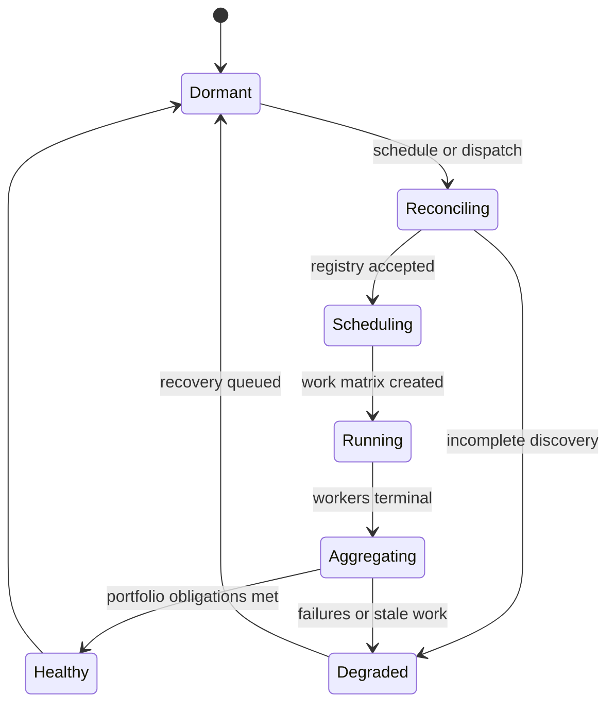
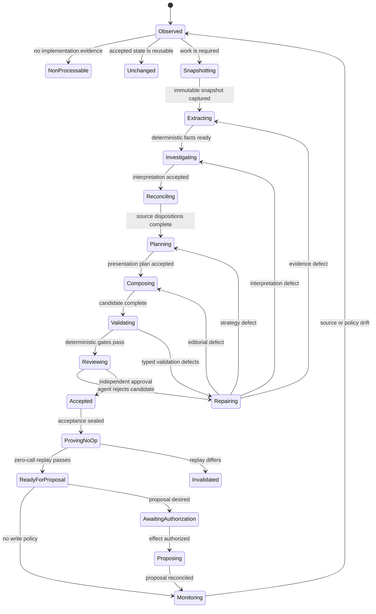
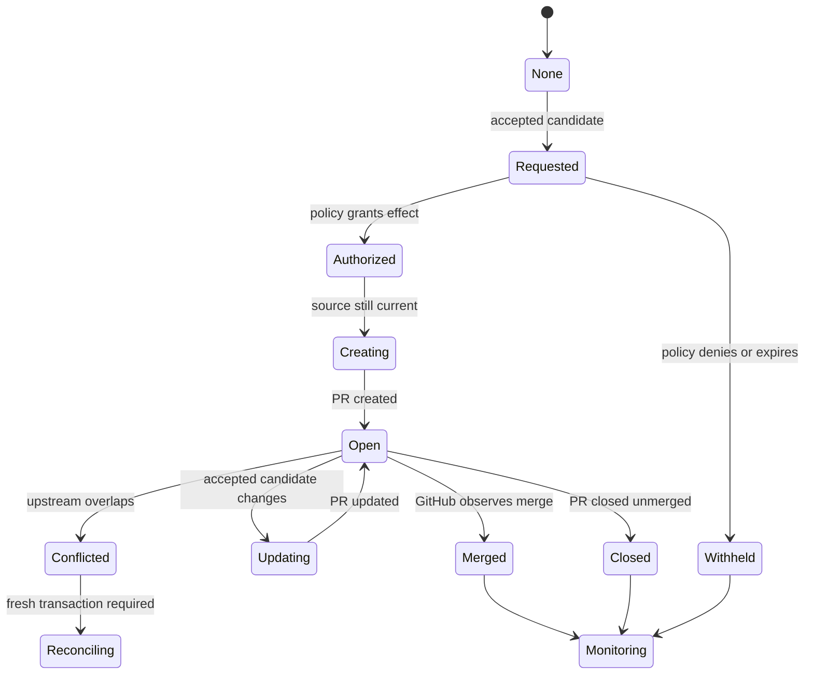
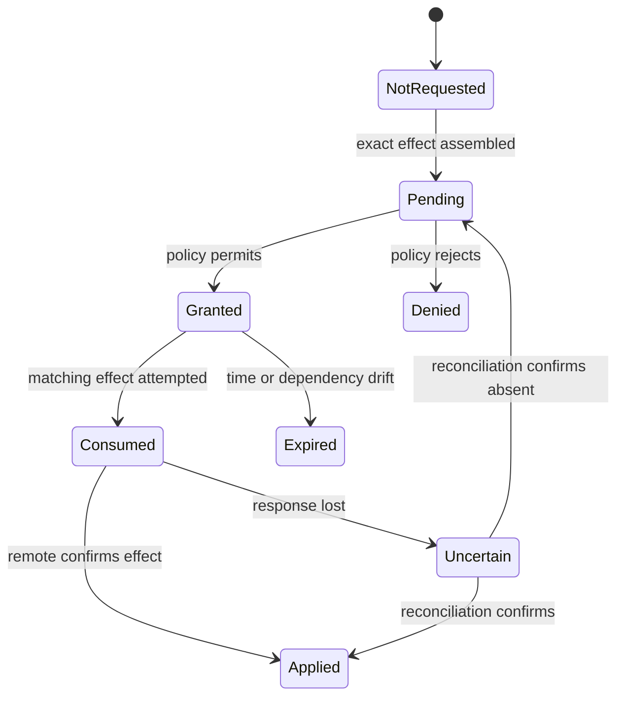

# Repository Presenter Runtime State Machine

Status: authoritative initial design  
Scope: autonomous README monitoring, regeneration, review, and proposal lifecycle  
Execution environment: GitHub-hosted runners using a configurable OpenAI-compatible LLM gateway

## 1. Purpose

Repository Presenter continuously monitors explicitly authorized repositories, determines whether
their README presentation remains truthful and effective, and autonomously produces or updates a
reviewable proposal when material drift or a presentation defect requires work.

The runtime is deterministic around agentic judgment:

- deterministic code owns admission, snapshots, evidence, state transitions, invalidation,
  concurrency, caching, validation, authorization, effects, recovery, and idempotency;
- agents own repository interpretation, claim reconciliation, presentation planning, editorial
  composition, independent review, and targeted repair;
- no LLM response directly changes a repository or advances durable state;
- every transition is made by deterministic code after validating the transition's evidence.

The state machine is deliberately repository-transaction-oriented. It does not contain a generic
mission graph or allow an LLM to invent runtime states, permissions, commands, or effects.

## 2. State hierarchy

The system has four related machines:

1. **Portfolio machine** — discovers authorized repositories, schedules work, and reports health.
2. **Repository machine** — monitors and produces one accepted README for one immutable revision.
3. **Proposal machine** — creates and maintains a GitHub proposal after repository acceptance.
4. **Effect-authorization machine** — independently controls write-capable GitHub operations.

One repository may have many historical transactions, but at most one active transaction and one
presenter-owned open proposal. Historical accepted artifacts are immutable.

Later surface machines required by `plans/idea.md` (repository description, homepage and topics,
community files, release and package links, visual assets and social preview, and upstream-defect
reports) consume the same core contracts and are specified when their gate opens. None of them
bypasses the effect-authorization machine, and none may displace the README machine.

## 3. Portfolio machine



### 3.1 Portfolio states

| State | Meaning | Exit requirement |
|---|---|---|
| `DORMANT` | No portfolio workflow is active. Durable repository state remains authoritative. | Accepted schedule, manual dispatch, repository dispatch, or recovery trigger. |
| `RECONCILING` | Authorized sources and the hard registry allow-list are being observed and reconciled. | Complete revision-bound inventory or a typed discovery failure. |
| `SCHEDULING` | Due repositories are selected from source drift, TTL expiry, open proposals, retries, and requested scope. | A deterministic matrix and exclusion ledger. |
| `RUNNING` | Isolated per-repository workers are executing. | Every scheduled worker is terminal for this invocation. |
| `AGGREGATING` | Worker receipts, registry denominator, health, and alert conditions are reconciled. | Checksum-valid portfolio report. |
| `HEALTHY` | No unexplained inventory, overdue work, stale lease, repeated internal failure, or corrupt evidence exists. | Workflow closeout. |
| `DEGRADED` | At least one portfolio obligation is unhealthy, without misrepresenting successful repositories as failed. | Recovery is queued and a visible diagnostic is published. |

The checksum-valid portfolio report separates fact-valid, presentation-valid, independently
accepted, no-op-proven, source-fresh, publication-eligible, and effect-authorized counts. The
denominator is the frozen registry revision, and non-processable entries stay inside it with their
dispositions.

### 3.2 Portfolio triggers

| Trigger | Stable identity | Intended use |
|---|---|---|
| Scheduled probe | Date, cron expression, control revision | Cheap remote revision and proposal reconciliation. |
| Scheduled daily run | Date, cron expression, control revision | Process changed or due repositories. |
| Scheduled weekly audit | ISO week, control revision | Full discovery and all-surface freshness audit. |
| `repository_dispatch` | Delivery ID and repository identity | Product release or upstream-change notification. |
| Manual dispatch | Workflow run ID and optional repository | Operator diagnosis or bounded replay. |
| Workflow call | Caller run ID and repository | Reusable integration from an authorized workflow. |
| Recovery | Original trigger ID and recovery attempt | Resume retryable or abandoned work. |

Duplicate trigger identities are acknowledged without creating duplicate repository transactions or
provider calls.

## 4. Repository transaction machine



### 4.1 Repository states

| State | Type | Required durable evidence | Permitted next states |
|---|---|---|---|
| `OBSERVED` | Active | Trigger, registry revision, remote default branch and observed surface fingerprints. | `NON_PROCESSABLE`, `UNCHANGED`, `SNAPSHOTTING`, `BLOCKED_EXTERNAL`, `FAILED_INTERNAL`. |
| `NON_PROCESSABLE` | Terminal for revision | Immutable tree inventory, typed reason, resume predicate. | `OBSERVED` after source drift or policy change. |
| `UNCHANGED` | Terminal for invocation | Reuse decision proving accepted source, facts, presentation components, prompts, models, protected content, and due surfaces are unchanged. | `OBSERVED` on later trigger. |
| `SNAPSHOTTING` | Active | Read-only repository identity and requested immutable revision. | `EXTRACTING`, `RETRYABLE`, `BLOCKED_EXTERNAL`, `FAILED_INTERNAL`. |
| `EXTRACTING` | Active | Exact original README bytes, tree inventory, manifests, source facts, examples, public consumer surface, license, history/release observations. | `INVESTIGATING`, `REPAIRING`, terminal failure states. |
| `INVESTIGATING` | Agentic | Fact-bound investigation receipt containing product purpose, audience, workflows, important capabilities, uncertainties, and requested evidence. | `RECONCILING`, `REPAIRING`, terminal failure states. |
| `RECONCILING` | Agentic | Exactly one disposition for every material original-README unit and every candidate claim source. | `PLANNING`, `REPAIRING`, terminal failure states. |
| `PLANNING` | Agentic | Versioned presentation plan: visitor journey, selected components, example strategy, API depth, limitations, contextual links, and repository-specific deviations. | `COMPOSING`, `REPAIRING`, terminal failure states. |
| `COMPOSING` | Agentic | Candidate README plus claim/fact bindings and authored-unit provenance. | `VALIDATING`, `REPAIRING`, terminal failure states. |
| `VALIDATING` | Deterministic | Applicable-check registry, results, exact candidate hash and validation dependency hashes. | `REVIEWING`, `REPAIRING`, terminal failure states. |
| `REVIEWING` | Agentic, non-authoring | Independent factual and visitor-quality verdict with criterion-specific evidence. | `ACCEPTED`, `REPAIRING`, terminal failure states. |
| `REPAIRING` | Mixed | Typed defects, causal stage, attempt fingerprint, retained accepted work and bounded repair plan. | Earliest affected active state or terminal failure states. |
| `ACCEPTED` | Sealed | Candidate, diff, facts, dispositions, plan, validation, review, call ledger and dependency manifest. | `PROVING_NO_OP`, `INVALIDATED`. |
| `PROVING_NO_OP` | Deterministic replay | Fresh process replay using the accepted source and dependency set. | `READY_FOR_PROPOSAL`, `INVALIDATED`, terminal failure states. |
| `READY_FOR_PROPOSAL` | Terminal content state | Accepted artifact and proof that unchanged replay made zero provider calls and produced byte-identical output. | `AWAITING_AUTHORIZATION`, `MONITORING`, `INVALIDATED`. |
| `AWAITING_AUTHORIZATION` | Effect boundary | Exact effect request: candidate hash, target repository, branch, PR intent, authorization policy and expiry. | `PROPOSING`, `MONITORING`, `BLOCKED_EXTERNAL`. |
| `PROPOSING` | Write-capable | Fresh source check, authorization receipt, effect identity and rollback plan. | `MONITORING`, `RETRYABLE`, `BLOCKED_EXTERNAL`, `FAILED_INTERNAL`. |
| `MONITORING` | Quiescent | Current source/policy fingerprints and optional open-proposal identity. | `OBSERVED`, proposal substates. |
| `INVALIDATED` | Routing state | Dependency changes and earliest affected stage. | Earliest affected active state. |
| `RETRYABLE` | Temporary terminal | Failure class, retry policy, next eligible time and original trigger identity. | Previous active state through recovery. |
| `BLOCKED_EXTERNAL` | Honest terminal | Missing permission, unavailable provider, unresolved owner fact, or external infrastructure condition plus resume predicate. | Previous active state when predicate becomes true. |
| `FAILED_INTERNAL` | Unacceptable terminal | Reproducible internal defect, causal boundary, evidence and recovery task. | Previous active state after code/config repair. |
| `SUPERSEDED` | Historical terminal | Newer transaction identity that replaced this transaction. | None. |

`FAILED_INTERNAL` never counts as acceptable portfolio completion. The system continues unrelated
repositories and creates a visible control-repository diagnostic.

## 5. Observation and no-change decision

`OBSERVED -> UNCHANGED` is allowed only when all applicable conditions hold:

1. The registry entry and stable provider identity are unchanged.
2. The accepted default-branch revision matches the remote observation.
3. Every TTL-governed external surface remains fresh.
4. No presenter-owned proposal requires reconciliation.
5. Product-fact extractor versions and relevant toolchain contracts match.
6. Presentation component versions match or only a non-required optional update exists.
7. Prompt hashes, job schemas, model routes, and sampling contracts match.
8. Acceptance policy, terminology, protected-content and link-policy hashes match.
9. Accepted artifacts and their manifest remain present and checksum-valid.
10. The prior transaction reached `READY_FOR_PROPOSAL` or an equivalent later accepted state.

If source is unchanged but an optional presentation component has a newer non-critical version,
the repository records `VALID_UPDATE_AVAILABLE`. Policy determines whether to schedule it; the
existing accepted README does not become falsely invalid.

## 6. Processability

A repository is `NON_PROCESSABLE` when its immutable snapshot lacks sufficient implementation or
public-product evidence to author a truthful README. A README-only placeholder is the primary
case.

The disposition contains:

- `reason_code`, initially `NO_IMPLEMENTATION_EVIDENCE`;
- source revision and complete inventory hash;
- evidence paths inspected;
- missing evidence classes;
- a resume predicate such as “a manifest or implementation source appears”;
- next scheduled recheck time.

The repository remains inside portfolio accountability but outside the processable candidate
denominator for that registry revision.

## 7. Agentic stages

### 7.1 Investigation

Input is a bounded evidence dossier, not the entire repository by default. The agent may request
additional evidence through registered read-only tools. Its structured output contains:

- canonical product interpretation;
- intended developer audiences;
- problems and workflows evidenced by the repository;
- primary and secondary capabilities;
- supported inputs and outputs;
- package and public-consumer observations;
- best candidate examples;
- limitations and uncertainty;
- contradictions and evidence gaps;
- recommended presentation emphasis.

An investigation cannot create candidate prose or authorize a claim.

### 7.2 Reconciliation

Every meaningful original README unit receives one disposition:

- `VERIFIED_PRESERVE`;
- `VERIFIED_REWRITE`;
- `VERIFIED_MOVE`;
- `CORRECT_WITH_EVIDENCE`;
- `SUPERSEDE_REDUNDANT`;
- `OMIT_UNSUPPORTED`;
- `DEFER_UNRESOLVED`;
- `NON_CONTENT`.

Every material unit maps exactly once. Unsupported unresolved material cannot silently disappear.

### 7.3 Presentation planning

The planning agent selects and configures versioned presentation components. It decides document
shape from product evidence; it does not select arbitrary executable code.

The plan includes:

- audience and reader goal;
- opening strategy;
- ordered semantic sections;
- visible versus collapsible material;
- semantic capability-graph contents;
- installation and example strategy;
- API-reference depth;
- scope and limitations strategy;
- development guidance;
- contextual-link opportunities and ceilings;
- justified family/product-specific deviations;
- protected material and reconciliation obligations.

### 7.4 Composition

One central composer has final writing authority. Section authoring may be packetized for a small
context model, but the composer performs a final coherence pass over the complete document.

LLM-authored text may only express accepted facts supplied in its packet. Deterministic code owns
commands, links, badges, diagram topology, exact identifiers, example code, and license identity.

### 7.5 Independent review

The reviewer receives the candidate, relevant evidence, dispositions, presentation plan, and
validation results. It does not receive authoring instructions that bias it toward acceptance and
must not have authored the candidate. Every non-accepting finding names a candidate section and a
causal stage from the fixed vocabulary (`EXTRACTING`, `INVESTIGATING`, `RECONCILING`, `PLANNING`,
`COMPOSING`); a finding the repair loop cannot act on is recorded as advisory and never blocks
twice.

The verdict is one of:

- `ACCEPT`;
- `REJECT_FACTUAL`;
- `REJECT_PRESERVATION`;
- `REJECT_PRESENTATION`;
- `REJECT_EXAMPLE`;
- `REJECT_LIMITATIONS`;
- `REJECT_LINKS`;
- `REJECT_COHERENCE`;
- `INSUFFICIENT_EVIDENCE`.

## 8. Validation and repair routing

| Defect class | Earliest reopened state |
|---|---|
| Missing or stale repository evidence | `EXTRACTING` |
| Misinterpreted product/audience/capability | `INVESTIGATING` |
| Incorrect inherited-content disposition | `RECONCILING` |
| Weak document strategy or wrong section selection | `PLANNING` |
| Prose, organization, tone or local coherence | `COMPOSING` |
| Invalid command, example, link, Markdown or claim binding | Causal state, never validation-only masking |
| Reviewer disagreement caused by missing evidence | `EXTRACTING` or `INVESTIGATING` |
| Presentation component cannot express a valid need | Component-development queue, then `PLANNING` |

One normal attempt and one targeted semantic repair are allowed per equivalent agentic job
fingerprint. A third equivalent attempt is prohibited. The system must change evidence, prompt,
model route, component, causal stage, or mechanism before trying again.

Accepted upstream-independent work is retained across repair. A broken additional example does not
force package rediscovery or rewriting an already accepted opening.

## 9. Invalidation

Every durable artifact declares dependency hashes, and those hashes are **per candidate and list
only the inputs that candidate consumed**: source revision and relevant tree, fact records, prompt
manifests, model route, template component versions, validator identities and versions, acceptance
profile, protected-content fingerprint, and policy. A component the candidate did not consume cannot
reopen it, and no global control-plane hash exists. A change reopens the earliest affected stage of
the candidates that consumed it and nothing else. A validator or reviewer change re-checks accepted
candidates; it invalidates one only on a factual, safety, or protected-content failure.

| Changed dependency | Reopened state |
|---|---|
| Repository revision or relevant tree fingerprint | `EXTRACTING` |
| Product-fact schema or extractor | `EXTRACTING` |
| Investigation prompt/model/schema | `INVESTIGATING` |
| Reconciliation contract | `RECONCILING` |
| Presentation planning prompt or component catalog | `PLANNING` |
| Section authoring prompt/model | `COMPOSING` for affected sections |
| Deterministic validator | `VALIDATING` |
| Reviewer prompt/model/rubric | `REVIEWING` |
| Authorization/effect policy only | `AWAITING_AUTHORIZATION` |

Factual, safety, protected-content, or severe acceptance defects invalidate an accepted candidate.
Non-critical presentation improvements create `VALID_UPDATE_AVAILABLE` without mislabeling the
published README as factually invalid.

## 10. No-op proof

No-op is a complete-transaction property, not merely “remote SHA unchanged.”

The proof runs in a fresh process and must demonstrate:

- accepted source and all dependencies are unchanged;
- all durable artifacts load and pass checksums;
- the same candidate bytes are selected;
- no provider request is made;
- no new proposal or GitHub mutation is attempted;
- the result terminates as `READY_FOR_PROPOSAL` or `UNCHANGED`;
- the call ledger explicitly records zero provider calls and the relevant cache reuses.

Failure routes through `INVALIDATED` to the earliest mismatched dependency.

## 11. Proposal machine



### 11.1 Proposal rules

- Initial publication mode is `pull_request`; no direct default-branch commit.
- One stable presenter branch and one open PR exist per target repository.
- Before every write, the effect job refetches the default branch and verifies the accepted source
  revision.
- If upstream changed, the effect is cancelled and the repository returns to `OBSERVED`.
- An existing presenter PR is updated rather than duplicated.
- Overlapping upstream README edits reopen reconciliation; they are never overwritten mechanically.
- A merged PR establishes a new observation. It does not automatically prove the next transaction's
  no-op because the merge revision differs from the candidate's input revision.
- A closed-unmerged PR is not recreated until new upstream drift, a new accepted component version,
  or explicit policy permits another proposal.
- Auto-merge is an optional repository policy and remains separate from candidate acceptance.

## 12. Effect-authorization machine



Authorization binds:

- target repository;
- candidate hash;
- source revision;
- branch and operation type;
- PR title/body hash;
- credential provider;
- permission class;
- expiration;
- publication policy version.

Analysis uses a repository-scoped read-only GitHub App token. Proposal execution occurs in a
separate job with a freshly minted repository-scoped contents/pull-request token. Ambient personal
tokens are never fallback production credentials.

## 13. Durable state

### 13.1 Repository record

```yaml
schema_version: 1
repository: owner/name
provider_repository_id: 123456
registry_revision: sha256:...
active_transaction_id: uuid
state: MONITORING
source:
  default_branch: main
  revision: git-sha
  readme_blob: git-blob-sha
  relevant_tree: sha256:...
surfaces:
  package_release:
    observed_hash: sha256:...
    checked_at: timestamp
    due_at: timestamp
dependencies:
  facts: sha256:...
  prompts: sha256:...
  models: sha256:...
  presentation: sha256:...
  validation: sha256:...
accepted_artifact:
  manifest: sha256:...
  candidate: sha256:...
  accepted_at: timestamp
  no_op_proven_at: timestamp
proposal:
  repository: owner/name
  branch: repository-presenter/readme
  number: 42
  head_sha: git-sha
failure: null
lease: null
```

### 13.2 Storage

Production state uses one independently updateable CAS record per repository in the control
repository's dedicated state namespace. Candidate/evidence bundles are content-addressed and
immutable. GitHub Actions cache may accelerate retrieval but is never authoritative mutable state.

The state backend must support:

- compare-and-swap update;
- repository-scoped lease;
- immutable transaction history;
- corruption detection;
- migration by explicit schema version;
- recovery without relying on an expired Actions artifact;
- redaction before persistence.

## 14. Concurrency and leases

- GitHub Actions concurrency key: normalized target repository identity.
- Durable lease key: provider repository ID plus active transaction ID.
- A lease has owner, acquired time, heartbeat, expiry and fencing token.
- An expired worker cannot commit state after a new fencing token is issued.
- Portfolio aggregation is serialized.
- Repositories may run in parallel only when state and evidence paths are disjoint.
- Proposal effects use a separate serialized repository effect lease.
- LLM call and cost budgets are enforced per repository transaction and portfolio run.

## 15. Recovery

At every scheduled run, recovery executes before new scheduling.

Recovery:

1. Finds nonterminal transactions without a valid lease.
2. Verifies the last durable artifact and transition receipt.
3. Re-enters the last state whose entry conditions are fully proven.
4. Never skips a stage merely because a later partial artifact exists.
5. Reconciles uncertain GitHub effects before retrying them.
6. Preserves accepted agentic outputs whose dependency hashes still match.
7. Marks a transaction `SUPERSEDED` if a newer source revision owns the active work.

Provider timeouts, GitHub rate limits and transient clone failures become `RETRYABLE`. Missing
permissions, disabled model routes and owner-only factual decisions become `BLOCKED_EXTERNAL`.
Schema errors, bad routing, invalid transition attempts and reproducible composition defects become
`FAILED_INTERNAL` and create a visible control-repository issue.

## 16. LLM call contract

Every attempted provider call records:

- repository and source revision;
- transaction, stage and job;
- prompt ID and hash;
- model and sampling contract;
- logical-call and physical-attempt IDs;
- request and response hashes, never secret-bearing raw payloads in ordinary state;
- outcome, latency and provider-reported token usage;
- cache-reuse identity;
- repair attempt fingerprint.

The gateway is OpenAI-compatible and configured through environment secrets. Routes are selected
per job by governed configuration. A disabled or unhealthy required route blocks honestly; the
runtime never silently substitutes another model.

## 17. Transition receipt

Every durable transition records:

```yaml
transition_id: uuid
transaction_id: uuid
repository: owner/name
from: VALIDATING
to: REVIEWING
event: deterministic_validation_passed
occurred_at: timestamp
actor: runtime
input_manifest: sha256:...
output_manifest: sha256:...
policy_version: sha256:...
fencing_token: 17
```

A transition is rejected when:

- it is not present in the transition registry;
- the current state differs from `from`;
- its lease/fencing token is stale;
- required evidence is absent or invalid;
- dependency hashes do not match;
- an agent tries to assert a deterministic gate result;
- a write-capable transition lacks exact unexpired authorization.

## 18. Core invariants

1. Only explicitly admitted repositories may be observed or changed.
2. Repository facts come from immutable evidence, not model memory.
3. Existing README content is investigated and dispositioned, never blindly trusted or discarded.
4. Template filling without interpretive agentic reasoning cannot reach acceptance.
5. Every public claim has evidence and candidate-location accountability.
6. The candidate writer and independent reviewer are separate roles/calls.
7. Agents cannot advance durable state or perform GitHub effects.
8. Changed dependencies reopen only their earliest affected stage.
9. An unchanged accepted transaction makes zero provider calls.
10. A processability failure cannot produce a fabricated README.
11. Analysis and write credentials are separate and repository-scoped.
12. No product effect occurs without an exact authorization receipt.
13. Lost responses are reconciled before retrying an effect.
14. One repository failure does not stop safe work on unrelated repositories.
15. Historical artifacts never become current merely because they exist.
16. GitHub Actions cache and uploaded artifacts are not durable authority.
17. Every terminal state includes a checksum-valid receipt and a resume/closure explanation.

## 19. Initial implementation boundary

This document is the runtime target, not the build order. Gate G1 of the build plan implements the
repository transaction as a linear pipeline with stage artifacts on disk and a per-candidate
dependency manifest; the durable four-machine runtime, leases, triggers, and recovery are built at
G4, and the proposal and effect-authorization machines at G5. Nothing here may be built ahead of the
gate that consumes it.

The full vertical slice is complete only when a disposable target demonstrates:

1. scheduled GitHub-hosted execution;
2. repository-scoped read-only GitHub App access;
3. custom live LLM gateway calls with complete attribution;
4. immutable source snapshot and deterministic facts;
5. agentic investigation, reconciliation, planning and composition;
6. deterministic validation and independent review;
7. bounded targeted repair;
8. an accepted candidate with source dispositions and exact diff;
9. a fresh-process, byte-identical, zero-provider-call no-op;
10. separately authorized automatic PR creation;
11. subsequent monitoring that detects both no-change and new upstream drift;
12. recovery from a deliberately interrupted transaction and a lost-effect response.

Only after this transaction passes should ecosystem and portfolio rollout expand.
